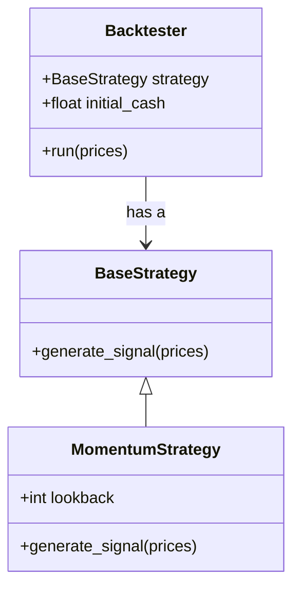
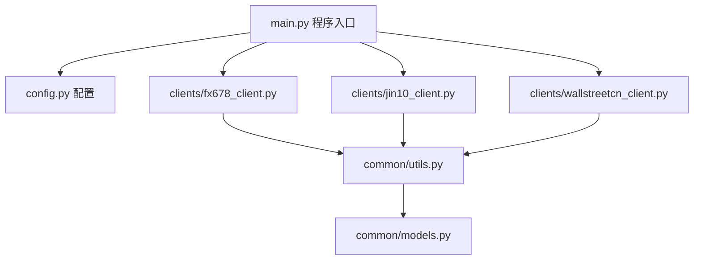
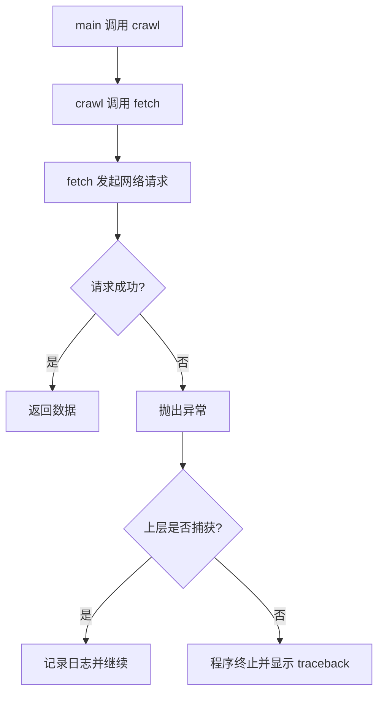
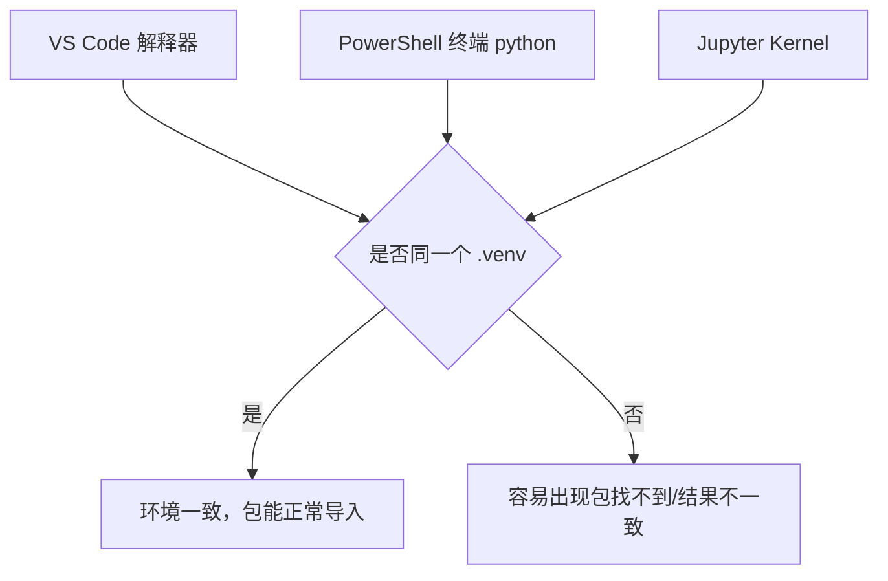

# 01 Python 工程基础：从“会写脚本”到“能做项目”

## 学习目标

学完这一章，你应该能做到：

- 看懂一个中小型 Python 项目的基本结构，而不是只看懂单个 `.py` 文件。
- 理解函数、类、对象、模块、包之间的关系。
- 会处理异常，能根据报错信息定位问题，而不是看到红字就慌。
- 会为每个项目创建独立虚拟环境，并用依赖文件复现环境。
- 会使用调试器、日志和单元测试，让程序逐步变得可靠。
- 能把一个财经新闻爬虫或行情数据分析脚本，整理成可维护的小项目。

你可以把这一章当成 Python 的“工程化入门”。它不追求讲完 Python 的所有语法，而是解决一个更关键的问题：**如何写出以后还能继续改、继续查错、继续扩展的 Python 代码**。

## 为什么这部分对 AI 和量化重要

AI 和量化投资不是只在 Notebook 里跑几行模型代码。真实任务通常包括：

- 获取数据：爬虫、API、数据库、CSV、Excel。
- 清洗数据：缺失值、异常值、时间格式、编码问题。
- 计算指标：收益率、波动率、最大回撤、因子暴露。
- 训练模型：特征工程、训练集测试集划分、模型保存。
- 回测和评估：策略信号、交易成本、绩效指标。
- 自动运行：定时任务、日志、错误报警、结果输出。

这些任务如果都塞进一个文件，短期看似快，长期会变成一团难以维护的代码。你现在工作区里的 `finance_news_crawler` 已经具备项目雏形：

```text
finance_news_crawler/
├── main.py
├── config.py
├── requirements.txt
├── clients/
│   ├── fx678_client.py
│   ├── jin10_client.py
│   └── wallstreetcn_client.py
└── common/
    ├── models.py
    └── utils.py
```

这类结构背后对应的核心能力，就是本章要补的 Python 工程基础。

## 一、从脚本思维到项目思维

### 1. 什么是脚本

脚本通常是为了解决一个明确的小任务而写的文件。例如：

```python
import pandas as pd

df = pd.read_csv("prices.csv")
df["return"] = df["close"].pct_change()
print(df["return"].mean())
```

这段代码没有问题。它适合快速验证想法。但如果你继续往里面加：

- 下载行情数据
- 清洗数据
- 计算多个指标
- 画图
- 保存结果
- 处理错误
- 接收命令行参数

这个文件就会迅速膨胀。你会开始找不到代码在哪里，改一个地方影响另一个地方。

### 2. 什么是项目

项目不是“很多文件”的意思，而是**把不同职责拆开**。

| 职责 | 适合放在哪里 | 例子 |
|---|---|---|
| 程序入口 | `main.py` | 解析参数，组织流程 |
| 配置参数 | `config.py` / `.env` / `yaml` | 日期范围、输出路径、请求超时 |
| 数据获取 | `clients/` | 调接口、爬网页、下载 CSV |
| 数据处理 | `metrics.py` / `processors/` | 收益率、回撤、文本清洗 |
| 通用工具 | `common/utils.py` | 时间解析、保存 JSON、日志设置 |
| 数据结构 | `common/models.py` | 新闻记录、行情记录、策略结果 |
| 测试 | `tests/` | 验证函数是否正确 |

一个最小但健康的行情分析项目可以是：

```text
market_project/
├── main.py
├── config.py
├── data_loader.py
├── metrics.py
├── plotting.py
└── tests/
    └── test_metrics.py
```

### 3. 一条经验法则

当你写代码时，可以问自己：

> 如果三个月后我忘了这段代码，能不能通过文件名和函数名快速找回逻辑？

如果答案是否定的，就说明代码需要拆分、命名或注释。

## 二、函数：把步骤封装成可复用动作

函数是 Python 项目的基本积木。函数解决的问题是：**把一段有明确输入和输出的逻辑命名**。

### 1. 不好的写法：逻辑散落

```python
prices = [10, 10.5, 10.2, 10.8]
returns = []

for i in range(1, len(prices)):
    returns.append(prices[i] / prices[i - 1] - 1)

print(returns)
```

这段代码能跑，但逻辑没有名字。别人读到这里，需要自己推理这是在计算收益率。

### 2. 更好的写法：用函数表达意图

```python
def calculate_returns(prices: list[float]) -> list[float]:
    returns = []
    for i in range(1, len(prices)):
        returns.append(prices[i] / prices[i - 1] - 1)
    return returns


prices = [10, 10.5, 10.2, 10.8]
daily_returns = calculate_returns(prices)
print(daily_returns)
```

函数名 `calculate_returns` 比注释更有力量，因为它直接进入了代码结构。

### 3. 一个好函数的特征

| 特征 | 说明 | 例子 |
|---|---|---|
| 输入明确 | 参数表达它需要什么 | `prices: list[float]` |
| 输出明确 | 返回值表达它产出什么 | `list[float]` |
| 职责单一 | 只做一件主要事情 | 只计算收益率，不顺便画图 |
| 名字清楚 | 读名字就知道用途 | `parse_datetime` |
| 容易测试 | 给定输入能预测输出 | 输入价格，输出收益率 |

### 4. 函数什么时候不够用

如果你发现多个函数总是共享同一组数据，就可能需要类。

例如一个爬虫客户端通常需要共享：

- 请求超时时间
- 页数限制
- 请求头
- 数据源名称
- 解析规则

这时就适合把这些状态放进一个对象里。

## 三、类与对象：把金融量化里的“实体、状态、行为”组织起来

类与对象是很多初学者最卡的地方，因为它不像 `for` 循环那样立刻能看到效果。可以先用一句话理解：

> 类是对一类事物的定义，对象是这类事物的一个具体实例。

在金融量化和爬虫项目里，类不是为了炫技，而是为了把下面三种东西组织清楚：

- **实体**：一条新闻、一根 K 线、一个持仓、一次回测结果。
- **状态**：数据源名称、请求超时时间、策略参数、账户现金、持仓数量。
- **行为**：抓取数据、计算信号、更新持仓、输出摘要、保存结果。

### 1. 类和对象的关系

```mermaid
classDiagram
    class NewsRecord {
        +str title
        +str source
        +str publish_time
        +summary()
    }

    class PriceBar {
        +str symbol
        +str trade_date
        +float close
        +daily_return(previous_close)
    }

    class Strategy {
        +generate_signal(prices)
    }

    NewsRecord --> "具体新闻对象"
    PriceBar --> "具体行情对象"
    Strategy --> "具体策略对象"
```

ASCII 版本：

```text
类：NewsRecord
  定义新闻记录应该有什么：
  - title
  - source
  - publish_time
  - summary()

对象：record_a
  是一条具体新闻：
  - title = "美联储公布利率决议"
  - source = "jin10"
```

### 2. 金融量化里类的常见用途

| 用途 | 类名例子 | 保存什么状态 | 提供什么行为 |
|---|---|---|---|
| 数据容器 | `NewsRecord`、`PriceBar` | 标题、日期、价格、成交量 | 格式化、校验、转字典 |
| 数据源客户端 | `Jin10Client`、`TushareClient` | URL、token、timeout | 请求数据、解析数据 |
| 指标计算器 | `FactorCalculator` | 窗口长度、指标配置 | 计算收益率、波动率、因子 |
| 策略对象 | `MovingAverageStrategy` | 短均线、长均线参数 | 生成买卖信号 |
| 组合对象 | `Portfolio` | 现金、持仓、净值 | 买入、卖出、估值 |
| 回测结果 | `BacktestResult` | 收益曲线、交易记录 | 计算夏普、回撤、摘要 |
| 配置对象 | `CrawlerConfig` | 日期、路径、并发数 | 集中传递参数 |

如果你看到 AI 生成一个类，可以先问：

```text
这个类在保存什么状态？
这个类有哪些行为？
这些状态和行为放在一起是否自然？
```

如果答案很模糊，这个类可能设计得不好。

### 3. 最小类示例：新闻记录

```python
class NewsRecord:
    def __init__(self, title: str, source: str, publish_time: str):
        self.title = title
        self.source = source
        self.publish_time = publish_time

    def summary(self) -> str:
        return f"[{self.source}] {self.publish_time} - {self.title}"


record = NewsRecord("美联储公布利率决议", "wallstreetcn", "2026-07-27 14:30:00")
print(record.summary())
```

逐行拆开：

| 代码 | 含义 |
|---|---|
| `class NewsRecord:` | 定义一种“新闻记录”类型 |
| `def __init__(...)` | 定义对象创建时如何初始化 |
| `self.title = title` | 把传入的标题保存到当前对象里 |
| `def summary(self)` | 定义对象能做的动作 |
| `record = NewsRecord(...)` | 创建一个具体新闻对象 |
| `record.summary()` | 调用这个对象的方法 |

### 4. `self` 到底是什么

`self` 指向“当前这个对象”。如果有两个新闻对象：

```python
record_a = NewsRecord("新闻 A", "jin10", "2026-07-27 14:00:00")
record_b = NewsRecord("新闻 B", "fx678", "2026-07-27 14:05:00")
```

它们都来自同一个类，但各自保存自己的数据：

```text
record_a:
  title = 新闻 A
  source = jin10

record_b:
  title = 新闻 B
  source = fx678
```

当你调用：

```python
record_a.summary()
```

Python 实际上会把 `record_a` 作为 `self` 传进去。你可以把它理解成：

```text
请 record_a 这个对象，用它自己的 title/source/publish_time 生成摘要。
```

所以方法里的 `self.title` 不是全局变量，而是“当前对象自己的 title”。

### 5. 实例属性、类属性、方法

```python
class PriceBar:
    market = "A-share"

    def __init__(self, symbol: str, trade_date: str, close: float):
        self.symbol = symbol
        self.trade_date = trade_date
        self.close = close

    def daily_return(self, previous_close: float) -> float:
        return self.close / previous_close - 1
```

这里有三类东西：

| 名称 | 例子 | 含义 |
|---|---|---|
| 类属性 | `market = "A-share"` | 这个类的所有对象共享的属性 |
| 实例属性 | `self.symbol`、`self.close` | 每个对象自己的数据 |
| 方法 | `daily_return()` | 对象能执行的动作 |

使用：

```python
bar = PriceBar("510300.SH", "2026-07-27", 4.25)
print(bar.symbol)
print(bar.daily_return(previous_close=4.20))
```

类属性适合放“所有对象共享”的信息。实例属性适合放“每个对象不同”的信息。初学时不要滥用类属性，尤其不要用类属性保存会变化的列表或字典。

### 6. 对象生命周期：从创建到使用

```mermaid
flowchart LR
    A[调用类名 NewsRecord(...)] --> B[运行 __init__]
    B --> C[保存实例属性]
    C --> D[得到对象 record]
    D --> E[调用方法 record.summary()]
    E --> F[对象继续存在或被释放]
```

ASCII 版本：

```text
NewsRecord(...)
  -> __init__ 初始化
  -> self.title/self.source 被保存
  -> 得到 record 对象
  -> record.summary() 使用对象内部数据
```

### 7. 更贴近量化的类：移动均线策略

先看一个函数版：

```python
def moving_average_signal(prices: list[float], short_window: int, long_window: int) -> str:
    short_ma = sum(prices[-short_window:]) / short_window
    long_ma = sum(prices[-long_window:]) / long_window

    if short_ma > long_ma:
        return "buy"
    if short_ma < long_ma:
        return "sell"
    return "hold"
```

这个函数能用。但如果你的策略有很多参数，且要反复生成信号，用类更自然：

```python
class MovingAverageStrategy:
    def __init__(self, short_window: int, long_window: int):
        if short_window >= long_window:
            raise ValueError("short_window must be smaller than long_window")

        self.short_window = short_window
        self.long_window = long_window

    def generate_signal(self, prices: list[float]) -> str:
        if len(prices) < self.long_window:
            return "hold"

        short_ma = sum(prices[-self.short_window:]) / self.short_window
        long_ma = sum(prices[-self.long_window:]) / self.long_window

        if short_ma > long_ma:
            return "buy"
        if short_ma < long_ma:
            return "sell"
        return "hold"


strategy = MovingAverageStrategy(short_window=3, long_window=5)
signal = strategy.generate_signal([10, 10.2, 10.5, 10.8, 11.0])
print(signal)
```

这个类的状态是：

```text
short_window
long_window
```

它的行为是：

```text
generate_signal(prices)
```

类的好处是：策略参数跟策略行为绑在一起。以后你想创建两个不同参数的策略，可以这样：

```python
fast_strategy = MovingAverageStrategy(3, 5)
slow_strategy = MovingAverageStrategy(5, 20)
```

两个对象互不影响。

### 8. 如何看懂一段类代码

看到一个陌生类，不要从第一行硬读到最后一行。按这个顺序：

```text
1. 看类名：它代表什么东西？
2. 看 __init__ 参数：创建它需要哪些信息？
3. 看 self.xxx：它保存了哪些状态？
4. 看公开方法：不以下划线开头的方法能做什么？
5. 看返回值：每个方法输出什么？
6. 搜索调用位置：项目里谁创建了这个类，谁调用它的方法？
```

例子：

```python
client = Jin10Client(timeout=15, limit=100)
records = client.fetch_by_time_range(start_dt, end_dt)
```

你应该读出：

| 代码 | 你要理解的信息 |
|---|---|
| `Jin10Client(...)` | 创建一个金十数据客户端 |
| `timeout=15` | 这个对象保存请求超时设置 |
| `limit=100` | 这个对象保存抓取数量限制 |
| `fetch_by_time_range(...)` | 这个对象能按时间范围抓新闻 |
| `records` | 方法返回新闻记录列表 |

### 9. 继承与派生：把相似对象的共同部分抽出来

继承是指一个类从另一个类那里获得属性和方法。

术语：

| 术语 | 含义 |
|---|---|
| 父类 / 基类 | 被继承的类 |
| 子类 / 派生类 | 继承父类的类 |
| 重写 override | 子类重新定义父类方法 |
| `super()` | 调用父类的方法 |
| 多态 | 不同子类使用同一个方法名，但表现不同 |

爬虫项目很适合讲继承。不同新闻源都需要：

- 保存 `source_name`。
- 保存 `timeout`。
- 发请求。
- 解析数据。
- 返回统一格式记录。

父类可以放共同逻辑：

```python
class BaseNewsClient:
    def __init__(self, source_name: str, timeout: int = 15):
        self.source_name = source_name
        self.timeout = timeout

    def fetch(self) -> list[dict]:
        raise NotImplementedError("Subclasses must implement fetch()")

    def normalize_record(self, title: str, publish_time: str) -> dict:
        return {
            "title": title,
            "publish_time": publish_time,
            "source": self.source_name,
        }
```

子类实现自己的抓取方式：

```python
class Jin10Client(BaseNewsClient):
    def __init__(self, timeout: int = 15, limit: int = 100):
        super().__init__(source_name="jin10", timeout=timeout)
        self.limit = limit

    def fetch(self) -> list[dict]:
        raw_items = [
            {"title": "金十快讯 A", "time": "2026-07-27 14:00:00"},
            {"title": "金十快讯 B", "time": "2026-07-27 14:01:00"},
        ]

        records = []
        for item in raw_items[: self.limit]:
            records.append(self.normalize_record(item["title"], item["time"]))
        return records
```

使用：

```python
client = Jin10Client(timeout=10, limit=1)
records = client.fetch()
print(records)
```

这里：

- `BaseNewsClient` 是父类。
- `Jin10Client` 是子类。
- `Jin10Client` 继承了 `normalize_record()`。
- `Jin10Client.fetch()` 是子类自己的实现。
- `super().__init__(...)` 调用了父类初始化逻辑。

### 10. 多态：同一个接口，不同实现

多态的意思是：不同对象有同名方法，调用者不用关心具体对象是谁。

```python
class Fx678Client(BaseNewsClient):
    def __init__(self, timeout: int = 15):
        super().__init__(source_name="fx678", timeout=timeout)

    def fetch(self) -> list[dict]:
        return [self.normalize_record("汇通财经新闻", "2026-07-27 14:02:00")]


clients = [
    Jin10Client(timeout=10, limit=2),
    Fx678Client(timeout=10),
]

all_records = []
for client in clients:
    all_records.extend(client.fetch())
```

循环里只调用：

```python
client.fetch()
```

至于 `client` 是 `Jin10Client` 还是 `Fx678Client`，调用者不用写一堆 `if`。这就是统一接口的好处。

### 11. 量化策略里的继承

策略也可以有统一接口：

```python
class BaseStrategy:
    def generate_signal(self, prices: list[float]) -> str:
        raise NotImplementedError


class MomentumStrategy(BaseStrategy):
    def __init__(self, lookback: int):
        self.lookback = lookback

    def generate_signal(self, prices: list[float]) -> str:
        if len(prices) <= self.lookback:
            return "hold"

        momentum = prices[-1] / prices[-self.lookback] - 1
        if momentum > 0.03:
            return "buy"
        if momentum < -0.03:
            return "sell"
        return "hold"


class MeanReversionStrategy(BaseStrategy):
    def __init__(self, window: int):
        self.window = window

    def generate_signal(self, prices: list[float]) -> str:
        if len(prices) < self.window:
            return "hold"

        average_price = sum(prices[-self.window:]) / self.window
        if prices[-1] < average_price * 0.97:
            return "buy"
        if prices[-1] > average_price * 1.03:
            return "sell"
        return "hold"
```

统一使用：

```python
strategies: list[BaseStrategy] = [
    MomentumStrategy(lookback=5),
    MeanReversionStrategy(window=10),
]

for strategy in strategies:
    print(strategy.generate_signal([10, 10.5, 10.8, 10.2, 10.9, 11.2]))
```

你要抓住重点：继承不是为了“高级”，而是为了让多个类似对象遵守同一个接口。

### 12. 组合：一个对象持有另一个对象

组合的意思是：一个类不是继承另一个类，而是把另一个对象作为自己的属性。

例如一个回测器可以持有策略对象：

```python
class Backtester:
    def __init__(self, strategy: BaseStrategy, initial_cash: float):
        self.strategy = strategy
        self.initial_cash = initial_cash

    def run(self, prices: list[float]) -> list[str]:
        signals = []
        for end in range(1, len(prices) + 1):
            signal = self.strategy.generate_signal(prices[:end])
            signals.append(signal)
        return signals
```

使用：

```python
strategy = MomentumStrategy(lookback=5)
backtester = Backtester(strategy=strategy, initial_cash=100_000)
signals = backtester.run([10, 10.2, 10.4, 10.7, 11.0, 11.3])
print(signals)
```

关系图：



ASCII 版本：

```text
Backtester 不是一种 Strategy
Backtester 拥有一个 Strategy

Backtester
  └── strategy = MomentumStrategy(...)
```

经验法则：

```text
“A 是一种 B” -> 可以考虑继承
“A 拥有一个 B” -> 应该考虑组合
```

例如：

- `Jin10Client` 是一种 `BaseNewsClient`：继承合理。
- `Backtester` 拥有一个 `Strategy`：组合合理。
- `Portfolio` 拥有很多 `Position`：组合合理。

### 13. `dataclass`：适合纯数据对象

如果一个类主要是保存数据，可以使用标准库 `dataclasses`。

```python
from dataclasses import dataclass


@dataclass
class BacktestResult:
    total_return: float
    max_drawdown: float
    sharpe_ratio: float

    def summary(self) -> str:
        return (
            f"total_return={self.total_return:.2%}, "
            f"max_drawdown={self.max_drawdown:.2%}, "
            f"sharpe={self.sharpe_ratio:.2f}"
        )
```

使用：

```python
result = BacktestResult(total_return=0.18, max_drawdown=-0.07, sharpe_ratio=1.25)
print(result.summary())
```

`dataclass` 会自动帮你生成 `__init__`，让数据容器更简洁。适合：

- 新闻记录。
- 行情记录。
- 持仓记录。
- 回测结果。
- 配置对象。

不适合：

- 需要复杂继承和大量业务逻辑的类。
- 对象状态会频繁变化且规则复杂的场景。

### 14. 什么时候用类，什么时候用函数

| 场景 | 推荐 | 原因 |
|---|---|---|
| 只做一个计算 | 函数 | 输入输出清晰，不需要保存状态 |
| 多个函数共享一组配置 | 类 | 把状态和行为放在一起 |
| 表示一个实体 | 类 / `dataclass` | 新闻、股票、订单、策略结果 |
| 快速清洗一列数据 | 函数 | 简单直接 |
| 不同数据源有类似行为 | 父类 + 子类 | 统一接口，减少重复 |
| 策略有参数并反复使用 | 类 | 参数和生成信号的行为绑定 |
| 一个对象需要使用另一个对象 | 组合 | 比继承更灵活 |

函数示例：

```python
def calculate_max_drawdown(values: list[float]) -> float:
    peak = values[0]
    max_drawdown = 0.0

    for value in values:
        peak = max(peak, value)
        drawdown = value / peak - 1
        max_drawdown = min(max_drawdown, drawdown)

    return max_drawdown
```

类示例：

```python
class FactorCalculator:
    def __init__(self, lookback: int):
        self.lookback = lookback

    def momentum(self, prices: list[float]) -> float:
        if len(prices) <= self.lookback:
            raise ValueError("Not enough prices")
        return prices[-1] / prices[-self.lookback] - 1
```

### 15. 类的常见坏味道

| 坏味道 | 表现 | 改法 |
|---|---|---|
| 万能类 | 一个类什么都做 | 拆成数据加载、计算、保存等小类 |
| 无状态类 | 类里没有属性，只有一个函数 | 改成普通函数 |
| 继承太深 | A 继承 B，B 继承 C，C 继承 D | 优先组合，减少层级 |
| 方法太长 | 一个方法几十上百行 | 拆成小函数或小方法 |
| 名字抽象 | `Manager`、`Processor` 什么都能装 | 用更具体名字 |
| 隐式修改太多 | 方法偷偷改很多属性 | 明确输入输出，减少副作用 |

如果你不确定用类还是函数，优先用函数。等你真的发现“多个函数共享同一组状态”或“多个对象需要统一接口”，再引入类。

## 四、模块与包：把代码组织起来

### 1. 模块是什么

一个 `.py` 文件就是一个模块。例如：

```text
metrics.py
```

里面可以放：

```python
def calculate_returns(prices: list[float]) -> list[float]:
    return [prices[i] / prices[i - 1] - 1 for i in range(1, len(prices))]
```

另一个文件可以导入它：

```python
from metrics import calculate_returns

prices = [10, 10.5, 10.2]
print(calculate_returns(prices))
```

### 2. 包是什么

包是包含 `__init__.py` 的文件夹。在现代 Python 中，某些情况下没有 `__init__.py` 也能工作，但初学阶段建议保留它，因为结构更明确。

```text
common/
├── __init__.py
├── models.py
└── utils.py
```

你可以这样导入：

```python
from common.utils import parse_datetime
from common.models import NewsRecord
```

### 3. 为什么要拆模块

拆模块不是为了显得专业，而是为了降低大脑负担。

| 不拆模块的问题 | 拆模块后的好处 |
|---|---|
| 一个文件几百上千行 | 每个文件只关心一类任务 |
| 找函数很困难 | 文件名就提示职责 |
| 测试困难 | 可以单独测试某个模块 |
| 复用困难 | 其他项目可以复用通用模块 |
| 改动风险大 | 改一个模块不容易误伤全部逻辑 |

### 4. 一个爬虫项目的导入关系



ASCII 版本：

```text
main.py
  ├── config.py
  ├── clients/fx678_client.py
  ├── clients/jin10_client.py
  ├── clients/wallstreetcn_client.py
  └── common/utils.py
```

### 5. 常见导入错误

| 报错 | 常见原因 | 解决思路 |
|---|---|---|
| `ModuleNotFoundError` | Python 找不到模块 | 检查当前工作目录、包结构、运行方式 |
| `ImportError` | 模块存在但对象导入失败 | 检查函数名/类名是否写错 |
| 循环导入 | A 导入 B，B 又导入 A | 把公共逻辑抽到第三个模块 |
| 同名文件冲突 | 文件名叫 `requests.py` | 避免用第三方库名作为文件名 |

## 五、异常：程序出错时如何优雅失败

### 1. 什么是异常

异常是程序运行过程中发生的错误信号。比如：

```python
int("abc")
```

会得到：

```text
ValueError: invalid literal for int() with base 10: 'abc'
```

这不是 Python 在“发脾气”，而是在告诉你：我尝试把 `"abc"` 转成整数，但这不合理。

### 2. 异常传播流程



ASCII 版本：

```text
main()
  -> crawl()
      -> fetch()
          -> 网络请求失败
          -> 抛出异常
      -> 如果 crawl 不处理，异常继续往上传
  -> 如果 main 也不处理，程序终止
```

### 3. `try` / `except` 的基本用法

```python
def parse_price(text: str) -> float | None:
    try:
        return float(text)
    except ValueError:
        return None


print(parse_price("10.5"))
print(parse_price("暂无数据"))
```

这里的意思是：如果转换成功，就返回数字；如果发生 `ValueError`，就返回 `None`。

### 4. 不要滥用裸 `except`

不推荐：

```python
try:
    price = float(text)
except:
    price = None
```

问题是它会吞掉所有错误，包括你不该忽略的错误。例如变量名写错、键名写错、程序逻辑错误都会被悄悄隐藏。

推荐：

```python
try:
    price = float(text)
except ValueError:
    price = None
```

### 5. 爬虫中的异常处理

```python
import requests


def fetch_json(url: str, timeout: int = 10) -> dict | None:
    try:
        response = requests.get(url, timeout=timeout)
        response.raise_for_status()
        return response.json()
    except requests.Timeout:
        print(f"Request timed out: {url}")
    except requests.HTTPError as exc:
        print(f"Bad HTTP response: {exc}")
    except requests.RequestException as exc:
        print(f"Request failed: {exc}")
    except ValueError:
        print("Response is not valid JSON")

    return None
```

这个例子体现了几个原则：

- 不同错误分开处理。
- 错误信息要包含上下文。
- 函数最后返回一个明确的失败结果。
- 生产代码里最好使用日志，而不是 `print`。

## 六、虚拟环境与包管理：VS Code 到底在用哪个 Python

虚拟环境是很多初学者最容易“会用但不懂”的地方。你要先记住一句话：

> 虚拟环境不是复制一台新电脑，而是给某个项目准备一个专属 Python 解释器入口和独立第三方包目录。

### 1. 为什么每个项目要有独立环境

假设你有两个项目：

```text
项目 A：需要 pandas 2.2
项目 B：需要 pandas 1.5
```

如果它们共用一个 Python 环境，你安装一个版本就可能破坏另一个项目。虚拟环境的作用就是把依赖隔离开。

```text
电脑上的 Python
  ├── 项目 A 的 .venv
  │   ├── python.exe
  │   └── Lib/site-packages
  │       ├── pandas 2.2
  │       └── requests 2.x
  └── 项目 B 的 .venv
      ├── python.exe
      └── Lib/site-packages
          ├── pandas 1.5
          └── numpy 1.x
```

### 2. 虚拟环境底层到底是什么

当你运行：

```powershell
python -m venv .venv
```

项目目录里会出现：

```text
.venv/
├── Scripts/
│   ├── python.exe
│   ├── pip.exe
│   └── Activate.ps1
├── Lib/
│   └── site-packages/
└── pyvenv.cfg
```

关键部分：

| 路径 | 作用 |
|---|---|
| `.venv\Scripts\python.exe` | 这个虚拟环境里的 Python 入口 |
| `.venv\Scripts\pip.exe` | 给这个虚拟环境安装包的 pip |
| `.venv\Lib\site-packages` | 第三方包安装位置 |
| `.venv\Scripts\Activate.ps1` | PowerShell 激活脚本 |
| `pyvenv.cfg` | 记录虚拟环境依赖哪个基础 Python |

你可以把它理解成：

```text
项目目录
  └── .venv
      └── 这个项目专用的 Python 和包仓库
```

### 3. 激活虚拟环境后发生了什么

激活：

```powershell
.\.venv\Scripts\Activate.ps1
```

激活后，PowerShell 前面通常会出现：

```text
(.venv) PS D:\爬虫预警程序\finance_news_crawler>
```

底层主要变化是：当前终端的 `PATH` 被临时调整，让 `.venv\Scripts` 排在更前面。

所以你输入：

```powershell
python
pip
```

系统会优先找到：

```text
.\.venv\Scripts\python.exe
.\.venv\Scripts\pip.exe
```

而不是全局 Python。

检查当前解释器：

```powershell
python -c "import sys; print(sys.executable)"
```

你应该看到类似：

```text
D:\爬虫预警程序\finance_news_crawler\.venv\Scripts\python.exe
```

检查 pip 属于哪个环境：

```powershell
python -m pip --version
```

推荐永远用：

```powershell
python -m pip install requests
```

而不是只写：

```powershell
pip install requests
```

因为 `python -m pip` 明确表示：**给当前这个 Python 安装包**。

### 4. 切换虚拟环境后会怎么样

切换虚拟环境后，变化的是“当前项目运行代码时使用的 Python 和第三方包集合”。

| 你做的事 | 会受虚拟环境影响吗 | 说明 |
|---|---|---|
| 运行 `.py` 文件 | 会 | 用哪个解释器运行，决定能导入哪些包 |
| `import pandas` | 会 | pandas 必须安装在当前环境 |
| `python -m pytest` | 会 | pytest 必须安装在当前环境 |
| Jupyter Notebook | 会 | Kernel 必须选对环境 |
| VS Code 自动补全 | 会 | VS Code 解释器选错会提示包不存在 |
| 系统里其他项目 | 不应该影响 | 每个项目环境独立 |

一个常见困惑：

```text
我明明安装了 pandas，为什么 VS Code 还说 import pandas 失败？
```

大概率是：

```text
你安装 pandas 的环境 != VS Code 当前选择的解释器
```

### 5. 在 VS Code 里设置虚拟环境

推荐流程：

```text
1. 用 VS Code 打开项目文件夹
2. 在项目根目录创建 .venv
3. 选择 VS Code Python 解释器
4. 新终端自动激活 .venv
5. 安装依赖
6. 运行脚本或测试
```

PowerShell：

```powershell
cd D:\爬虫预警程序\finance_news_crawler
python -m venv .venv
.\.venv\Scripts\Activate.ps1
python -m pip install -r requirements.txt
```

VS Code 操作：

```text
Ctrl + Shift + P
  -> Python: Select Interpreter
  -> 选择包含 .venv\Scripts\python.exe 的解释器
```

选中后，VS Code 通常会在右下角或状态栏显示当前 Python 版本和路径。

如果 VS Code 新终端没有自动激活：

```text
Ctrl + Shift + P
  -> Python: Create Environment 或 Python: Select Interpreter
  -> 重新选择 .venv
  -> 关闭旧终端，打开新终端
```

### 6. VS Code、终端、Jupyter 三个地方要统一

很多问题来自“三个地方用的不是同一个 Python”：



检查方式：

在 `.py` 文件或 Notebook 中运行：

```python
import sys
print(sys.executable)
```

在终端中运行：

```powershell
python -c "import sys; print(sys.executable)"
```

两个路径应该指向同一个 `.venv`。

如果 Notebook Kernel 没有你的 `.venv`，可以在激活环境后安装：

```powershell
python -m pip install ipykernel
python -m ipykernel install --user --name finance-news-crawler --display-name "Python (.venv finance-news-crawler)"
```

然后在 Jupyter 里选择这个 Kernel。

### 7. 使用 `venv`

在 Windows PowerShell 中：

```powershell
python -m venv .venv
.\.venv\Scripts\Activate.ps1
python -m pip install requests pandas pytest
python -m pip freeze > requirements.txt
```

以后别人复现环境：

```powershell
python -m venv .venv
.\.venv\Scripts\Activate.ps1
python -m pip install -r requirements.txt
```

退出当前虚拟环境：

```powershell
deactivate
```

注意：`deactivate` 不会删除 `.venv`，只是让当前终端不再优先使用它。

### 8. 使用 `conda`

如果你做数据科学、机器学习，`conda` 也常见：

```powershell
conda create -n quant-foundation python=3.11
conda activate quant-foundation
conda install pandas numpy matplotlib
pip install pytest requests
```

`conda` 的环境通常不放在项目目录里，而是由 conda 统一管理。查看环境：

```powershell
conda env list
```

### 9. `pip`、`venv` 和 `conda` 的区别

| 工具 | 主要用途 | 优点 | 注意点 |
|---|---|---|---|
| `pip` | 安装 Python 包 | 官方标准，适合大多数项目 | 它不负责创建环境 |
| `venv` | 创建虚拟环境 | Python 自带，轻量 | 不负责安装非 Python 依赖 |
| `conda` | 管理环境和科学计算包 | 适合数据科学、底层依赖复杂场景 | 环境较重，和 pip 混用要谨慎 |

初学阶段建议：

- 普通 Python 项目：`venv + pip`
- 数据科学课程或机器学习环境复杂时：`conda`
- 一个项目里尽量固定一种主环境管理方式，不要今天用 `.venv`，明天又用另一个 conda 环境。

### 10. 依赖文件不是摆设

`requirements.txt` 的意义是让环境可复现。没有它，你一个月后可能忘记装过什么包。

```text
requests==2.32.3
pandas==2.2.2
pytest==8.2.2
```

注意：不要手动猜版本，通常用：

```powershell
python -m pip freeze > requirements.txt
```

如果你只是想记录直接安装的主依赖，可以手写更简洁的版本：

```text
requests
pandas
pytest
```

初学项目两种都可以，但要知道区别：

| 写法 | 优点 | 缺点 |
|---|---|---|
| `pip freeze` 全量锁定 | 复现更强 | 文件很长，包含间接依赖 |
| 手写主依赖 | 简洁 | 版本可能漂移 |

### 11. 环境问题排查清单

| 现象 | 排查命令 | 常见原因 |
|---|---|---|
| `ModuleNotFoundError` | `python -c "import sys; print(sys.executable)"` | VS Code 或终端选错解释器 |
| `pip install` 后仍找不到包 | `python -m pip --version` | pip 装到了另一个环境 |
| Notebook 能跑，脚本不能跑 | 两边都打印 `sys.executable` | Kernel 和终端不是同一环境 |
| pytest 找不到 | `python -m pytest --version` | 当前环境没装 pytest |
| VS Code 红线但能运行 | 查看 VS Code 解释器 | 编辑器解释器和终端不一致 |

环境问题不要凭感觉，先看路径。路径对了，问题就少一半。

## 七、调试：从“猜错在哪里”到“看见程序状态”

### 1. 为什么不能只靠 `print`

`print` 很有用，但它有局限：

- 输出太多会混乱。
- 忘记删除会污染结果。
- 很难逐行观察变量变化。
- 很难在复杂条件下暂停。

调试器的价值是：**让程序停在某一行，然后你观察现场**。

### 2. 读懂 traceback

一个报错通常长这样：

```text
Traceback (most recent call last):
  File "main.py", line 20, in <module>
    main()
  File "main.py", line 16, in main
    price = parse_price("暂无")
  File "utils.py", line 3, in parse_price
    return float(text)
ValueError: could not convert string to float: '暂无'
```

读 traceback 的方法：

1. 先看最后一行：错误类型和错误信息。
2. 再从下往上看：错误发生在哪个文件、哪一行。
3. 找到自己写的代码位置，不要被库内部调用吓住。

### 3. 用 `breakpoint()`

Python 内置一个简单调试入口：

```python
def calculate_returns(prices: list[float]) -> list[float]:
    returns = []
    for i in range(1, len(prices)):
        breakpoint()
        returns.append(prices[i] / prices[i - 1] - 1)
    return returns
```

运行到 `breakpoint()` 时，程序会暂停。你可以输入变量名观察值。

### 4. 调试时重点看什么

| 问题 | 观察对象 |
|---|---|
| 数据为空 | 列表长度、DataFrame 行数 |
| 时间筛选不对 | 起止时间、时间类型、时区 |
| 请求失败 | URL、参数、状态码、响应文本 |
| 指标异常 | 中间变量、分母是否为零 |
| 文件找不到 | 当前目录、绝对路径 |

## 八、日志：让程序运行过程留下证据

日志是给未来的你看的证据。尤其是爬虫、回测、定时任务，程序可能运行几分钟、几小时，甚至每天自动运行。如果只靠 `print`，失败后你很难还原现场。

### 1. `print` 和日志的区别

| 方式 | 适合场景 | 缺点 |
|---|---|---|
| `print` | 临时观察变量 | 不分级别，不方便保存，不适合长期运行 |
| `logging` | 正式记录运行过程 | 需要一点配置，但更专业 |

你可以这样理解：

```text
print：临时喊一嗓子
logging：给程序写运行日记
```

### 2. 日志系统的四个概念

| 概念 | 含义 | 类比 |
|---|---|---|
| logger | 记录日志的对象 | 记者 |
| level | 日志重要程度 | 新闻等级 |
| handler | 日志输出到哪里 | 报纸/网页/文件 |
| formatter | 日志长什么样 | 排版格式 |

### 3. 日志级别

| 级别 | 含义 | 金融爬虫例子 |
|---|---|---|
| `DEBUG` | 调试细节 | 第 3 页原始响应长度 |
| `INFO` | 正常进度 | 开始抓取 Jin10 |
| `WARNING` | 可恢复问题 | 某条新闻时间解析失败 |
| `ERROR` | 当前任务失败 | 某个数据源请求失败 |
| `CRITICAL` | 严重故障 | 输出目录不可写，程序无法继续 |

选择级别的经验：

```text
程序正常推进：INFO
数据有点问题但还能继续：WARNING
某个任务失败：ERROR
排查细节：DEBUG
程序无法继续：CRITICAL
```

### 4. 最小日志示例

```python
import logging

logging.basicConfig(
    level=logging.INFO,
    format="%(asctime)s [%(levelname)s] %(message)s",
)

logging.info("Start crawling")
logging.warning("Publish time is missing")
logging.error("Request failed")
```

运行后你会看到类似：

```text
2026-07-27 14:00:00 [INFO] Start crawling
2026-07-27 14:00:01 [WARNING] Publish time is missing
2026-07-27 14:00:02 [ERROR] Request failed
```

### 5. 模块化项目里的推荐写法

在项目里不要每个文件都 `basicConfig` 一遍。推荐：

```text
finance_news_crawler/
├── main.py
├── common/
│   ├── logging_config.py
│   └── utils.py
└── clients/
    └── jin10_client.py
```

`common/logging_config.py`：

```python
import logging
from pathlib import Path


def setup_logging(log_path: Path | None = None) -> None:
    handlers: list[logging.Handler] = [logging.StreamHandler()]

    if log_path is not None:
        log_path.parent.mkdir(parents=True, exist_ok=True)
        handlers.append(logging.FileHandler(log_path, encoding="utf-8"))

    logging.basicConfig(
        level=logging.INFO,
        format="%(asctime)s [%(levelname)s] %(name)s: %(message)s",
        handlers=handlers,
    )
```

`main.py`：

```python
import logging
from pathlib import Path

from common.logging_config import setup_logging

logger = logging.getLogger(__name__)


def main() -> None:
    setup_logging(Path("logs/crawler.log"))
    logger.info("Start finance news crawler")

    records = [{"title": "美联储公布利率决议"}]
    logger.info("Fetched %s records", len(records))


if __name__ == "__main__":
    main()
```

`clients/jin10_client.py`：

```python
import logging

logger = logging.getLogger(__name__)


class Jin10Client:
    def __init__(self, timeout: int = 15):
        self.timeout = timeout

    def fetch(self) -> list[dict]:
        logger.info("Start fetching Jin10 timeout=%s", self.timeout)

        try:
            records = [{"title": "金十快讯", "publish_time": "2026-07-27 14:00:00"}]
        except Exception:
            logger.exception("Failed to fetch Jin10 records")
            raise

        logger.info("Fetched Jin10 records count=%s", len(records))
        return records
```

重点：

- `logger = logging.getLogger(__name__)` 让日志知道来自哪个模块。
- `logger.info("count=%s", len(records))` 比 f-string 更适合日志，因为日志系统可以延迟格式化。
- `logger.exception(...)` 会自动记录异常堆栈，必须放在 `except` 里面。

### 6. 爬虫里应该记录哪些日志

| 场景 | 推荐日志 |
|---|---|
| 程序启动 | `logger.info("Start crawler source=%s", source)` |
| 请求前 | `logger.info("Request url=%s", url)` |
| 请求失败 | `logger.warning("Request timeout url=%s", url)` |
| 解析失败 | `logger.warning("Parse failed title=%s", title)` |
| 数据为空 | `logger.warning("No records source=%s", source)` |
| 保存成功 | `logger.info("Saved records count=%s path=%s", count, path)` |
| 未知异常 | `logger.exception("Unexpected error")` |

### 7. 如何读日志定位问题

读日志时按顺序问：

```text
1. 程序从哪里开始？
2. 最后一个成功步骤是什么？
3. 第一个 WARNING/ERROR 在哪里？
4. 这个错误属于请求、解析、保存、环境还是数据问题？
5. 日志里有没有 source、url、path、count、date 这些上下文？
```

不够好的日志：

```text
ERROR failed
```

更好的日志：

```text
ERROR clients.jin10_client: Request failed source=jin10 url=https://... timeout=15
```

日志的关键不是“写很多”，而是写出能排查问题的上下文。

## 九、单元测试：用代码验证代码

单元测试就是写代码检查代码。它不是大公司专属，也不是形式主义。对量化尤其重要，因为指标算错了，程序可能照样运行，但结论会完全错。

### 1. 单元测试是什么

一个测试通常包含三步：

```text
Arrange：准备输入
Act：调用被测试函数
Assert：检查输出是否符合预期
```

也叫 AAA 模式。AI 写的测试，你也可以按这三段去读。

### 2. 测试目录结构

推荐：

```text
market_project/
├── metrics.py
├── cleaner.py
├── strategy.py
└── tests/
    ├── test_metrics.py
    ├── test_cleaner.py
    └── test_strategy.py
```

命名规则：

| 对象 | 规则 | 例子 |
|---|---|---|
| 测试文件 | `test_*.py` | `test_metrics.py` |
| 测试函数 | `test_*` | `test_calculate_returns()` |
| 测试类 | `Test*` | `TestStrategy` |

### 3. 安装和运行 `pytest`

安装：

```powershell
python -m pip install pytest
```

运行全部测试：

```powershell
python -m pytest
```

显示更详细输出：

```powershell
python -m pytest -v
```

只运行某个文件：

```powershell
python -m pytest tests\test_metrics.py
```

### 4. 测试收益率函数

`metrics.py`：

```python
def calculate_returns(prices: list[float]) -> list[float]:
    if len(prices) < 2:
        return []

    returns = []
    for i in range(1, len(prices)):
        returns.append(prices[i] / prices[i - 1] - 1)
    return returns
```

`tests/test_metrics.py`：

```python
from metrics import calculate_returns


def test_calculate_returns():
    prices = [100, 110, 99]

    returns = calculate_returns(prices)

    assert round(returns[0], 4) == 0.1
    assert round(returns[1], 4) == -0.1


def test_calculate_returns_with_one_price():
    assert calculate_returns([100]) == []
```

读测试：

| 代码 | 含义 |
|---|---|
| `prices = [...]` | Arrange，准备输入 |
| `returns = calculate_returns(prices)` | Act，调用函数 |
| `assert ...` | Assert，检查结果 |

### 5. 测试最大回撤

`metrics.py`：

```python
def calculate_max_drawdown(values: list[float]) -> float:
    if not values:
        raise ValueError("values must not be empty")

    peak = values[0]
    max_drawdown = 0.0

    for value in values:
        peak = max(peak, value)
        drawdown = value / peak - 1
        max_drawdown = min(max_drawdown, drawdown)

    return max_drawdown
```

`tests/test_metrics.py`：

```python
import pytest

from metrics import calculate_max_drawdown


def test_calculate_max_drawdown():
    values = [100, 120, 90, 110]

    result = calculate_max_drawdown(values)

    assert round(result, 4) == -0.25


def test_calculate_max_drawdown_rejects_empty_values():
    with pytest.raises(ValueError):
        calculate_max_drawdown([])
```

`pytest.raises` 的意思是：

```text
我预期这里会抛出 ValueError。
如果真的抛了，测试通过。
如果没抛，测试失败。
```

### 6. 测试类：新闻记录

`models.py`：

```python
from dataclasses import dataclass


@dataclass
class NewsRecord:
    title: str
    source: str
    publish_time: str

    def summary(self) -> str:
        return f"[{self.source}] {self.publish_time} - {self.title}"
```

`tests/test_models.py`：

```python
from models import NewsRecord


def test_news_record_summary():
    record = NewsRecord(
        title="美联储公布利率决议",
        source="jin10",
        publish_time="2026-07-27 14:30:00",
    )

    summary = record.summary()

    assert summary == "[jin10] 2026-07-27 14:30:00 - 美联储公布利率决议"
```

测试类的方法时，先创建对象，再调用方法，再断言结果。

### 7. 测试策略对象

`strategy.py`：

```python
class MovingAverageStrategy:
    def __init__(self, short_window: int, long_window: int):
        if short_window >= long_window:
            raise ValueError("short_window must be smaller than long_window")
        self.short_window = short_window
        self.long_window = long_window

    def generate_signal(self, prices: list[float]) -> str:
        if len(prices) < self.long_window:
            return "hold"

        short_ma = sum(prices[-self.short_window:]) / self.short_window
        long_ma = sum(prices[-self.long_window:]) / self.long_window

        if short_ma > long_ma:
            return "buy"
        if short_ma < long_ma:
            return "sell"
        return "hold"
```

`tests/test_strategy.py`：

```python
import pytest

from strategy import MovingAverageStrategy


def test_moving_average_strategy_generates_buy_signal():
    strategy = MovingAverageStrategy(short_window=2, long_window=4)
    prices = [10, 10, 12, 14]

    signal = strategy.generate_signal(prices)

    assert signal == "buy"


def test_moving_average_strategy_holds_when_not_enough_data():
    strategy = MovingAverageStrategy(short_window=2, long_window=4)

    signal = strategy.generate_signal([10, 11])

    assert signal == "hold"


def test_moving_average_strategy_rejects_invalid_windows():
    with pytest.raises(ValueError):
        MovingAverageStrategy(short_window=5, long_window=3)
```

这个测试覆盖了：

- 正常买入信号。
- 数据不足。
- 参数错误。

### 8. 测试临时文件：`tmp_path`

如果函数会保存 JSON，不要在测试里写死真实文件路径。用 `tmp_path` 创建临时目录。

`storage.py`：

```python
import json
from pathlib import Path


def save_json(records: list[dict], output_path: Path) -> None:
    output_path.parent.mkdir(parents=True, exist_ok=True)
    with output_path.open("w", encoding="utf-8") as file:
        json.dump(records, file, ensure_ascii=False, indent=2)
```

`tests/test_storage.py`：

```python
import json

from storage import save_json


def test_save_json(tmp_path):
    output_path = tmp_path / "records.json"
    records = [{"title": "测试新闻", "source": "jin10"}]

    save_json(records, output_path)

    saved_records = json.loads(output_path.read_text(encoding="utf-8"))
    assert saved_records == records
```

`tmp_path` 是 pytest 提供的临时路径。测试结束后，pytest 会管理这些临时文件，不会污染你的项目目录。

### 9. 哪些代码最值得测试

| 代码类型 | 是否值得优先测试 | 原因 |
|---|---|---|
| 收益率计算 | 是 | 金融指标错了会影响结论 |
| 最大回撤 | 是 | 边界条件多 |
| 时间解析 | 是 | 格式复杂，容易出错 |
| 新闻清洗 | 是 | 脏数据多，规则容易写错 |
| 策略信号 | 是 | 买卖信号错了会影响回测 |
| 文件保存 | 中等 | 可用 `tmp_path` 测关键逻辑 |
| 网络请求 | 视情况 | 先测试解析逻辑，后面再学 mock |
| 画图 | 暂不优先 | 初期手动检查即可 |
| 命令行参数 | 中等 | 项目稳定后再补 |

### 10. AI 写的测试怎么看懂

看到一段 AI 生成的测试，不要觉得它神秘。按这个表拆：

| 你看到的代码 | 你要问 |
|---|---|
| `def test_xxx()` | 这个测试想验证什么行为？ |
| 输入数据 | 它准备了什么场景？ |
| 调用函数/方法 | 它真正测试的对象是谁？ |
| `assert` | 它认为正确结果是什么？ |
| `pytest.raises` | 它是否在测试错误输入？ |
| `tmp_path` | 它是否在测试文件读写？ |

一个好测试应该像一个小故事：

```text
给定一组上涨价格
当我调用均线策略
那么它应该返回 buy
```

### 11. 测试不是为了追求形式

初学阶段不需要追求 100% 覆盖率。你先做到：

- 重要计算函数有测试。
- 复杂数据清洗函数有测试。
- 策略信号有测试。
- 异常输入有测试。
- 每次改核心逻辑后运行测试。

这已经能显著减少低级错误。

## 十、一个贯穿案例：财经新闻记录清洗

假设我们从不同数据源拿到新闻：

```python
raw_records = [
    {"title": "美联储公布利率决议", "source": "jin10", "publish_time": "2026-07-27 14:30:00"},
    {"title": "", "source": "fx678", "publish_time": "bad time"},
]
```

我们希望：

- 去掉标题为空的记录。
- 检查时间格式。
- 按发布时间排序。
- 保存为 JSON。

### 1. 单文件版本

```python
from datetime import datetime
import json

raw_records = [
    {"title": "美联储公布利率决议", "source": "jin10", "publish_time": "2026-07-27 14:30:00"},
    {"title": "", "source": "fx678", "publish_time": "bad time"},
]

clean_records = []

for record in raw_records:
    if not record["title"]:
        continue
    try:
        datetime.strptime(record["publish_time"], "%Y-%m-%d %H:%M:%S")
    except ValueError:
        continue
    clean_records.append(record)

clean_records.sort(key=lambda item: item["publish_time"], reverse=True)

with open("news.json", "w", encoding="utf-8") as file:
    json.dump(clean_records, file, ensure_ascii=False, indent=2)
```

这个版本适合练习，但扩展性有限。

### 2. 项目版本

```text
news_cleaner/
├── main.py
├── config.py
├── cleaner.py
├── storage.py
└── tests/
    └── test_cleaner.py
```

`cleaner.py`：

```python
from datetime import datetime


def is_valid_record(record: dict) -> bool:
    if not record.get("title"):
        return False

    try:
        datetime.strptime(record["publish_time"], "%Y-%m-%d %H:%M:%S")
    except (KeyError, ValueError):
        return False

    return True


def clean_records(records: list[dict]) -> list[dict]:
    return [record for record in records if is_valid_record(record)]
```

`storage.py`：

```python
import json
from pathlib import Path


def save_json(records: list[dict], output_path: Path) -> None:
    output_path.parent.mkdir(parents=True, exist_ok=True)
    with output_path.open("w", encoding="utf-8") as file:
        json.dump(records, file, ensure_ascii=False, indent=2)
```

`main.py`：

```python
from pathlib import Path

from cleaner import clean_records
from storage import save_json


def main() -> None:
    raw_records = [
        {"title": "美联储公布利率决议", "source": "jin10", "publish_time": "2026-07-27 14:30:00"},
        {"title": "", "source": "fx678", "publish_time": "bad time"},
    ]

    records = clean_records(raw_records)
    records.sort(key=lambda item: item["publish_time"], reverse=True)
    save_json(records, Path("output/news.json"))


if __name__ == "__main__":
    main()
```

测试：

```python
from cleaner import clean_records


def test_clean_records_removes_empty_title():
    records = [
        {"title": "", "source": "fx678", "publish_time": "2026-07-27 14:30:00"},
        {"title": "有效新闻", "source": "jin10", "publish_time": "2026-07-27 14:31:00"},
    ]

    cleaned = clean_records(records)

    assert len(cleaned) == 1
    assert cleaned[0]["title"] == "有效新闻"
```

这就是工程化：不是把代码写复杂，而是把复杂度放到合适的位置。

## 十一、小白容易误解的地方

| 误解 | 更准确的理解 |
|---|---|
| 类比函数高级，所以应该多用类 | 类用于组织状态和行为，不是越多越好 |
| 报错就是失败 | 报错是程序给你的定位信息 |
| 能跑就行 | 能跑只是第一步，还要能复现、能维护、能排错 |
| Notebook 可以代替项目 | Notebook 适合探索，项目代码应沉淀到 `.py` 文件 |
| 安装包装到全局环境也没事 | 时间久了环境会冲突，项目不可复现 |
| 测试是大公司才需要 | 小项目更需要测试核心计算，尤其是金融指标 |
| 日志和 print 差不多 | 日志有级别、时间、保存能力，更适合长期运行程序 |
| 继承越多越专业 | 继承用于统一接口，过深继承反而难懂 |
| `super()` 很神秘 | 它只是调用父类方法，常用于复用父类初始化 |
| VS Code 会自动用正确环境 | 不一定，必须检查解释器路径 |
| `pip install` 成功就说明环境没问题 | 要确认包装到当前 Python 环境 |
| AI 写的测试看不懂就不用管 | 按 Arrange-Act-Assert 拆开就能读 |

## 十二、练习任务

### 练习 1：拆分一个脚本

把下面任务拆成至少三个文件：

- 读取一个价格列表。
- 计算日收益率。
- 计算最大回撤。
- 输出结果。

建议结构：

```text
quant_practice/
├── main.py
├── metrics.py
└── config.py
```

### 练习 2：写一个新闻记录类

要求：

- 类名：`NewsRecord`
- 属性：`title`、`source`、`publish_time`
- 方法：`summary()`，返回格式化字符串
- 至少创建两个对象并打印摘要

### 练习 2.1：写一个行情数据类

要求：

- 类名：`PriceBar`
- 属性：`symbol`、`trade_date`、`close`
- 方法：`daily_return(previous_close)`，返回日收益率
- 创建两个对象，计算第二天相对第一天的收益率

参考调用方式：

```python
bar1 = PriceBar("510300.SH", "2026-07-26", 4.20)
bar2 = PriceBar("510300.SH", "2026-07-27", 4.25)
print(bar2.daily_return(bar1.close))
```

### 练习 2.2：写一个移动均线策略类

要求：

- 类名：`MovingAverageStrategy`
- 初始化参数：`short_window`、`long_window`
- 如果 `short_window >= long_window`，抛出 `ValueError`
- 方法：`generate_signal(prices)`，返回 `"buy"`、`"sell"` 或 `"hold"`

### 练习 2.3：读懂继承代码

阅读下面结构，写出每个类的角色：

```text
BaseNewsClient
  ├── Jin10Client
  ├── Fx678Client
  └── WallStreetCnClient
```

回答：

- 父类应该放哪些共同逻辑？
- 子类应该重写哪个方法？
- 为什么调用者可以统一写 `client.fetch()`？

### 练习 2.4：组合练习

设计一个 `Backtester` 类，让它持有一个 `strategy` 对象。

要求：

- `Backtester.__init__(strategy, initial_cash)`
- `Backtester.run(prices)` 内部调用 `strategy.generate_signal(...)`
- 说明为什么这里更适合组合，而不是让 `Backtester` 继承 `MovingAverageStrategy`

### 练习 3：处理异常

写函数 `parse_float(text: str) -> float | None`：

- 如果可以转换成浮点数，返回数字。
- 如果不能转换，返回 `None`。
- 不允许使用裸 `except`。

### 练习 4：创建虚拟环境

在任意练习项目中完成：

```powershell
python -m venv .venv
.\.venv\Scripts\Activate.ps1
python -m pip install pytest
python -m pip freeze > requirements.txt
```

### 练习 4.1：确认 VS Code 使用的解释器

在 VS Code 终端运行：

```powershell
python -c "import sys; print(sys.executable)"
python -m pip --version
```

然后在 VS Code 中执行：

```text
Ctrl + Shift + P
  -> Python: Select Interpreter
```

确认选择的路径是否包含当前项目的 `.venv\Scripts\python.exe`。

### 练习 4.2：排查 Notebook Kernel

在 Notebook 中运行：

```python
import sys
print(sys.executable)
```

比较它和 PowerShell 里的输出是否一致。如果不一致，说明 Notebook Kernel 和终端环境不同。

### 练习 5：为收益率函数写测试

为 `calculate_returns` 写至少三个测试：

- 正常价格序列。
- 只有一个价格。
- 空列表。

### 练习 6：为策略类写测试

为 `MovingAverageStrategy` 写三个测试：

- 价格上涨时返回 `"buy"`。
- 数据不足时返回 `"hold"`。
- `short_window >= long_window` 时抛出 `ValueError`。

### 练习 7：写日志配置

创建一个 `logging_config.py`，实现：

```python
def setup_logging(log_path):
    ...
```

要求：

- 日志同时输出到控制台和文件。
- 日志格式包含时间、级别、模块名、消息。
- 在一个模拟爬虫函数里记录开始、成功条数和异常。

### 练习 8：用 `tmp_path` 测试保存文件

写一个 `save_json(records, output_path)` 函数，然后用 pytest 的 `tmp_path` 测试：

- 文件是否被创建。
- 文件内容读回来是否等于原始 records。

## 十三、自检清单

如果下面问题你能回答，大体说明本章过关：

- [ ] 我能解释函数和类的区别。
- [ ] 我知道 `self` 指向当前对象。
- [ ] 我能说出实例属性和类属性的区别。
- [ ] 我能用量化场景解释策略类、数据类、客户端类。
- [ ] 我知道父类、子类、继承、重写、`super()` 的含义。
- [ ] 我能解释多态为什么能让调用者统一写 `client.fetch()`。
- [ ] 我能区分“继承”和“组合”的使用场景。
- [ ] 我知道 `dataclass` 适合保存纯数据对象。
- [ ] 我能把一个单文件脚本拆成多个模块。
- [ ] 我知道 `ModuleNotFoundError` 常见原因。
- [ ] 我会用 `try` / `except` 捕获具体异常。
- [ ] 我知道为什么不能随便写裸 `except`。
- [ ] 我会创建并激活虚拟环境。
- [ ] 我知道虚拟环境本质上包含解释器入口和独立 `site-packages`。
- [ ] 我知道激活环境会临时改变当前终端的 `PATH`。
- [ ] 我能在 VS Code 里选择 `.venv\Scripts\python.exe`。
- [ ] 我能检查终端、VS Code、Jupyter 是否使用同一个解释器。
- [ ] 我知道 `requirements.txt` 的作用。
- [ ] 我能读懂 traceback 的最后一行和调用栈。
- [ ] 我会用 `logging` 记录程序运行过程。
- [ ] 我知道 logger、handler、formatter、level 分别是什么。
- [ ] 我会在模块里写 `logger = logging.getLogger(__name__)`。
- [ ] 我能为一个计算函数写简单单元测试。
- [ ] 我能为类方法写测试。
- [ ] 我会用 `pytest.raises` 测试异常。
- [ ] 我知道 `tmp_path` 可以测试临时文件读写。
- [ ] 我能按 Arrange-Act-Assert 看懂 AI 写的测试。

## 十四、术语表

| 术语 | 解释 |
|---|---|
| 脚本 | 为完成某个具体任务写的程序文件 |
| 项目 | 由多个模块、配置、依赖、测试组成的代码集合 |
| 函数 | 对一段可复用逻辑的命名封装 |
| 类 | 对一类对象的数据和行为的定义 |
| 对象 | 按照类创建出来的具体实例 |
| 属性 | 对象保存的数据 |
| 方法 | 定义在类中的函数，通常操作对象自身数据 |
| 实例属性 | 每个对象自己拥有的数据 |
| 类属性 | 类和所有实例共享的数据 |
| 继承 | 子类复用父类属性和方法的机制 |
| 派生类 | 继承父类得到的新类，也叫子类 |
| 重写 | 子类重新定义父类已有方法 |
| `super()` | 在子类中调用父类方法的工具 |
| 多态 | 不同对象使用同一个方法名，表现出不同实现 |
| 组合 | 一个对象把另一个对象作为自己的属性 |
| `dataclass` | Python 标准库提供的简化数据类写法 |
| 模块 | 一个 `.py` 文件 |
| 包 | 一组模块组成的文件夹 |
| 异常 | 程序运行时出现的错误信号 |
| traceback | Python 打印的错误调用路径 |
| 虚拟环境 | 某个项目独立使用的 Python 环境 |
| 解释器 | 执行 Python 代码的程序，例如 `python.exe` |
| `site-packages` | 第三方包安装目录 |
| PATH | 操作系统寻找命令时使用的环境变量 |
| VS Code 解释器 | VS Code 当前选中的 Python 运行环境 |
| Jupyter Kernel | Notebook 实际执行代码的 Python 环境 |
| 依赖 | 项目运行所需要的第三方包 |
| 调试 | 观察程序运行过程并定位问题 |
| 日志 | 程序运行时记录下来的事件信息 |
| logger | 负责记录日志的对象 |
| handler | 决定日志输出位置的组件 |
| formatter | 决定日志输出格式的组件 |
| level | 日志重要程度 |
| 单元测试 | 用代码验证小块逻辑是否正确 |
| `assert` | 测试中用于检查结果是否符合预期的语句 |
| `pytest.raises` | pytest 中用于检查异常是否被抛出的工具 |
| `tmp_path` | pytest 提供的临时路径夹具 |

## 十五、延伸阅读

- Python 官方教程：重点看模块、异常、类、虚拟环境。
- `pytest` 官方文档：先学函数测试和断言。
- Python `logging` 官方文档：先理解日志级别和基本配置。
- 你自己的 `finance_news_crawler`：重点阅读 `main.py`、`config.py`、`clients/`、`common/` 之间的关系。
