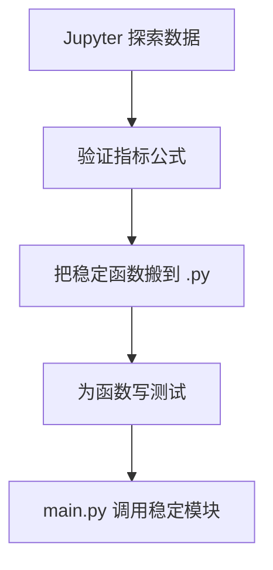
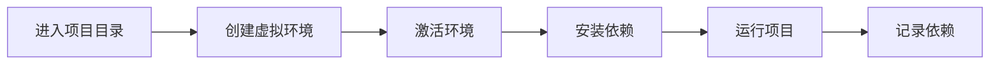
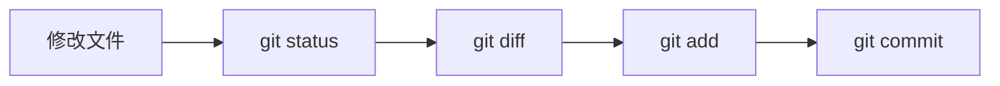

# 02 工具、环境与工作流：让你能稳定地写、跑、改项目

## 学习目标

学完这一章，你应该能做到：

- 熟悉 Windows PowerShell 的基本命令、路径、当前目录、管道和重定向。
- 理解 shell、终端、命令行之间的关系。
- 会使用 Jupyter 做探索，但知道最终代码为什么要沉淀到 `.py` 文件。
- 能区分 `conda`、`venv`、`pip` 的用途。
- 理解环境变量是什么，知道 API Key、路径、运行参数为什么常放在环境变量里。
- 会使用日志和配置文件，让程序可运行、可复现、可排查。
- 掌握 Git 的基础工作流，能保存每一步学习和项目改动。

这一章补的是“工具链”。它不像模型公式那样显眼，但会决定你能不能长期做项目。

## 为什么这部分对 AI 和量化重要

很多初学者以为自己卡在“不会模型”，其实卡在：

- 不知道当前命令在哪个目录运行。
- `pip install` 装到了另一个 Python 环境里。
- Notebook 能跑，命令行不能跑。
- 路径写死，换一台电脑就失败。
- API Key 写进代码，既不安全也不方便。
- 程序跑了一小时失败，没有日志，不知道失败在哪里。
- 改代码没有 Git 记录，改坏了回不去。

AI 和量化项目通常不是一次性脚本，而是一条工作流：


ASCII 版本：

```text
环境 -> 依赖 -> 探索 -> 脚本 -> 测试 -> Git -> 复现
```

## 一、终端、Shell、命令行到底是什么

### 1. 三个概念

| 概念 | 简单理解 | Windows 中的例子 |
|---|---|---|
| 终端 | 一个输入和显示命令的窗口 | Windows Terminal、VS Code Terminal |
| Shell | 解释你输入命令的程序 | PowerShell、cmd |
| 命令行 | 用文字命令操作电脑的方式 | `python main.py` |

你可以把终端想成“窗口”，Shell 想成“翻译官”，命令行是你和电脑沟通的语言。

### 2. 为什么要学命令行

因为很多开发工具首先提供命令行接口：

- 创建虚拟环境：`python -m venv .venv`
- 安装依赖：`python -m pip install pandas`
- 运行脚本：`python main.py`
- 运行测试：`python -m pytest`
- 使用 Git：`git status`
- 启动 Jupyter：`jupyter lab`

你不需要成为命令行高手，但必须掌握基础动作。

## 二、路径与当前目录

### 1. 当前目录是什么

当前目录就是命令行此刻“站在哪里”。你运行命令时，很多相对路径都以当前目录为起点。

查看当前目录：

```powershell
Get-Location
```

或者简写：

```powershell
pwd
```

切换目录：

```powershell
cd D:\爬虫预警程序
```

列出文件：

```powershell
Get-ChildItem
```

或者常用别名：

```powershell
ls
```

### 2. 绝对路径与相对路径

| 类型 | 例子 | 含义 |
|---|---|---|
| 绝对路径 | `D:\爬虫预警程序\finance_news_crawler\main.py` | 从盘符开始的完整位置 |
| 相对路径 | `finance_news_crawler\main.py` | 从当前目录出发的位置 |
| 当前目录 | `.` | 命令行现在所在的位置 |
| 上级目录 | `..` | 当前目录的父目录 |

图示：

```text
D:\爬虫预警程序
├── finance_news_crawler
│   └── main.py
└── docs
```

如果当前目录是 `D:\爬虫预警程序`，那么：

```powershell
python finance_news_crawler\main.py
```

能找到 `main.py`。

如果当前目录已经是 `D:\爬虫预警程序\finance_news_crawler`，那么：

```powershell
python main.py
```

才是更自然的写法。

### 3. 常见路径错误

| 现象 | 常见原因 | 排查方式 |
|---|---|---|
| `FileNotFoundError` | 当前目录不是你以为的地方 | `pwd` 查看当前目录 |
| 相同代码在 Notebook 能跑，脚本不能跑 | Notebook 工作目录不同 | 在 Notebook 中运行 `import os; os.getcwd()` |
| 路径中有中文或空格导致命令失败 | 没有加引号 | 用 `"D:\some path\file.py"` |
| Windows 路径反斜杠出错 | 字符串转义问题 | Python 中用 `Path` 或原始字符串 |

Python 中建议使用 `pathlib`：

```python
from pathlib import Path

base_dir = Path(__file__).resolve().parent
data_path = base_dir / "crawler_data" / "news.json"
```

这样比手写字符串路径更稳。

## 三、PowerShell 常用命令

| 任务 | PowerShell 命令 | 说明 |
|---|---|---|
| 查看当前目录 | `pwd` | 显示当前位置 |
| 列出文件 | `ls` | 查看当前目录内容 |
| 切换目录 | `cd path` | 进入某个目录 |
| 新建目录 | `mkdir docs` | 创建文件夹 |
| 查看文件内容 | `Get-Content file.txt` | 输出文本内容 |
| 删除文件 | `Remove-Item file.txt` | 删除前要确认路径 |
| 复制文件 | `Copy-Item a.txt b.txt` | 复制 |
| 移动文件 | `Move-Item a.txt folder\` | 移动或重命名 |
| 查看命令位置 | `Get-Command python` | 检查命令来自哪里 |
| 查看环境变量 | `$env:PATH` | 显示 PATH |

运行 Python：

```powershell
python --version
python main.py
python -m pip --version
python -m pytest
```

### 标准输入、标准输出、标准错误

程序运行时通常有三条“通道”：

| 通道 | 含义 |
|---|---|
| 标准输入 stdin | 程序读取用户输入 |
| 标准输出 stdout | 程序正常输出 |
| 标准错误 stderr | 程序错误信息 |

重定向输出到文件：

```powershell
python main.py > output.txt
```

把输出追加到文件：

```powershell
python main.py >> output.txt
```

管道把一个命令的输出传给另一个命令：

```powershell
Get-ChildItem | Select-Object Name, Length
```

## 四、Jupyter：探索工具，不是项目本体

### 1. Jupyter 适合什么

Jupyter 非常适合：

- 快速查看数据。
- 画图。
- 验证某个统计指标。
- 写实验笔记。
- 交互式调参。

例如：

```python
import pandas as pd

df = pd.read_csv("prices.csv")
df.head()
```

### 2. Jupyter 不适合什么

Jupyter 不适合长期承担：

- 项目主流程。
- 复杂爬虫。
- 定时任务。
- 大规模代码组织。
- 自动化测试。
- 多人协作中的核心业务逻辑。

因为 Notebook 的执行顺序可以和单元格顺序不一致，你可能先运行了第 8 个单元格，再运行第 3 个单元格，导致变量状态很混乱。

### 3. 推荐工作方式



ASCII 版本：

```text
Notebook 探索
  -> 公式稳定
  -> 搬到 metrics.py
  -> 写 test_metrics.py
  -> main.py 组织流程
```

### 4. 一个例子

Notebook 中探索：

```python
df["return"] = df["close"].pct_change()
df["cum_return"] = (1 + df["return"]).cumprod()
```

沉淀到 `metrics.py`：

```python
import pandas as pd


def add_return_columns(df: pd.DataFrame) -> pd.DataFrame:
    result = df.copy()
    result["return"] = result["close"].pct_change()
    result["cum_return"] = (1 + result["return"]).cumprod()
    return result
```

## 五、`venv`、`conda`、`pip`：环境管理三件套

### 1. 环境冲突是怎么来的

同一台电脑上可能有多个 Python：

```text
系统 Python
Anaconda Python
项目 A 的 .venv
项目 B 的 .venv
VS Code 选择的 Python
Jupyter Kernel 使用的 Python
```

你在一个环境里安装了包，另一个环境不一定能用。

### 2. 环境管理流程



PowerShell 示例：

```powershell
cd D:\爬虫预警程序\finance_news_crawler
python -m venv .venv
.\.venv\Scripts\Activate.ps1
python -m pip install -r requirements.txt
python main.py
```

### 3. 如何确认包装到哪个环境

```powershell
python -c "import sys; print(sys.executable)"
python -m pip --version
```

这两条命令很重要。很多“明明安装了却 import 不到”的问题，都是因为 `pip` 和 `python` 不属于同一个环境。

推荐永远用：

```powershell
python -m pip install package_name
```

而不是直接：

```powershell
pip install package_name
```

因为前者明确表示：给当前这个 `python` 安装包。

### 4. `requirements.txt` 和 `environment.yml`

`requirements.txt` 常用于 `pip`：

```text
requests==2.32.3
pandas==2.2.2
pytest==8.2.2
```

安装：

```powershell
python -m pip install -r requirements.txt
```

`environment.yml` 常用于 `conda`：

```yaml
name: quant-foundation
channels:
  - conda-forge
dependencies:
  - python=3.11
  - pandas
  - numpy
  - matplotlib
  - pip
  - pip:
      - pytest
```

创建：

```powershell
conda env create -f environment.yml
```

## 六、环境变量：不要把秘密和机器差异写死在代码里

### 1. 环境变量是什么

环境变量是操作系统提供给程序的一组键值对。程序运行时可以读取它们。

例如：

```text
TUSHARE_TOKEN=xxxxxxxx
DATA_DIR=D:\market_data
```

### 2. 为什么需要环境变量

| 内容 | 是否适合写进代码 | 更好的位置 |
|---|---|---|
| API Token | 不适合 | 环境变量或 `.env` |
| 数据目录 | 不适合写死 | 配置文件或环境变量 |
| 请求超时 | 可放配置 | `config.py` / `yaml` |
| 策略参数 | 可放配置 | `json` / `yaml` |
| 固定常量 | 可以 | 代码常量 |

### 3. PowerShell 中设置环境变量

当前窗口临时设置：

```powershell
$env:TUSHARE_TOKEN = "your-token"
```

Python 中读取：

```python
import os

token = os.getenv("TUSHARE_TOKEN")
if token is None:
    raise RuntimeError("TUSHARE_TOKEN is not set")
```

### 4. `.env` 文件

`.env` 是一种常见约定：

```text
TUSHARE_TOKEN=your-token
DATA_DIR=D:\market_data
```

注意：如果里面有真实 token，不要提交到 Git。

## 七、配置文件：让参数和代码分离

### 1. 为什么需要配置

如果你的代码里到处都是：

```python
start_date = "2026-07-27 14:00:00"
timeout = 15
page_limit = 5
```

每次改参数都要翻代码。更好的做法是集中配置。

### 2. `config.py`

你现有项目中已经有类似方式：

```python
from pathlib import Path

BASE_DIR = Path(__file__).resolve().parent
OUTPUT_DIR = BASE_DIR / "crawler_data"
REQUEST_TIMEOUT = 15
DEFAULT_SOURCE = "all"
```

优点：

- 简单。
- Python 原生。
- 可以使用 `Path` 等对象。

缺点：

- 改配置等于改代码。
- 不适合保存秘密。

### 3. JSON 配置

```json
{
  "source": "all",
  "request_timeout": 15,
  "page_limit": 5
}
```

读取：

```python
import json
from pathlib import Path


def load_config(path: Path) -> dict:
    with path.open("r", encoding="utf-8") as file:
        return json.load(file)
```

### 4. YAML 配置

```yaml
source: all
request_timeout: 15
page_limit: 5
```

YAML 更适合人读，但需要安装额外库，例如 `pyyaml`。

### 5. 配置优先级

一个常见优先级是：

```text
命令行参数 > 环境变量 > 配置文件 > 代码默认值
```

例如你运行：

```powershell
python main.py --source jin10
```

命令行参数应该覆盖默认配置。

## 八、日志：长期运行程序的黑匣子

### 1. 日志级别表

| 级别 | 用途 | 金融爬虫例子 |
|---|---|---|
| `DEBUG` | 详细调试信息 | 第 3 页原始响应长度 |
| `INFO` | 正常进度 | 开始抓取华尔街见闻 |
| `WARNING` | 可继续但需要注意 | 某条新闻没有发布时间 |
| `ERROR` | 某个任务失败 | Jin10 请求失败 |
| `CRITICAL` | 程序无法继续 | 输出目录不可写 |

### 2. 推荐日志格式

```python
import logging


def setup_logging() -> None:
    logging.basicConfig(
        level=logging.INFO,
        format="%(asctime)s [%(levelname)s] %(name)s: %(message)s",
    )
```

使用：

```python
import logging

logger = logging.getLogger(__name__)

logger.info("Start crawling source=%s", "jin10")
logger.warning("Missing publish_time for title=%s", "某条新闻")
```

### 3. 日志应该包含上下文

不够好：

```text
Error occurred
```

更好：

```text
Request failed source=jin10 url=https://... timeout=15
```

上下文越清楚，排查越快。

## 九、Git：保存你的学习过程

### 1. Git 解决什么问题

Git 是版本控制工具。它帮你回答：

- 我改了哪些文件？
- 上一次能跑的版本是什么？
- 这次改动为什么出现 bug？
- 能不能回看某一次提交？
- 能不能开分支做实验？

### 2. 基础工作流



命令：

```powershell
git status
git diff
git add .
git commit -m "Add return calculation"
```

### 3. 你应该什么时候提交

适合提交的时机：

- 完成一个小功能。
- 修复一个明确错误。
- 增加一组测试。
- 整理一次文档。

不建议：

- 写了一半还完全不能运行就提交到主分支。
- 一个提交混合很多无关改动。
- 提交信息写成 `update`、`fix`、`aaa`。

更好的提交信息：

```text
Add max drawdown calculation
Fix datetime parsing for empty values
Document crawler run commands
```

## 十、推荐日常工作流

下面是一条适合你当前阶段的工作流：

```text
1. 打开终端，进入项目目录
2. 激活虚拟环境
3. 用 Jupyter 探索数据或公式
4. 把稳定逻辑放入 .py 文件
5. 运行脚本
6. 运行测试
7. 查看 git diff
8. 提交一次清晰的 commit
```

PowerShell 示例：

```powershell
cd D:\爬虫预警程序\finance_news_crawler
.\.venv\Scripts\Activate.ps1
python main.py --source all
python -m pytest
git status
git diff
```

## 十一、小白容易误解的地方

| 误解 | 更准确的理解 |
|---|---|
| 命令行只是黑框，很落后 | 命令行是开发工具的统一入口 |
| Notebook 能跑就代表项目没问题 | Notebook 状态可能不可复现 |
| `pip install` 成功就万事大吉 | 要确认安装到当前 Python 环境 |
| 环境变量很玄学 | 它只是操作系统给程序的键值配置 |
| 配置文件越多越专业 | 初期保持简单，参数集中即可 |
| 日志是上线后才需要 | 学习项目也需要日志帮助排错 |
| Git 只是上传 GitHub | Git 首先是本地版本控制工具 |

## 十二、练习任务

### 练习 1：命令行定位项目

完成：

```powershell
cd D:\爬虫预警程序
pwd
ls
cd finance_news_crawler
ls
```

写下：

- 当前目录是什么？
- `main.py` 在哪里？
- `requirements.txt` 在哪里？

### 练习 2：创建并确认虚拟环境

```powershell
python -m venv .venv
.\.venv\Scripts\Activate.ps1
python -c "import sys; print(sys.executable)"
```

观察输出路径是否包含 `.venv`。

### 练习 3：Notebook 到模块

在 Notebook 中计算收益率，然后把函数搬到 `metrics.py`，再用 `main.py` 调用。

### 练习 4：环境变量读取

设置：

```powershell
$env:DATA_DIR = "D:\market_data"
```

读取：

```python
import os

print(os.getenv("DATA_DIR"))
```

### 练习 5：Git 保存一次学习成果

```powershell
git status
git diff
git add docs
git commit -m "Add computer foundation notes"
```

如果你还没有准备提交，可以只运行前两条观察变化。

## 十三、自检清单

- [ ] 我能解释终端、Shell、命令行的区别。
- [ ] 我知道当前目录会影响相对路径。
- [ ] 我能区分绝对路径和相对路径。
- [ ] 我会在 PowerShell 中运行 Python 文件。
- [ ] 我知道 Notebook 适合探索，不适合作为项目主代码。
- [ ] 我会创建和激活 `venv`。
- [ ] 我知道为什么推荐 `python -m pip`。
- [ ] 我能解释环境变量的用途。
- [ ] 我会把参数集中放入配置文件。
- [ ] 我知道日志五个级别的大致含义。
- [ ] 我会用 `git status` 和 `git diff` 检查改动。

## 十四、术语表

| 术语 | 解释 |
|---|---|
| 终端 | 输入和显示命令的窗口 |
| Shell | 解释命令的程序 |
| 当前目录 | 命令行当前所在的位置 |
| 绝对路径 | 从盘符或根目录开始的完整路径 |
| 相对路径 | 从当前目录出发的路径 |
| 标准输出 | 程序正常输出的信息通道 |
| 标准错误 | 程序错误信息通道 |
| 管道 | 把一个命令的输出传给另一个命令 |
| Jupyter | 交互式数据探索和笔记工具 |
| 虚拟环境 | 项目独立的 Python 运行环境 |
| 环境变量 | 操作系统提供给程序的键值配置 |
| 配置文件 | 集中保存参数的文件 |
| 日志 | 程序运行过程中的结构化记录 |
| Git | 版本控制工具 |
| commit | Git 中一次明确的版本记录 |

## 十五、延伸阅读

- MIT Missing Semester：重点看 Shell、Git、命令行环境。
- PowerShell 官方文档：重点学路径、管道、对象输出。
- JupyterLab 文档：重点理解 Notebook 和 Kernel。
- Git 官方教程：重点掌握 `status`、`diff`、`add`、`commit`、`log`。
- Python `pathlib` 文档：路径处理建议优先使用它。

