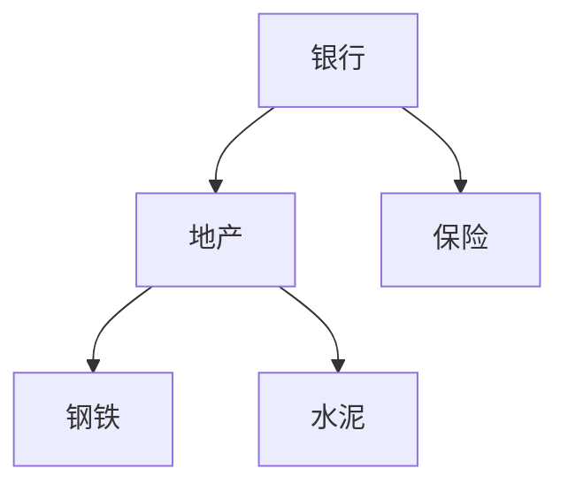

# 03 数据结构与算法：让你知道程序为什么快、为什么慢

## 学习目标

学完这一章，你应该能做到：

- 理解时间复杂度和空间复杂度的基本含义。
- 知道数组、链表、栈、队列、哈希表、树、图分别解决什么问题。
- 能用 Python 写出这些结构的基本操作。
- 理解排序、二分、递归、动态规划的核心思想。
- 面对金融数据任务时，能初步判断该用什么结构、程序大概会不会慢、内存大概会不会爆。

这一章不把你训练成算法竞赛选手，而是让你获得“计算直觉”。量化和 AI 里，很多问题不是公式不会，而是数据规模一大，代码就慢到不可用。

## 为什么这部分对 AI 和量化重要

金融数据有几个特点：

- 数据量容易变大：分钟线、tick 数据、新闻文本、订单簿。
- 时间顺序很重要：不能用未来数据。
- 查找和匹配很多：股票代码、交易日、新闻 ID、行业分类。
- 排序和排名很多：因子排序、收益排名、风险排序。
- 图关系越来越常见：行业链、供应链、股权关系、新闻传播。

如果你完全不懂数据结构和算法，容易写出这样的代码：

```python
for stock in stocks:
    for record in all_records:
        if record["symbol"] == stock:
            ...
```

当 `stocks` 有 5000 个，`all_records` 有 100 万条时，这种双重循环会非常慢。算法基础就是帮你看出：这里应该先建立哈希表。

## 一、复杂度：估算程序增长速度

### 1. 为什么要学复杂度

复杂度回答的问题不是“程序运行多少秒”，而是：

> 当数据规模变大 10 倍时，运行时间大概会变成多少？

这对量化非常关键。因为你在小样本上跑得很快，不代表在全市场、长周期、多频率数据上还能跑。

### 2. 常见时间复杂度

| 复杂度 | 名称 | 数据量翻倍时 | 例子 |
|---|---|---|---|
| `O(1)` | 常数时间 | 基本不变 | 字典按 key 查询 |
| `O(log n)` | 对数时间 | 增加一点 | 二分查找 |
| `O(n)` | 线性时间 | 大约翻倍 | 遍历所有价格 |
| `O(n log n)` | 线性对数 | 略高于翻倍 | 高效排序 |
| `O(n^2)` | 平方时间 | 大约变 4 倍 | 双重循环两两比较 |
| `O(2^n)` | 指数时间 | 爆炸增长 | 穷举所有组合 |

直觉图：

```text
快  O(1)
    O(log n)
    O(n)
    O(n log n)
    O(n^2)
慢  O(2^n)
```

### 3. 一个金融例子

假设你有 5000 只股票，要判断某条行情的股票代码是否在自选池里。

列表写法：

```python
watchlist = ["000001.SZ", "600000.SH", "510300.SH"]

def is_watched(symbol: str) -> bool:
    return symbol in watchlist
```

列表查询平均要一个一个找，复杂度是 `O(n)`。

集合写法：

```python
watchlist = {"000001.SZ", "600000.SH", "510300.SH"}

def is_watched(symbol: str) -> bool:
    return symbol in watchlist
```

集合查询平均接近 `O(1)`。数据越大，差距越明显。

### 4. 空间复杂度

空间复杂度关注额外占用多少内存。

例如：

```python
new_prices = [price * 1.01 for price in prices]
```

这会创建一个新列表，额外占用 `O(n)` 空间。

如果数据特别大，你可能需要逐行处理：

```python
for price in prices:
    adjusted_price = price * 1.01
    # 立刻处理，不保存全部结果
```

## 二、数组 / 列表：最常用的顺序结构

Python 中最常见的数组型结构是 `list`。严格说，Python 的 `list` 是动态数组。

### 1. 它是什么

列表是一组有顺序的元素：

```python
prices = [10.0, 10.5, 10.2, 10.8]
```

索引从 0 开始：

```text
索引:   0     1     2     3
值:   10.0  10.5  10.2  10.8
```

### 2. 解决什么问题

列表适合：

- 保存按顺序排列的数据。
- 通过索引快速访问。
- 遍历全部元素。
- 保存时间序列。

量化中常见：

- 收盘价序列。
- 日收益率序列。
- 策略净值曲线。
- 新闻发布时间序列。

### 3. 常见操作复杂度

| 操作 | 例子 | 复杂度 |
|---|---|---|
| 按索引访问 | `prices[2]` | `O(1)` |
| 尾部追加 | `prices.append(11)` | 平均 `O(1)` |
| 遍历 | `for p in prices` | `O(n)` |
| 中间插入 | `prices.insert(1, 9)` | `O(n)` |
| 删除中间元素 | `prices.pop(1)` | `O(n)` |
| 判断是否存在 | `x in prices` | `O(n)` |

### 4. Python 示例：计算收益率

```python
def calculate_returns(prices: list[float]) -> list[float]:
    returns = []
    for i in range(1, len(prices)):
        daily_return = prices[i] / prices[i - 1] - 1
        returns.append(daily_return)
    return returns


print(calculate_returns([100, 105, 102]))
```

### 5. 常见坑

| 坑 | 说明 |
|---|---|
| 越界 | `prices[len(prices)]` 会报错 |
| 空列表 | 访问 `prices[0]` 前要确认不为空 |
| 频繁头部插入 | `insert(0, x)` 会移动很多元素 |
| 原地修改 | 函数内部改列表会影响外部对象 |

## 三、链表：理解指针和连接关系

Python 日常量化中很少直接手写链表，但学习链表能帮助你理解“对象引用”和“内存不连续”。

### 1. 它是什么

链表由一个个节点组成，每个节点保存数据和下一个节点的位置。

```text
[数据|next] -> [数据|next] -> [数据|next] -> None
```

### 2. 与数组的区别

| 特征 | 数组 / 列表 | 链表 |
|---|---|---|
| 内存 | 通常连续或类似连续管理 | 节点分散 |
| 按索引访问 | 快，`O(1)` | 慢，`O(n)` |
| 头部插入 | 慢，`O(n)` | 快，`O(1)` |
| Python 常用程度 | 很高 | 较低 |

### 3. Python 简化示例

```python
class Node:
    def __init__(self, value: str):
        self.value = value
        self.next: Node | None = None


first = Node("news A")
second = Node("news B")
third = Node("news C")

first.next = second
second.next = third
```

遍历：

```python
current = first
while current is not None:
    print(current.value)
    current = current.next
```

### 4. 常见坑

链表题常见错误是：

- 忘记更新 `next`。
- 循环条件写错。
- 形成环，导致无限循环。

初学阶段不必过度刷链表难题，理解概念即可。

## 四、栈：后进先出

### 1. 它是什么

栈的规则是：**后进先出**。

```text
入栈 push:
底部 [A]
     [B]
顶部 [C]

出栈 pop:
先拿 C，再拿 B，再拿 A
```

### 2. 解决什么问题

栈适合处理：

- 括号匹配。
- 函数调用。
- 撤销操作。
- 深度优先搜索。

### 3. Python 中用列表模拟栈

```python
stack = []
stack.append("task A")
stack.append("task B")
last_task = stack.pop()

print(last_task)
```

### 4. 例子：检查括号匹配

```python
def is_valid_parentheses(text: str) -> bool:
    stack = []
    pairs = {")": "(", "]": "[", "}": "{"}

    for char in text:
        if char in "([{":
            stack.append(char)
        elif char in ")]}":
            if not stack or stack.pop() != pairs[char]:
                return False

    return len(stack) == 0
```

### 5. 金融场景直觉

栈不一定直接出现在量化指标里，但它帮助你理解：

- 函数调用栈。
- 递归为什么可能爆栈。
- 表达式解析。
- 回测系统中某些“撤销/回滚”逻辑。

## 五、队列：先进先出

### 1. 它是什么

队列的规则是：**先进先出**。

```text
入队: A -> B -> C
出队: 先 A，再 B，再 C
```

### 2. 解决什么问题

队列适合：

- 任务排队。
- 广度优先搜索。
- 滑动窗口。
- 消息处理。

### 3. Python 中使用 `deque`

不要用列表频繁 `pop(0)`，因为它是 `O(n)`。推荐：

```python
from collections import deque

queue = deque()
queue.append("page 1")
queue.append("page 2")

task = queue.popleft()
print(task)
```

### 4. 例子：滑动窗口均值

```python
from collections import deque


def moving_average(values: list[float], window: int) -> list[float]:
    result = []
    q = deque()
    current_sum = 0.0

    for value in values:
        q.append(value)
        current_sum += value

        if len(q) > window:
            current_sum -= q.popleft()

        if len(q) == window:
            result.append(current_sum / window)

    return result
```

这个例子对量化很重要。移动平均、滚动波动率、滚动收益都可以理解为滑动窗口。

## 六、哈希表：快速查找的核心结构

Python 的 `dict` 和 `set` 都基于哈希表思想。

### 1. 它是什么

哈希表通过 key 快速定位 value。

```text
"000001.SZ" -> 平安银行
"600000.SH" -> 浦发银行
"510300.SH" -> 沪深300ETF
```

### 2. 解决什么问题

哈希表适合：

- 快速查找。
- 去重。
- 计数。
- 建立映射关系。
- 按 ID 合并数据。

### 3. Python 示例：股票代码映射

```python
stock_names = {
    "000001.SZ": "平安银行",
    "600000.SH": "浦发银行",
    "510300.SH": "沪深300ETF",
}

print(stock_names["000001.SZ"])
```

### 4. 例子：新闻去重

```python
def deduplicate_news(records: list[dict]) -> list[dict]:
    seen_ids = set()
    result = []

    for record in records:
        news_id = record["id"]
        if news_id in seen_ids:
            continue
        seen_ids.add(news_id)
        result.append(record)

    return result
```

如果用列表保存 `seen_ids`，每次判断都要线性查找。用集合平均接近 `O(1)`。

### 5. 常见坑

| 坑 | 说明 |
|---|---|
| key 不存在 | `dict[key]` 会报 `KeyError` |
| key 必须可哈希 | 列表不能作为 key |
| 顺序不是主要目的 | 虽然新版本 Python 字典保留插入顺序，但核心价值是查找 |
| 哈希冲突 | 理论上存在，初学阶段知道即可 |

更稳的访问：

```python
name = stock_names.get("000002.SZ", "未知股票")
```

## 七、树：层级关系

### 1. 它是什么

树是一种层级结构。

```text
市场
├── 股票
│   ├── 银行
│   └── 医药
└── 基金
    ├── ETF
    └── 债券基金
```

### 2. 树的基本术语

| 术语 | 解释 |
|---|---|
| 根节点 | 最上层节点 |
| 子节点 | 某节点下面的节点 |
| 父节点 | 某节点上面的节点 |
| 叶子节点 | 没有子节点的节点 |
| 深度 | 从根到某节点经过的层数 |

### 3. 二叉树

二叉树是每个节点最多有两个子节点的树。

```text
        A
       / \
      B   C
     / \
    D   E
```

### 4. 遍历

```python
class TreeNode:
    def __init__(self, value: str):
        self.value = value
        self.left: TreeNode | None = None
        self.right: TreeNode | None = None


def preorder(node: TreeNode | None) -> None:
    if node is None:
        return
    print(node.value)
    preorder(node.left)
    preorder(node.right)
```

### 5. 金融场景

树可以表示：

- 行业分类。
- 指标体系。
- 风险因子层级。
- 文件目录。
- 决策树模型。

如果你以后学机器学习中的决策树、随机森林、梯度提升树，树结构会非常常见。

## 八、图：复杂关系网络

### 1. 它是什么

图由节点和边组成。

```text
公司 A ---- 供应 ---- 公司 B
公司 A ---- 持股 ---- 公司 C
公司 C ---- 同行业 -- 公司 D
```

### 2. 适合表示什么

图适合：

- 社交关系。
- 供应链关系。
- 股权关系。
- 行业传导。
- 新闻事件传播。

### 3. 邻接表

```python
graph = {
    "银行": ["地产", "保险"],
    "地产": ["钢铁", "水泥"],
    "保险": ["银行"],
}
```

### 4. BFS：广度优先搜索

BFS 像一层一层向外扩散。



BFS 顺序可能是：

```text
银行 -> 地产 -> 保险 -> 钢铁 -> 水泥
```

Python 示例：

```python
from collections import deque


def bfs(graph: dict[str, list[str]], start: str) -> list[str]:
    visited = set()
    order = []
    queue = deque([start])

    while queue:
        node = queue.popleft()
        if node in visited:
            continue

        visited.add(node)
        order.append(node)

        for neighbor in graph.get(node, []):
            if neighbor not in visited:
                queue.append(neighbor)

    return order
```

### 5. DFS：深度优先搜索

DFS 像沿着一条路走到底，再回头。

```python
def dfs(graph: dict[str, list[str]], start: str, visited: set[str] | None = None) -> list[str]:
    if visited is None:
        visited = set()

    visited.add(start)
    order = [start]

    for neighbor in graph.get(start, []):
        if neighbor not in visited:
            order.extend(dfs(graph, neighbor, visited))

    return order
```

### 6. 常见坑

图最常见的问题是有环。如果不记录 `visited`，程序可能无限循环。

```text
银行 -> 保险 -> 银行 -> 保险 -> ...
```

## 九、排序：排名、筛选、风控的基础

### 1. 为什么排序重要

量化里排序无处不在：

- 按收益率排序。
- 按市值排序。
- 按因子值排序。
- 按新闻发布时间排序。
- 按风险指标排序。

### 2. Python 排序

```python
records = [
    {"symbol": "A", "return": 0.03},
    {"symbol": "B", "return": -0.01},
    {"symbol": "C", "return": 0.05},
]

sorted_records = sorted(records, key=lambda item: item["return"], reverse=True)
```

### 3. 复杂度

Python 的 `sorted` 通常是 `O(n log n)`，这是非常成熟的排序实现。初学阶段不需要自己手写工业级排序，但要理解为什么排序不是免费的。

### 4. 排序算法直觉

| 算法 | 复杂度 | 初学重点 |
|---|---|---|
| 冒泡排序 | `O(n^2)` | 理解交换 |
| 选择排序 | `O(n^2)` | 理解选择最小值 |
| 插入排序 | `O(n^2)` | 小数据较直观 |
| 归并排序 | `O(n log n)` | 理解分治 |
| 快速排序 | 平均 `O(n log n)` | 理解基准划分 |

### 5. 因子排序例子

```python
def select_top_symbols(factors: list[dict], top_n: int) -> list[str]:
    ranked = sorted(factors, key=lambda item: item["factor_value"], reverse=True)
    return [item["symbol"] for item in ranked[:top_n]]
```

注意：实际量化中还要考虑停牌、涨跌停、行业中性、交易成本、未来函数等问题。这里先只关注排序。

## 十、二分：在有序数据中快速查找

### 1. 它是什么

二分查找每次把搜索范围砍掉一半。

```text
有序数组: [1, 3, 5, 7, 9, 11, 13]
找 9:
看中间 7，9 在右边
看右半边中间 11，9 在左边
看 9，找到
```

### 2. 复杂度

二分查找是 `O(log n)`。即使数据有 100 万条，也只需要大约 20 次比较。

### 3. Python 示例

```python
def binary_search(values: list[int], target: int) -> int:
    left = 0
    right = len(values) - 1

    while left <= right:
        mid = (left + right) // 2

        if values[mid] == target:
            return mid
        if values[mid] < target:
            left = mid + 1
        else:
            right = mid - 1

    return -1
```

### 4. 金融场景

二分适合：

- 在交易日列表中找某个日期。
- 找第一个大于等于目标时间的行情。
- 在有序价格中找阈值位置。

Python 标准库有 `bisect`：

```python
import bisect

dates = ["2026-07-01", "2026-07-02", "2026-07-03"]
index = bisect.bisect_left(dates, "2026-07-02")
print(index)
```

### 5. 常见坑

| 坑 | 说明 |
|---|---|
| 数据未排序 | 二分只适用于有序数据 |
| 边界条件 | `left <= right` 容易写错 |
| 死循环 | 更新左右边界时没有排除 `mid` |
| 重复元素 | 要明确找第一个、最后一个还是任意一个 |

## 十一、递归：函数调用自己

### 1. 它是什么

递归就是函数调用自己。它必须有终止条件。

```python
def factorial(n: int) -> int:
    if n == 0:
        return 1
    return n * factorial(n - 1)
```

调用栈：

```text
factorial(3)
  = 3 * factorial(2)
        = 2 * factorial(1)
              = 1 * factorial(0)
                    = 1
```

### 2. 递归的两个条件

| 条件 | 含义 |
|---|---|
| 终止条件 | 什么时候停止 |
| 规模缩小 | 每次调用都更接近终止条件 |

### 3. 树遍历中的递归

树天然适合递归：

```python
def count_nodes(node: TreeNode | None) -> int:
    if node is None:
        return 0
    return 1 + count_nodes(node.left) + count_nodes(node.right)
```

### 4. 常见坑

| 坑 | 说明 |
|---|---|
| 没有终止条件 | 无限递归 |
| 规模没有变小 | 永远到不了终点 |
| 递归太深 | 可能触发 `RecursionError` |
| 重复计算 | 可能需要缓存或动态规划 |

## 十二、动态规划：把重复子问题存起来

动态规划是初学者最容易害怕的内容。先别把它想成玄学。它的核心是：

> 如果一个问题会反复计算同样的小问题，就把小问题的答案存起来。

### 1. 从斐波那契数列开始

低效递归：

```python
def fib(n: int) -> int:
    if n <= 1:
        return n
    return fib(n - 1) + fib(n - 2)
```

这里会反复计算 `fib(3)`、`fib(4)`。

加缓存：

```python
def fib(n: int) -> int:
    cache = {0: 0, 1: 1}

    for i in range(2, n + 1):
        cache[i] = cache[i - 1] + cache[i - 2]

    return cache[n]
```

### 2. 动态规划三件事

| 步骤 | 问题 |
|---|---|
| 定义状态 | `dp[i]` 表示什么？ |
| 状态转移 | `dp[i]` 怎么由前面的结果得到？ |
| 初始条件 | 最开始的几个值是什么？ |

### 3. 金融直觉例子：最大单次买卖收益

问题：给定价格序列，只允许买一次卖一次，求最大收益。

```python
def max_profit(prices: list[float]) -> float:
    if not prices:
        return 0.0

    min_price = prices[0]
    best_profit = 0.0

    for price in prices:
        min_price = min(min_price, price)
        best_profit = max(best_profit, price - min_price)

    return best_profit
```

这里虽然不一定叫典型动态规划，但已经有 DP 思想：

- 截止当前，最低买入价是多少？
- 截止当前，最大收益是多少？
- 新一天的答案由前一天状态更新。

### 4. 初学阶段怎么学 DP

先掌握：

- 一维 DP：斐波那契、爬楼梯、最大子数组。
- 状态定义。
- 状态转移。
- 用表格手推小例子。

不要一开始就刷股票多次交易、背包变形、区间 DP 等难题。

## 十三、结构选择表

| 任务 | 推荐结构/算法 | 原因 |
|---|---|---|
| 保存价格序列 | 列表 / DataFrame | 有顺序，方便遍历 |
| 股票代码快速查找 | 集合 | 平均 `O(1)` |
| 股票代码到名称 | 字典 | key-value 映射 |
| 新闻去重 | 集合 | 快速判断是否出现 |
| 计算移动平均 | 队列 / 滑动窗口 | 维护固定窗口 |
| 因子排名 | 排序 | 找 top/bottom |
| 有序日期查找 | 二分 | 快速定位 |
| 行业层级 | 树 | 层级关系 |
| 供应链/股权关系 | 图 | 网络关系 |
| 递归目录扫描 | 递归 / 栈 | 层层展开 |

## 十四、小白容易误解的地方

| 误解 | 更准确的理解 |
|---|---|
| 数据结构是面试题，和量化没关系 | 数据结构决定大数据量下程序能不能跑 |
| Python 有库就不用学算法 | 库帮你实现，但你要知道什么时候用什么 |
| `O(n^2)` 只是慢一点 | 数据大时可能从秒级变小时级 |
| 链表很重要，所以要刷很多 | 对 Python/量化初学者，理解即可 |
| 动态规划必须一开始就学很深 | 先掌握状态和转移思想 |
| 哈希表等于字典 | 字典是哈希表思想的一种实现 |
| 排序很简单 | 排序背后有成本，且要注意排序依据和稳定性 |

## 十五、练习任务

### 练习 1：复杂度判断

判断下面代码复杂度：

```python
for price in prices:
    print(price)
```

```python
for stock in stocks:
    for date in dates:
        print(stock, date)
```

### 练习 2：新闻去重

写函数：

```python
def deduplicate(records: list[dict]) -> list[dict]:
    ...
```

要求按 `id` 去重，保留第一次出现的记录。

### 练习 3：滑动窗口

实现 3 日移动平均：

```python
prices = [10, 11, 12, 13, 14]
```

输出：

```text
[11.0, 12.0, 13.0]
```

### 练习 4：因子排序

给定：

```python
factors = [
    {"symbol": "A", "value": 0.3},
    {"symbol": "B", "value": 0.1},
    {"symbol": "C", "value": 0.5},
]
```

返回因子值最高的两个股票代码。

### 练习 5：二分查找日期

使用 `bisect` 找到某个日期在有序交易日列表中的位置。

### 练习 6：图遍历

用邻接表表示行业关系，然后从“银行”开始做 BFS。

## 十六、自检清单

- [ ] 我能解释 `O(1)`、`O(n)`、`O(n^2)` 的区别。
- [ ] 我知道列表按索引访问很快，但中间插入较慢。
- [ ] 我能解释栈的后进先出。
- [ ] 我能解释队列的先进先出。
- [ ] 我知道为什么集合适合去重。
- [ ] 我会用字典建立股票代码到名称的映射。
- [ ] 我能说明树适合表示层级关系。
- [ ] 我能说明图适合表示网络关系。
- [ ] 我知道二分必须用于有序数据。
- [ ] 我能解释递归必须有终止条件。
- [ ] 我能说出动态规划的状态、转移、初始条件。

## 十七、术语表

| 术语 | 解释 |
|---|---|
| 数据结构 | 组织和存储数据的方式 |
| 算法 | 解决问题的步骤 |
| 时间复杂度 | 数据规模变大时运行时间的增长趋势 |
| 空间复杂度 | 数据规模变大时内存占用的增长趋势 |
| 数组 | 顺序存储、按索引访问的数据结构 |
| 链表 | 由节点连接而成的数据结构 |
| 栈 | 后进先出的结构 |
| 队列 | 先进先出的结构 |
| 哈希表 | 通过 key 快速查找 value 的结构 |
| 树 | 表示层级关系的结构 |
| 图 | 表示复杂网络关系的结构 |
| 排序 | 按某种规则重新排列数据 |
| 二分查找 | 每次排除一半搜索范围的算法 |
| 递归 | 函数调用自身 |
| 动态规划 | 保存重复子问题答案的算法思想 |

## 十八、延伸阅读

- Open Data Structures：系统学习列表、栈、队列、哈希表、树、图。
- Python 官方文档：重点看 `list`、`dict`、`set`、`collections.deque`、`bisect`。
- 算法可视化网站：用动画理解排序、BFS、DFS。
- 量化练习：把每一种结构都对应到一个金融数据小任务。

