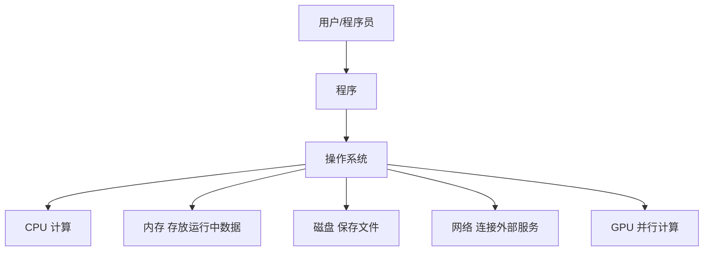
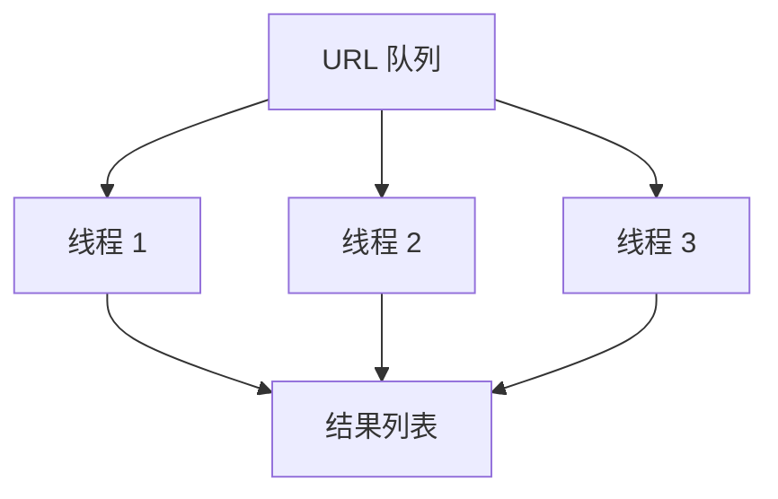
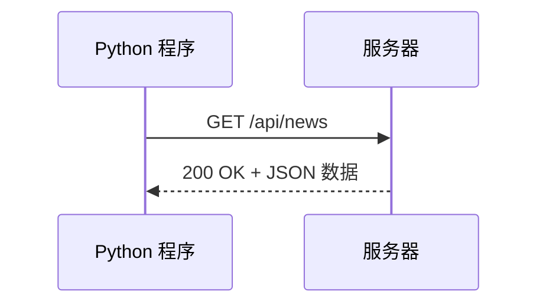

# 04 计算机常识与问题排查：从“玄学报错”到“系统定位”

## 学习目标

学完这一章，你应该能做到：

- 理解二进制、内存、CPU/GPU、进程/线程、文件系统、网络请求、数据库、操作系统的基本概念。
- 面对内存爆了、数据太大、程序太慢、环境冲突、网络请求失败、乱码、路径错误时，有基本排查思路。
- 知道哪些问题是代码逻辑问题，哪些问题是环境问题，哪些问题是系统资源问题。
- 能用较专业但不晦涩的语言描述问题，方便向他人求助或写排查记录。

这章不是要你一下学完操作系统、计算机组成原理、网络和数据库，而是先建立一个实用的“系统地图”。

## 为什么这部分对 AI 和量化重要

AI 和量化任务经常会遇到这些问题：

- 读取多年分钟线数据，内存突然爆了。
- pandas 操作很慢，不知道是 CPU 慢还是代码写法慢。
- 深度学习代码没有用上 GPU。
- 爬虫请求偶尔失败，不知道是网站问题、网络问题还是代码问题。
- 同一个项目在 Jupyter 能跑，在命令行不能跑。
- CSV 中文乱码。
- SQLite 查询慢。
- 安装包之后仍然 `ModuleNotFoundError`。

这些都属于计算机基础和工程排查能力。你越早建立直觉，越少被“玄学问题”消耗。

## 一、计算机的简化模型

先用一个简化图理解计算机：



ASCII 版本：

```text
你写的程序
  -> 操作系统调度
      -> CPU 做计算
      -> 内存放临时数据
      -> 磁盘读写文件
      -> 网络请求数据
      -> GPU 做大规模并行计算
```

当程序出问题时，先问：

- 是代码逻辑错了吗？
- 是文件路径或权限错了吗？
- 是网络失败了吗？
- 是内存不够了吗？
- 是环境装错了吗？
- 是 CPU/GPU 资源问题吗？

## 二、二进制：计算机为什么只认 0 和 1

### 1. 二进制是什么

二进制用 0 和 1 表示数字。十进制每一位是 10 的幂，二进制每一位是 2 的幂。

```text
十进制 13 = 1*8 + 1*4 + 0*2 + 1*1
二进制 13 = 1101
```

### 2. 为什么计算机用二进制

因为电子电路很适合表示两种稳定状态：

- 有电 / 无电
- 高电平 / 低电平
- 真 / 假

### 3. 常见单位

| 单位 | 含义 |
|---|---|
| bit | 1 个二进制位，0 或 1 |
| byte | 1 字节，通常等于 8 bit |
| KB | 约 1024 byte |
| MB | 约 1024 KB |
| GB | 约 1024 MB |

### 4. 和数据分析有什么关系

数据最终都要占字节：

- 一个整数占若干字节。
- 一个浮点数占若干字节。
- 一个字符串按编码占若干字节。
- DataFrame 的每一列都占内存。

理解这些，才能理解为什么数据太大会把内存撑爆。

## 三、内存：程序运行时的数据仓库

### 1. 内存是什么

内存是程序运行时临时存放数据的地方。它比磁盘快，但容量小，断电后数据消失。

```text
磁盘：长期保存 CSV、JSON、模型文件
内存：程序运行时加载 DataFrame、列表、模型参数
CPU：对内存里的数据做计算
```

### 2. 为什么会内存爆

假设一个 CSV 有 1000 万行，20 列。你用：

```python
import pandas as pd

df = pd.read_csv("huge_prices.csv")
```

`pandas` 会尽量把数据读进内存。文件在磁盘上可能是 2GB，读成 DataFrame 后可能占更多，因为数据结构、索引、对象列都有额外开销。

### 3. 排查内存问题

| 现象 | 可能原因 | 排查 |
|---|---|---|
| 程序突然退出 | 内存不足，被系统杀掉 | 观察任务管理器内存 |
| `MemoryError` | Python 申请内存失败 | 减少一次性加载数据 |
| pandas 很慢 | 数据列类型不合理 | 查看 `df.info(memory_usage="deep")` |
| 机器卡死 | 多个程序同时占内存 | 关闭无关程序 |

### 4. 解决思路

| 方法 | 说明 |
|---|---|
| 只读需要的列 | `usecols=[...]` |
| 分块读取 | `chunksize=100000` |
| 优化数据类型 | `float64` 改 `float32`，字符串改分类 |
| 使用数据库 | 不把所有数据一次性读进内存 |
| 及时删除大对象 | `del df`，必要时重启 Kernel |

分块读取示例：

```python
import pandas as pd

total_rows = 0

for chunk in pd.read_csv("huge_prices.csv", chunksize=100_000):
    total_rows += len(chunk)

print(total_rows)
```

## 四、CPU 与 GPU：为什么有些代码慢

### 1. CPU 是什么

CPU 是通用计算核心，适合处理复杂控制逻辑。Python 程序大部分逻辑都在 CPU 上运行。

### 2. GPU 是什么

GPU 有大量适合并行计算的小核心，特别适合矩阵运算、深度学习训练、图像处理。

| 设备 | 擅长 | 不擅长 |
|---|---|---|
| CPU | 分支逻辑、通用任务、系统调度 | 大规模同质并行计算 |
| GPU | 矩阵运算、深度学习、并行计算 | 小数据、频繁控制流、数据搬运 |

### 3. 为什么 Python 循环慢

Python 是高级语言，普通 `for` 循环每一步都有解释器开销：

```python
result = []
for x in values:
    result.append(x * 2)
```

NumPy / pandas 底层很多操作用 C 实现，通常更快：

```python
import numpy as np

arr = np.array(values)
result = arr * 2
```

这叫向量化。它不是魔法，本质是把循环交给更底层、更高效的代码执行。

### 4. 排查程序慢

| 现象 | 可能原因 | 思路 |
|---|---|---|
| 小数据快，大数据慢 | 算法复杂度高 | 检查是否有双重循环 |
| pandas 操作慢 | 用了逐行 `apply` | 尝试向量化 |
| GPU 利用率低 | 数据没放到 GPU 或数据太小 | 检查框架设备设置 |
| 网络爬虫慢 | 等待网络响应 | 加并发、缓存、重试 |
| 数据库慢 | 没有索引 | 为查询字段建索引 |

### 5. 简单计时

```python
from time import perf_counter

start = perf_counter()

# 需要计时的代码
sum(range(1_000_000))

elapsed = perf_counter() - start
print(f"elapsed: {elapsed:.4f}s")
```

不要凭感觉判断慢，要先测量。

## 五、进程与线程：程序运行时的单位

### 1. 进程是什么

进程是一个正在运行的程序实例。你运行：

```powershell
python main.py
```

操作系统会创建一个 Python 进程。

### 2. 线程是什么

线程是进程内部的执行流。一个进程可以有多个线程，共享同一进程的内存。

```text
进程：python.exe
  ├── 主线程
  ├── 网络请求线程
  └── 日志写入线程
```

### 3. 并发与并行

| 概念 | 含义 |
|---|---|
| 并发 | 多个任务交替推进，看起来同时进行 |
| 并行 | 多个任务真正同时执行 |

爬虫常用并发，因为很多时间都在等网络。

### 4. 爬虫中的线程池示意



### 5. 常见坑

| 坑 | 说明 |
|---|---|
| 线程越多越快 | 线程太多会增加调度和网络压力 |
| 多线程适合所有慢任务 | CPU 密集任务不一定适合 Python 多线程 |
| 共享数据随便改 | 可能产生竞态条件 |
| 忘记超时 | 线程可能卡在网络请求上 |

## 六、文件系统：路径、编码、权限

### 1. 文件系统是什么

文件系统负责管理磁盘上的文件和目录。

```text
D:\
└── 爬虫预警程序
    ├── finance_news_crawler
    │   ├── main.py
    │   └── crawler_data
    └── docs
```

### 2. 文件读写

```python
from pathlib import Path

path = Path("output.txt")
path.write_text("hello", encoding="utf-8")
text = path.read_text(encoding="utf-8")
```

### 3. 编码为什么会乱码

中文文本需要编码。常见编码：

| 编码 | 特点 |
|---|---|
| UTF-8 | 最常用，推荐 |
| GBK | Windows 中文环境中常见 |
| ASCII | 只支持基础英文字符 |

如果一个文件用 UTF-8 写入，却用 GBK 读取，就可能乱码。

读取 CSV 时可尝试：

```python
import pandas as pd

df = pd.read_csv("news.csv", encoding="utf-8")
```

如果失败或乱码，再尝试：

```python
df = pd.read_csv("news.csv", encoding="gbk")
```

### 4. 常见文件问题

| 现象 | 可能原因 | 解决 |
|---|---|---|
| `FileNotFoundError` | 路径错，当前目录错 | 打印绝对路径 |
| `PermissionError` | 文件被占用或无权限 | 关闭 Excel，检查权限 |
| 中文乱码 | 编码不匹配 | 明确 `encoding` |
| 输出目录不存在 | 未创建目录 | `mkdir(parents=True, exist_ok=True)` |

## 七、网络请求：爬虫和 API 的基础

### 1. HTTP 请求是什么

程序访问网页或 API，本质是在发 HTTP 请求。



ASCII 版本：

```text
Python 程序  --请求-->  服务器
Python 程序  <--响应--  服务器
```

### 2. 请求与响应

| 概念 | 说明 |
|---|---|
| URL | 访问地址 |
| method | 请求方法，如 GET、POST |
| headers | 请求头，描述客户端信息 |
| params | URL 查询参数 |
| body | 请求体，POST 常用 |
| status code | 状态码，如 200、404、500 |
| response text | 服务器返回内容 |

### 3. 常见状态码

| 状态码 | 含义 |
|---|---|
| 200 | 成功 |
| 400 | 请求参数错误 |
| 401 | 未认证 |
| 403 | 被拒绝访问 |
| 404 | 地址不存在 |
| 429 | 请求太频繁 |
| 500 | 服务器内部错误 |
| 502/503 | 服务暂时不可用 |

### 4. 请求示例

```python
import requests

url = "https://example.com/api/news"

try:
    response = requests.get(url, timeout=10)
    response.raise_for_status()
    data = response.json()
except requests.Timeout:
    print("请求超时")
except requests.HTTPError as exc:
    print(f"HTTP 错误: {exc}")
except requests.RequestException as exc:
    print(f"网络请求失败: {exc}")
```

### 5. 网络问题排查

| 现象 | 可能原因 | 排查 |
|---|---|---|
| 超时 | 网络慢，服务器慢 | 增加 timeout，重试 |
| 403 | 访问被拒 | 检查 headers、频率、权限 |
| 429 | 请求过快 | 降低频率，增加 sleep |
| JSON 解析失败 | 返回不是 JSON | 打印 `response.text[:500]` |
| 偶发失败 | 网络波动 | 加重试机制 |

### 6. 重试思想

```python
import time
import requests


def get_with_retry(url: str, retries: int = 3, timeout: int = 10) -> requests.Response:
    last_error = None

    for attempt in range(1, retries + 1):
        try:
            response = requests.get(url, timeout=timeout)
            response.raise_for_status()
            return response
        except requests.RequestException as exc:
            last_error = exc
            time.sleep(attempt)

    raise RuntimeError(f"Request failed after {retries} retries") from last_error
```

## 八、数据库：不要总把数据塞进 CSV

### 1. 数据库解决什么问题

CSV 简单，但有局限：

- 查询慢。
- 类型不严格。
- 多文件管理麻烦。
- 很难并发写入。
- 不适合复杂筛选。

数据库适合长期保存和查询结构化数据。

### 2. 表、行、列

```text
news 表
┌────┬──────────┬────────────┬─────────────────────┐
│ id │ title    │ source     │ publish_time        │
├────┼──────────┼────────────┼─────────────────────┤
│ 1  │ 新闻 A   │ jin10      │ 2026-07-27 14:00:00 │
│ 2  │ 新闻 B   │ fx678      │ 2026-07-27 14:05:00 │
└────┴──────────┴────────────┴─────────────────────┘
```

### 3. SQLite 入门

SQLite 是一个轻量数据库，一个 `.db` 文件就是数据库。Python 标准库自带 `sqlite3`。

```python
import sqlite3

conn = sqlite3.connect("news.db")
cursor = conn.cursor()

cursor.execute("""
CREATE TABLE IF NOT EXISTS news (
    id TEXT PRIMARY KEY,
    title TEXT NOT NULL,
    source TEXT NOT NULL,
    publish_time TEXT
)
""")

cursor.execute(
    "INSERT OR REPLACE INTO news (id, title, source, publish_time) VALUES (?, ?, ?, ?)",
    ("1", "美联储公布利率决议", "jin10", "2026-07-27 14:30:00"),
)

conn.commit()
conn.close()
```

### 4. 查询

```python
conn = sqlite3.connect("news.db")
cursor = conn.cursor()

cursor.execute("SELECT title, source FROM news WHERE source = ?", ("jin10",))
rows = cursor.fetchall()

for row in rows:
    print(row)

conn.close()
```

### 5. 索引

如果你经常按 `publish_time` 查询，可以建立索引：

```sql
CREATE INDEX idx_news_publish_time ON news(publish_time);
```

索引像书的目录，能加快查找，但也会占空间，并让写入稍慢。

## 九、操作系统：程序运行的管理者

### 1. 操作系统负责什么

操作系统管理：

- 进程和线程。
- 内存分配。
- 文件系统。
- 网络。
- 用户权限。
- 环境变量。
- 设备驱动。

你写的 Python 程序不是直接控制硬件，而是通过操作系统请求资源。

### 2. 环境冲突为什么常见

因为操作系统里可能存在多个版本：

```text
Python 3.10
Python 3.11
Anaconda Python
项目 .venv Python
VS Code 解释器
Jupyter Kernel
```

排查三连：

```powershell
python --version
python -c "import sys; print(sys.executable)"
python -m pip --version
```

### 3. PATH 是什么

`PATH` 是环境变量，告诉操作系统去哪些目录找命令。

当你输入：

```powershell
python
```

系统会在 `PATH` 里的目录中寻找 `python.exe`。

如果 PATH 顺序混乱，就可能调用了不是你想要的 Python。

## 十、故障诊断总表

| 问题现象 | 可能原因 | 排查步骤 | 解决办法 |
|---|---|---|---|
| `ModuleNotFoundError` | 包没装到当前环境 | `python -c "import sys; print(sys.executable)"` | 激活正确环境后 `python -m pip install` |
| `FileNotFoundError` | 当前目录或路径错误 | `pwd`，打印 `Path(...).resolve()` | 使用绝对路径或 `Path(__file__)` |
| 中文乱码 | 编码不匹配 | 尝试 `utf-8`、`gbk` | 读写时明确 `encoding` |
| `MemoryError` | 一次加载数据太大 | 看文件大小、`df.info()` | 分块读取、只读必要列 |
| 程序很慢 | 算法复杂度高或循环低效 | 计时，检查双重循环 | 哈希表、向量化、减少重复计算 |
| 网络超时 | 服务慢或网络波动 | 增加 timeout，打印 URL | 重试、限速、缓存 |
| HTTP 403 | 被拒绝访问 | 看状态码和响应文本 | 检查 headers、权限、频率 |
| HTTP 429 | 请求过快 | 看返回信息 | 降低频率，增加等待 |
| JSON 解析失败 | 返回 HTML 或错误页 | 打印 `response.text[:500]` | 先检查状态码和内容类型 |
| 数据库查询慢 | 没有索引或查询太大 | 查看 WHERE 条件 | 建索引，限制返回列 |
| Notebook 能跑脚本不能跑 | 工作目录或环境不同 | 打印 `os.getcwd()` 和解释器路径 | 统一工作目录和环境 |
| GPU 没用上 | 设备未配置或版本不匹配 | 检查框架设备信息 | 安装匹配版本，显式指定设备 |

## 十一、一个排查案例：爬虫请求失败

现象：

```text
requests.exceptions.Timeout
```

排查顺序：

```text
1. URL 是否正确？
2. 当前网络是否能访问？
3. timeout 是否太短？
4. 是否只有某个数据源失败？
5. 是否请求太频繁？
6. 响应状态码是多少？
7. 是否需要 headers 或 token？
```

改进代码：

```python
import logging
import requests

logger = logging.getLogger(__name__)


def fetch_text(url: str, timeout: int = 15) -> str:
    try:
        response = requests.get(url, timeout=timeout)
        response.raise_for_status()
    except requests.RequestException as exc:
        logger.error("Request failed url=%s timeout=%s error=%s", url, timeout, exc)
        raise

    return response.text
```

关键点：

- 不要只写 `请求失败`。
- 日志里放 URL、timeout、错误对象。
- 不确定能否恢复时，先抛出异常，让上层决定。

## 十二、一个排查案例：CSV 读取后内存暴涨

现象：

```python
df = pd.read_csv("all_ticks.csv")
```

程序卡住或内存占用很高。

排查：

```python
import pandas as pd

df = pd.read_csv("all_ticks.csv", nrows=1000)
print(df.info(memory_usage="deep"))
```

优化：

```python
usecols = ["symbol", "datetime", "price", "volume"]

for chunk in pd.read_csv("all_ticks.csv", usecols=usecols, chunksize=100_000):
    # 每次处理一块
    print(chunk["price"].mean())
```

如果长期使用，考虑导入 SQLite 或更专业的列式存储格式。

## 十三、一个排查案例：环境装包混乱

现象：

```text
ModuleNotFoundError: No module named 'requests'
```

但你明明运行过：

```powershell
pip install requests
```

排查：

```powershell
python -c "import sys; print(sys.executable)"
python -m pip --version
```

解决：

```powershell
.\.venv\Scripts\Activate.ps1
python -m pip install requests
python -c "import requests; print(requests.__version__)"
```

记住：用 `python -m pip` 可以减少“pip 和 python 不是同一个环境”的问题。

## 十四、小白容易误解的地方

| 误解 | 更准确的理解 |
|---|---|
| 内存和硬盘差不多 | 内存是运行时临时空间，硬盘是长期存储 |
| 文件 1GB，DataFrame 就只占 1GB | DataFrame 可能占更多内存 |
| GPU 一定比 CPU 快 | 小任务和控制逻辑未必适合 GPU |
| 多线程一定更快 | 取决于是网络等待还是 CPU 计算 |
| 乱码是 Python 抽风 | 通常是编码不匹配 |
| 403 是代码语法错 | 403 是服务器拒绝访问 |
| 数据库很高级，初学不用管 | SQLite 很轻量，适合保存结构化结果 |
| 环境问题只能重装 | 大多数环境问题可以通过解释器路径和 pip 路径定位 |

## 十五、练习任务

### 练习 1：查看 Python 解释器位置

```powershell
python --version
python -c "import sys; print(sys.executable)"
python -m pip --version
```

写下当前 Python 来自哪里。

### 练习 2：估算 CSV 内存

用一个小 CSV 或现有 JSON/CSV 数据，读取前 1000 行：

```python
import pandas as pd

df = pd.read_csv("your_file.csv", nrows=1000)
print(df.info(memory_usage="deep"))
```

观察哪些列占内存较多。

### 练习 3：路径排查

写一个脚本打印：

```python
from pathlib import Path
import os

print(os.getcwd())
print(Path(".").resolve())
print(Path(__file__).resolve())
```

分别在不同目录运行，观察变化。

### 练习 4：网络状态码

用 `requests` 请求一个网页，打印：

```python
print(response.status_code)
print(response.text[:200])
```

观察状态码和返回内容。

### 练习 5：SQLite 保存新闻

用 `sqlite3` 创建 `news.db`，保存两条新闻记录，然后按 `source` 查询。

### 练习 6：程序计时

比较普通循环和 NumPy 向量化的速度差异。

## 十六、自检清单

- [ ] 我能解释 bit、byte、MB、GB。
- [ ] 我知道内存和磁盘的区别。
- [ ] 我知道为什么 DataFrame 可能占很多内存。
- [ ] 我能说出 CPU 和 GPU 擅长任务的区别。
- [ ] 我知道进程和线程的大致区别。
- [ ] 我理解当前目录会影响文件读写。
- [ ] 我知道 UTF-8 和 GBK 都是编码。
- [ ] 我知道 HTTP 请求包含 URL、状态码、响应内容。
- [ ] 我能解释 403、404、429、500 的基本含义。
- [ ] 我知道数据库表、行、列、索引是什么。
- [ ] 我能用三条命令排查 Python 环境问题。
- [ ] 我遇到问题时能按“现象、原因、排查、解决”记录。

## 十七、术语表

| 术语 | 解释 |
|---|---|
| bit | 二进制位，0 或 1 |
| byte | 字节，通常 8 bit |
| 内存 | 程序运行时临时存放数据的空间 |
| 磁盘 | 长期保存文件的存储设备 |
| CPU | 通用计算核心 |
| GPU | 适合大规模并行计算的处理器 |
| 进程 | 正在运行的程序实例 |
| 线程 | 进程内部的执行流 |
| 文件系统 | 操作系统管理文件和目录的机制 |
| 编码 | 字符与字节之间的转换规则 |
| HTTP | Web 请求和响应协议 |
| 状态码 | HTTP 响应结果编号 |
| 数据库 | 管理结构化数据的软件系统 |
| 表 | 数据库中保存一类记录的结构 |
| 索引 | 加快数据库查询的数据结构 |
| 操作系统 | 管理硬件和程序资源的软件 |
| PATH | 操作系统寻找命令的环境变量 |

## 十八、延伸阅读

- Nand2Tetris：从底层建立计算机系统直觉。
- CS50：补计算机导论和 C、内存、算法基础。
- Python `pathlib`、`sqlite3`、`logging`、`requests` 文档。
- pandas 用户指南：重点看 IO、缺失值、数据类型、性能优化。
- SQLite 官方文档：重点学表、查询、索引。

