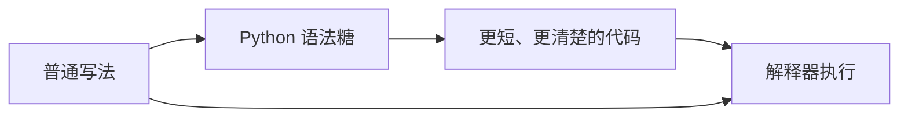
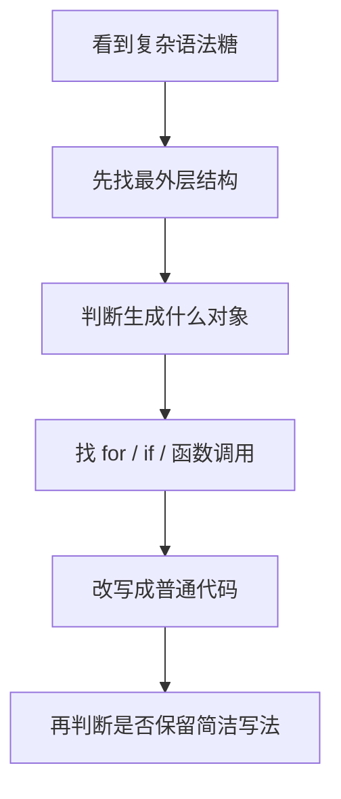

# 05 Python 语法糖：把代码写得更顺手，也看懂它背后的真实逻辑

## 学习目标

学完这一章，你应该能做到：

- 说清楚什么是语法糖，知道它不是“新能力”，而是更方便的表达方式。
- 看懂 Python 里常见的简洁写法，不再把它们当成神秘魔法。
- 能把“有糖写法”翻译回“没糖写法”，理解解释器大致帮你做了什么。
- 在爬虫、行情数据处理、量化指标计算中合理使用语法糖。
- 判断什么时候应该用语法糖，什么时候应该展开成普通写法来保证可读性。
- 看懂 AI 生成代码里的列表推导式、装饰器、解包、`with`、`@property`、`@dataclass` 等常见结构。

这一章不是为了鼓励你把代码写得越短越好，而是为了让你理解 Python 代码里那些“看起来很优雅”的写法到底在做什么。真正成熟的 Python 风格，不是炫技，而是**用简洁的语法表达清楚的意图**。

## 为什么语法糖对 Python、爬虫和量化重要

Python 很受欢迎，一个重要原因就是它提供了大量“顺手”的语法。比如：

- 清洗一批新闻标题时，可以用列表推导式。
- 读写 CSV、HTML、JSON 文件时，可以用 `with` 自动关闭文件。
- 爬虫请求失败需要重试时，可以用装饰器把“重试逻辑”和“业务逻辑”分开。
- API 返回多项数据时，可以用解包赋值。
- 表示持仓、新闻、K 线这类数据对象时，可以用 `@dataclass`。
- 想把方法伪装成属性读取时，可以用 `@property`。

在量化研究里，你会频繁处理“批量数据 + 重复流程 + 工具函数 + 数据对象”。语法糖能让这些代码更短、更规整。但如果你只会照抄，不懂底层等价逻辑，看到 AI 生成的一行复杂代码时，就会很容易卡住。

你要建立的意识是：

```text
语法糖不是魔法。
语法糖 = Python 给常见写法准备的快捷表达。
```

下面这张图可以帮助你理解：



ASCII 版本：

```text
没糖写法  ->  有糖写法  ->  更适合人阅读
   \                         /
    --------解释器最终执行--------
```

## 一、什么是语法糖

### 1. 定义

语法糖，英文是 syntactic sugar，指编程语言中一种让代码更简洁、更自然、更好读的语法形式。它通常不改变语言本身的能力，只是让你用更少的代码表达同一件事。

比如：

```python
prices = [i * 100 for i in range(10)]
```

这行代码可以翻译成：

```python
prices = []

for i in range(10):
    prices.append(i * 100)
```

两个版本做的事情基本一样，但第一个更短、更集中。

### 2. 语法糖、普通语法和语法盐

| 概念 | 含义 | Python 例子 | 学习重点 |
|---|---|---|---|
| 普通语法 | 最基础、最直接的写法 | `for` 循环、`if` 判断、函数调用 | 必须先掌握 |
| 语法糖 | 更简洁、更自然的快捷写法 | 列表推导式、装饰器、解包、`with` | 要知道等价普通写法 |
| 语法盐 | 让你多写一点，但减少危险的语法约束 | Python 强制缩进、显式 `self` | 不一定舒服，但有安全价值 |

语法糖让你开心，因为它减少重复劳动。语法盐有时让你不舒服，但它逼你写出更明确的代码。

例如 Python 的缩进：

```python
if True:
    print("inside if")
print("outside if")
```

Python 不允许你随便缩进。刚学时你可能觉得烦，但它避免了很多“大括号错位”导致的隐藏 bug。

### 3. 学语法糖的正确姿势

学习每一种语法糖时，都问六个问题：

| 问题 | 目的 |
|---|---|
| 没糖怎么写？ | 建立底层理解 |
| 有糖怎么写？ | 学会简洁表达 |
| Python 大致帮我做了什么？ | 看懂机制 |
| 适合什么场景？ | 避免乱用 |
| 不适合什么场景？ | 避免炫技 |
| AI 写出这种代码时，我该从哪里读？ | 提高读代码能力 |

## 二、列表推导式：最常见的 Python 语法糖

### 1. 它解决什么问题

列表推导式用于从一个可迭代对象中批量生成新列表。它特别适合“遍历、筛选、转换”这种操作。

量化和爬虫里很常见：

- 把价格转成收益率。
- 清洗新闻标题。
- 从 API 返回结果里提取字段。
- 过滤空数据、无效数据。

### 2. 没糖写法

```python
prices = []

for i in range(10):
    prices.append(i * 100)

print(prices)
```

### 3. 有糖写法

```python
prices = [i * 100 for i in range(10)]

print(prices)
```

### 4. 解释器大致帮你做了什么

你可以把：

```python
[表达式 for 变量 in 可迭代对象]
```

理解成：

```python
result = []

for 变量 in 可迭代对象:
    result.append(表达式)
```

### 5. 加条件筛选

假设你爬到一组财经新闻标题，想去掉空标题：

```python
raw_titles = ["央行发布新政策", "", "AI 算力需求增长", "   ", "美股科技股回调"]
clean_titles = []

for title in raw_titles:
    title = title.strip()
    if title:
        clean_titles.append(title)

print(clean_titles)
```

列表推导式写法：

```python
raw_titles = ["央行发布新政策", "", "AI 算力需求增长", "   ", "美股科技股回调"]

clean_titles = [title.strip() for title in raw_titles if title.strip()]

print(clean_titles)
```

这里的结构是：

```text
[转换结果 for 原始元素 in 原始列表 if 筛选条件]
```

### 6. 量化例子：计算简单收益率

假设你有一组收盘价：

```python
prices = [100, 102, 101, 105]

returns = []
for i in range(1, len(prices)):
    ret = prices[i] / prices[i - 1] - 1
    returns.append(ret)

print(returns)
```

列表推导式写法：

```python
prices = [100, 102, 101, 105]

returns = [prices[i] / prices[i - 1] - 1 for i in range(1, len(prices))]

print(returns)
```

这行代码的读法是：

```text
对 i 从 1 到 len(prices)-1：
    计算 prices[i] 相对 prices[i-1] 的收益率
    放进 returns 列表
```

### 7. 什么时候该用

| 适合用列表推导式 | 不适合用列表推导式 |
|---|---|
| 一次简单转换 | 逻辑超过两三步 |
| 简单筛选 | 嵌套太多层 |
| 生成新列表 | 中间需要打印、调试、处理异常 |
| 表达式比较短 | 读起来要来回倒着看 |

### 8. 不要过度炫技

下面这种写法虽然合法，但对初学者非常不友好：

```python
result = [x * y for x in range(10) for y in range(5) if x > y]
```

它等价于：

```python
result = []

for x in range(10):
    for y in range(5):
        if x > y:
            result.append(x * y)
```

如果你需要花很多秒才能看懂一行推导式，那就应该展开成普通循环。代码是给人读的，机器只是顺便执行。

## 三、字典推导式与集合推导式

### 1. 字典推导式

字典推导式用于批量生成字典。

没糖写法：

```python
codes = ["AAPL", "MSFT", "NVDA"]
weights = [0.3, 0.4, 0.3]

portfolio = {}
for code, weight in zip(codes, weights):
    portfolio[code] = weight

print(portfolio)
```

有糖写法：

```python
codes = ["AAPL", "MSFT", "NVDA"]
weights = [0.3, 0.4, 0.3]

portfolio = {code: weight for code, weight in zip(codes, weights)}

print(portfolio)
```

量化中常用于构造因子值字典：

```python
stocks = ["000001.SZ", "000002.SZ", "600519.SH"]
pe_values = [5.2, 8.7, 28.3]

pe_factor = {stock: pe for stock, pe in zip(stocks, pe_values)}

print(pe_factor)
```

### 2. 集合推导式

集合推导式用于生成去重集合。

假设你爬到的新闻来源有重复：

```python
sources = ["jin10", "fx678", "jin10", "wallstreetcn", "fx678"]

unique_sources = {source for source in sources}

print(unique_sources)
```

它等价于：

```python
unique_sources = set()

for source in sources:
    unique_sources.add(source)
```

### 3. 选择列表、字典还是集合

| 目标 | 使用 |
|---|---|
| 保留顺序，允许重复 | 列表推导式 |
| 建立键值映射 | 字典推导式 |
| 去重，只关心有哪些元素 | 集合推导式 |

## 四、生成器表达式：适合大数据的“省内存写法”

### 1. 它和列表推导式有什么区别

列表推导式会一次性生成完整列表：

```python
squares = [x * x for x in range(1_000_000)]
```

生成器表达式不会一次性把所有结果放进内存，而是用到一个算一个：

```python
squares = (x * x for x in range(1_000_000))
```

这对大数据很重要。

| 写法 | 是否一次性生成全部结果 | 适合场景 |
|---|---|---|
| `[x for x in data]` | 是 | 数据不大，需要反复访问 |
| `(x for x in data)` | 否 | 数据很大，只遍历一次 |

### 2. 量化例子：计算平均收益

```python
returns = [0.01, -0.02, 0.015, 0.003]

positive_sum = sum(ret for ret in returns if ret > 0)

print(positive_sum)
```

这里 `sum(...)` 里面用的是生成器表达式。它不会先生成一个中间列表，而是边遍历边求和。

### 3. 大文件例子

```python
def read_lines(path):
    with open(path, "r", encoding="utf-8") as file:
        for line in file:
            yield line.strip()


for line in read_lines("news.txt"):
    if "AI" in line:
        print(line)
```

这里的 `yield` 不是简单语法糖，而是生成器机制。你暂时可以理解为：函数不是一次性返回所有内容，而是一条一条产出数据。

### 4. 常见坑

生成器只能被消费一次：

```python
numbers = (x for x in range(3))

print(list(numbers))
print(list(numbers))
```

第二次会输出空列表，因为生成器已经被遍历完了。

## 五、`with` 语句：自动管理资源的语法糖

### 1. 它解决什么问题

很多资源都有“打开后必须关闭”的要求：

- 文件
- 数据库连接
- 网络连接
- 线程锁
- 临时资源

如果你忘记关闭，程序短期可能没事，长期可能出现文件占用、连接泄露、内存占用等问题。

### 2. 没糖写法

```python
file = open("data.csv", "r", encoding="utf-8")
data = file.read()
file.close()
```

问题是：如果 `read()` 时出错，`close()` 可能执行不到。

更安全的普通写法需要 `try/finally`：

```python
file = open("data.csv", "r", encoding="utf-8")

try:
    data = file.read()
finally:
    file.close()
```

### 3. 有糖写法

```python
with open("data.csv", "r", encoding="utf-8") as file:
    data = file.read()
```

退出 `with` 缩进块后，Python 会自动关闭文件。即使中间报错，也会尽量执行清理逻辑。

### 4. 底层等价理解

`with` 背后依赖两个特殊方法：

| 方法 | 作用 |
|---|---|
| `__enter__()` | 进入 `with` 代码块时执行 |
| `__exit__()` | 离开 `with` 代码块时执行，适合释放资源 |

大致流程：

```text
进入 with
  -> 调用 __enter__()
  -> 执行缩进块里的代码
离开 with
  -> 调用 __exit__()
```

### 5. 爬虫例子：保存 HTML

```python
html = "<html><body>news page</body></html>"

with open("page.html", "w", encoding="utf-8") as file:
    file.write(html)
```

### 6. CSV 保存例子

```python
import csv

rows = [
    {"title": "AI 算力需求增长", "source": "jin10"},
    {"title": "美股科技股回调", "source": "wallstreetcn"},
]

with open("news.csv", "w", encoding="utf-8", newline="") as file:
    writer = csv.DictWriter(file, fieldnames=["title", "source"])
    writer.writeheader()
    writer.writerows(rows)
```

### 7. 什么时候该用

只要你看到“打开、连接、申请、加锁”这类动作，就应该本能地想：能不能用 `with` 管理？

## 六、装饰器：用 `@` 给函数加一层能力

### 1. 它解决什么问题

装饰器用于在不修改函数主体的情况下，给函数增加额外功能。

常见额外功能包括：

- 统计耗时
- 自动重试
- 日志记录
- 权限校验
- 缓存结果
- 参数检查

### 2. 函数也是对象

理解装饰器之前，要先接受一个关键事实：Python 里的函数可以像变量一样被传递。

```python
def say_hello():
    print("hello")


func = say_hello
func()
```

`func` 和 `say_hello` 指向同一个函数对象。

### 3. 没糖写法

```python
def log_time(func):
    def wrapper():
        print("开始运行")
        func()
        print("结束运行")

    return wrapper


def run_strategy():
    print("策略运行中")


run_strategy = log_time(run_strategy)
run_strategy()
```

### 4. 有糖写法

```python
def log_time(func):
    def wrapper():
        print("开始运行")
        func()
        print("结束运行")

    return wrapper


@log_time
def run_strategy():
    print("策略运行中")


run_strategy()
```

这两种写法的核心等价关系是：

```python
@log_time
def run_strategy():
    ...
```

大致等价于：

```python
def run_strategy():
    ...


run_strategy = log_time(run_strategy)
```

### 5. 策略耗时统计例子

```python
import time
from functools import wraps


def timeit(func):
    @wraps(func)
    def wrapper(*args, **kwargs):
        start = time.perf_counter()
        result = func(*args, **kwargs)
        elapsed = time.perf_counter() - start
        print(f"{func.__name__} 耗时 {elapsed:.4f} 秒")
        return result

    return wrapper


@timeit
def calculate_factor(prices):
    return [price / prices[0] - 1 for price in prices]


print(calculate_factor([100, 101, 103, 102]))
```

### 6. 爬虫自动重试例子

```python
import time
from functools import wraps


def retry(times=3, delay=1):
    def decorator(func):
        @wraps(func)
        def wrapper(*args, **kwargs):
            last_error = None

            for _ in range(times):
                try:
                    return func(*args, **kwargs)
                except OSError as error:
                    last_error = error
                    time.sleep(delay)

            raise last_error

        return wrapper

    return decorator


@retry(times=3, delay=0.5)
def fetch_news():
    raise OSError("网络请求失败")
```

这个例子里：

- `retry(times=3, delay=0.5)` 先创建一个装饰器。
- 装饰器接收 `fetch_news`。
- 返回一个带重试功能的新函数。

### 7. AI 写的装饰器怎么读

看到装饰器时，按这个顺序读：

| 阅读顺序 | 看什么 |
|---|---|
| 第一步 | `@xxx` 写在谁上面 |
| 第二步 | `xxx` 是普通装饰器还是带参数装饰器 |
| 第三步 | 装饰器内部是否定义 `wrapper` |
| 第四步 | `wrapper` 什么时候调用原函数 |
| 第五步 | 调用前后加了什么逻辑 |
| 第六步 | 是否返回原函数结果 |

### 8. 常见坑

装饰器会让调用链多一层。如果报错，堆栈里可能出现 `wrapper`。这不是 Python 出问题，而是你的函数已经被包装了。

写装饰器时建议使用：

```python
from functools import wraps
```

`@wraps(func)` 可以保留原函数的名字和文档信息，方便调试。

## 七、解包：让赋值和参数传递更自然

### 1. 基本解包

没糖写法：

```python
point = (10, 20)

x = point[0]
y = point[1]
```

有糖写法：

```python
point = (10, 20)

x, y = point
```

### 2. API 返回数据解包

```python
day_data = (100, 105, 98, 103)

open_price, high_price, low_price, close_price = day_data

print(close_price)
```

注意：变量数量必须和数据数量匹配，否则会报错。

### 3. 扩展解包

```python
prices = [100, 101, 102, 103, 104]

first, *middle, last = prices

print(first)
print(middle)
print(last)
```

输出含义：

```text
first 取第一个元素
last 取最后一个元素
middle 接收中间剩下的元素
```

### 4. 交换变量

```python
a = 10
b = 20

a, b = b, a

print(a, b)
```

这比手动使用临时变量更简洁：

```python
temp = a
a = b
b = temp
```

### 5. 函数参数里的 `*args` 和 `**kwargs`

`*args` 接收多余的位置参数，`**kwargs` 接收多余的关键字参数。

```python
def show_request(url, *args, **kwargs):
    print("url:", url)
    print("args:", args)
    print("kwargs:", kwargs)


show_request(
    "https://example.com",
    "extra",
    timeout=10,
    headers={"User-Agent": "crawler"},
)
```

常见于装饰器，因为装饰器不知道原函数到底接收什么参数：

```python
def wrapper(*args, **kwargs):
    return func(*args, **kwargs)
```

读法：

```text
不管原函数传进来什么位置参数和关键字参数，
wrapper 都原样转交给 func。
```

## 八、三元表达式：简单条件的一行写法

### 1. 没糖写法

```python
ret = -0.03

if ret > 0:
    label = "上涨"
else:
    label = "下跌或持平"
```

### 2. 有糖写法

```python
ret = -0.03

label = "上涨" if ret > 0 else "下跌或持平"
```

读法是：

```text
如果 ret > 0，label 等于 "上涨"；
否则 label 等于 "下跌或持平"。
```

### 3. 什么时候用

| 适合 | 不适合 |
|---|---|
| 二选一逻辑很短 | 多条件、多分支 |
| 表达式一眼能看懂 | 每个分支里有复杂计算 |
| 给变量赋简单值 | 需要异常处理或日志 |

不要写这种代码：

```python
signal = "buy" if score > 0.8 else "sell" if score < 0.2 else "hold"
```

虽然合法，但读起来绕。更推荐：

```python
if score > 0.8:
    signal = "buy"
elif score < 0.2:
    signal = "sell"
else:
    signal = "hold"
```

## 九、f-string：最常用的字符串格式化糖

### 1. 没糖写法

```python
name = "NVDA"
price = 120.567

message = "{} 当前价格 {:.2f}".format(name, price)

print(message)
```

### 2. 有糖写法

```python
name = "NVDA"
price = 120.567

message = f"{name} 当前价格 {price:.2f}"

print(message)
```

### 3. 爬虫日志例子

```python
source = "jin10"
count = 28

print(f"从 {source} 抓取到 {count} 条新闻")
```

### 4. 格式控制

| 写法 | 含义 |
|---|---|
| `{value}` | 直接插入变量 |
| `{value:.2f}` | 保留两位小数 |
| `{value:%}` | 百分比格式 |
| `{date:%Y-%m-%d}` | 日期格式 |

例子：

```python
ret = 0.03456

print(f"收益率：{ret:.2%}")
```

输出：

```text
收益率：3.46%
```

### 5. 注意安全

f-string 适合拼普通字符串和日志，但不要用它直接拼 SQL 查询。数据库查询要使用参数化查询，避免 SQL 注入风险。

## 十、切片语法：序列访问的快捷写法

### 1. 基本形式

```python
data[start:stop:step]
```

含义：

| 部分 | 含义 |
|---|---|
| `start` | 从哪里开始，包含该位置 |
| `stop` | 到哪里停止，不包含该位置 |
| `step` | 步长 |

### 2. 价格序列例子

```python
prices = [100, 101, 102, 103, 104, 105]

print(prices[:3])
print(prices[-3:])
print(prices[::2])
```

### 3. 滑动窗口

计算 3 日窗口：

```python
prices = [100, 101, 102, 103, 104]

for i in range(3, len(prices) + 1):
    window = prices[i - 3:i]
    print(window)
```

### 4. 字符串切片

```python
date = "2026-07-30"

year = date[:4]
month = date[5:7]
day = date[8:10]

print(year, month, day)
```

### 5. 常见坑

切片的右边界不包含。`prices[1:3]` 取的是下标 1 和下标 2，不包含下标 3。

## 十一、海象运算符 `:=`：表达式内部赋值

### 1. 它解决什么问题

海象运算符从 Python 3.8 开始支持，允许你在表达式内部赋值。

### 2. 没糖写法

```python
data = "news content"

if data:
    print(data)
```

### 3. 有糖写法

```python
if data := "news content":
    print(data)
```

### 4. 爬虫例子

没糖写法：

```python
def fetch_data():
    return {"title": "AI 算力需求增长"}


data = fetch_data()

if data:
    print(data["title"])
```

有糖写法：

```python
def fetch_data():
    return {"title": "AI 算力需求增长"}


if data := fetch_data():
    print(data["title"])
```

### 5. 什么时候不要用

海象运算符很容易被滥用。初学阶段建议只在“避免重复调用函数”时使用。

不要写：

```python
if (score := get_score()) > 0.8 and (rank := get_rank(score)) < 10:
    print(score, rank)
```

这会增加阅读负担。更清楚的写法是：

```python
score = get_score()
rank = get_rank(score)

if score > 0.8 and rank < 10:
    print(score, rank)
```

## 十二、`@property`：把方法伪装成属性

### 1. 它解决什么问题

有些值本质上需要计算，但使用者希望像访问普通属性一样读取。

比如持仓市值：

```text
市值 = 持仓股数 × 当前价格
```

你可以写成方法：

```python
class Position:
    def __init__(self, shares, current_price):
        self.shares = shares
        self.current_price = current_price

    def market_value(self):
        return self.shares * self.current_price


pos = Position(100, 12.5)
print(pos.market_value())
```

也可以用 `@property`：

```python
class Position:
    def __init__(self, shares, current_price):
        self.shares = shares
        self.current_price = current_price

    @property
    def market_value(self):
        return self.shares * self.current_price


pos = Position(100, 12.5)
print(pos.market_value)
```

### 2. 读法

看到：

```python
@property
def market_value(self):
    ...
```

你要读成：

```text
market_value 表面上像属性，
但它的值是通过方法动态算出来的。
```

### 3. 量化对象例子

```python
class Trade:
    def __init__(self, buy_price, sell_price):
        self.buy_price = buy_price
        self.sell_price = sell_price

    @property
    def return_rate(self):
        return self.sell_price / self.buy_price - 1


trade = Trade(100, 108)

print(f"收益率：{trade.return_rate:.2%}")
```

### 4. 什么时候该用

| 适合用 `@property` | 不适合用 `@property` |
|---|---|
| 值像属性，但需要计算 | 计算非常慢 |
| 不需要传额外参数 | 每次访问都有网络请求 |
| 希望隐藏内部实现 | 访问时可能产生明显副作用 |

如果 `pos.market_value` 每次都会去网络请求最新价格，那就要谨慎。属性访问通常让人以为它很轻量。

## 十三、`@dataclass`：快速定义数据对象

### 1. 它解决什么问题

在爬虫和量化里，你经常要定义“只用来装数据”的类，比如：

- 新闻记录
- K 线数据
- 因子值
- 持仓
- 回测结果

普通写法：

```python
class NewsRecord:
    def __init__(self, title, source, url):
        self.title = title
        self.source = source
        self.url = url


news = NewsRecord("AI 算力需求增长", "jin10", "https://example.com")
print(news.title)
```

使用 `@dataclass`：

```python
from dataclasses import dataclass


@dataclass
class NewsRecord:
    title: str
    source: str
    url: str


news = NewsRecord("AI 算力需求增长", "jin10", "https://example.com")
print(news.title)
print(news)
```

### 2. Python 帮你生成了什么

`@dataclass` 会帮你自动生成一些常见方法：

| 方法 | 作用 |
|---|---|
| `__init__` | 初始化对象 |
| `__repr__` | 打印对象时更清楚 |
| `__eq__` | 比较两个对象是否相等 |

### 3. 行情数据例子

```python
from dataclasses import dataclass


@dataclass
class PriceBar:
    symbol: str
    date: str
    open_price: float
    high_price: float
    low_price: float
    close_price: float

    @property
    def intraday_return(self):
        return self.close_price / self.open_price - 1


bar = PriceBar("AAPL", "2026-07-30", 100, 105, 99, 103)

print(bar)
print(f"日内收益：{bar.intraday_return:.2%}")
```

### 4. 什么时候该用

适合：

- 类主要用来存数据。
- 属性比较固定。
- 希望对象打印出来更清楚。
- 希望减少重复的 `__init__`。

不适合：

- 类有复杂生命周期。
- 初始化逻辑很复杂。
- 对象需要严格控制属性修改。

## 十四、`for ... else` 和 `try ... else`

这两个不是最常用，但 AI 和开源代码里会遇到。

### 1. `for ... else`

`for ... else` 的 `else` 会在循环没有被 `break` 打断时执行。

```python
symbols = ["AAPL", "MSFT", "NVDA"]
target = "TSLA"

for symbol in symbols:
    if symbol == target:
        print("找到了")
        break
else:
    print("没找到")
```

读法：

```text
如果循环正常跑完，没有 break，就执行 else。
```

它常用于搜索。

### 2. `try ... else`

`try ... else` 的 `else` 会在没有异常时执行。

```python
try:
    value = float("12.5")
except ValueError:
    print("转换失败")
else:
    print("转换成功", value)
```

读法：

```text
try 里面没有报错，才执行 else。
```

### 3. 初学建议

这两个语法不必急着大量使用。你需要先能看懂，因为它们在某些库代码和 AI 生成代码里会出现。

## 十五、特殊方法：很多语法糖背后的接口

Python 很多“自然写法”背后，其实是在调用特殊方法。特殊方法通常长这样：

```text
__xxx__
```

比如：

| 你写的代码 | 背后可能调用 |
|---|---|
| `len(obj)` | `obj.__len__()` |
| `obj[0]` | `obj.__getitem__(0)` |
| `a + b` | `a.__add__(b)` |
| `str(obj)` | `obj.__str__()` |
| `with obj:` | `obj.__enter__()` 和 `obj.__exit__()` |

### 1. `__len__`

```python
class Portfolio:
    def __init__(self, positions):
        self.positions = positions

    def __len__(self):
        return len(self.positions)


portfolio = Portfolio(["AAPL", "MSFT", "NVDA"])

print(len(portfolio))
```

### 2. `__getitem__`

```python
class PriceSeries:
    def __init__(self, prices):
        self.prices = prices

    def __getitem__(self, index):
        return self.prices[index]


series = PriceSeries([100, 101, 103])

print(series[0])
```

### 3. `__add__`

```python
class Money:
    def __init__(self, amount):
        self.amount = amount

    def __add__(self, other):
        return Money(self.amount + other.amount)

    def __repr__(self):
        return f"Money({self.amount})"


a = Money(100)
b = Money(50)

print(a + b)
```

### 4. 初学者注意

你现在不需要急着自己大量写特殊方法，但要知道：

```text
Python 里很多“看起来像语法”的东西，
背后其实是在调用对象的方法。
```

这会帮助你理解类与对象。

## 十六、`enumerate()` 和 `zip()`：常见 Pythonic 写法

严格说，`enumerate()` 和 `zip()` 是内置函数，不完全等同于语法糖。但它们是 Pythonic 代码里最常见的简洁写法，常和语法糖一起学习。

### 1. `enumerate()`

没糖味的写法：

```python
titles = ["新闻 A", "新闻 B", "新闻 C"]

for i in range(len(titles)):
    print(i, titles[i])
```

更 Pythonic 的写法：

```python
titles = ["新闻 A", "新闻 B", "新闻 C"]

for i, title in enumerate(titles):
    print(i, title)
```

### 2. `zip()`

```python
symbols = ["AAPL", "MSFT", "NVDA"]
returns = [0.01, -0.02, 0.03]

for symbol, ret in zip(symbols, returns):
    print(symbol, ret)
```

常用于把两列数据配对。

### 3. 和字典推导式结合

```python
symbols = ["AAPL", "MSFT", "NVDA"]
returns = [0.01, -0.02, 0.03]

return_map = {symbol: ret for symbol, ret in zip(symbols, returns)}

print(return_map)
```

## 十七、常用语法糖总表

| 语法糖/惯用法 | 典型写法 | 适合场景 | 初学注意 |
|---|---|---|---|
| 列表推导式 | `[x * 2 for x in data]` | 批量转换列表 | 不要嵌套太复杂 |
| 字典推导式 | `{k: v for k, v in pairs}` | 构造映射 | 注意 key 是否重复 |
| 集合推导式 | `{x for x in data}` | 去重 | 集合无稳定顺序假设 |
| 生成器表达式 | `(x for x in data)` | 大数据、只遍历一次 | 不能反复消费 |
| `with` | `with open(...) as f:` | 文件、连接、锁 | 理解自动清理 |
| 装饰器 | `@timeit` | 日志、重试、缓存 | 注意 wrapper 和返回值 |
| 解包 | `a, b = pair` | 多值赋值 | 数量要匹配 |
| 扩展解包 | `first, *mid, last = data` | 拆序列 | `*` 接收列表 |
| 三元表达式 | `a if cond else b` | 简单二选一 | 不要多层嵌套 |
| f-string | `f"{ret:.2%}"` | 字符串格式化 | 不要拼 SQL |
| 切片 | `data[-5:]` | 取子序列 | 右边界不包含 |
| 海象运算符 | `if data := fetch():` | 避免重复调用 | 别写得太密 |
| `@property` | `obj.value` | 动态计算属性 | 不要隐藏重操作 |
| `@dataclass` | `@dataclass class X:` | 数据对象 | 复杂类别滥用 |
| `for ... else` | 循环未 `break` 执行 | 搜索失败处理 | 初学要慢慢读 |
| `try ... else` | 无异常时执行 | 分离成功逻辑 | 不如 `try/except` 常见 |
| 特殊方法 | `__len__`、`__getitem__` | 自定义对象行为 | 先看懂，再少量写 |
| `enumerate()` | `for i, x in enumerate(data)` | 同时要下标和值 | 比 `range(len())` 清楚 |
| `zip()` | `for a, b in zip(xs, ys)` | 并行遍历 | 长度不一致会截断 |

## 十八、常见误解与陷阱

### 1. 误解一：语法糖越多越高级

不是。高级代码不是短，而是清楚。

下面这行并不值得模仿：

```python
signals = ["buy" if x > 0.8 else "sell" if x < 0.2 else "hold" for x in scores if x is not None]
```

更清楚的写法：

```python
signals = []

for score in scores:
    if score is None:
        continue

    if score > 0.8:
        signals.append("buy")
    elif score < 0.2:
        signals.append("sell")
    else:
        signals.append("hold")
```

### 2. 误解二：语法糖一定更快

有些语法糖可能更快，比如列表推导式通常比手写 `append` 循环略快。但你不应该为了这点速度牺牲可读性。量化代码的性能瓶颈更多来自：

- 数据量太大。
- 重复 IO。
- 不必要的网络请求。
- 没有向量化。
- 算法复杂度太高。

### 3. 误解三：看不懂语法糖就是基础差

不是。很多语法糖本来就是把多层概念压缩成短写法。比如装饰器同时涉及：

- 函数对象
- 闭包
- 参数传递
- 返回函数
- 作用域

看不懂很正常。正确方法是拆回没糖写法。

### 4. 误解四：AI 写出来就一定是最佳写法

AI 很喜欢写“看起来很 Pythonic”的代码，但有时会过度压缩。你要敢于把它改回普通循环、普通函数、普通 `if`。

判断标准很简单：

```text
如果我明天再看这段代码，还能一眼看懂，就可以保留。
如果我要反复读三遍，说明它可能太甜了。
```

## 十九、如何看懂 AI 生成的语法糖代码

看到复杂代码时，不要从左到右硬读。按下面流程拆：



### 1. 读列表推导式

```python
valid_titles = [title.strip() for title in titles if title and "广告" not in title]
```

拆成三部分：

| 部分 | 含义 |
|---|---|
| `title.strip()` | 最终放进列表的结果 |
| `for title in titles` | 遍历标题 |
| `if title and "广告" not in title` | 筛选条件 |

普通写法：

```python
valid_titles = []

for title in titles:
    if title and "广告" not in title:
        valid_titles.append(title.strip())
```

### 2. 读装饰器

```python
@retry(times=3)
def fetch_news():
    ...
```

先翻译成：

```python
fetch_news = retry(times=3)(fetch_news)
```

含义是：原来的 `fetch_news` 被包装成了一个带重试能力的新函数。

### 3. 读解包

```python
open_price, high_price, low_price, close_price = day_data
```

先问：

```text
day_data 里面到底有几个元素？
顺序是不是 open、high、low、close？
```

如果顺序不确定，不要轻易解包。

## 二十、练习任务

### 练习 1：列表推导式还原

把下面代码还原成普通 `for` 循环：

```python
positive_returns = [ret for ret in returns if ret > 0]
```

### 练习 2：普通循环改写成推导式

把下面代码改成列表推导式：

```python
clean_titles = []

for title in titles:
    clean_titles.append(title.strip())
```

### 练习 3：写一个简单装饰器

写一个 `@log_start` 装饰器，在函数运行前打印：

```text
函数开始运行
```

要求：

- 能装饰无参数函数。
- 能调用原函数。
- 能返回原函数结果。

### 练习 4：使用 `@dataclass`

定义一个 `FactorValue`：

- `symbol: str`
- `factor_name: str`
- `value: float`
- `date: str`

创建一个对象并打印。

### 练习 5：使用 `@property`

定义一个 `Position` 类：

- `shares`
- `price`
- `market_value`

其中 `market_value` 用 `@property` 实现。

### 练习 6：判断是否过度用糖

判断下面代码是否适合保留，说明理由：

```python
result = [x * y for x in xs for y in ys if x > y and y > 0]
```

## 二十一、自检清单

- [ ] 我能说清楚语法糖不是新功能，而是快捷表达。
- [ ] 我能把列表推导式还原成普通 `for` 循环。
- [ ] 我知道字典推导式和集合推导式分别生成什么。
- [ ] 我知道生成器表达式比列表推导式更省内存，但只能遍历一次。
- [ ] 我知道 `with` 会自动调用资源清理逻辑。
- [ ] 我能解释装饰器大致等价于 `func = decorator(func)`。
- [ ] 我知道 `*args` 和 `**kwargs` 常用于转发函数参数。
- [ ] 我能读懂简单的三元表达式。
- [ ] 我会用 f-string 格式化收益率和日志。
- [ ] 我知道切片右边界不包含。
- [ ] 我知道海象运算符适合少量使用，不适合炫技。
- [ ] 我知道 `@property` 是把方法包装成属性访问。
- [ ] 我知道 `@dataclass` 适合定义数据对象。
- [ ] 我能看懂 `for ... else` 和 `try ... else`。
- [ ] 我知道特殊方法是很多自然语法背后的接口。
- [ ] 我能判断什么时候应该把语法糖展开成普通写法。

## 二十二、术语表

| 术语 | 解释 |
|---|---|
| 语法糖 | 不改变功能，但让代码更简洁、更自然的语法 |
| 脱糖 | 把语法糖还原成更基础的等价写法 |
| Pythonic | 符合 Python 社区习惯、简洁清楚的写法 |
| 推导式 | 用一行表达遍历、筛选、转换并生成容器 |
| 生成器 | 惰性产出数据的对象，用到一个算一个 |
| 上下文管理器 | 支持 `with` 的对象，负责进入和退出时的资源管理 |
| 装饰器 | 接收函数并返回新函数的包装工具 |
| 解包 | 把序列或映射中的值拆开赋给变量 |
| 特殊方法 | 形如 `__len__` 的方法，用来自定义对象行为 |
| 闭包 | 内部函数记住外部变量的机制，装饰器常用 |
| 语法盐 | 让写法更严格或更麻烦，但减少错误的语法约束 |

## 二十三、延伸阅读

- Python 官方教程：数据结构、函数、类、输入输出。
- Python 官方文档：`dataclasses`、`contextlib`、`functools`。
- Fluent Python：适合进阶理解 Python 数据模型和特殊方法。
- Effective Python：适合学习更清楚、更可靠的 Python 写法。
- Python Cookbook：适合查常见写法和工程实践。

## 二十四、本章总结

语法糖的价值不是让你少打几个字，而是让常见意图更直接地表达出来。

你学习语法糖时，不要停留在“这行好短、好酷”。更重要的是能在脑子里完成这一步：

```text
有糖写法 -> 没糖写法 -> 我理解它到底在干什么
```

当你能自由地在两种写法之间转换时，Python 代码会突然变得没那么神秘。无论是你自己写爬虫、做因子研究，还是阅读 AI 生成的工程代码，都会稳很多。
