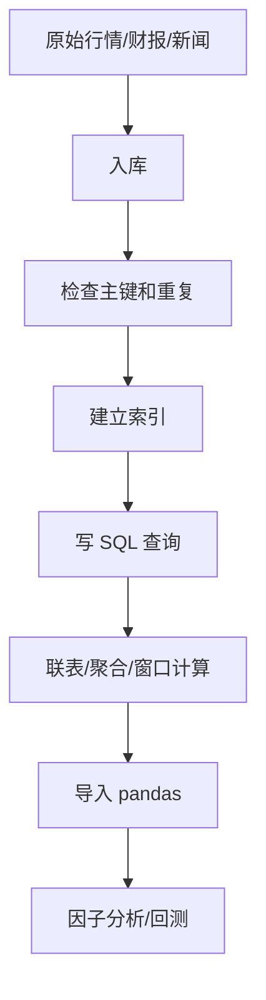

# 05 SQL 与数据库基础：把量化研究的数据地基打牢

## 学习目标

学完这一章，你应该能做到：

- 看懂数据库、表、行、列、主键、索引、事务这些最基础的概念。
- 写出常见 SQL 查询，并能读懂别人写的 SQL。
- 理解 `SELECT`、`WHERE`、`JOIN`、`GROUP BY`、`HAVING`、`ORDER BY`、`LIMIT` 的作用。
- 理解时间序列研究里为什么特别需要数据库，而不是只靠 CSV 或 Excel。
- 知道行情表、因子表、财报表、新闻表应该怎么设计。
- 会用 Python 的 `sqlite3` 和 `pandas.read_sql()` 做最基础的数据读写。
- 知道哪些数据库问题会直接毁掉量化研究，比如未来函数、重复记录、口径不一致和慢查询。

这一章不要求你成为数据库管理员。你要达到的是：**能把数据正确、稳定、可复现地取出来，并服务于研究**。

## 为什么这部分对量化研究重要

量化研究不是先写模型，而是先处理数据。你每天都会遇到这些问题：

- 行情数据很多，CSV 打开太慢。
- 财报、因子、新闻、指数成分来自不同来源，字段命名不统一。
- 某些数据只能在公告后才能知道，不能在历史回测里提前用。
- 同一只股票同一天可能出现多条记录，必须去重。
- 某些查询很慢，不知道是 SQL 写法问题还是索引没建。
- Python 里能读到数据，不代表 SQL 层已经干净。

数据库的作用，不只是“存数据”，而是把数据组织成一种可查询、可更新、可复现的结构。


ASCII 版本：

```text
数据源 -> 入库 -> SQL查询 -> Python分析 -> 研究结果
```

如果这一层没打好，后面的因子、回测、归因分析都会很脆。

## 一、数据库到底是什么

### 1. 最简化理解

数据库可以理解成一个长期保存和查询数据的系统。它比 CSV 更适合下面这些事：

- 存很多表。
- 快速按条件查。
- 保持数据一致性。
- 支持更新和删除。
- 支持多人协作和长期维护。

### 2. 表、行、列

数据库里最基本的结构是表（table）。

| 概念 | 直觉理解 | 量化例子 |
|---|---|---|
| 表 | 一类数据的集合 | 日行情表、财报表、新闻表 |
| 行 | 一条记录 | 某只股票某一天的行情 |
| 列 | 一个字段 | 收盘价、成交量、公告日期 |

例如一张日行情表：

| symbol | trade_date | open | high | low | close | volume |
|---|---|---:|---:|---:|---:|---:|
| 000001.SZ | 2024-06-03 | 9.80 | 10.10 | 9.75 | 10.02 | 1234567 |

这张表里：

- 每一行表示一只股票某一天的数据。
- 每一列表示一个字段。

### 3. 为什么 SQL 比“直接看 CSV”更适合研究

CSV 适合简单保存和交换文件，但它的问题也很明显：

- 大文件打开慢。
- 不容易高效筛选。
- 不容易多表关联。
- 不容易控制重复数据。
- 不容易管理更新过程。

数据库更适合：

- 多次查询。
- 逐日增量更新。
- 多表关联。
- 长期研究复现。

## 二、关系型数据库的思维

### 1. 什么叫关系型

关系型数据库强调“表”和“表之间的关系”。这个关系通常靠键来连接。

比如：

- `daily_price.symbol` 对应股票代码。
- `financial_statement.symbol` 也对应股票代码。
- 两张表可以通过 `symbol` 连接起来。

### 2. 主键和外键

| 概念 | 含义 | 量化例子 |
|---|---|---|
| 主键 | 一条记录的唯一标识 | `(symbol, trade_date)` |
| 外键 | 指向另一张表主键的字段 | 财报表里的 `symbol` |

主键的作用是防止重复记录。比如同一只股票同一天的日行情，理论上应该只有一条。

### 3. 为什么量化研究很依赖关系型数据库

量化里最常见的问题不是“没有数据”，而是：

- 数据很多，但结构乱。
- 数据来自不同源，不能直接拼。
- 时间字段很多，容易穿越。
- 某些字段必须按公告时点解释，而不是按报告期解释。

关系型数据库能让这些数据按统一结构管理。

## 三、常见数据库类型怎么理解

你不需要一口气学完所有数据库，但要知道它们大概干什么。

| 类型 | 适合什么 | 直觉 |
|---|---|---|
| SQLite | 本地研究、入门、小项目 | 一个文件就是数据库 |
| MySQL | 常规业务系统 | 结构清楚，应用很广 |
| PostgreSQL | 更强的 SQL 能力 | 功能丰富，研究也常用 |
| ClickHouse | 大量分析查询 | 很适合海量数据分析 |

对于你现在的阶段，建议从 SQLite 开始。它足够轻量，适合你在本地练 SQL 和数据库思维。

## 四、SQL 是什么

SQL 是 Structured Query Language，结构化查询语言。它是你和数据库交流的语言。

你可以把 SQL 理解成：

```text
告诉数据库：
你要哪张表
筛哪些行
保留哪些列
怎么分组
怎么排序
要不要把多张表拼起来
```

### 1. 最基本的查询结构

```sql
SELECT 列名
FROM 表名
WHERE 条件
ORDER BY 排序字段
LIMIT 返回条数;
```

这四个动作是 SQL 的骨架：

- `SELECT`：选哪些列。
- `FROM`：从哪张表取。
- `WHERE`：筛哪些行。
- `ORDER BY`：怎么排序。
- `LIMIT`：最多返回多少条。

### 2. 一个最小例子

```sql
SELECT symbol, trade_date, close
FROM daily_price
WHERE symbol = '000001.SZ'
ORDER BY trade_date;
```

读法：

```text
从 daily_price 里取出 000001.SZ 这只股票的代码、日期和收盘价，并按日期排序。
```

### 3. `SELECT *` 为什么不推荐滥用

```sql
SELECT *
FROM daily_price;
```

这虽然方便，但在研究里通常不够好，因为：

- 可能拉回不需要的列。
- 字段太多时性能差。
- 代码可读性差。
- 表结构一变，结果也跟着变。

更稳妥的习惯是明确写列名。

## 五、`WHERE`：筛选行

`WHERE` 用来筛选满足条件的记录。

### 1. 常见条件

```sql
SELECT symbol, trade_date, close
FROM daily_price
WHERE trade_date >= '2024-01-01'
  AND trade_date <= '2024-12-31'
  AND close > 10;
```

常见运算符：

| 运算符 | 含义 |
|---|---|
| `=` | 等于 |
| `<>` 或 `!=` | 不等于 |
| `>` / `<` | 大于 / 小于 |
| `>=` / `<=` | 大于等于 / 小于等于 |
| `AND` / `OR` / `NOT` | 逻辑连接 |
| `IN` | 在集合中 |
| `BETWEEN` | 在区间中 |
| `LIKE` | 模糊匹配 |

### 2. 量化例子

```sql
SELECT symbol, trade_date, close, volume
FROM daily_price
WHERE symbol IN ('000001.SZ', '600519.SH')
  AND trade_date >= '2024-06-01'
ORDER BY trade_date;
```

### 3. 常见坑

| 错误 | 问题 |
|---|---|
| 把日期写成不统一的字符串格式 | 比如 `2024/1/2` 和 `2024-01-02` 混用 |
| 忘记加条件 | 查询结果太大 |
| 把应该放 `WHERE` 的条件写到后面才处理 | 效率差 |

## 六、`ORDER BY` 和 `LIMIT`

### 1. 排序

```sql
SELECT symbol, trade_date, close
FROM daily_price
WHERE symbol = '000001.SZ'
ORDER BY trade_date DESC;
```

`DESC` 表示降序，`ASC` 表示升序。

### 2. 限制返回条数

```sql
SELECT symbol, trade_date, close
FROM daily_price
ORDER BY trade_date DESC
LIMIT 5;
```

这通常用于：

- 看最新几条数据。
- 调试 SQL。
- 快速抽样检查。

## 七、`GROUP BY` 和聚合

### 1. 为什么需要分组

如果你想看“每只股票平均收盘价”“每个行业的平均收益”“每月新闻数量”，就需要分组。

### 2. 常见聚合函数

| 函数 | 含义 |
|---|---|
| `COUNT()` | 计数 |
| `SUM()` | 求和 |
| `AVG()` | 平均值 |
| `MAX()` | 最大值 |
| `MIN()` | 最小值 |

### 3. 例子：每只股票的平均收盘价

```sql
SELECT symbol, AVG(close) AS avg_close
FROM daily_price
GROUP BY symbol;
```

读法：

```text
按 symbol 分组，对每组的 close 求平均。
```

### 4. 例子：每一天的新闻数量

```sql
SELECT publish_date, COUNT(*) AS news_cnt
FROM news
GROUP BY publish_date
ORDER BY publish_date;
```

### 5. `HAVING` 和 `WHERE` 的区别

| 语句 | 作用对象 |
|---|---|
| `WHERE` | 分组前筛选行 |
| `HAVING` | 分组后筛选组 |

例子：

```sql
SELECT symbol, COUNT(*) AS n
FROM news
GROUP BY symbol
HAVING COUNT(*) >= 10;
```

意思是：只保留新闻量不少于 10 条的股票。

## 八、`JOIN`：把多张表连起来

### 1. 为什么需要连接

量化研究通常不会只看一张表。你会把：

- 行情表
- 因子表
- 财报表
- 行业表
- 新闻表

连起来分析。

### 2. `INNER JOIN`

```sql
SELECT p.symbol, p.trade_date, p.close, f.factor_value
FROM daily_price p
INNER JOIN factor_value f
  ON p.symbol = f.symbol
 AND p.trade_date = f.trade_date;
```

意思是：只有两边都匹配上的记录才保留。

### 3. `LEFT JOIN`

```sql
SELECT p.symbol, p.trade_date, p.close, f.factor_value
FROM daily_price p
LEFT JOIN factor_value f
  ON p.symbol = f.symbol
 AND p.trade_date = f.trade_date;
```

意思是：

- 左表全部保留。
- 右表能匹配上的就带上。
- 右表没有匹配的地方返回 `NULL`。

这在量化里很常用，因为行情表通常是主表，因子表可能缺值。

### 4. `RIGHT JOIN` 和 `FULL JOIN`

有些数据库支持，语义分别是：

- `RIGHT JOIN`：保留右表全部记录。
- `FULL JOIN`：两边都尽量保留。

入门阶段先把 `INNER JOIN` 和 `LEFT JOIN` 练熟就够了。

### 5. 连接里最容易犯的错

| 错误 | 后果 |
|---|---|
| 连接条件写错 | 结果爆炸或错配 |
| 忘记加时间条件 | 不同日期的数据乱连 |
| 一对多连接没想清楚 | 行数变多 |
| 用股票代码连，却没处理复权或公告时点 | 研究失真 |

### 6. 量化例子：行情 + 因子

```sql
SELECT
    p.symbol,
    p.trade_date,
    p.close,
    f.factor_name,
    f.factor_value
FROM daily_price p
LEFT JOIN factor_value f
    ON p.symbol = f.symbol
   AND p.trade_date = f.trade_date
WHERE p.trade_date = '2024-06-03';
```

这能把某一天的价格和因子放到同一张结果表里。

## 九、子查询、CTE 和窗口函数

### 1. 子查询

子查询就是“查询里的查询”。

```sql
SELECT symbol, close
FROM daily_price
WHERE trade_date = (
    SELECT MAX(trade_date)
    FROM daily_price
);
```

意思是：先找最新日期，再查最新日期的数据。

### 2. CTE：公共表表达式

CTE 让 SQL 更容易读。

```sql
WITH latest_day AS (
    SELECT MAX(trade_date) AS trade_date
    FROM daily_price
)
SELECT p.symbol, p.close
FROM daily_price p
JOIN latest_day l
  ON p.trade_date = l.trade_date;
```

它的好处是：

- 更清楚。
- 更容易拆步骤。
- 更适合复杂研究查询。

### 3. 窗口函数

窗口函数是 SQL 里很重要的一类功能，适合做时间序列分析。

例子：按股票和日期排序，计算过去 5 天移动平均。

```sql
SELECT
    symbol,
    trade_date,
    close,
    AVG(close) OVER (
        PARTITION BY symbol
        ORDER BY trade_date
        ROWS BETWEEN 4 PRECEDING AND CURRENT ROW
    ) AS ma5
FROM daily_price;
```

读法：

```text
对每只股票单独排序，
然后对当前行及前 4 行求平均，
得到 5 日移动平均。
```

### 4. 窗口函数和 `GROUP BY` 的区别

| 方式 | 结果形态 |
|---|---|
| `GROUP BY` | 一组变一行 |
| 窗口函数 | 保留原始每一行 |

量化中，窗口函数特别适合：

- 移动均值
- 累计收益
- 排名
- 分位数
- 滚动统计

## 十、数据库设计：量化研究里最重要的一层

### 1. 典型表怎么设计

你做量化研究，通常会有几张核心表：

| 表名 | 典型字段 |
|---|---|
| `daily_price` | `symbol, trade_date, open, high, low, close, volume, adj_factor` |
| `financial_statement` | `symbol, report_date, announce_date, revenue, net_profit, ocf` |
| `factor_value` | `symbol, trade_date, factor_name, factor_value` |
| `news` | `news_id, publish_time, source, title, url, content` |
| `index_constituent` | `index_code, trade_date, symbol, weight` |

### 2. 为什么主键重要

主键可以防止重复记录。比如日行情表常见主键：

```text
(symbol, trade_date)
```

这意味着同一只股票同一天不应该出现多条日线。

### 3. 为什么公告日期比报告期更重要

财报研究里最容易犯的错，是把报告期和披露时点混为一谈。

| 字段 | 含义 |
|---|---|
| `report_date` | 财报对应哪个时期 |
| `announce_date` | 这份财报什么时候真的被市场知道 |

回测时你只能使用当时已经披露出来的数据，不能提前使用未来才公布的财报。

### 4. 为什么索引很重要

索引像目录，能加快查询。

比如你经常按这两个字段查：

```text
symbol + trade_date
```

那就应该优先考虑给这两个字段建索引。

| 场景 | 是否适合建索引 |
|---|---|
| 经常用于 `WHERE` 过滤 | 是 |
| 经常用于 `JOIN` 连接 | 是 |
| 经常用于排序 | 有时是 |
| 经常变化的字段 | 要谨慎 |

但索引不是越多越好。索引会占空间，也会拖慢写入。

### 5. 事务是什么

事务是一组要么一起成功、要么一起失败的操作。

这对数据库更新非常重要。

```text
插入行情
更新因子
写入日志
```

如果中间一半失败，最好整体回滚，别留半成品数据。

## 十一、Python 连接数据库

### 1. 用 `sqlite3` 读数据库

```python
import sqlite3

conn = sqlite3.connect("quant.db")
cursor = conn.cursor()

cursor.execute(
    """
    SELECT symbol, trade_date, close
    FROM daily_price
    WHERE symbol = ?
    ORDER BY trade_date
    LIMIT 5
    """,
    ("000001.SZ",),
)

rows = cursor.fetchall()
print(rows)

conn.close()
```

这里的 `?` 是参数占位符。比直接拼字符串安全。

### 2. 用 pandas 读 SQL

```python
import sqlite3
import pandas as pd

conn = sqlite3.connect("quant.db")

df = pd.read_sql(
    """
    SELECT trade_date, close
    FROM daily_price
    WHERE symbol = '000001.SZ'
    ORDER BY trade_date
    """,
    conn,
)

conn.close()

print(df.head())
```

### 3. Python 保存 DataFrame 到数据库

```python
import sqlite3
import pandas as pd

df = pd.DataFrame(
    {
        "symbol": ["000001.SZ", "000002.SZ"],
        "trade_date": ["2024-06-03", "2024-06-03"],
        "close": [10.02, 8.45],
    }
)

conn = sqlite3.connect("quant.db")
df.to_sql("daily_price_demo", conn, if_exists="replace", index=False)
conn.close()
```

### 4. 为什么 SQL 和 pandas 要配合

| 工具 | 适合做什么 |
|---|---|
| SQL | 筛选、连接、聚合、窗口分析 |
| pandas | 进一步分析、画图、建模 |

最稳的流程通常是：

```text
先用 SQL 把数据取干净
再交给 pandas 做后续分析
```

## 十二、量化研究里最该警惕的数据库问题

### 1. 未来函数

你在数据库里能查到，不代表历史上当时就能知道。

比如：

- 财报实际披露日晚于报告期。
- 因子值计算用了未来价格。
- 指数成分更新日期没处理好。

### 2. 数据泄露

把测试期信息混进训练期，或者把未来信息错放进过去，都会让研究虚高。

### 3. 重复记录

同一键值出现多条记录，会让统计结果偏掉。

### 4. 空值处理

空值不是简单删除就完事了，要看它为什么为空：

- 没披露？
- 数据抓取失败？
- 本来就不存在？

### 5. 口径不一致

不同数据库对同一个指标可能定义不一样。

例如：

- `OCF` 可能叫法不同。
- `CapEx` 口径可能不同。
- 复权因子可能取值范围不同。

### 6. 慢查询

慢不一定是数据库差，也可能是你：

- 没建索引
- 一次查太多列
- 没有限制时间范围
- 做了不必要的多表连接

## 十三、数据库性能的基本直觉

### 1. 为什么会慢

| 原因 | 直觉 |
|---|---|
| 全表扫描 | 数据太多，挨个看 |
| 缺少索引 | 找人靠喊，不靠电话簿 |
| 连接太多表 | 拼接代价高 |
| 返回列太多 | 传输和解析都重 |
| 时间范围太大 | 一次读太久 |

### 2. 优化思路

- 只查需要的列。
- 用 `WHERE` 限制时间和股票范围。
- 给常用查询字段建索引。
- 先过滤再连接。
- 优先按主键组织数据。

## 十四、常见错误与陷阱

| 错误 | 为什么有问题 |
|---|---|
| 把 CSV 当数据库长期使用 | 不适合复杂查询和维护 |
| `SELECT *` 乱用 | 慢、脏、不可控 |
| 不写主键 | 容易重复 |
| 只存 `report_date` 不存 `announce_date` | 容易未来函数 |
| 乱建索引 | 写入变慢，维护复杂 |
| 连接表时不看键 | 错配、重复、膨胀 |
| 用字符串日期但格式不统一 | 排序和比较容易错 |
| 把 null 当成 0 | 统计含义会变 |

## 十五、一个量化研究的典型 SQL 流程



你可以把它理解成：

```text
先让数据结构正确
再让查询正确
最后才是研究正确
```

## 十六、练习任务

### 练习 1：基础查询

写 SQL 查询某只股票最近 10 条收盘价记录。

### 练习 2：分组统计

统计每只股票的平均收盘价和记录数。

### 练习 3：连接查询

把 `daily_price` 和 `factor_value` 按 `symbol + trade_date` 连起来。

### 练习 4：窗口函数

计算每只股票的 5 日移动平均收盘价。

### 练习 5：数据库设计

设计一张 `news` 表，至少写出以下字段：

- 主键
- 发布时间
- 来源
- 标题
- URL
- 内容

### 练习 6：Python 读写

用 `sqlite3` 建一个本地数据库，把两条行情数据写进去，再用 `pandas.read_sql()` 读出来。

## 十七、自检清单

- [ ] 我知道表、行、列、主键、索引分别是什么。
- [ ] 我能写出 `SELECT ... FROM ... WHERE ... ORDER BY ... LIMIT ...`。
- [ ] 我知道 `WHERE` 和 `HAVING` 的区别。
- [ ] 我知道 `GROUP BY` 是按组统计。
- [ ] 我能解释 `INNER JOIN` 和 `LEFT JOIN` 的区别。
- [ ] 我知道为什么时间字段在量化里很重要。
- [ ] 我能说出报告期和公告期的区别。
- [ ] 我知道索引不是越多越好。
- [ ] 我能用 Python 连接 SQLite。
- [ ] 我知道未来函数和数据泄露的危险。

## 十八、术语表

| 术语 | 解释 |
|---|---|
| 数据库 | 长期存储和管理数据的系统 |
| 表 | 数据库里保存一类记录的结构 |
| 行 | 表中的一条记录 |
| 列 | 表中的一个字段 |
| 主键 | 唯一标识一条记录的字段或字段组合 |
| 外键 | 关联另一张表主键的字段 |
| 索引 | 加快查询的数据结构 |
| 事务 | 一组要么全成功、要么全失败的操作 |
| SQL | 结构化查询语言 |
| CTE | 公共表表达式，便于拆解复杂查询 |
| 窗口函数 | 在保留行的同时做分组统计 |
| 未来函数 | 使用了当时本不应知道的数据 |
| 数据泄露 | 训练或回测中混入了未来信息 |

## 十九、延伸阅读

- SQLite 官方文档
- PostgreSQL 官方文档
- SQLBolt / Mode SQL Tutorial
- 《SQL Cookbook》
- pandas 官方文档中的 `read_sql` 和 `to_sql`

## 二十、本章总结

SQL 和数据库不是“附加技能”，而是量化研究的数据底座。

你学习它的目标，不是背很多命令，而是形成一套稳定判断：

```text
数据该怎么建表
查询该怎么写
结果该怎么看
风险该怎么防
```

当你能把行情、财报、因子、新闻这些数据用数据库组织起来，你的量化研究就开始有真正的工程基础了。
