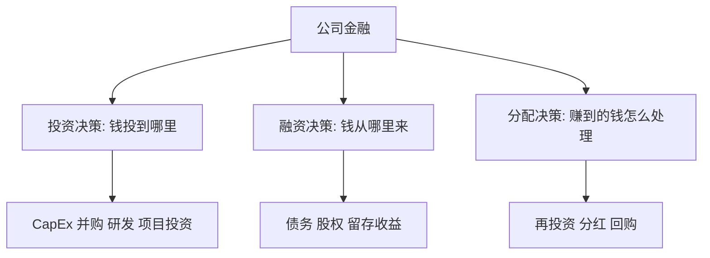
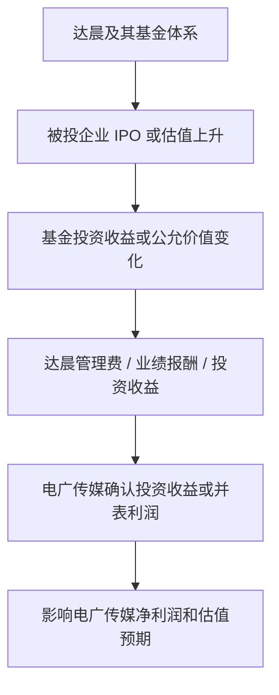

# 00 财务指标入门桥梁：给量化金融学习者的公司金融慢启动

> 适合先读：如果你两年没系统学会计，看到 ROE、ROIC、FCF、CapEx、投资收益、公允价值变动、长期股权投资就头大，请先读这一篇，再进入 01-05 的系统教材。

## 学习目标

读完这一篇，你不需要马上像会计师一样做分录，但应该能做到：

- 知道一个财务指标大概来自哪张表。
- 看到指标时先问“它衡量什么”，而不是急着背公式。
- 分清利润、现金流、资产、负债、股东权益不是一回事。
- 理解为什么同样是“净利润增长”，质量可能完全不同。
- 理解公司金融的核心不是背 NPV、WACC，而是判断“钱从哪里来、投到哪里去、回报够不够”。
- 能初步看懂“电广传媒持有达晨财智”这类投资型资产如何影响上市公司利润。
- 知道财务指标如何变成量化因子，以及哪些指标不能机械使用。

## 为什么你会觉得原来的教材头大

很多财务教材一上来就讲：

```text
ROE = 净利润 / 净资产
ROIC = NOPAT / 投入资本
FCF = OCF - CapEx
EV/EBITDA = 企业价值 / EBITDA
```

这些公式本身不难，但对初学者真正困难的是：

| 困难点 | 表面感受 | 真正问题 |
|---|---|---|
| 指标太多 | 感觉每个都要背 | 没有建立“指标地图” |
| 报表太陌生 | 不知道数字从哪来 | 三张表的功能没接上 |
| 会计口径复杂 | 名词看起来很专业 | 不知道哪些口径必须精确，哪些先理解直觉 |
| 公司金融抽象 | NPV、WACC、ROIC 像公式堆 | 没看出它们都在回答“资本有没有创造价值” |
| 主观和量化脱节 | 新闻分析和因子模型像两套东西 | 没把“商业判断 -> 财务指标 -> 可检验变量”连起来 |

所以你现在不需要再加速，而是要先补一层“翻译器”：

```text
业务现象 -> 报表项目 -> 财务指标 -> 研究问题 -> 量化变量
```

## 一、先别背指标，先建立三张表的直觉

公司财务报表不是三堆孤立数字，而是从三个角度观察同一家公司。

| 报表 | 像什么 | 回答什么问题 | 初学者先看什么 |
|---|---|---|---|
| 利润表 | 一段时间的成绩单 | 这段时间赚没赚钱？ | 收入、毛利、费用、净利润、投资收益 |
| 资产负债表 | 某一天的家底照片 | 公司有什么、欠什么、属于股东多少？ | 现金、应收、存货、长期股权投资、金融资产、有息负债、净资产 |
| 现金流量表 | 现金出入记录 | 真金白银是流入还是流出？ | 经营现金流、投资现金流、融资现金流、CapEx |

### 1. 利润表：会计意义上的“赚”

利润表最简化可以写成：

```text
收入
- 成本
- 费用
+ 投资收益
+/- 公允价值变动
+/- 其他非经常项目
- 所得税
= 净利润
```

初学者常误解：净利润增长就一定是主营业务变好。

其实不一定。净利润可以来自很多地方：

| 利润来源 | 可持续性 | 研究时怎么看 |
|---|---|---|
| 主营业务赚钱 | 通常更可持续 | 看收入、毛利率、费用率 |
| 卖资产赚钱 | 往往一次性 | 看资产处置收益、非经常性损益 |
| 投资收益 | 取决于投资资产质量 | 看长期股权投资、金融资产、被投企业退出 |
| 公允价值变动 | 波动较大 | 看持仓资产估值和市场行情 |
| 政府补助 | 通常不可持续 | 看其他收益或营业外收入 |

这就是为什么你看电广传媒时，不能只看传媒业务收入。  
如果它的利润很大一部分来自达晨相关投资，那么它的利润驱动就更像“创投资产重估和退出”，而不只是“广告卖得好不好”。

### 2. 资产负债表：利润的来源往往藏在资产里

资产负债表的核心恒等式：

```text
资产 = 负债 + 股东权益
```

对投资研究来说，你要把资产分成几类：

| 资产类型 | 例子 | 对利润的影响 |
|---|---|---|
| 经营性资产 | 存货、固定资产、应收账款 | 影响主营收入、成本、折旧、坏账 |
| 现金资产 | 货币资金、交易性金融资产 | 影响利息收入、投资收益、公允价值变动 |
| 长期股权投资 | 联营企业、合营企业股权 | 可能通过权益法确认投资收益 |
| 金融资产 | 股票、基金、理财、债权投资 | 可能通过公允价值变动或投资收益影响利润 |
| 无形资产和商誉 | 并购形成的商誉、品牌、技术 | 可能未来减值，直接打击利润 |

如果一家上市公司持有创投平台或大量投资资产，你要特别盯：

- `长期股权投资`
- `交易性金融资产`
- `其他权益工具投资`
- `其他非流动金融资产`
- `投资收益`
- `公允价值变动损益`
- `其他综合收益`
- `少数股东损益`

这些项目决定了投资资产如何进入利润表或权益表。

### 3. 现金流量表：利润有没有变成现金

现金流量表分三块：

```text
经营活动现金流 OCF：主业经营带来的现金
投资活动现金流 ICF：买资产、卖资产、投资、收回投资
融资活动现金流 FCFn：借钱、还钱、分红、增发、回购
```

注意：这里的 `FCFn` 只是为了避免和自由现金流 `FCF` 混淆。现实报表里通常叫“筹资活动现金流量”。

一个公司如果净利润很好，但经营现金流很差，你要警惕：

| 现象 | 可能原因 |
|---|---|
| 收入增长，但应收账款暴增 | 卖出去了，但钱没收回来 |
| 利润增长，但存货暴增 | 产品可能滞销或提前备货 |
| 净利润很高，但 OCF 很低 | 利润质量可能不高 |
| OCF 很好，但投资现金流大幅流出 | 可能在扩产、并购或买金融资产 |

## 二、财务指标不是孤立公式，而是“问题的压缩表达”

你可以把每个指标都翻译成一个研究问题。

| 指标 | 粗略公式 | 它真正问的是 |
|---|---|---|
| 收入增速 | 本期收入 / 上期收入 - 1 | 公司卖得更多了吗？ |
| 毛利率 | 毛利 / 收入 | 产品或服务有没有议价能力？ |
| 净利率 | 净利润 / 收入 | 最后能留下多少利润？ |
| ROE | 净利润 / 股东权益 | 股东的钱赚得怎么样？ |
| ROA | 净利润 / 总资产 | 全部资产赚钱效率如何？ |
| OCF / 净利润 | 经营现金流 / 净利润 | 利润有没有现金含量？ |
| 资产负债率 | 总负债 / 总资产 | 公司杠杆高不高？ |
| 利息保障倍数 | EBIT / 利息费用 | 公司能不能付得起利息？ |
| CapEx / 收入 | 资本开支 / 收入 | 公司是不是重资产扩张？ |
| FCF | OCF - CapEx | 经营和投资后还剩多少自由现金？ |
| ROIC | NOPAT / 投入资本 | 投入资本回报是否足够高？ |
| PE | 市值 / 净利润 | 市场愿意为每 1 元利润付多少钱？ |
| PB | 市值 / 净资产 | 市场愿意为每 1 元账面净资产付多少钱？ |

### 指标阅读四问法

看到任何指标，先问四个问题：

```text
1. 分子是什么？
2. 分母是什么？
3. 这个指标想衡量什么经济含义？
4. 哪些会计处理或行业特征会让它失真？
```

例子：`ROE = 净利润 / 股东权益`

| 问题 | 回答 |
|---|---|
| 分子是什么？ | 净利润，来自利润表 |
| 分母是什么？ | 股东权益，来自资产负债表 |
| 衡量什么？ | 股东投入的钱产生了多少会计利润 |
| 可能怎么失真？ | 高杠杆能抬高 ROE；一次性投资收益也能抬高 ROE |

所以 ROE 高不一定代表公司优秀。它可能是：

- 主业真的很强；
- 杠杆很高；
- 资产很轻；
- 一次性收益推高净利润；
- 净资产太低导致分母小。

## 三、先把指标按“财务问题”分类，不要散着背

### 1. 盈利能力：公司赚不赚钱

| 指标 | 初学理解 | 常见坑 |
|---|---|---|
| 毛利率 | 产品卖价扣掉直接成本后剩多少 | 不同行业不可横比 |
| 净利率 | 最后真正留给股东多少 | 可能被非经常收益扭曲 |
| ROE | 股东资本回报 | 可能被杠杆或一次性收益抬高 |
| ROA | 总资产赚钱能力 | 金融行业和制造业口径差异大 |
| ROIC | 投入资本回报 | 口径复杂，需要核对数据源定义 |

量化使用时，盈利能力常被做成质量因子或基本面因子。  
但不要只机械取高 ROE，因为高 ROE 可能来自高杠杆。

### 2. 成长能力：公司有没有变大

| 指标 | 初学理解 | 常见坑 |
|---|---|---|
| 收入增速 | 卖出的规模变大了吗 | 并购也能带来收入增长 |
| 净利润增速 | 利润变大了吗 | 一次性收益会扭曲 |
| OCF 增速 | 现金流变好吗 | 周期行业波动大 |
| 资产增速 | 公司投入资源变多了吗 | 扩张不等于创造价值 |
| CapEx 增速 | 资本开支变多了吗 | 要区分维持性和扩张性 |

成长指标一定要配合质量指标。  
只看增长，很容易买到“增长很快但收不回钱”的公司。

### 3. 现金流质量：利润有没有含金量

| 指标 | 初学理解 | 常见坑 |
|---|---|---|
| OCF / 净利润 | 1 元利润对应多少现金 | 金融、地产等行业要另看 |
| 应收账款增速 - 收入增速 | 钱是否收得慢 | 高速成长公司也可能短期偏高 |
| 存货增速 - 收入增速 | 货是否积压 | 制造、周期行业需结合景气 |
| FCF | 扣除资本开支后剩余现金 | 扩张期 FCF 可能短期为负 |

一个简单判断：

```text
净利润增长 + OCF 同步增长：质量较好
净利润增长 + OCF 明显掉队：需要警惕
净利润下滑 + CapEx 大增 + OCF 稳健：可能是战略投入
```

### 4. 杠杆与偿债：公司会不会被债务拖死

| 指标 | 初学理解 | 常见坑 |
|---|---|---|
| 资产负债率 | 资产里有多少靠借来的钱 | 行业差异极大 |
| 有息负债率 | 真正需要付利息的债务比例 | 比总负债更接近偿债压力 |
| 利息保障倍数 | 利润能覆盖几倍利息 | EBIT 被周期利润扭曲时要小心 |
| 现金短债比 | 现金能否覆盖短债 | 要看受限资金 |

杠杆本身不是坏事。  
坏的是：借来的钱没有产生超过资本成本的回报。

### 5. 估值：市场为这些财务结果付多少钱

| 指标 | 初学理解 | 适用场景 |
|---|---|---|
| PE | 为 1 元利润付多少钱 | 盈利稳定公司 |
| PB | 为 1 元净资产付多少钱 | 银行、保险、周期底部、资产型公司 |
| PS | 为 1 元收入付多少钱 | 暂时亏损但收入有价值的成长公司 |
| EV/EBITDA | 企业价值相对经营现金利润 | 重资产、跨资本结构比较 |
| FCF Yield | 自由现金流 / 市值 | 现金流成熟公司 |

估值指标不是“越低越好”。  
低估值可能是便宜，也可能是市场认为利润不可持续。

## 四、公司金融怎么慢慢学：从“钱的去向”开始

公司金融看起来公式很多，但核心其实只有一句话：

```text
公司拿到资本后，能不能投到回报率超过资本成本的地方？
```

### 1. 三个决策



ASCII 版本：

```text
公司金融
  |-- 投资决策：钱投到哪里？能不能创造价值？
  |-- 融资决策：钱从哪里来？债务还是股权？
  |-- 分配决策：赚到的钱留下、分红还是回购？
```

### 2. NPV、IRR、WACC 不要先背，先翻译成人话

| 概念 | 人话翻译 | 你现在先掌握到什么程度 |
|---|---|---|
| NPV | 把未来赚的钱折算到今天，看扣掉投入后是否为正 | 知道 NPV > 0 代表理论上创造价值 |
| IRR | 一个项目隐含的年化回报率 | 知道 IRR 要和资本成本比较 |
| WACC | 公司整体拿钱的平均成本 | 知道它是项目回报率的最低门槛 |
| ROIC | 已投入资本实际赚到的回报 | 知道 ROIC > WACC 才更可能创造价值 |
| CapEx | 买机器、建厂、买服务器、扩产等长期投入 | 知道要区分维持性和扩张性 |

你现在最重要的不是手算复杂 DCF，而是建立这个判断：

```text
如果公司大幅增加 CapEx：
  不是立刻说它变差；
  要问这是维持旧业务，还是扩张新业务；
  再看未来收入、毛利、现金流、ROIC 有没有跟上。
```

## 五、重点例子：电广传媒持有达晨，为什么会影响利润

> 说明：这里是学习框架，不是对电广传媒的投资建议。真实研究必须以最新年报、半年报和交易所公告为准，尤其要核对股权结构、会计分类、持股比例和报表口径。

你提到的核心判断是：

```text
电广传媒表面是传媒公司；
但如果达晨财智和相关创投资产贡献了重要利润，
它的一部分估值逻辑就更像投资控股公司或创投平台。
```

### 1. 为什么“持股达晨”不是一句普通新闻

如果上市公司持有一家创投机构，影响利润的路径可能有很多种：



你真正要查的是：电广和达晨之间到底是什么会计关系。

### 2. 三种常见确认路径

| 会计关系 | 人话理解 | 对电广利润的影响方式 |
|---|---|---|
| 控股并表 | 达晨像电广体系内的子公司 | 达晨收入、利润进入合并报表，再扣少数股东损益 |
| 权益法核算 | 电广不能完全控制，但有重大影响 | 达晨赚的钱按持股比例进入电广“投资收益” |
| 金融资产计量 | 更像持有一项投资资产 | 估值变化可能进入公允价值变动损益或其他综合收益 |

你不能只说“电广持有达晨，所以达晨 IPO 多，电广一定赚钱”。  
中间必须问：

- 持的是达晨管理公司股权，还是达晨旗下基金份额？
- 是控股并表、权益法，还是金融资产？
- 被投企业估值变化是否已经在会计上确认？
- IPO 后是否解禁、是否退出、是否有实际现金回流？
- 收益进入利润表，还是进入其他综合收益？
- 是否有少数股东分享利润？

### 3. 一个简化算例

假设达晨某年确认利润 10 亿元，电广对达晨采用权益法核算，持股比例为 40%。

简化理解：

```text
电广确认的投资收益 ≈ 达晨净利润 × 电广持股比例
                 ≈ 10 亿元 × 40%
                 ≈ 4 亿元
```

但现实中不会这么简单，因为还要考虑：

| 调整项 | 为什么会影响结果 |
|---|---|
| 持股比例 | 电广到底享有多少权益 |
| 会计分类 | 权益法、并表、金融资产的利润路径不同 |
| 少数股东损益 | 并表利润不一定全部归母 |
| 基金层级 | 创投机构可能管理基金，也可能自有资金跟投 |
| 公允价值 | 未退出项目可能只是账面估值变化 |
| 解禁和退出 | IPO 不等于马上卖出变现金 |

所以，你看这类公司时要养成一套固定动作：

```text
第一步：看资产负债表，找长期股权投资和金融资产。
第二步：看利润表，找投资收益和公允价值变动。
第三步：看现金流量表，找收回投资收到的现金、取得投资收益收到的现金。
第四步：看附注，确认达晨相关资产的持股比例、会计分类和收益来源。
第五步：看被投企业 IPO / 解禁 / 退出节奏，判断未来利润弹性。
```

### 4. 这类公司不能只看传统传媒指标

普通传媒公司可能看：

- 广告收入；
- 内容版权；
- 游戏流水；
- 毛利率；
- 用户规模；
- 费用率。

但投资控股特征明显的公司还要看：

- 投资收益占净利润比例；
- 公允价值变动损益；
- 长期股权投资规模；
- 金融资产规模；
- 被投项目 IPO 排队数量；
- 退出收益是否可持续；
- 投资收益是否带来现金流；
- 净利润是否被非经常项目大幅扭曲。

一个很有用的比率：

```text
投资相关利润占比 = (投资收益 + 公允价值变动损益) / 净利润
```

如果这个比例很高，你就不能只用传媒公司逻辑看它。

## 六、从“主观判断”到“量化变量”

你做量化金融，最终不能只停留在“我感觉这家公司像创投公司”。你需要把判断变成可检验变量。

| 主观判断 | 可以观察的财务指标 | 可能的量化变量 |
|---|---|---|
| 公司利润依赖投资资产 | 投资收益、公允价值变动、净利润 | 投资收益占比 |
| 创投资产进入收获期 | 长期股权投资、金融资产、处置收益 | 投资资产 / 总资产 |
| 利润质量不稳定 | 净利润、扣非净利润、OCF | 扣非净利润 / 净利润 |
| 投资收益没有现金回流 | 投资收益、取得投资收益收到的现金 | 现金化投资收益比例 |
| 杠杆风险上升 | 有息负债、利息费用、EBIT | 利息保障倍数 |
| 估值可能重估 | PB、PE、投资资产价值 | 市值 / 投资资产账面价值 |

注意：这些变量只是研究起点，不是直接买卖信号。你需要做：

- 行业中性；
- 极值处理；
- 财报公告日滞后；
- 避免未来函数；
- 分组回测；
- IC / IR 检验；
- 样本外验证。

## 七、建议你按这个顺序重新读 01-05

不要从头硬啃。建议这样读：

| 阶段 | 阅读内容 | 目标 |
|---|---|---|
| 第 0 步 | 本文 | 建立指标地图和报表直觉 |
| 第 1 步 | 01 财务报表分析 | 看懂利润、资产、现金流从哪来 |
| 第 2 步 | 02 公司金融 | 理解钱从哪里来、投到哪里去 |
| 第 3 步 | 03 估值框架 | 理解市场为什么给不同价格 |
| 第 4 步 | 04 行业与商业模式 | 知道不同行业指标不能乱比 |
| 第 5 步 | 05 财务因子化 | 把财务判断变成量化变量 |

每次读一个指标，都按这个模板记笔记：

```text
指标名称：
公式：
分子来自哪张表：
分母来自哪张表：
衡量什么问题：
在哪些行业容易失真：
能不能变成量化因子：
如果用于回测，公告日怎么处理：
```

## 八、一个最小学习项目：拆一家公司

你可以拿电广传媒做练习，但先不要追求完整估值。只做一件事：

```text
判断它的利润到底有多少来自经营业务，有多少来自投资资产。
```

### 步骤

1. 下载最近三年年报。
2. 找利润表里的 `投资收益`、`公允价值变动损益`、`净利润`、`扣非净利润`。
3. 找资产负债表里的 `长期股权投资`、`交易性金融资产`、`其他权益工具投资`、`其他非流动金融资产`。
4. 找现金流量表里的 `取得投资收益收到的现金`、`收回投资收到的现金`。
5. 读附注中和达晨相关的披露。
6. 计算：

```text
投资收益占净利润比例
投资相关资产占总资产比例
扣非净利润 / 净利润
取得投资收益收到的现金 / 投资收益
```

7. 写一句结论：

```text
这家公司更像经营型传媒公司，还是投资控股型公司？
这个判断来自哪些报表项目？
```

## 九、常见误区

| 误区 | 为什么错 |
|---|---|
| 看到净利润增长就认为公司变好 | 利润可能来自投资收益或公允价值变动 |
| 看到 IPO 排队就认为马上贡献利润 | IPO、解禁、退出、会计确认是不同阶段 |
| 只看 PE | 投资型公司净利润波动大，PE 可能失真 |
| 把投资收益都当成一次性 | 创投平台可能有持续项目退出，但节奏不稳定 |
| 把所有高 CapEx 都当坏事 | 扩张性 CapEx 可能创造未来收入 |
| 把所有高负债都当坏事 | 关键是回报率是否超过债务成本 |
| 直接拿数据源指标回测 | 必须核对口径、公告日和行业差异 |

## 十、自检清单

读完本文后，你应该能回答：

- 我看到一个财务指标时，能不能说出它大概来自哪张表？
- 我能不能解释净利润和经营现金流为什么可能背离？
- 我能不能解释投资收益和公允价值变动为什么会影响利润？
- 我能不能说清楚控股并表、权益法、金融资产计量的大致区别？
- 我能不能用一段话解释“电广持股达晨为什么影响利润”？
- 我能不能把一个主观判断转成一个可能的量化变量？
- 我是否知道财务因子回测时必须处理公告日滞后？

如果这些问题还回答不顺，先不要急着读估值和 WACC，回到本文前半部分，把三张表和指标地图再走一遍。

## 术语表

| 术语 | 简明解释 |
|---|---|
| 净利润 | 会计上归属于一定期间的利润结果 |
| 扣非净利润 | 扣除非经常性损益后的利润，更接近持续经营表现 |
| OCF | 经营活动现金流，衡量主业带来的现金 |
| CapEx | 资本开支，购买长期资产的投入 |
| FCF | 自由现金流，常简化为 OCF - CapEx |
| 投资收益 | 投资、处置股权、权益法核算等带来的收益 |
| 公允价值变动损益 | 金融资产估值变化进入利润表的部分 |
| 长期股权投资 | 对联营、合营等企业的长期股权投资 |
| 权益法 | 按持股比例确认被投资企业利润或亏损的方法 |
| 少数股东损益 | 子公司利润中不属于上市公司股东的部分 |
| ROE | 股东权益回报率 |
| ROIC | 投入资本回报率 |
| WACC | 加权平均资本成本 |
| PE | 市盈率 |
| PB | 市净率 |

## 延伸阅读

- 先读上市公司年报中的“主要会计数据和财务指标”“管理层讨论与分析”“财务报表附注”。
- 对 A 股公司，重点看交易所年报问询函，那里经常指出利润质量、投资收益和会计处理问题。
- 对财务指标，不要只看数据终端给出的数值，要学会回到年报口径核对。
- 学公司金融时，先抓住 FCF、CapEx、ROIC、WACC 四个概念，不要一开始陷入复杂估值模型。
