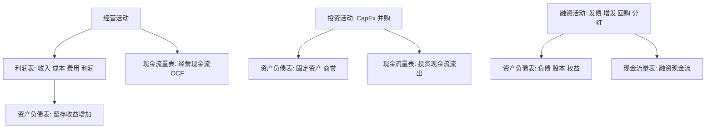
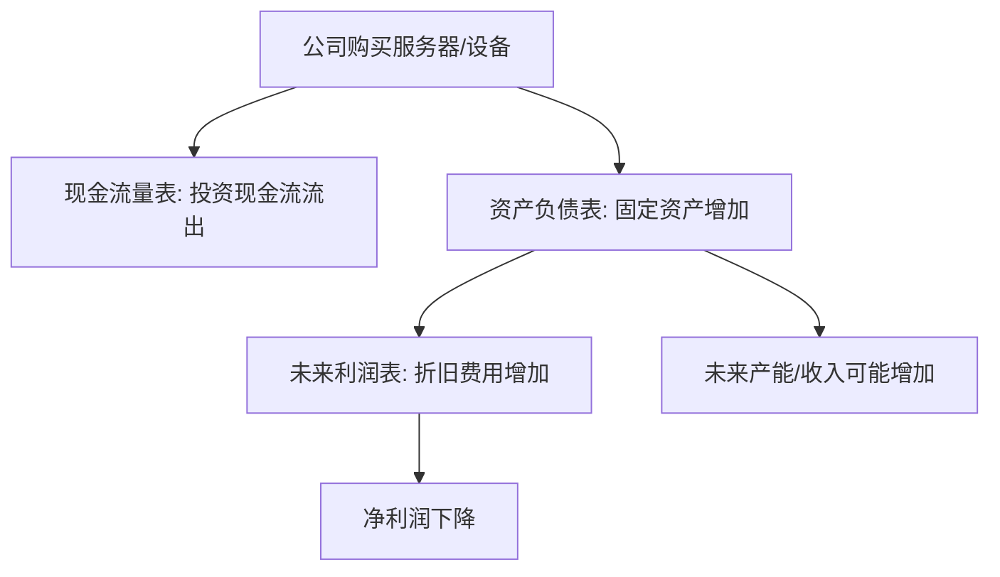

# 01 财务报表分析：从三张表看懂一家公司

## 学习目标

学完这一章，你应该能做到：

- 分清利润表、资产负债表、现金流量表各自回答什么问题。
- 理解三张表之间的勾稽关系，而不是孤立地看净利润、收入或现金流。
- 判断一家公司的收入质量、利润质量和现金流质量。
- 看懂应收账款、存货、商誉、折旧摊销、资本化费用这些项目为什么会影响投资判断。
- 面对“利润增长但现金流差”“CapEx 暴增但公司说是战略投入”这类新闻时，有一套分析顺序。
- 为后续公司金融、估值和量化因子构造打基础。

这章的目标不是把你训练成会计，而是训练你成为能读懂企业经营质量的研究者。你不需要像财务人员一样熟练做分录，但你必须能看出：**利润有没有含金量，增长有没有现金支撑，资产有没有水分，风险是不是藏在表外或脚注里**。

## 为什么这部分对主观 + 量化重要

主观研究里，新闻最终往往要落回财务报表：

- 公司说 AI 服务器需求旺盛，要看收入增长和订单能不能转成现金。
- 公司说扩大资本开支，要看现金流是否承压，固定资产是否快速增加。
- 公司说利润短期下滑是战略投入，要看经营现金流是否仍然健康。
- 公司说回购提振股东回报，要看自由现金流是否足够支持。
- 公司说并购带来协同，要看商誉、减值、整合费用和 ROIC。

量化研究里，财报也是大量基本面因子的来源：

- 盈利能力：ROE、ROA、毛利率、净利率。
- 成长：收入增速、利润增速、现金流增速。
- 质量：经营现金流 / 净利润，应收账款增速 - 收入增速。
- 杠杆：资产负债率、有息负债率、利息保障倍数。
- 投资：CapEx / 收入，固定资产周转率。

所以财报分析不是“主观研究员才需要”，也不是“量化可以完全外包给数据供应商”。你至少要知道每个因子的财务含义和潜在陷阱。

## 一、三张表分别回答什么问题

| 报表 | 核心问题 | 关键词 | 初学者最该看什么 |
|---|---|---|---|
| 利润表 | 这段时间赚了多少钱？ | 收入、成本、费用、利润 | 收入增长、毛利率、费用率、净利润质量 |
| 资产负债表 | 某一天家底如何？ | 资产、负债、权益 | 现金、应收、存货、固定资产、有息负债 |
| 现金流量表 | 钱实际怎么流入流出？ | 经营、投资、融资现金流 | OCF、CapEx、FCF、融资依赖 |

最重要的直觉：

```text
利润表看“经营战绩”
资产负债表看“资源与风险”
现金流量表看“现金生死”
```

### 三张表联动图



ASCII 版本：

```text
利润表：收入 - 成本 - 费用 = 利润
            │
            └── 利润的一部分进入资产负债表的留存收益

现金流量表：经营现金流 - 资本开支 ≈ 自由现金流
            │
            └── 解释利润有没有变成现金

资产负债表：资产 = 负债 + 股东权益
            │
            └── 记录公司某一时点拥有和欠下的东西
```

## 二、利润表：不要只盯净利润

利润表展示一段时间内的经营成果。最简化结构：

```text
营业收入
- 营业成本
= 毛利润
- 销售费用
- 管理费用
- 研发费用
- 财务费用
= 营业利润
+/- 非经常项目
- 所得税
= 净利润
```

### 1. 收入：增长从哪里来

收入是利润表起点，但收入增长不等于经营变好。你要问：

| 问题 | 研究含义 |
|---|---|
| 增长来自销量还是价格？ | 销量增长更偏需求，价格上涨可能有周期或通胀因素 |
| 增长来自老业务还是新业务？ | 新业务可能改善估值逻辑，也可能烧钱 |
| 增长来自内生还是并购？ | 并购增长需要警惕商誉和整合风险 |
| 增长是否带来现金？ | 收入增长但应收账款更快增长，质量可疑 |
| 增长是否可持续？ | 一次性大订单不能简单年化 |

### 2. 毛利率：商业模式的第一道体检

```text
毛利率 = (营业收入 - 营业成本) / 营业收入
```

毛利率反映产品或服务扣除直接成本后的盈利空间。不同商业模式差异很大：

| 行业/模式 | 毛利率特征 | 解读重点 |
|---|---|---|
| 软件/SaaS | 通常较高 | 规模效应、续费率、获客成本 |
| 制造业 | 中等或偏低 | 原材料、产能利用率、产品结构 |
| 零售 | 通常不高 | 周转率、渠道效率 |
| 医药创新药 | 成熟产品高 | 研发管线、专利保护 |
| 大宗商品 | 周期波动大 | 商品价格、成本曲线 |

毛利率上升可能来自：

- 产品涨价。
- 成本下降。
- 高毛利产品占比提升。
- 会计口径变化。

毛利率下降可能来自：

- 价格竞争。
- 原材料上涨。
- 产能利用率下降。
- 新业务早期亏损。

### 3. 费用率：增长背后的投入

```text
销售费用率 = 销售费用 / 收入
管理费用率 = 管理费用 / 收入
研发费用率 = 研发费用 / 收入
财务费用率 = 财务费用 / 收入
```

费用率不是越低越好。对成长型公司，研发费用率高可能是未来增长投入；对消费公司，销售费用高可能是渠道投放；对高杠杆公司，财务费用高可能是危险信号。

### 4. 净利润：会计结果，不等于现金

净利润很重要，但不能单独看。因为净利润会受到：

- 折旧摊销。
- 存货跌价准备。
- 应收账款坏账准备。
- 公允价值变动。
- 政府补助。
- 资产减值。
- 股权激励费用。
- 所得税变化。

主观研究里要区分：

| 利润类型 | 含义 |
|---|---|
| 经营性利润 | 主营业务产生的利润，更重要 |
| 非经常性损益 | 一次性收益或损失，不宜简单外推 |
| 会计利润 | 按会计准则确认的利润 |
| 现金利润 | 真正带来现金流入的利润 |

## 三、资产负债表：家底、资源和风险

资产负债表的核心恒等式：

```text
资产 = 负债 + 股东权益
```

它是某一个时点的快照，不是一个期间的流量。

### 1. 资产端：公司把钱变成了什么

| 项目 | 含义 | 研究重点 |
|---|---|---|
| 货币资金 | 现金和银行存款 | 是否足够覆盖短期债务 |
| 应收账款 | 客户欠公司的钱 | 是否增长过快，是否回款困难 |
| 存货 | 原材料、在产品、产成品 | 是否积压，是否存在跌价 |
| 固定资产 | 厂房、设备、服务器等 | CapEx 投入是否形成产能 |
| 在建工程 | 还未完工的资产 | 是否拖延，未来折旧压力 |
| 无形资产 | 专利、软件、土地使用权等 | 资本化是否激进 |
| 商誉 | 并购溢价 | 是否有减值风险 |

### 2. 应收账款：收入质量的报警器

如果收入增长 20%，但应收账款增长 80%，你要警惕：

```text
公司可能卖出去了，但钱没收回来。
```

常用观察：

```text
应收账款周转天数 = 平均应收账款 / 营业收入 * 365
```

如果周转天数持续上升，说明回款变慢。可能原因：

- 客户议价能力增强。
- 公司为了冲收入放松信用政策。
- 下游行业景气度下降。
- 部分收入确认质量较差。

### 3. 存货：周期和需求的温度计

存货增长本身不一定坏。关键是和收入、订单、行业周期一起看。

| 现象 | 可能解释 |
|---|---|
| 存货和收入同步增长 | 可能是正常备货 |
| 存货增长远快于收入 | 可能需求不及预期 |
| 存货跌价准备增加 | 产品可能卖不出去或价格下跌 |
| 原材料库存增加 | 可能提前锁定成本，也可能误判需求 |

常用观察：

```text
存货周转天数 = 平均存货 / 营业成本 * 365
```

### 4. 商誉：并购故事的尾部风险

商誉来自并购。如果一家公司花 100 亿元买了一家公司，但被买公司的可辨认净资产只有 40 亿元，差额可能形成商誉。

商誉不是现金，也不是可以随时卖掉的资产。它代表并购预期。如果被收购业务表现不好，商誉可能减值，直接冲击利润。

主观研究里要问：

- 公司是否频繁并购？
- 商誉占净资产比例是否过高？
- 被并购资产是否达到业绩承诺？
- 是否存在一次性大额减值风险？

### 5. 负债端：钱从哪里来，风险在哪里

| 项目 | 含义 | 研究重点 |
|---|---|---|
| 短期借款 | 一年内要还的债 | 流动性压力 |
| 长期借款 | 长期债务 | 利率和期限结构 |
| 应付账款 | 欠供应商的钱 | 供应链议价能力 |
| 合同负债 | 客户预付款 | 需求和现金流质量 |
| 有息负债 | 需要支付利息的债务 | 杠杆风险 |

资产负债率：

```text
资产负债率 = 总负债 / 总资产
```

但只看资产负债率不够，还要看有息负债、现金储备和盈利能力。

## 四、现金流量表：看公司生死

现金流量表分三部分：

| 部分 | 含义 | 研究解读 |
|---|---|---|
| 经营活动现金流 OCF | 主营业务带来的现金 | 最重要，判断利润含金量 |
| 投资活动现金流 CFI | 买资产、CapEx、并购、理财 | 扩张、收缩或资产配置 |
| 融资活动现金流 CFF | 借钱、还钱、发股、分红、回购 | 资金来源和股东回报 |

### 1. 经营现金流 OCF

经营现金流强，说明主营业务能产生现金。常用质量指标：

```text
现金利润质量 = 经营现金流 / 净利润
```

直觉：

| 情况 | 解读 |
|---|---|
| OCF 长期高于净利润 | 现金质量较好 |
| OCF 长期低于净利润 | 利润可能缺少现金支撑 |
| 净利润为正但 OCF 为负 | 需要重点排查应收、存货、预付款 |
| OCF 波动大 | 可能有周期性或营运资本扰动 |

### 2. 投资现金流与 CapEx

资本开支通常用于购买长期资产，如厂房、设备、服务器、数据中心。

简化公式：

```text
自由现金流 FCF ≈ 经营现金流 OCF - 资本开支 CapEx
```

CapEx 增加不一定坏。关键看它是什么性质：

| 类型 | 含义 | 解读 |
|---|---|---|
| 维持性 CapEx | 维持现有产能和设备 | 必须花的钱，不一定带来增长 |
| 扩张性 CapEx | 新建产能、新业务投入 | 可能带来未来增长，也可能投资失败 |

AI 数据中心、半导体产线、新能源产能建设，都常涉及高 CapEx。研究重点不是“CapEx 高所以不好”，而是：

```text
投入资本能不能带来超过资本成本的未来现金流？
```

### 3. 融资现金流

融资现金流回答：公司缺钱或分配现金时，如何处理资本来源？

| 行为 | 现金流方向 | 解读 |
|---|---|---|
| 发债 | 融资现金流入 | 增加杠杆 |
| 还债 | 融资现金流出 | 降低杠杆 |
| 增发 | 融资现金流入 | 稀释股权 |
| 回购 | 融资现金流出 | 提升每股指标，前提是价格合理 |
| 分红 | 融资现金流出 | 股东回报，考验现金流稳定性 |

## 五、三张表怎么勾稽

### 1. 净利润如何影响资产负债表

```text
利润表产生净利润
  -> 扣除分红后进入留存收益
  -> 增加股东权益
```

### 2. CapEx 如何影响三张表



这就是为什么 CapEx 会制造“短期利润压力 + 长期增长期待”的矛盾。

### 3. 应收账款如何连接利润和现金

```text
公司确认收入
  -> 利润表收入增加
  -> 如果客户还没付款，资产负债表应收账款增加
  -> 现金流量表暂时没有经营现金流入
```

所以：

```text
收入增长 != 现金流入
```

## 六、财务质量排查表

| 观察点 | 正常状态 | 风险信号 |
|---|---|---|
| 收入与应收 | 应收增速不明显高于收入 | 应收持续快于收入 |
| 净利润与 OCF | OCF 与净利润匹配 | 净利润增长但 OCF 下滑 |
| 毛利率 | 与行业景气和产品结构一致 | 突然异常上升但无解释 |
| 存货 | 与收入和订单匹配 | 存货大增、周转变慢 |
| CapEx | 能解释未来产能或效率 | 大额投入但收入不兑现 |
| 商誉 | 占净资产比例可控 | 并购频繁、商誉高、减值风险 |
| 有息负债 | 利润和现金流可覆盖利息 | 利息保障倍数下降 |
| 非经常损益 | 占利润比例低 | 利润主要靠一次性收益 |

## 七、A 股 / 美股案例化理解

### 案例 1：利润增长但现金流差

现象：

```text
收入 +30%
净利润 +25%
经营现金流 -10%
应收账款 +80%
```

可能解释：

- 公司给客户更宽松账期来冲收入。
- 下游客户付款能力变差。
- 收入确认提前，现金回收滞后。
- 增长质量不高。

研究结论不是马上否定，而是继续追问：

- 应收账款账龄是否变长？
- 坏账准备是否充分？
- 客户集中度是否上升？
- 后续季度 OCF 是否修复？

### 案例 2：CapEx 上升但战略合理

现象：

```text
净利润短期下降
经营现金流仍然强劲
投资现金流大幅流出
固定资产/在建工程增加
管理层解释为 AI 数据中心投入
```

这可能是战略性阵痛，也可能是过度扩张。判断关键：

- 订单或需求是否真实存在？
- 新资产未来能否提升收入或毛利率？
- 资金来源是否稳健？
- ROIC 是否有望高于 WACC？
- 行业供给是否会过剩？

### 案例 3：美股 Non-GAAP 与 GAAP 差异

美股科技公司常披露 Non-GAAP 利润，剔除股权激励、重组费用等项目。

你要理解：

| 指标 | 含义 | 风险 |
|---|---|---|
| GAAP | 会计准则口径 | 更规范，但可能受一次性项目影响 |
| Non-GAAP | 公司调整后口径 | 有助理解经营趋势，但可能过度美化 |

股权激励虽然不直接流出现金，但会稀释股东权益，不能完全忽略。

## 八、财报阅读顺序

建议你不要从第一页读到最后一页。初学者可以按这个顺序：

```text
1. 看公司业务描述：到底靠什么赚钱
2. 看收入和利润增速：增长是否存在
3. 看毛利率和费用率：盈利结构是否改善
4. 看经营现金流：利润有没有现金支撑
5. 看资产负债表：应收、存货、债务、商誉有没有异常
6. 看 CapEx 和投资现金流：钱投向哪里
7. 看管理层讨论：解释是否和数字一致
8. 看脚注：会计政策、重大风险、关联交易
```

## 九、常见误解与陷阱

| 误解 | 更准确的理解 |
|---|---|
| 净利润增长就是好公司 | 要看现金流、质量和可持续性 |
| 现金流为负一定坏 | 扩张期投资现金流为负可能合理 |
| CapEx 越少越好 | 过少可能意味着缺乏再投资机会或资产老化 |
| 应收账款是资产，所以越多越好 | 应收是别人欠的钱，不等于已经收到现金 |
| 商誉是优质资产 | 商誉依赖并购预期，可能减值 |
| 毛利率高一定好 | 要看是否可持续，是否来自会计或一次性因素 |
| 财报只适合主观研究 | 量化因子很多来自财报数据 |

## 十、练习任务

### 练习 1：三张表定位

找一家你熟悉的 A 股或美股公司，回答：

- 收入和净利润在利润表哪里？
- 现金和有息负债在资产负债表哪里？
- 经营现金流和资本开支在现金流量表哪里？

### 练习 2：利润质量判断

计算并解释：

```text
经营现金流 / 净利润
应收账款增速 - 收入增速
存货增速 - 营业成本增速
```

### 练习 3：CapEx 案例分析

找一条关于科技公司或制造公司资本开支上升的新闻，按以下框架写 300 字：

```text
CapEx 用途是什么？
资金来自哪里？
短期影响哪张表？
长期可能带来什么回报？
最大风险是什么？
```

### 练习 4：现金流画像

根据三类现金流判断公司阶段：

| OCF | CFI | CFF | 可能阶段 |
|---|---|---|---|
| 正 | 负 | 负 | 成熟公司再投资并回报股东 |
| 正 | 负 | 正 | 扩张公司，同时外部融资 |
| 负 | 负 | 正 | 烧钱扩张，风险较高 |
| 正 | 正 | 负 | 收缩资产、还债或分红 |

## 十一、自检清单

- [ ] 我能说清三张表分别回答什么问题。
- [ ] 我能解释收入增长为什么不等于现金流增长。
- [ ] 我知道 OCF、CapEx、FCF 的关系。
- [ ] 我能解释应收账款为什么是收入质量报警器。
- [ ] 我能解释存货为什么要结合行业周期看。
- [ ] 我知道商誉来自并购，可能产生减值。
- [ ] 我能区分经营现金流、投资现金流、融资现金流。
- [ ] 我知道 CapEx 会影响现金流、资产负债表和未来折旧。
- [ ] 我能按顺序读一份财报，而不是只看净利润。

## 十二、术语表

| 术语 | 解释 |
|---|---|
| 利润表 | 反映一段期间收入、成本、费用和利润的报表 |
| 资产负债表 | 反映某一时点资产、负债和权益的报表 |
| 现金流量表 | 反映现金流入流出的报表 |
| OCF | Operating Cash Flow，经营活动现金流 |
| CapEx | Capital Expenditure，资本开支 |
| FCF | Free Cash Flow，自由现金流 |
| 应收账款 | 客户欠公司的钱 |
| 存货 | 原材料、在产品、产成品等 |
| 商誉 | 并购价格超过可辨认净资产公允价值的部分 |
| 折旧 | 固定资产成本在使用期内分摊到费用 |
| 摊销 | 无形资产成本在使用期内分摊到费用 |
| 非经常性损益 | 不属于持续主营经营的收益或损失 |
| 营运资本 | 与日常经营相关的流动资产和流动负债 |

## 十三、延伸阅读

- 财务报表分析教材：重点看三张表勾稽、盈利质量、现金流分析。
- 公司年报/10-K/10-Q：不要只读摘要，重点看 MD&A、财务报表和脚注。
- A 股年报：重点看管理层讨论与分析、主要会计数据、现金流量表。
- 美股财报：关注 GAAP 与 Non-GAAP 差异、股权激励、自由现金流口径。
- 后续学习衔接：读完本章后进入公司金融，理解为什么 FCF、CapEx、ROIC 会决定长期价值。

