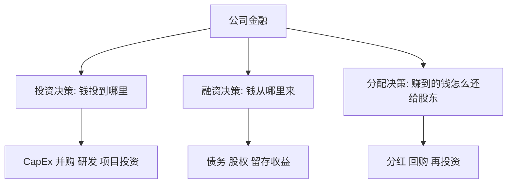
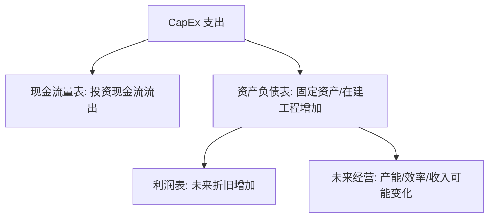
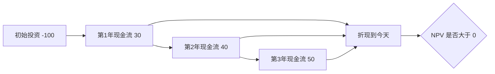

# 02 公司金融与资本配置：钱从哪里来，投到哪里去

> 前置阅读建议：如果你对利润、现金流、资产、负债和股东权益之间的关系还不熟，请先阅读 [00 财务指标入门桥梁](00_financial_metrics_bridge_for_quant.md)，再进入本章。

## 学习目标

学完这一章，你应该能做到：

- 理解公司金融的核心问题：投资决策、融资决策、分配决策。
- 掌握 FCF、CapEx、NPV、IRR、WACC、ROIC 等核心概念。
- 区分维持性 CapEx 和扩张性 CapEx。
- 判断一家公司加杠杆、增发、回购、分红、并购背后的资本配置逻辑。
- 看懂“短期财务指标恶化但长期可能创造价值”的条件。
- 把公司金融判断转化为研究问题和量化指标。

公司金融不是只给 CFO 学的。对投资研究者来说，公司金融回答的是：

```text
管理层拿股东和债权人的钱，是否投向了能创造价值的地方？
```

## 为什么这部分对主观 + 量化重要

主观研究需要判断管理层“下一盘什么棋”：

- 为什么公司突然提高资本开支？
- 为什么公司发债而不是增发？
- 为什么盈利下滑还继续回购？
- 为什么并购消息公布后股价下跌？
- 为什么同样是烧钱，有些公司被市场奖励，有些公司被惩罚？

量化研究也会把这些问题转成因子：

- CapEx / 收入。
- FCF Yield。
- ROIC - WACC。
- 有息负债 / EBITDA。
- 回购金额 / 市值。
- 并购支出 / 总资产。
- 投资现金流 / 总资产。

公司金融是连接“财报数字”和“估值变化”的桥。

## 一、公司金融的三大决策



ASCII 版本：

```text
公司金融
  ├── 投资决策：项目、CapEx、并购、研发
  ├── 融资决策：债务、股权、内部现金流
  └── 分配决策：再投资、分红、回购
```

一句话总结：

```text
投资决策决定资产质量
融资决策决定风险结构
分配决策决定股东回报和再投资空间
```

## 二、自由现金流 FCF：估值的核心燃料

### 1. 为什么不是只看净利润

净利润是会计利润，FCF 更接近“公司在维持和发展业务后还能自由支配的现金”。

简化公式：

```text
FCF ≈ OCF - CapEx
```

更完整的公司金融口径可能区分 FCFF 和 FCFE：

| 指标 | 含义 | 用途 |
|---|---|---|
| FCFF | Firm Free Cash Flow，归属于全部资本提供者的自由现金流 | 企业价值估值 |
| FCFE | Free Cash Flow to Equity，归属于股东的自由现金流 | 股权价值估值 |

初学阶段先抓住：

```text
经营能产生多少现金？
维持和扩张资产要花多少现金？
剩下多少现金可以还债、分红、回购或继续投资？
```

### 2. FCF 的四种画像

| 类型 | 可能公司状态 | 解读 |
|---|---|---|
| OCF 强，CapEx 低，FCF 高 | 成熟现金牛 | 适合分红、回购 |
| OCF 强，CapEx 高，FCF 低或负 | 扩张期优质公司 | 看投资效率 |
| OCF 弱，CapEx 高，FCF 负 | 烧钱扩张 | 风险高，看融资能力 |
| OCF 弱，CapEx 低，FCF 弱 | 主业疲软 | 需要警惕 |

### 3. 案例化理解：AI 基建 CapEx

如果一家云计算或数据库公司宣布大幅提高 AI 数据中心资本开支，你不要只问“利润会不会下降”，还要问：

- OCF 是否足够覆盖部分投资？
- 额外资金来自发债、现金储备还是股权融资？
- CapEx 是客户订单驱动，还是管理层押注？
- 投入后能否提升收入增长、客户粘性或毛利率？
- 未来折旧是否会压低利润率？
- 行业是否会出现产能过剩？

## 三、CapEx：维持性投资还是扩张性投资

### 1. CapEx 的双重性质

CapEx 是现金流出，但可能创造未来收入。它既是成本，也是选择权。

| 类型 | 目的 | 例子 | 投资解读 |
|---|---|---|---|
| 维持性 CapEx | 保持现有产能 | 更换旧设备、维护厂房 | 不花会衰退 |
| 扩张性 CapEx | 扩大未来收入 | 新工厂、数据中心、新产线 | 看未来回报 |
| 战略性 CapEx | 抢占新机会 | AI 算力、自动化升级 | 不确定性更高 |

### 2. CapEx 影响三张表



### 3. 投资效率指标

| 指标 | 公式 | 含义 |
|---|---|---|
| CapEx / 收入 | 资本开支 / 营业收入 | 资本密集度 |
| CapEx 增速 | 本期 CapEx 同比增长 | 投资扩张速度 |
| 收入增量 / CapEx | 收入增加额 / 资本开支 | 粗略投资转化效率 |
| 固定资产周转率 | 收入 / 平均固定资产 | 资产使用效率 |
| ROIC | 税后经营利润 / 投入资本 | 投入资本回报 |

实际研究中，CapEx 口径要按数据源和财报附注核对。A 股和美股披露项目名称可能不同，且不同数据库对资本开支的计算口径不完全一致。

## 四、NPV：项目是否创造价值

NPV 是净现值，核心逻辑：

```text
NPV = 未来现金流折现值之和 - 初始投资
```

如果 NPV > 0，理论上项目创造价值；如果 NPV < 0，项目毁灭价值。

### 1. 为什么要折现

今天的 100 元和三年后的 100 元不一样，因为：

- 今天的钱可以投资产生收益。
- 未来现金流有不确定性。
- 通胀和利率会改变货币价值。
- 风险越高，投资者要求回报越高。

### 2. NPV 直觉图

```text
现在: -100 投资
第1年: +30
第2年: +40
第3年: +50

未来现金流要折回今天，再和 -100 比较
```



### 3. 投资研究中的 NPV 思维

你不一定每天手搭项目 NPV，但要有这种思维：

```text
这笔投入未来能产生多少现金？
这些现金什么时候来？
不确定性多大？
折现后是否超过今天投入？
```

## 五、IRR：项目自身的收益率

IRR 是让 NPV 等于 0 的折现率。直觉上，它是一个项目内含的年化回报率。

判断：

```text
如果 IRR > 资本成本，项目可能创造价值
如果 IRR < 资本成本，项目可能毁灭价值
```

IRR 的问题：

- 现金流多次正负变化时可能有多个 IRR。
- 不适合比较规模差异巨大的项目。
- 容易让人忽略再投资假设。

投资研究中，IRR 不要孤立看，要和 NPV、资本成本、项目风险一起看。

## 六、WACC：钱不是免费的

WACC 是加权平均资本成本。公司资金通常来自债务和股权。

简化公式：

```text
WACC = 债务权重 * 税后债务成本 + 股权权重 * 股权成本
```

### 1. 债务成本

债务成本相对容易观察：公司借钱要付利息。

税盾效应：

```text
利息可以税前扣除，所以债务有税盾
```

### 2. 股权成本

股权没有固定利息，但股东承担剩余风险，所以要求回报通常高于债务。

直觉：

```text
债权人先拿固定利息，风险较低
股东最后拿剩余收益，风险较高
```

### 3. 为什么 WACC 重要

ROIC 必须和 WACC 比：

```text
ROIC > WACC：可能创造价值
ROIC < WACC：可能毁灭价值
```

这句话非常关键。增长本身不等于价值创造。如果公司每投入 1 元资本，只赚到低于资本成本的回报，规模越大可能越毁灭价值。

## 七、ROIC：管理层配置资本的成绩单

ROIC 是投入资本回报率，常见简化：

```text
ROIC = NOPAT / Invested Capital
```

其中：

```text
NOPAT = 税后经营利润
Invested Capital = 有息债务 + 股东权益 - 非经营性现金
```

不同数据源口径会有差异，实务中要核对定义。

### 1. ROIC 为什么比 ROE 更接近经营质量

ROE 受杠杆影响较大：

```text
ROE = 净利润 / 股东权益
```

如果公司大量举债，股东权益较小，ROE 可能很高，但风险也更高。ROIC 更关注全部投入资本的回报。

### 2. ROIC 拆解

```text
ROIC ≈ 税后经营利润率 * 投入资本周转率
```

也就是：

- 一块收入能赚多少经营利润？
- 一块资本能支持多少收入？

| 公司类型 | ROIC 特征 |
|---|---|
| 优质轻资产软件 | 可能较高 |
| 重资产制造 | 取决于产能利用率和周期 |
| 资本密集公用事业 | 稳定但可能不高 |
| 过度扩张公司 | 可能下降 |

## 八、资本结构：债务与股权的权衡

### 1. MM 定理的直觉

MM 定理在完美市场假设下说，资本结构不影响公司价值。但现实世界不完美，所以资本结构很重要。

现实中存在：

- 税盾效应。
- 破产成本。
- 信息不对称。
- 代理问题。
- 融资约束。

所以公司要在债务好处和债务风险之间权衡。

### 2. 债务的好处

- 利息税盾。
- 不稀释股权。
- 管理层被债务约束，减少乱投资。
- 如果项目回报高于债务成本，股东收益被放大。

### 3. 债务的风险

- 利息和本金必须支付。
- 利率上升会增加压力。
- 经营下行时可能触发财务困境。
- 高杠杆限制未来融资灵活性。

### 4. 核心杠杆指标

| 指标 | 公式 | 用途 |
|---|---|---|
| 资产负债率 | 总负债 / 总资产 | 总体负债水平 |
| 有息负债率 | 有息负债 / 总资产 | 需要付息的负债压力 |
| 净债务 | 有息负债 - 现金 | 真实债务负担 |
| Debt / EBITDA | 有息债务 / EBITDA | 偿债压力 |
| 利息保障倍数 | EBIT / 利息费用 | 利润覆盖利息能力 |

利息保障倍数直觉：

```text
倍数越高，公司付息越安全
倍数越低，利润稍微下滑就可能紧张
```

## 九、债务融资、股权融资与内部现金流

| 融资方式 | 优点 | 缺点 | 常见信号 |
|---|---|---|---|
| 内部现金流 | 不稀释，不增加债务 | 受经营能力限制 | 成熟优质公司常见 |
| 债务融资 | 成本较低，有税盾 | 增加偿债压力 | 利率和期限结构很重要 |
| 股权融资 | 不需固定还本付息 | 稀释股东 | 可能说明股价较高或现金不足 |

看新闻时，你要问：

```text
公司为什么选择这种融资方式？
它有没有更便宜或更稳健的选择？
这会改变股东收益和风险吗？
```

## 十、回购、分红与再投资

### 1. 分红

分红适合现金流稳定、再投资机会有限的公司。分红不是越高越好，如果公司需要大量再投资却硬分红，可能牺牲长期增长。

### 2. 回购

回购减少流通股数，可能提高每股收益。关键条件：

- 公司有真实自由现金流。
- 回购价格不贵。
- 回购不是为了掩盖股权激励稀释。
- 不因回购牺牲必要投资。

### 3. 再投资

如果公司 ROIC 长期高于 WACC，再投资可能比直接分红更有价值。优秀公司往往不是只会赚钱，而是能把赚来的钱继续高回报投出去。

## 十一、并购：增长捷径还是风险来源

并购可能带来：

- 市场份额。
- 技术能力。
- 客户资源。
- 成本协同。
- 收入协同。

但风险也很大：

- 出价过高。
- 商誉减值。
- 文化整合失败。
- 管理层追求规模而非回报。
- 用股权并购稀释原股东。

并购研究清单：

| 问题 | 研究意义 |
|---|---|
| 买的是什么资产？ | 是否增强核心业务 |
| 花了多少钱？ | 估值是否过高 |
| 资金来源是什么？ | 债务风险或股权稀释 |
| 商誉会增加多少？ | 未来减值风险 |
| 协同是否可验证？ | 不要只听管理层故事 |
| ROIC 是否改善？ | 并购最终要回到资本回报 |

## 十二、战略性阵痛 vs 价值毁灭

当公司短期利润下滑、FCF 转负时，不要简单判断好坏。用下面框架：

| 问题 | 战略性阵痛 | 价值毁灭 |
|---|---|---|
| OCF | 仍然强或可恢复 | 持续恶化 |
| CapEx | 指向明确增长机会 | 盲目扩张 |
| 资产效率 | 未来有望提升 | 固定资产周转下降 |
| 资金来源 | 可承受 | 高杠杆或高稀释 |
| ROIC 前景 | 有望高于 WACC | 长期低于 WACC |
| 管理层解释 | 与数据一致 | 只讲故事 |

## 十三、常见误解与陷阱

| 误解 | 更准确的理解 |
|---|---|
| 债务一定不好 | 合理债务能降低资本成本，但过度债务危险 |
| 增发一定不好 | 高估值时增发用于高回报项目可能合理 |
| 回购一定利好 | 高价回购可能毁灭价值 |
| CapEx 增加一定拖累股价 | 如果投资效率高，长期可能提升价值 |
| ROE 高一定优秀 | 可能只是高杠杆推高 |
| IRR 高就一定好 | 要看项目规模、风险和现金流形态 |
| 并购等于增长 | 并购也可能带来商誉减值和资本回报下降 |

## 十四、练习任务

### 练习 1：资本配置三问

选择一家公司，回答：

```text
过去一年钱主要投到哪里？
钱主要从哪里来？
赚到的钱用于再投资、分红还是回购？
```

### 练习 2：CapEx 判断

找一家资本开支大幅上升的公司，判断：

- 是维持性还是扩张性？
- 是否有收入或订单支撑？
- 是否会带来折旧压力？
- 资金来源是否稳健？

### 练习 3：杠杆风险

计算或查找：

```text
资产负债率
有息负债
净债务
利息保障倍数
Debt / EBITDA
```

写下这家公司债务风险是低、中还是高，并说明理由。

### 练习 4：ROIC 思考

比较两家公司：

```text
A 公司收入增速高但 ROIC 下降
B 公司收入增速中等但 ROIC 稳定高于 WACC
```

从长期价值创造角度，你更愿意深入研究哪一家？为什么？

## 十五、自检清单

- [ ] 我能解释公司金融三大决策。
- [ ] 我知道 FCF 为什么比净利润更接近估值核心。
- [ ] 我能区分维持性 CapEx 和扩张性 CapEx。
- [ ] 我能解释 NPV 和 IRR 的基本逻辑。
- [ ] 我知道 WACC 表示资本不是免费的。
- [ ] 我能解释 ROIC > WACC 为什么重要。
- [ ] 我知道债务有税盾，也有财务困境成本。
- [ ] 我能用利息保障倍数判断偿债压力。
- [ ] 我能分析回购、分红、增发、发债的基本含义。
- [ ] 我能区分战略性阵痛和价值毁灭的基本条件。

## 十六、术语表

| 术语 | 解释 |
|---|---|
| FCF | 自由现金流，公司可自由分配或再投资的现金流 |
| CapEx | 资本开支，用于购买长期资产的现金支出 |
| NPV | 净现值，未来现金流折现值减去初始投资 |
| IRR | 内部收益率，使 NPV 等于 0 的折现率 |
| WACC | 加权平均资本成本 |
| ROIC | 投入资本回报率 |
| NOPAT | 税后经营利润 |
| 维持性 CapEx | 维持现有经营能力所需资本开支 |
| 扩张性 CapEx | 为未来增长投入的资本开支 |
| 资本结构 | 债务和股权的组合 |
| 税盾 | 利息税前扣除带来的税收节约 |
| 财务困境成本 | 高杠杆带来的破产、融资困难和经营受限成本 |
| 回购 | 公司买回自己的股票 |
| 分红 | 公司把利润或现金分配给股东 |
| 并购 | 收购或合并其他公司或资产 |

## 十七、延伸阅读

- 公司金融教材：重点看资本预算、资本结构、股利政策。
- 年报管理层讨论：观察管理层如何解释投资和融资决策。
- 信用评级报告：学习债务风险和偿债能力分析。
- 估值教材：理解 FCF、WACC、ROIC 如何进入 DCF 和价值判断。
- 后续学习衔接：进入估值框架，理解资本配置如何反映到 PE、EV/EBITDA、DCF 和市场预期中。
