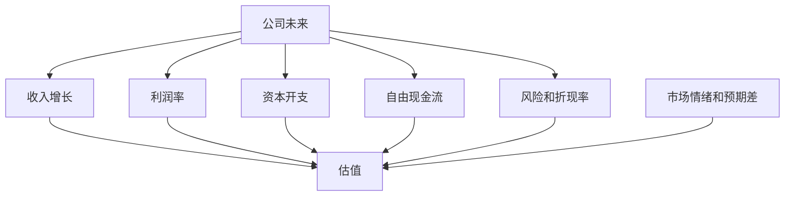
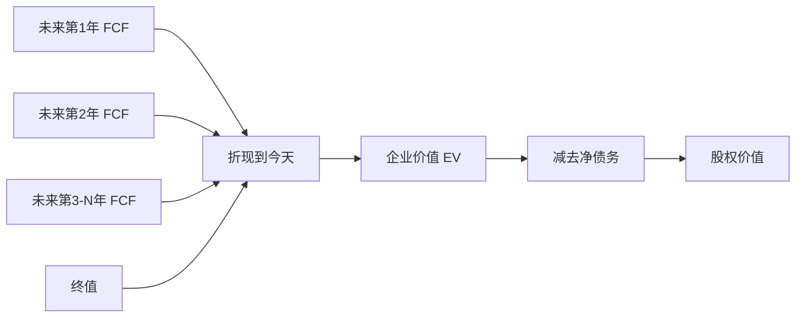

# 03 估值框架：好公司不等于好股票

> 前置阅读建议：如果你还不熟悉净利润、自由现金流、净资产和资本成本，请先阅读 [00 财务指标入门桥梁](00_financial_metrics_bridge_for_quant.md)，再进入本章。

## 学习目标

学完这一章，你应该能做到：

- 理解估值的本质：为未来现金流、增长、风险和市场预期定价。
- 掌握 PE、PB、PS、EV/EBITDA、FCF Yield、PEG、DCF 的核心逻辑。
- 知道不同估值方法适合哪些行业和公司阶段。
- 理解为什么利率变化会影响成长股估值。
- 能区分“公司优秀”和“股票值得买”这两个问题。
- 能把估值指标用于主观研究和量化筛选，但不机械套公式。

估值不是算出一个精确数字。估值更像一个结构化判断：

```text
市场现在给了什么价格？
这个价格隐含了什么增长、利润率、现金流和风险假设？
这些假设是否过高或过低？
```

## 为什么这部分对主观 + 量化重要

主观研究中，估值决定“故事已经被价格反映了多少”。一家好公司如果估值过高，未来回报也可能一般；一家普通公司如果预期过低，边际改善也可能带来股价弹性。

量化研究中，估值是最常见的因子类别之一：

- PE 分位数。
- PB 分位数。
- EV/EBITDA。
- FCF Yield。
- 股息率。
- 估值相对行业偏离。
- 估值与盈利增速匹配度。

但估值因子不能脱离行业、周期、会计质量和市场环境。低估值可能是机会，也可能是价值陷阱。

## 一、估值的本质

股票价值来自未来。今天的价格反映市场对未来的预期。



ASCII 版本：

```text
估值 = 未来现金流 + 增长 + 风险 + 利率 + 预期差
```

你要形成一个核心意识：

```text
好公司不等于好股票。
好股票 = 好公司 + 合理价格 + 未来预期有上修空间。
```

## 二、市值、企业价值与股权价值

### 1. 市值

```text
市值 = 股价 * 总股本
```

市值是股权市场给公司的价格，但它只代表股东权益价值。

### 2. 企业价值 EV

企业价值试图衡量整个公司经营资产的价值，常见简化：

```text
EV = 市值 + 有息债务 + 少数股东权益 + 优先股 - 现金及现金等价物
```

初学阶段可以先理解为：

```text
EV 是买下整个经营业务的大致价格。
```

### 3. 为什么 EV 很重要

两家公司市值一样，但债务不同，经营资产的真实价格不同。

| 公司 | 市值 | 净债务 | EV |
|---|---:|---:|---:|
| A | 100 | 0 | 100 |
| B | 100 | 50 | 150 |

如果只看 PE，可能忽略资本结构差异。EV 类指标更适合跨杠杆结构比较。

## 三、PE：最常见，也最容易误用

### 1. 公式

```text
PE = 市值 / 净利润
```

或者：

```text
PE = 股价 / 每股收益 EPS
```

### 2. PE 适合什么

PE 适合：

- 盈利为正。
- 盈利相对稳定。
- 会计利润质量较好。
- 行业周期波动不太极端。

例如成熟消费、部分医药、稳定制造、成熟软件公司。

### 3. PE 不适合什么

| 场景 | 问题 |
|---|---|
| 公司亏损 | PE 无意义或为负 |
| 周期利润高点 | PE 看起来很低，但可能是盈利峰值 |
| 一次性收益大 | PE 被非经常项目压低 |
| 重资产折旧差异大 | 会计利润受折旧政策影响 |
| 早期成长公司 | 利润被研发和扩张压低 |

### 4. PE 的主观解读

PE 高不一定贵，PE 低不一定便宜。关键是：

```text
增长能否持续？
利润质量如何？
资本回报如何？
风险是否低？
市场是否已经充分预期？
```

### 5. PE 的量化使用

量化里常看：

- 当前 PE 相对历史分位。
- 当前 PE 相对行业分位。
- PE 与未来盈利增速匹配。
- PE 变化与盈利修正的关系。

注意：不同数据库可能使用 TTM、静态、动态、预测 PE，口径必须核对。

## 四、PB：资产定价视角

### 1. 公式

```text
PB = 市值 / 净资产
```

或者：

```text
PB = 股价 / 每股净资产
```

### 2. PB 适合什么

PB 更适合资产驱动型行业：

- 银行。
- 保险。
- 券商。
- 房地产。
- 周期资源。
- 部分重资产制造。

### 3. PB 与 ROE 的关系

简化直觉：

```text
高 ROE 公司通常应该享有更高 PB
低 ROE 或亏损公司 PB 应该较低
```

如果一家公司 PB 很低，你要问：

- 净资产质量真实吗？
- ROE 是否长期低迷？
- 是否有资产减值风险？
- 是否存在资本无法有效变现的问题？

### 4. 银行估值例子

银行常用 PB，因为银行资产负债表是业务核心。看银行 PB 时，要同时看：

- ROE。
- 净息差。
- 不良贷款率。
- 拨备覆盖率。
- 资本充足率。
- 宏观信用周期。

低 PB 银行不一定便宜，可能反映市场担心资产质量。

## 五、PS：收入定价视角

### 1. 公式

```text
PS = 市值 / 营业收入
```

### 2. PS 适合什么

PS 常用于：

- 尚未稳定盈利的成长公司。
- SaaS、云计算、互联网平台。
- 生物科技早期商业化阶段。
- 利润受短期投入压制但收入增长清晰的公司。

### 3. PS 的核心问题

PS 本身不考虑成本和利润。你必须追问：

```text
这 1 元收入未来能变成多少利润和现金流？
```

所以 PS 要结合：

- 毛利率。
- 费用率。
- 留存率。
- 单位经济模型。
- 长期经营利润率。
- 收入增长可持续性。

### 4. PS 陷阱

| 陷阱 | 说明 |
|---|---|
| 只看收入增长 | 高收入增长可能靠烧钱买来 |
| 忽略毛利率 | 低毛利收入价值不如高毛利收入 |
| 忽略客户留存 | 收入不稳定时 PS 没有支撑 |
| 忽略最终利润率 | 永远不能盈利的收入不值高估值 |

## 六、EV/EBITDA：跨资本结构比较

### 1. 公式

```text
EV/EBITDA = 企业价值 / EBITDA
```

EBITDA 是息税折旧摊销前利润：

```text
EBITDA ≈ EBIT + 折旧 + 摊销
```

### 2. 为什么用 EV/EBITDA

它有几个优点：

- 使用 EV，考虑债务和现金。
- EBITDA 排除了折旧摊销影响，便于比较重资产公司。
- 排除了资本结构导致的利息差异。

适合：

- 工业。
- 通信。
- 资源。
- 酒店。
- 基础设施。
- 部分重资产科技公司。

### 3. 局限

EBITDA 不是现金流。它忽略了：

- 资本开支。
- 营运资本变化。
- 税。
- 利息。

对需要持续高 CapEx 的公司，EV/EBITDA 可能过于乐观。

## 七、FCF Yield：现金流收益率

### 1. 公式

```text
FCF Yield = 自由现金流 / 市值
```

或使用企业价值口径：

```text
FCF Yield = 自由现金流 / EV
```

### 2. 直觉

如果一家公司市值 1000 亿，自由现金流 50 亿：

```text
FCF Yield = 5%
```

这可以理解为以当前价格买入公司，当前自由现金流相当于价格的多少比例。当然未来现金流会变化，所以它不是债券收益率。

### 3. 适用场景

FCF Yield 适合现金流成熟稳定的公司，也适合识别“利润不错但现金流差”的估值陷阱。

但对高增长扩张期公司，FCF 可能因为 CapEx 暂时为负，不能简单判定昂贵。

## 八、PEG：估值与增长匹配

### 1. 公式

```text
PEG = PE / 盈利增速
```

例如：

```text
PE = 30
盈利增速 = 30%
PEG = 1
```

### 2. 使用前提

PEG 只适合盈利增长较稳定的成长公司。它的难点在于：

- 增速用过去还是未来？
- 未来增速是否可靠？
- 盈利是否高质量？
- 增速会持续几年？

PEG 看起来简单，但实际非常依赖盈利预测。

## 九、DCF：估值的底层语言

### 1. DCF 核心

DCF 是现金流折现：

```text
企业价值 = 未来自由现金流折现值之和
```

简化结构：

```text
预测期 FCF
+ 终值 Terminal Value
折现到今天
= 企业价值
- 净债务
= 股权价值
```

### 2. DCF 直觉图



ASCII 版本：

```text
未来现金流越高，价值越高
增长越持久，价值越高
风险/利率越高，折现率越高，价值越低
```

### 3. 为什么利率影响成长股

成长股价值更多来自遥远未来现金流。利率上升时，远期现金流折现到今天的价值下降更明显。

```text
现金流越远，对折现率越敏感。
```

所以高利率环境下，市场往往压缩高久期成长股估值。

### 4. DCF 的实际用途

你不必一开始做复杂模型，但必须理解：

- 估值最终与未来 FCF 有关。
- WACC 是折现率的重要组成。
- 长期增长率不能脱离经济常识。
- 终值对结果影响很大。
- DCF 对假设非常敏感。

## 十、估值方法选择表

| 公司类型 | 优先估值方法 | 辅助指标 |
|---|---|---|
| 成熟消费 | PE、DCF、FCF Yield | 毛利率、ROE、股息率 |
| 银行 | PB、PE | ROE、不良率、净息差 |
| 保险 | PB、内含价值相关指标 | 投资收益、新业务价值 |
| 周期资源 | PB、EV/EBITDA、周期位置 | 商品价格、库存、成本曲线 |
| SaaS/云 | PS、EV/Sales、DCF | 增长、留存、长期利润率 |
| 重资产制造 | EV/EBITDA、PE、PB | CapEx、折旧、ROIC |
| 生物医药早期 | 管线价值、概率加权 DCF | 研发阶段、现金储备 |
| 公用事业 | DCF、股息率、PB | 监管回报率、负债成本 |

## 十一、估值与市场预期

估值不是静态标签。股价变化往往来自预期变化：

```text
股价变化 ≈ 盈利变化 + 估值倍数变化
```

如果一家公司的盈利增长符合预期，股价不一定涨；如果盈利只是少亏一点但市场原本更悲观，股价可能大涨。

研究要问：

- 市场现在预期什么？
- 财报或新闻是否改变预期？
- 改变的是收入、利润率、现金流还是风险？
- 估值是否已经提前反映？

## 十二、估值陷阱清单

| 陷阱 | 表现 | 排查 |
|---|---|---|
| 低 PE 陷阱 | PE 很低但盈利处于周期高点 | 看历史周期利润 |
| 低 PB 陷阱 | PB 很低但资产质量差 | 看减值、不良、ROE |
| 高 PS 陷阱 | 收入增长快但永远不赚钱 | 看毛利率和费用率路径 |
| EBITDA 陷阱 | EBITDA 高但 CapEx 巨大 | 看 FCF |
| 一次性利润陷阱 | PE 被非经常收益压低 | 剔除非经常项目 |
| 预测陷阱 | 估值依赖过高未来增速 | 做敏感性分析 |
| 可比公司陷阱 | 随便选同行 | 比较商业模式、增长、利润率、资本结构 |

## 十三、A 股 / 美股案例化理解

### 案例 1：成长股高 PE 是否合理

一家 AI 软件公司 PE 很高，但收入增速快、毛利率高、客户留存强、FCF 开始转正。高 PE 可能反映市场对长期成长和高利润率的预期。

关键问题：

- 增长能持续几年？
- 毛利率是否稳定？
- 销售和研发费用率能否下降？
- FCF 是否真实改善？
- 当前估值是否已经隐含过高增长？

### 案例 2：周期股低 PE 是否便宜

一家资源公司在商品价格高点利润暴增，PE 看起来只有 5 倍。但如果商品价格回落，利润可能大幅下降。低 PE 可能只是周期高点的幻觉。

关键问题：

- 当前利润处于周期什么位置？
- 商品价格是否可持续？
- 公司成本曲线位置如何？
- 资产负债表能否穿越下行周期？

### 案例 3：银行低 PB 是否机会

银行 PB 低可能意味着便宜，也可能意味着市场担心资产质量。必须结合 ROE、不良率、拨备覆盖率、资本充足率和宏观信用环境判断。

## 十四、常见误解与陷阱

| 误解 | 更准确的理解 |
|---|---|
| PE 越低越便宜 | 低 PE 可能反映盈利不可持续或风险高 |
| PE 越高越贵 | 高 PE 可能对应高增长和高质量，但要验证 |
| DCF 能算出精确价值 | DCF 是假设敏感的框架，不是精密仪器 |
| 同行业可以直接比估值 | 还要比较增长、利润率、资本结构和风险 |
| 估值只看财务指标 | 利率、风险偏好、流动性和预期差也重要 |
| FCF 为负一定不能投 | 扩张期可能合理，但要看投资回报 |

## 十五、练习任务

### 练习 1：估值方法选择

给以下公司类型选择主要估值方法并说明理由：

- 银行。
- SaaS 公司。
- 周期资源公司。
- 成熟消费公司。
- 重资产制造公司。

### 练习 2：PE 分析

找一家公司，记录：

```text
当前 PE
过去 5 年 PE 分位
行业 PE 分位
收入和利润增速
经营现金流 / 净利润
```

判断低估、高估或合理之前，先写出关键假设。

### 练习 3：DCF 直觉

不用建复杂模型，只写出影响 DCF 的 5 个关键变量：

```text
收入增长率
长期利润率
CapEx
WACC
长期增长率
```

说明每个变量上升会如何影响估值。

### 练习 4：预期差分析

找一条财报后股价大涨或大跌的新闻，分析：

- 财报数字本身如何？
- 市场原本预期是什么？
- 变化来自收入、利润率、现金流还是指引？
- 估值倍数是否扩张或收缩？

## 十六、自检清单

- [ ] 我能解释市值和 EV 的区别。
- [ ] 我知道 PE 适合盈利稳定公司，但不适合亏损公司。
- [ ] 我知道 PB 常用于银行等资产驱动行业。
- [ ] 我知道 PS 要结合毛利率和长期利润率。
- [ ] 我能解释 EV/EBITDA 为什么考虑资本结构。
- [ ] 我知道 EBITDA 不等于现金流。
- [ ] 我能解释 FCF Yield 的直觉。
- [ ] 我知道 DCF 的核心是未来 FCF 折现。
- [ ] 我能解释利率上升为什么压制成长股估值。
- [ ] 我能说出至少三种估值陷阱。

## 十七、术语表

| 术语 | 解释 |
|---|---|
| 市值 | 股价乘以总股本 |
| EV | 企业价值，衡量经营资产整体价值 |
| PE | 市盈率，市值 / 净利润 |
| PB | 市净率，市值 / 净资产 |
| PS | 市销率，市值 / 收入 |
| EV/EBITDA | 企业价值 / 息税折旧摊销前利润 |
| FCF Yield | 自由现金流收益率 |
| PEG | PE / 盈利增速 |
| DCF | 现金流折现估值 |
| WACC | 加权平均资本成本 |
| 终值 | 预测期之后现金流价值的估计 |
| 估值分位 | 当前估值在历史或横截面中的相对位置 |
| 预期差 | 实际情况与市场预期之间的差异 |

## 十八、延伸阅读

- 估值教材：重点读相对估值、DCF、可比公司分析。
- 公司年报和业绩会纪要：学习管理层如何给增长和利润率指引。
- 卖方研究报告：学习估值方法选择，但要独立判断假设是否合理。
- 量化研究：比较不同估值因子在行业中性后的表现。
- 后续学习衔接：进入行业与商业模式分析，理解为什么不同行业不能共用一套估值倍数。
