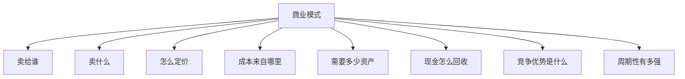

# 04 行业与商业模式分析：不同行业不能用同一把尺

> 前置阅读建议：如果你还不能熟练解释收入、成本、资产、现金流和投资收益，请先阅读 [00 财务指标入门桥梁](00_financial_metrics_bridge_for_quant.md)，再进入本章。

## 学习目标

学完这一章，你应该能做到：

- 理解为什么同一个财务指标在不同行业含义不同。
- 从收入驱动、成本结构、资产结构、现金流、周期性和护城河拆解商业模式。
- 掌握银行、保险、科技、制造、消费、医药、能源周期、互联网平台等行业的基础分析框架。
- 面对行业新闻时，能判断它影响的是需求、供给、价格、成本、竞争格局还是估值预期。
- 为主观研究构建行业地图，为量化研究做行业中性和行业因子解释打基础。

行业分析不是背行业知识点，而是训练一种能力：

```text
同一个财务数字，在这个行业里到底意味着什么？
```

## 为什么这部分对主观 + 量化重要

主观研究里，行业决定一家公司能不能把财务表现延续下去。你不能用同一套 PE、毛利率、资产负债率去比较银行、软件、煤炭、医药和零售。

量化研究里，行业影响更明显：

- 银行天然高杠杆，不能简单和制造业比资产负债率。
- 软件公司毛利率高，制造业毛利率低，横截面比较必须行业中性。
- 周期股低 PE 可能是周期高点，不等于便宜。
- 消费公司存货和渠道变化非常重要。
- 医药公司的研发投入可能短期压低利润，但决定长期价值。

行业是解释财务指标的语境。

## 一、商业模式拆解框架

一个通用框架：



ASCII 版本：

```text
客户 -> 产品/服务 -> 定价 -> 成本 -> 资产 -> 现金流 -> 护城河 -> 周期
```

### 商业模式拆解模板

| 维度 | 要问的问题 | 常见财务映射 |
|---|---|---|
| 客户 | 谁买单？客户集中吗？ | 收入稳定性、应收账款 |
| 产品 | 标准化还是差异化？ | 毛利率、研发费用 |
| 定价 | 公司有定价权吗？ | 毛利率波动 |
| 成本 | 主要成本是原材料、人力还是流量？ | 成本率、费用率 |
| 资产 | 轻资产还是重资产？ | 固定资产、CapEx |
| 现金流 | 先收钱还是后收钱？ | OCF、合同负债、应收 |
| 护城河 | 竞争优势来自哪里？ | ROIC、毛利率稳定性 |
| 周期 | 受宏观和价格影响多大？ | 盈利波动、估值倍数 |

## 二、行业指标地图

| 行业 | 核心指标 | 关键风险 |
|---|---|---|
| 银行 | 净息差、不良率、拨备、资本充足率、ROE、PB | 信用周期、地产风险、利率变化 |
| 保险 | 新业务价值、内含价值、投资收益率、综合成本率 | 利率、权益市场、负债成本 |
| 科技软件 | 收入增长、毛利率、研发费用率、留存率、FCF | 增长放缓、竞争、估值收缩 |
| 硬件制造 | 毛利率、存货、CapEx、产能利用率、固定资产周转 | 周期、库存、价格竞争 |
| 消费 | 同店增长、渠道、毛利率、存货周转、品牌力 | 需求下滑、渠道压货、竞争 |
| 医药 | 研发管线、专利、销售费用率、现金储备 | 研发失败、集采、专利悬崖 |
| 能源周期 | 商品价格、单位成本、CapEx、库存、现金成本 | 价格周期、政策、供给冲击 |
| 互联网平台 | 用户规模、ARPU、变现率、获客成本、经营杠杆 | 监管、流量见顶、竞争 |

## 三、银行：资产质量比低 PB 更重要

银行商业模式是吸收存款、发放贷款、赚取利差，同时承担信用风险。

### 核心指标

| 指标 | 含义 |
|---|---|
| 净息差 NIM | 生息资产收益率与付息负债成本之间的差 |
| 不良贷款率 | 不良贷款 / 总贷款 |
| 拨备覆盖率 | 贷款损失准备 / 不良贷款 |
| 资本充足率 | 资本 / 风险加权资产 |
| ROE | 股东权益回报率 |
| PB | 市净率 |

### 分析逻辑

```text
银行价值 = 资产质量 + 息差能力 + 风控能力 + 资本约束
```

低 PB 银行不一定便宜。可能原因：

- 市场担心不良贷款暴露。
- 净息差持续收窄。
- 资本补充压力大。
- 宏观信用周期下行。

新闻解读例子：

```text
“央行降息”
  -> 可能压缩银行净息差
  -> 但也可能缓解借款人压力
  -> 要看资产端和负债端重定价速度
```

## 四、保险：负债成本和投资收益共同决定价值

保险公司的核心是收保费、承担未来赔付责任，并投资保费资金。

### 核心指标

| 指标 | 含义 |
|---|---|
| 新业务价值 NBV | 新卖保单未来价值 |
| 内含价值 EV | 存量业务价值 + 调整净资产 |
| 综合成本率 | 财险赔付和费用占保费比例 |
| 投资收益率 | 保险资金投资回报 |
| 偿付能力充足率 | 偿付监管要求 |

保险受利率影响很大。长期利率下降会压低投资收益和折现假设，可能影响估值。

## 五、科技软件与云计算：高毛利不等于高利润

科技软件常见特征：

- 毛利率较高。
- 研发费用率较高。
- 销售获客成本可能较高。
- 规模化后利润率可能提升。
- 估值更依赖未来增长和 FCF。

### 分析重点

| 指标 | 解读 |
|---|---|
| 收入增速 | 产品需求和市场渗透 |
| 毛利率 | 产品标准化和定价权 |
| 研发费用率 | 未来产品投入 |
| 销售费用率 | 获客效率 |
| 客户留存率 | 收入可持续性 |
| FCF | 增长是否转为现金 |

### AI 基建相关公司

对于 AI 云、服务器、芯片、数据中心相关公司，要区分：

```text
算力需求真实增长
    vs
资本开支过度提前
    vs
行业供给过剩
```

财务上看：

- CapEx 是否上升。
- 固定资产或在建工程是否增加。
- 折旧压力是否会抬升。
- 收入增量是否逐步体现。
- OCF 是否能支撑扩张。

## 六、硬件制造：库存、产能和价格竞争

制造业通常更重资产，利润受产能利用率和成本影响。

### 核心指标

| 指标 | 含义 |
|---|---|
| 毛利率 | 产品价格和成本压力 |
| 存货周转 | 库存健康程度 |
| 固定资产周转 | 产能使用效率 |
| CapEx / 收入 | 资本密集度 |
| 产能利用率 | 供需平衡 |
| 应收账款周转 | 回款质量 |

制造业常见风险：

- 产能扩张后需求不足。
- 价格战导致毛利率下降。
- 存货跌价。
- 客户集中度高。
- 原材料价格波动。

新闻解读例子：

```text
“公司扩建新产线”
  -> 看行业需求是否足够
  -> 看竞争对手是否也扩产
  -> 看未来折旧和固定成本压力
  -> 看产品价格是否可能下跌
```

## 七、消费：品牌、渠道与周转

消费公司不只是看收入增长。你要看增长来自：

- 提价。
- 销量。
- 新渠道。
- 新品类。
- 渠道压货。

### 核心指标

| 指标 | 解读 |
|---|---|
| 毛利率 | 品牌力和定价权 |
| 销售费用率 | 渠道和营销投入 |
| 存货周转 | 产品动销 |
| 应收账款 | 渠道回款 |
| 合同负债 | 预收款和渠道信心 |
| 同店增长 | 存量门店健康程度 |

### 渠道压货风险

如果收入增长很好，但：

```text
应收账款大增
存货大增
经营现金流变差
```

可能说明公司通过渠道压货确认收入，而终端需求没有真正消化。

## 八、医药：研发管线和现金储备

医药行业跨度很大：创新药、仿制药、医疗器械、CXO、药店等逻辑不同。

### 创新药重点

| 维度 | 问题 |
|---|---|
| 管线阶段 | 临床前、I/II/III 期、上市 |
| 适应症空间 | 市场规模多大 |
| 竞争格局 | 同类药物多少 |
| 专利保护 | 独占期多久 |
| 现金储备 | 能支撑多久研发 |
| 商业化能力 | 上市后能否销售 |

创新药公司可能长期亏损，所以不能只看 PE。要看管线概率、现金消耗速度和融资能力。

### 集采影响

对于仿制药和部分器械，集中采购可能压低价格和毛利率，但也可能带来销量。关键看：

- 降价幅度。
- 市占率变化。
- 成本控制能力。
- 产品结构升级。

## 九、能源与周期：利润高点最危险

周期行业包括煤炭、石油、化工、有色、钢铁、航运等。它们的利润高度依赖价格周期。

### 周期行业分析公式

```text
利润 ≈ 销量 * (产品价格 - 单位成本)
```

价格小幅变化可能带来利润大幅波动。

### 核心指标

| 指标 | 含义 |
|---|---|
| 商品价格 | 收入和毛利最大驱动 |
| 单位现金成本 | 成本曲线位置 |
| 库存 | 供需平衡信号 |
| CapEx | 未来供给变化 |
| 资产负债率 | 穿越下行周期能力 |

### 周期股估值

周期股在利润高点时 PE 往往很低，在利润低点时 PE 可能很高甚至亏损。不要机械使用 PE。

更重要的是判断：

```text
当前处于周期上行、中段、顶点还是下行？
```

## 十、互联网平台：网络效应与变现效率

互联网平台常见驱动：

- 用户规模。
- 用户时长。
- 交易频次。
- ARPU。
- 广告加载率。
- 抽佣率。
- 获客成本。

### 核心指标

| 指标 | 解读 |
|---|---|
| MAU/DAU | 用户规模和活跃度 |
| ARPU | 单用户收入 |
| GMV | 平台交易规模 |
| Take Rate | 平台抽佣率 |
| CAC | 获客成本 |
| 留存率 | 用户粘性 |
| 经营利润率 | 规模化后的变现质量 |

平台公司的护城河通常来自网络效应、数据、生态和切换成本，但也面临监管和流量增长见顶风险。

## 十一、新闻解读框架

看到一条行业新闻，按这个顺序拆：

```text
1. 影响需求还是供给？
2. 影响价格还是成本？
3. 是短期扰动还是长期趋势？
4. 影响收入、利润率、资产负债表还是现金流？
5. 哪些公司受益，哪些公司受损？
6. 市场是否已经预期？
7. 能否转成可跟踪指标？
```

例子：

```text
“某云厂商上调 AI 数据中心资本开支”
  -> 需求端：AI 算力需求强
  -> 供给端：数据中心和芯片订单增加
  -> 受益者：服务器、芯片、光模块、电力设备
  -> 风险：CapEx 过热、未来供给过剩、折旧压力
  -> 财务指标：CapEx、固定资产、收入增速、毛利率、OCF
```

## 十二、行业中性意识

量化研究中，如果直接比较全市场毛利率，软件公司天然高、制造公司天然低。这会把行业差异误判为公司质量。

行业中性就是在同一行业内比较：

```text
公司指标 - 行业平均指标
```

或：

```text
公司在行业内的分位数
```

常见需要行业中性的指标：

- PE、PB、EV/EBITDA。
- 毛利率、ROE、ROIC。
- 资产负债率。
- CapEx / 收入。
- 存货周转。

## 十三、案例化理解

### 案例 1：同样是高 CapEx，为什么市场反应不同

假设两家公司都宣布未来一年资本开支大幅增加。

| 公司 | 行业 | CapEx 用途 | 财务状态 | 可能解读 |
|---|---|---|---|---|
| A | 云计算/AI 基建 | 已签客户订单的数据中心 | OCF 强、净现金充足 | 可能是成长扩张 |
| B | 传统制造 | 新建同质化产能 | 毛利率下滑、负债上升 | 可能是过度扩张 |

同一个指标不能脱离行业和商业模式判断。对 A 来说，CapEx 可能代表抢占需求；对 B 来说，CapEx 可能意味着未来折旧压力和产能过剩。

### 案例 2：消费公司收入增长但渠道质量恶化

一家消费公司收入增长 25%，表面很好。但进一步看到：

```text
应收账款 +70%
存货 +50%
经营现金流下降
销售费用率上升
```

这时要怀疑增长是否来自终端真实需求，而不是渠道压货或加大促销。行业知识告诉你，消费公司的收入质量必须结合渠道库存、回款和动销速度判断。

### 案例 3：周期股低 PE 不一定便宜

一家煤炭或航运公司在价格高点利润暴增，PE 看起来很低。行业框架会提醒你：

```text
周期股盈利高点往往对应低 PE。
真正要判断的是商品价格和供需周期是否还能维持。
```

如果价格回落，未来盈利下降，当前低 PE 可能迅速变成高 PE。

## 十四、常见误解与陷阱

| 误解 | 更准确的理解 |
|---|---|
| 所有公司都看 PE | 银行、周期、亏损成长公司要换框架 |
| 毛利率高就是好行业 | 还要看费用率、竞争和现金流 |
| 高增长行业一定有好股票 | 竞争和估值可能吞掉回报 |
| 周期股低 PE 就便宜 | 可能处在盈利高点 |
| 银行低 PB 就安全 | 可能反映资产质量担忧 |
| 研发费用高一定好 | 要看研发效率和商业化能力 |
| CapEx 高一定激进 | 重资产或成长阶段可能必要 |

## 十五、练习任务

### 练习 1：商业模式拆解

选择一家公司，按模板回答：

```text
客户是谁？
卖什么？
怎么定价？
主要成本是什么？
需要多少资产？
现金如何回收？
护城河是什么？
周期性强不强？
```

### 练习 2：行业指标选择

分别为以下行业选 5 个最重要指标：

- 银行。
- 科技软件。
- 制造业。
- 消费。
- 周期资源。

### 练习 3：新闻拆解

找一条行业新闻，按“需求/供给/价格/成本/财务映射/市场预期”写分析。

### 练习 4：行业中性

选一个财务指标，例如毛利率或 PE，比较：

```text
全市场排名
行业内排名
```

观察结论是否不同。

## 十六、自检清单

- [ ] 我能解释为什么不同行业不能共用一套估值指标。
- [ ] 我能用商业模式模板拆解一家公司。
- [ ] 我知道银行要重点看资产质量和净息差。
- [ ] 我知道科技公司高毛利背后还要看费用率和 FCF。
- [ ] 我知道制造业要看库存、产能和 CapEx。
- [ ] 我知道消费公司要警惕渠道压货。
- [ ] 我知道医药公司要看研发管线和现金储备。
- [ ] 我知道周期股低 PE 可能是陷阱。
- [ ] 我能把行业新闻映射到财务指标。
- [ ] 我理解量化研究为什么需要行业中性。

## 十七、术语表

| 术语 | 解释 |
|---|---|
| 商业模式 | 公司创造、交付和获取价值的方式 |
| 护城河 | 公司长期竞争优势 |
| 周期性 | 业绩随宏观或价格周期波动的程度 |
| 净息差 | 银行资产收益率与负债成本之差 |
| 不良贷款率 | 不良贷款占总贷款比例 |
| 新业务价值 | 保险新保单未来利润价值 |
| ARPU | 单用户平均收入 |
| GMV | 平台交易总额 |
| Take Rate | 平台抽佣率 |
| 产能利用率 | 实际产出占设计产能比例 |
| 行业中性 | 在剔除行业差异后比较公司指标 |

## 十八、延伸阅读

- 行业研究报告：学习指标体系，但要警惕只讲故事。
- 公司年报业务分部：理解收入和利润来自哪里。
- 产业链资料：建立上游、中游、下游关系图。
- 量化因子研究：学习行业中性处理。
- 后续学习衔接：进入财务因子化，把行业和财务理解转成可检验变量。
