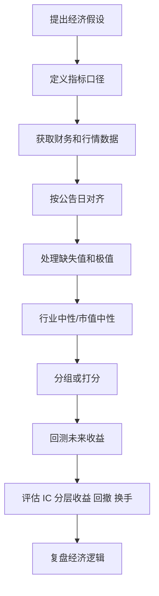
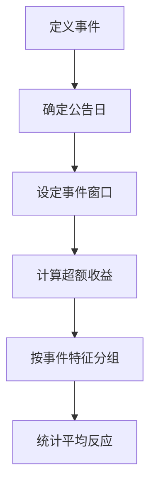

# 05 财务指标的量化因子化：把主观判断变成可检验变量

> 前置阅读建议：如果你还不熟悉财务指标的报表来源、会计含义和公告日滞后，请先阅读 [00 财务指标入门桥梁](00_financial_metrics_bridge_for_quant.md)，再进入本章。

## 学习目标

学完这一章，你应该能做到：

- 把财报分析、公司金融、估值和行业判断转成量化因子。
- 理解盈利质量、成长、估值、杠杆、现金流、资本开支、投资效率、财报异常等因子类别。
- 知道因子构造中最重要的工程问题：滞后、未来函数、行业中性、缺失值、极值处理、标准化。
- 能设计一个小型财务因子研究流程。
- 明白量化因子不是公式堆砌，而是“经济含义 + 数据口径 + 可检验性”的结合。

这一章是前四章的落地。你做“主观 + 量化”，真正的优势在这里：你既能理解财务指标背后的商业含义，也能把它变成可以回测和验证的变量。

## 为什么这部分对主观 + 量化重要

主观研究强调理解公司，量化研究强调可检验性。两者不是对立的。


ASCII 版本：

```text
研究假设 -> 指标表达 -> 因子构造 -> 回测检验 -> 迭代假设
```

例子：

```text
主观判断：利润增长但现金流跟不上，质量可疑。
财务指标：经营现金流 / 净利润。
量化因子：OCF_to_NI，行业内分位数越高越好。
检验方式：按季度财报披露后构造因子，测试未来 1-3 个月收益。
```

## 一、因子是什么

因子可以理解为给股票打分的变量。一个财务因子通常来自财报、估值或公司行为。

| 因子类型 | 例子 | 研究含义 |
|---|---|---|
| 价值 | PE、PB、FCF Yield | 价格相对基本面是否便宜 |
| 盈利 | ROE、ROIC、毛利率 | 公司赚钱能力 |
| 质量 | OCF / 净利润、应收变化 | 利润是否有现金支撑 |
| 成长 | 收入增速、利润增速 | 业务扩张速度 |
| 杠杆 | 资产负债率、Debt/EBITDA | 财务风险 |
| 投资 | CapEx / 收入、资产增长率 | 扩张或过度投资 |
| 事件 | 财报超预期、回购公告、并购 | 信息冲击 |

一个好因子至少要有三层支撑：

```text
经济逻辑：为什么它可能有效？
数据口径：它到底怎么计算？
检验结果：历史上是否有统计和经济显著性？
```

## 二、从主观判断到因子

| 主观判断 | 财务观察 | 可构造因子 | 方向直觉 |
|---|---|---|---|
| 利润有现金支撑 | OCF 高于净利润 | OCF / 净利润 | 越高越好 |
| 收入质量可疑 | 应收增长快于收入 | 应收增速 - 收入增速 | 越低越好 |
| 存货可能积压 | 存货增长快于成本 | 存货增速 - COGS 增速 | 越低越好 |
| 公司便宜 | 价格相对盈利低 | E/P、B/P、FCF/P | 越高越便宜 |
| 资本回报强 | ROIC 高 | ROIC | 越高越好 |
| 杠杆风险高 | 债务高、利息覆盖弱 | Debt/EBITDA、EBIT/利息 | 风险因子 |
| 扩张积极 | CapEx 增长 | CapEx / 收入 | 需结合效率 |
| 投资效率好 | 投入带来收入增长 | 收入增量 / CapEx | 越高越好 |
| 管理层回报股东 | 回购或分红 | 回购收益率、股息率 | 视价格和现金流 |
| 财报可能异常 | 多个质量指标恶化 | 异常综合分 | 越高越风险 |

注意：方向直觉不是永远成立。比如 CapEx 高在成熟行业可能是风险，在 AI/半导体扩张期可能是成长信号。因子必须结合行业和状态。

## 三、数据口径：先定义，再计算

财务因子最怕“公式看起来对，口径其实错”。

### 1. 常见口径差异

| 指标 | 可能口径差异 |
|---|---|
| 净利润 | 归母净利润、扣非归母净利润、GAAP 净利润、Non-GAAP 净利润 |
| 收入 | 营业收入、主营业务收入、分部收入 |
| OCF | 经营活动现金流净额，不同数据库命名不同 |
| CapEx | 购建固定资产等现金流、资本开支估算、固定资产增加 |
| 负债 | 总负债、有息负债、净债务 |
| 股本 | 总股本、流通股本、稀释股本 |
| EPS | 基本 EPS、摊薄 EPS、TTM EPS |

### 2. 基本原则

```text
不要先写公式，先写口径定义。
```

例如：

```text
OCF_to_NI = 过去 12 个月经营活动现金流净额 / 过去 12 个月归母净利润
```

还要写清：

- 数据频率：年报、季报、TTM。
- 生效日期：公告日之后还是报告期结束日之后。
- 缺失值处理。
- 极值处理。
- 行业中性与否。
- 正负利润如何处理。

## 四、未来函数：财务因子最危险的坑

未来函数是指回测时使用了当时投资者不可能知道的信息。

### 1. 一个典型错误

假设某公司 2026 年年报报告期结束日是 2026-12-31，但实际公告日是 2027-03-28。

如果你在 2027-01-01 的回测中使用 2026 年年报数据，就是未来函数。

```text
报告期结束日 != 信息可得日
```

### 2. 正确做法

应使用公告日或可得日：

```text
财报数据只能在公告日之后进入因子。
```

保守做法：

```text
公告日 + 1 个交易日后生效
```

### 3. 时间轴图


ASCII 版本：

```text
2026-12-31 报告期结束
        |
        | 这时市场还不知道年报数据
        v
2027-03-28 公告
        |
        v
2027-03-29 才能用于回测
```

### 4. 财务数据滞后建议

| 数据 | 推荐处理 |
|---|---|
| 年报 | 使用公告日，或至少滞后 3-4 个月 |
| 季报 | 使用公告日，或至少滞后 1-2 个月 |
| TTM | 只用当时已公告的最近四期 |
| 预测数据 | 使用当时可得的分析师预测快照 |

如果没有公告日数据，宁愿保守滞后，也不要提前使用。

## 五、因子构造通用流程



步骤说明：

| 步骤 | 核心问题 |
|---|---|
| 提出假设 | 这个指标为什么可能预测收益？ |
| 定义口径 | 用什么财务项目，哪个时间窗口？ |
| 数据对齐 | 当时市场是否已经知道？ |
| 清洗处理 | 缺失、极值、负值怎么处理？ |
| 中性化 | 是否只是行业或市值暴露？ |
| 检验 | 因子是否有稳定性和经济意义？ |
| 复盘 | 有效或无效的原因是什么？ |

## 六、盈利能力因子

### 1. 常见指标

| 因子 | 公式 | 含义 |
|---|---|---|
| ROE | 净利润 / 平均股东权益 | 股东权益回报 |
| ROA | 净利润 / 平均总资产 | 资产回报 |
| ROIC | NOPAT / 投入资本 | 资本配置效率 |
| 毛利率 | 毛利润 / 收入 | 产品盈利空间 |
| 营业利润率 | 营业利润 / 收入 | 主业经营效率 |

### 2. 主观逻辑

高盈利能力公司通常具有：

- 定价权。
- 成本优势。
- 品牌或技术壁垒。
- 规模效应。
- 资产周转效率。

### 3. 量化陷阱

| 陷阱 | 说明 |
|---|---|
| ROE 受杠杆影响 | 高 ROE 可能来自高负债 |
| 利润一次性抬高 | 非经常项目影响盈利能力 |
| 周期高点 | 周期行业高盈利不可持续 |
| 行业差异 | 软件毛利率天然高于制造业 |

建议：

```text
盈利能力因子最好做行业中性，并结合利润质量因子。
```

## 七、盈利质量因子

盈利质量因子判断“利润有没有含金量”。

### 1. OCF / 净利润

```text
OCF_to_NI = 经营活动现金流 / 净利润
```

直觉：

- 大于 1：现金流较好。
- 长期小于 1：利润可能缺少现金支撑。
- 净利润为负时要特殊处理，不能机械相除。

### 2. 应收异常

```text
AR_growth_minus_revenue_growth = 应收账款增速 - 收入增速
```

如果应收增速显著高于收入增速，可能说明回款变慢或收入质量下降。

### 3. 存货异常

```text
Inventory_growth_minus_COGS_growth = 存货增速 - 营业成本增速
```

如果存货大幅快于成本或收入，可能存在积压或需求不及预期。

### 4. 应计利润

简化理解：

```text
应计利润高 = 利润中非现金部分多
```

常见简化指标：

```text
Accruals = (净利润 - OCF) / 总资产
```

应计利润越高，利润现金含量可能越低。

## 八、成长因子

### 1. 常见指标

| 因子 | 公式 |
|---|---|
| 收入同比增速 | 本期收入 / 去年同期收入 - 1 |
| 净利润同比增速 | 本期净利润 / 去年同期净利润 - 1 |
| OCF 同比增速 | 本期 OCF / 去年同期 OCF - 1 |
| 毛利同比增速 | 本期毛利 / 去年同期毛利 - 1 |
| 研发费用增速 | 本期研发费用 / 去年同期研发费用 - 1 |

### 2. 成长质量

不是所有增长都好。更好的成长是：

```text
收入增长
+ 毛利率稳定或提升
+ OCF 同步改善
+ ROIC 不下降
+ 杠杆不明显恶化
```

### 3. 成长陷阱

| 陷阱 | 说明 |
|---|---|
| 基数效应 | 去年太低导致今年增速虚高 |
| 并购增长 | 不是内生增长 |
| 亏损收窄 | 增速指标可能失真 |
| 周期反弹 | 不一定可持续 |
| 牺牲利润换收入 | 高增长但现金流恶化 |

## 九、估值因子

### 1. 价值因子的常见反向表达

量化中常把估值转成“越大越便宜”的形式：

| 常见估值 | 因子表达 | 方向 |
|---|---|---|
| PE | E/P = 净利润 / 市值 | 越高越便宜 |
| PB | B/P = 净资产 / 市值 | 越高越便宜 |
| PS | S/P = 收入 / 市值 | 越高越便宜 |
| EV/EBITDA | EBITDA / EV | 越高越便宜 |
| FCF Yield | FCF / 市值 | 越高越便宜 |

### 2. 估值因子口径问题

| 问题 | 处理 |
|---|---|
| 净利润为负 | PE 无意义，可置缺失或单独处理 |
| 周期行业利润高点 | 加行业和周期控制 |
| 金融行业 EV 不适用 | 银行保险通常不用 EV/EBITDA |
| 极端估值 | 做 winsorize 或截尾 |
| 预测估值 | 确认预测数据时间点，避免未来函数 |

### 3. 价值陷阱识别

低估值组合可能包含大量基本面恶化公司。可以结合：

- 盈利质量。
- 杠杆风险。
- 盈利修正。
- 行业景气。
- 股价动量。

## 十、杠杆与风险因子

### 1. 常见指标

| 因子 | 公式 | 含义 |
|---|---|---|
| 资产负债率 | 总负债 / 总资产 | 总体负债水平 |
| 有息负债率 | 有息负债 / 总资产 | 付息压力 |
| 净债务率 | 净债务 / 权益或 EBITDA | 真实债务负担 |
| 利息保障倍数 | EBIT / 利息费用 | 利润覆盖利息 |
| 流动比率 | 流动资产 / 流动负债 | 短期偿债 |

### 2. 行业差异

银行、保险天然高杠杆，不能直接和制造业、软件公司比较。杠杆因子尤其需要行业中性或行业内口径。

### 3. 风险解释

杠杆因子不一定用于选高收益，也可以用于风控：

```text
剔除财务风险过高公司
降低组合尾部风险
识别利率上行环境下的脆弱股票
```

## 十一、资本开支与投资效率因子

### 1. CapEx 强度

```text
CapEx_intensity = CapEx / 收入
```

或：

```text
CapEx_to_assets = CapEx / 总资产
```

### 2. CapEx 增速

```text
CapEx_growth = 本期 CapEx / 去年同期 CapEx - 1
```

### 3. 投资效率

```text
Revenue_increment_to_CapEx = 收入增量 / 过去若干期 CapEx
```

也可观察：

```text
固定资产周转率 = 收入 / 平均固定资产
```

### 4. 解读难点

CapEx 因子方向不固定：

| 情况 | 可能含义 |
|---|---|
| 高 CapEx + 高 ROIC | 扩张可能创造价值 |
| 高 CapEx + 低 ROIC | 可能过度投资 |
| 低 CapEx + 高 FCF | 成熟现金牛 |
| 低 CapEx + 收入下滑 | 可能缺乏增长投入 |

因此 CapEx 最好与 ROIC、收入增速、行业景气一起使用。

## 十二、财报异常综合因子

可以把多个质量信号组合成异常风险分：

| 风险信号 | 指标 |
|---|---|
| 利润现金含量下降 | OCF / 净利润下降 |
| 回款变差 | 应收增速 > 收入增速 |
| 库存积压 | 存货增速 > 成本增速 |
| 毛利率异常 | 毛利率突然大幅偏离历史 |
| 债务压力上升 | 利息保障倍数下降 |
| 商誉风险 | 商誉 / 净资产过高 |
| 投资过度 | 资产增速高但 ROIC 下降 |

组合方式可以简单从打分开始：

```text
每出现一个风险信号 +1 分
风险分越高，财报质量越值得警惕
```

初学阶段不要急着做复杂机器学习模型。先做可解释规则，再逐步量化验证。

## 十三、行业中性、市值中性与标准化

### 1. 为什么要中性化

如果一个因子只是买了某些行业，而不是买到了真正的公司特征，回测结果可能不稳。

例如毛利率因子可能天然偏向软件、医药，低配制造、零售。你需要区分：

```text
因子收益来自公司质量，还是来自行业暴露？
```

### 2. 行业内分位数

简单方法：

```text
某公司因子值在所属行业内排名分位
```

例如某制造公司毛利率在制造行业前 10%，比全市场排名更有意义。

### 3. Z-score 标准化

```text
z = (x - mean) / std
```

常用于把不同量纲指标放到同一尺度。

### 4. 极值处理

财务数据常有极端值。常见处理：

| 方法 | 含义 |
|---|---|
| 截尾 | 删除最极端样本 |
| 缩尾 Winsorize | 把极端值压到某个分位点 |
| 中位数填充 | 用行业中位数填缺失 |
| 分位数打分 | 用排名替代原始值 |

## 十四、缺失值和负值处理

### 1. 缺失值不是随机的

缺失本身可能有信息：

- 新上市公司历史数据不足。
- 亏损公司没有 PE。
- 金融行业某些指标不适用。
- 数据源未覆盖。

### 2. 处理原则

| 情况 | 建议 |
|---|---|
| 指标不适用 | 不要强行填充，分行业处理 |
| 少量缺失 | 行业中位数或置缺失 |
| 大量缺失 | 考虑不用该因子或缩小样本 |
| 分母接近 0 | 避免生成极端比率 |
| 净利润为负 | PE、OCF/NI 等要特殊处理 |

### 3. 记录处理规则

每个因子都应记录：

```text
缺失值怎么处理？
负值怎么处理？
极值怎么处理？
不适用行业是否剔除？
```

否则回测结果无法复现。

## 十五、事件研究：财报、回购、并购和 CapEx 新闻

事件研究关注某个事件发生后股票的表现。

### 1. 常见事件

| 事件 | 研究问题 |
|---|---|
| 财报公告 | 超预期是否带来超额收益 |
| 盈利预告 | 预告修正是否被市场充分反映 |
| 回购公告 | 回购是否代表低估和现金流信心 |
| 分红公告 | 高股息是否带来防御属性 |
| 并购公告 | 市场如何评价交易 |
| CapEx 上调 | 是成长信号还是现金流压力 |

### 2. 事件研究流程



事件窗口例子：

```text
[-1, +1]：公告前后 1 个交易日
[0, +5]：公告日至后 5 个交易日
[+1, +20]：公告后中短期反应
```

注意：

- 公告时间在盘前、盘中、盘后会影响可交易日期。
- 要剔除停牌、涨跌停、重大市场事件干扰。
- A 股和美股交易制度不同。

## 十六、案例化理解

### 案例 1：把“利润质量差”转成因子

主观研究员说：

```text
这家公司利润增长很快，但经营现金流没有跟上，应收账款也明显增加。
```

量化表达可以是：

| 主观观察 | 因子表达 | 方向 |
|---|---|---|
| 现金流跟不上利润 | OCF / 净利润 | 越低风险越高 |
| 应收增长过快 | 应收增速 - 收入增速 | 越高风险越高 |
| 利润中非现金部分多 | (净利润 - OCF) / 总资产 | 越高风险越高 |

这类因子不只是“选股打分”，也可以做风险过滤：剔除财报质量恶化的股票。

### 案例 2：AI CapEx 新闻如何做事件研究

新闻：

```text
某云计算公司上调全年 AI 数据中心资本开支指引。
```

主观分析会问：

- 是订单驱动还是管理层押注？
- OCF 是否能支持扩张？
- 未来折旧是否影响利润率？
- 供应链哪些公司受益？

量化研究可以定义：

| 变量 | 可能口径 |
|---|---|
| 事件日 | 公告日或业绩会日期 |
| 事件强度 | CapEx 指引上调幅度 |
| 财务状态 | OCF / CapEx、净现金 / 总资产 |
| 后续表现 | 公告后 5、20、60 日超额收益 |
| 分组 | 高现金流支持 vs 低现金流支持 |

这样你就能检验：市场是否更奖励“现金流支持下的扩张”，而不是所有 CapEx 上调。

### 案例 3：低估值因子的价值陷阱过滤

单纯买低 PE 可能买到周期高点或基本面恶化公司。可以增加过滤：

```text
E/P 高
+ OCF / 净利润高
+ ROIC 稳定
+ Debt / EBITDA 不高
+ 行业内收入增速不差
```

这就是把主观的“便宜但不能烂”转成量化条件。

## 十七、小型财务因子研究模板

以“利润现金含量”为例：

### 1. 假设

```text
经营现金流相对净利润更高的公司，盈利质量更好，未来收益可能更高或风险更低。
```

### 2. 因子定义

```text
OCF_to_NI = TTM 经营活动现金流 / TTM 归母净利润
```

处理：

- 净利润 <= 0 的公司置缺失或单独分组。
- 使用公告日后数据。
- 行业内 winsorize。
- 行业内 z-score。

### 3. 检验

```text
调仓频率：月度或季度
持有期：1、3、6 个月
分组：行业内五分组
评价：IC、Rank IC、多空收益、最大回撤、换手率
```

### 4. 复盘

如果因子有效：

- 哪些行业最有效？
- 是否只是低杠杆或低估值暴露？
- 是否在小市值股票里更强？
- 是否在财报季后更强？

如果无效：

- 口径是否错误？
- 是否使用了未来数据？
- 是否被行业差异掩盖？
- 是否需要和应收/存货异常组合？

## 十八、因子评价指标

| 指标 | 含义 |
|---|---|
| IC | 因子值与未来收益的相关性 |
| Rank IC | 因子排名与未来收益排名的相关性 |
| 分组收益 | 按因子高低分组后的未来收益 |
| 多空收益 | 做多高分组、做空低分组的收益 |
| 最大回撤 | 策略从高点到低点的最大损失 |
| 换手率 | 组合调整频繁程度 |
| 覆盖率 | 因子有有效值的股票比例 |
| 稳定性 | 不同年份、行业、市场环境是否稳定 |

不要只看平均收益。一个因子如果只在某一年有效，或者只靠少数股票贡献，可靠性有限。

## 十九、常见误解与陷阱

| 误解 | 更准确的理解 |
|---|---|
| 因子公式越复杂越好 | 复杂不等于有效，先要经济逻辑清楚 |
| 财务数据天然可靠 | 要看口径、公告日、重述和缺失 |
| 回测收益高就说明因子好 | 可能有未来函数、过拟合或行业暴露 |
| 行业中性会降低收益，所以不用 | 不中性可能只是押行业 |
| 缺失值随便填 0 | 缺失往往有经济含义 |
| 低估值因子永远有效 | 价值陷阱和市场环境会影响表现 |
| 机器学习能自动发现一切 | 没有财务理解很容易学到噪声 |

## 二十、练习任务

### 练习 1：主观判断转因子

把以下判断转成因子：

- 公司现金流质量好。
- 公司资本开支扩张。
- 公司杠杆风险上升。
- 公司估值处于行业低位。
- 公司收入增长质量高。

要求写出：

```text
因子名称
公式
方向
适用行业
潜在陷阱
```

### 练习 2：未来函数排查

给定：

```text
报告期结束日：2026-12-31
公告日：2027-03-25
调仓日：2027-02-01
```

判断调仓日能不能使用这份年报数据，并说明理由。

### 练习 3：行业中性

选择一个指标，如 ROE 或毛利率：

- 计算全市场排名。
- 计算行业内排名。
- 比较两种排名差异。
- 解释为什么差异存在。

### 练习 4：质量因子组合

构造一个三指标财报质量分：

```text
OCF / 净利润
应收增速 - 收入增速
存货增速 - 成本增速
```

说明每个指标方向和合成方式。

### 练习 5：事件研究设计

设计一个“CapEx 上调公告”的事件研究：

- 事件定义。
- 公告日。
- 事件窗口。
- 分组变量。
- 超额收益计算方式。
- 可能干扰因素。

## 二十一、自检清单

- [ ] 我能解释因子的经济逻辑、数据口径和检验结果三层要求。
- [ ] 我知道财务数据必须按公告日对齐。
- [ ] 我能解释报告期结束日和信息可得日的区别。
- [ ] 我能把 OCF / 净利润解释为盈利质量因子。
- [ ] 我知道估值因子常用 E/P、B/P、FCF/P 等反向表达。
- [ ] 我知道 CapEx 因子方向要结合行业和 ROIC。
- [ ] 我能解释行业中性的必要性。
- [ ] 我知道缺失值和极值不能随便处理。
- [ ] 我能设计一个简单事件研究。
- [ ] 我知道回测高收益不等于因子可靠。

## 二十二、术语表

| 术语 | 解释 |
|---|---|
| 因子 | 用于解释或预测股票收益的变量 |
| 未来函数 | 回测中使用了当时不可得的信息 |
| 公告日 | 财务信息正式披露日期 |
| TTM | Trailing Twelve Months，过去 12 个月 |
| 行业中性 | 消除行业差异后的比较 |
| 市值中性 | 控制大小盘暴露 |
| Z-score | 减均值除以标准差后的标准化值 |
| Winsorize | 将极端值压到指定分位点 |
| IC | 因子值与未来收益的相关性 |
| Rank IC | 因子排名与未来收益排名的相关性 |
| 事件研究 | 分析事件发生前后股票表现的方法 |
| 超额收益 | 股票收益减去基准或预期收益 |
| 价值陷阱 | 估值低但基本面继续恶化的股票 |
| 财报异常 | 财务指标出现可能反映质量恶化的异常变化 |

## 二十三、延伸阅读

- 基本面量化研究：重点学习质量、价值、盈利、成长因子。
- 财务报表分析：理解每个因子背后的会计含义。
- 资产定价和因子模型：学习 IC、分组收益、多因子组合。
- 事件研究方法：学习公告日、事件窗口、超额收益。
- 数据工程基础：财务因子研究高度依赖数据清洗、时间对齐和复现能力。
