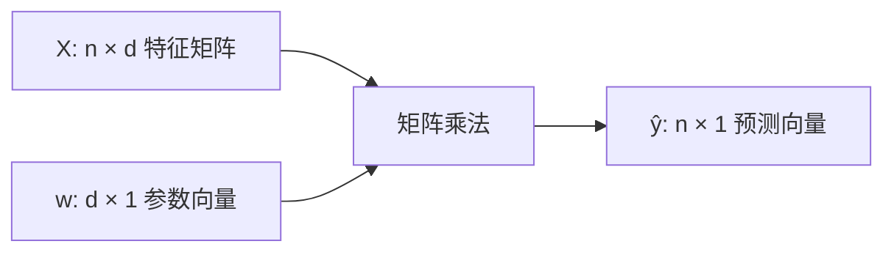
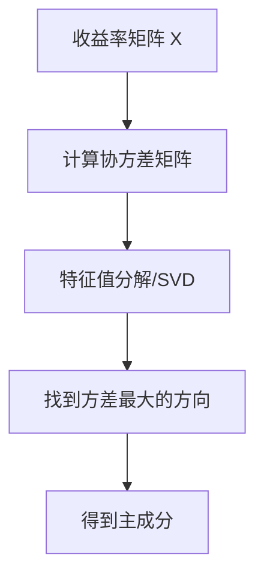

# 01 数学符号、线性代数与矩阵微积分：先把机器学习公式读顺

## 学习目标

学完这一章，你应该能做到：

- 看懂机器学习公式里常见的标量、向量、矩阵、样本下标和特征下标。
- 能读懂 $X \in \mathbb{R}^{n \times d}$、$x_i^T w$、$X^T X$、$\nabla_\theta J(\theta)$ 这类表达。
- 理解 L1/L2 范数、内积、投影、协方差矩阵、特征值/特征向量、SVD/PCA 的直觉。
- 能把线性回归、Ridge、Lasso、PCA 的关键公式逐项翻译成中文。
- 看到公式时先检查“维度是否对得上”，而不是被符号吓住。

这章解决的是公式阅读的第一道坎：**机器学习公式到底在写什么对象，以及这些对象如何相乘、求和、求导**。

## 为什么这部分对机器学习和量化重要

机器学习里的数据通常是一张表：

```text
行：样本，比如股票-月份、新闻文本、交易日
列：特征，比如估值因子、质量因子、动量因子、文本向量
目标：标签，比如未来收益、是否上涨、风险类别
```

数学上常写成：


$$
\begin{gathered}
X \in \mathbb{R}^{n \times d} \\
y \in \mathbb{R}^n \\
w \in \mathbb{R}^d
\end{gathered}
$$

含义：

- $n$：样本数。
- $d$：特征数。
- $X$：特征矩阵。
- $y$：标签向量。
- $w$：模型参数。

量化因子模型也是这样：

```text
未来收益 = 估值因子 * 权重 + 质量因子 * 权重 + 动量因子 * 权重 + 噪声
```

写成矩阵就是：


$$
y \approx Xw
$$

所以你要看懂机器学习推导，第一步不是背算法名，而是熟悉这套符号语言。

## 一、标量、向量、矩阵、张量

### 1. 四种对象

| 对象 | 常见符号 | 形状 | 量化例子 |
|---|---|---|---|
| 标量 | $x$、$\alpha$、$\lambda$ | 一个数 | 学习率、正则化强度、某只股票收益 |
| 向量 | $x$、$w$、$\beta$ | 一列或一行数 | 一只股票的一组因子、模型参数 |
| 矩阵 | $X$、$\Sigma$ | 二维表 | 多只股票的因子矩阵、协方差矩阵 |
| 张量 | $T$ | 多维数组 | 图片、批量文本 embedding、多资产多时间多特征数据 |

初学时先把标量、向量、矩阵搞熟。张量可以理解成“更高维的矩阵”。

### 2. 维度是读公式的导航仪

假设：


$$
\begin{gathered}
X \in \mathbb{R}^{n \times d} \\
w \in \mathbb{R}^d \\
y \in \mathbb{R}^n
\end{gathered}
$$

那么：


$$
Xw \in \mathbb{R}^n
$$

因为：

$$
(n \times d) \times (d \times 1) = (n \times 1)
$$

这正好表示：对 $n$ 个样本，每个样本得到一个预测值。



ASCII 版本：


$$
\begin{gathered}
X        w        \hat{y} \\
n\times d  \times  d\times 1  =   n\times 1
\end{gathered}
$$

### 3. 常见下标

| 符号 | 读法 | 含义 |
|---|---|---|
| $x_i$ | x i | 第 i 个样本 |
| $x_{ij}$ | x i j | 第 i 个样本的第 j 个特征 |
| $y_i$ | y i | 第 i 个样本的标签 |
| $w_j$ | w j | 第 j 个特征对应的参数 |
| $r_{i,t+1}$ | r i t+1 | 股票 i 在 t+1 期的收益 |
| $factor_{i,t}$ | factor i t | 股票 i 在 t 期已知的因子 |

因子模型里常见：


$$
r_{i,t+1} = \alpha_t + \beta_t factor_{i,t} + \varepsilon_{i,t+1}
$$

读法：

```text
在 t 时刻，用股票 i 当时已知的因子，解释它下一期收益。
```

## 二、求和、连乘、argmin/argmax

### 1. 求和符号 `Σ`


$$
\sum_{i=1}^n x_i
$$

读法：

```text
把 i 从 1 到 n 的所有 x_i 加起来。
```

均方误差：


$$
J(w) = 1/n \sum_{i=1}^n (y_i - x_i^T w)^2
$$

逐项翻译：

| 部分 | 含义 |
|---|---|
| $x_i^T w$ | 第 i 个样本的预测值 |
| $y_i - x_i^T w$ | 第 i 个样本的预测误差 |
| $(...)^2$ | 误差平方，避免正负抵消 |
| $\Sigma_{i=1}^n$ | 对所有样本求和 |
| $1/n$ | 求平均 |
| $J(w)$ | 参数 w 对应的损失 |

### 2. 连乘符号 `Π`


$$
\prod_{i=1}^n p_i
$$

读法：

```text
把所有 p_i 乘起来。
```

最大似然里常见：


$$
L(\theta) = \prod_{i=1}^n P(y_i | x_i; \theta)
$$

含义：

```text
在参数 θ 下，所有样本标签同时出现的概率。
```

实际推导中常取对数，把乘法变加法：


$$
\log L(\theta) = \sum_{i=1}^n \log P(y_i | x_i; \theta)
$$

### 3. `min` 和 `argmin`


$$
\min_{w} J(w)
$$

读法：

```text
让 J(w) 尽可能小。
```


$$
\arg\min_{w} J(w)
$$

读法：

```text
找到让 J(w) 最小的那个 w。
```

区别：

| 写法 | 返回什么 |
|---|---|
| $min_w J(w)$ | 最小的损失值 |
| $argmin_w J(w)$ | 使损失最小的参数 |

机器学习最常见的训练目标：


$$
\hat{w} = \arg\min_{w} J(w)
$$

意思是：训练模型就是找一组参数 $w$，让损失函数 $J(w)$ 最小。

## 三、内积：线性模型的最小积木

### 1. 内积是什么

两个向量：


$$
\begin{gathered}
x = [x_1, x_2, x_3] \\
w = [w_1, w_2, w_3]
\end{gathered}
$$

内积：


$$
x^T w = x_1 w_1 + x_2 w_2 + x_3 w_3
$$

机器学习里常见预测：


$$
\hat{y}_i = x_i^T w + b
$$

读法：第 $i$ 个样本的预测值，等于“每个特征乘以对应权重”之后加总，再加偏置。

量化例子：

```text
预测收益 = 0.3 * 估值因子 + 0.2 * 质量因子 - 0.1 * 波动率因子
```

这就是一个内积。

### 2. 内积也是相似度

如果两个向量方向接近，内积大；方向相反，内积小或为负。

这对后面的核技巧很重要：


$$
K(x_i, x_j) = \phi(x_i)^T \phi(x_j)
$$

核函数可以理解成“用某种方式计算两个样本的相似度”。

## 四、范数：误差大小和正则化惩罚

范数衡量向量有多大。

### 1. L2 范数


$$
\lVert w\rVert_2 = \sqrt{\sum_j w_j^2}
$$

平方 L2 范数：


$$
\lVert w\rVert_2^2 = \sum_j w_j^2
$$

Ridge 回归使用 L2 惩罚：


$$
\min_{w} \lVert y - Xw\rVert_2^2 + \lambda \lVert w\rVert_2^2
$$

逐项翻译：

| 部分 | 含义 |
|---|---|
| $||y - Xw||_2^2$ | 预测误差平方和 |
| $λ ||w||_2^2$ | 惩罚过大的参数 |
| $λ$ | 惩罚强度 |

直觉：

```text
Ridge 不喜欢参数太大，它会把参数往小压，但通常不会压成 0。
```

### 2. L1 范数


$$
\lVert w\rVert_1 = \sum_j |w_j|
$$

Lasso 回归使用 L1 惩罚：


$$
\min_{w} \lVert y - Xw\rVert_2^2 + \lambda \lVert w\rVert_1
$$

直觉：

```text
Lasso 不仅让参数变小，还可能把一些参数直接压成 0。
```

这对因子筛选很有用。如果你有 200 个候选因子，Lasso 可能自动筛掉一部分。

### 3. L1 与 L2 对比

| 项目 | L1 | L2 |
|---|---|---|
| 公式 | $Σ |w_j|$ | $Σ w_j^2$ |
| 对大参数 | 线性惩罚 | 平方惩罚，更强 |
| 是否产生 0 | 容易产生稀疏解 | 通常不直接为 0 |
| 典型模型 | Lasso | Ridge |
| 量化用途 | 因子筛选 | 稳定估计、缓解共线性 |

## 五、矩阵乘法：一次性处理很多样本

单个样本预测：


$$
\hat{y}_i = x_i^T w
$$

所有样本一起预测：


$$
\hat{y} = Xw
$$

这不是两个不同模型，而是同一件事的批量写法。

也就是：

- 第 1 行 $x_1^T$ 乘 $w$，得到第 1 个预测。
- 第 2 行 $x_2^T$ 乘 $w$，得到第 2 个预测。
- 第 $n$ 行 $x_n^T$ 乘 $w$，得到第 $n$ 个预测。

### 维度检查

| 对象 | 维度 | 含义 |
|---|---|---|
| $X$ | $n × d$ | n 个样本，d 个特征 |
| $w$ | $d × 1$ | d 个参数 |
| $Xw$ | $n × 1$ | n 个预测 |
| $y$ | $n × 1$ | n 个真实标签 |
| $y - Xw$ | $n × 1$ | n 个误差 |

读公式时，维度对不上，公式基本就不对。

## 六、线性回归闭式解：看懂 $X^T X$

线性回归目标：


$$
\min_{w} \lVert y - Xw\rVert_2^2
$$

在满足一定条件时，解是：


$$
\hat{w} = (X^T X)^{-1} X^T y
$$

你不必一开始完整证明，但要能翻译：

| 部分 | 维度 | 含义 |
|---|---|---|
| $X^T$ | $d × n$ | 把样本矩阵转置 |
| $X^T X$ | $d × d$ | 特征之间的关系矩阵 |
| $(X^T X)^{-1}$ | $d × d$ | 逆矩阵，要求可逆 |
| $X^T y$ | $d × 1$ | 特征与目标的关系 |
| $\hat{w}$ | $d × 1$ | 估计出来的参数 |

### 为什么 $X^T X$ 重要

$X^T X$ 反映特征之间是否高度相关。如果两个因子几乎一样，比如：

```text
价值因子 A = E/P
价值因子 B = 1/PE
```

它们可能高度共线，使 $X^T X$ 接近不可逆，参数估计不稳定。

这就是多重共线性。

### Ridge 为什么更稳定

Ridge 解：


$$
\hat{w} = (X^T X + \lambda I)^{-1} X^T y
$$

$λI$ 像给矩阵对角线上加一点稳定垫片，让求逆更稳定。

## 七、协方差矩阵：风险模型和 PCA 的入口

### 1. 协方差


$$
\operatorname{Cov}(X, Y) = E[(X - E[X])(Y - E[Y])]
$$

直觉：

- 同涨同跌：协方差为正。
- 一个涨一个跌：协方差为负。
- 没明显关系：接近 0。

### 2. 协方差矩阵

如果有 3 个资产收益：


$$
r_1, r_2, r_3
$$

协方差矩阵：


$$
\Sigma =
\begin{bmatrix}
\operatorname{Var}(r_1) & \operatorname{Cov}(r_1,r_2) & \operatorname{Cov}(r_1,r_3) \\
\operatorname{Cov}(r_2,r_1) & \operatorname{Var}(r_2) & \operatorname{Cov}(r_2,r_3) \\
\operatorname{Cov}(r_3,r_1) & \operatorname{Cov}(r_3,r_2) & \operatorname{Var}(r_3)
\end{bmatrix}
$$

组合方差：


$$
\sigma_p^2 = w^T \Sigma w
$$

逐项翻译：

| 符号 | 含义 |
|---|---|
| $w$ | 组合权重 |
| $\Sigma$ | 资产收益协方差矩阵 |
| $w^T \Sigma w$ | 组合收益方差 |

这就是组合优化、风险模型、PCA 风险因子的基础。

## 八、特征值、特征向量与 PCA

### 1. 特征值方程


$$
Av = \lambda v
$$

读法：

```text
矩阵 A 作用在向量 v 上，只改变 v 的长度，不改变方向。
```

其中：

- $v$ 是特征向量。
- $λ$ 是特征值。

### 2. PCA 的直觉

PCA 要找的是：

```text
数据变化最大的方向。
```

在资产收益里，第一主成分可能类似“市场共同波动”，第二主成分可能类似“成长-价值”或“利率敏感”方向。具体解释要看数据，不能机械命名。



### 3. PCA 公式怎么读

常见目标：


$$
\begin{gathered}
\max_{w} w^T \Sigma w \\
\text{s.t.} \lVert w\rVert_2 = 1
\end{gathered}
$$

逐项翻译：

| 部分 | 含义 |
|---|---|
| $w^T \Sigma w$ | 投影到方向 w 后的方差 |
| $\max_w$ | 找一个方向 w，让方差最大 |
| $\text{s.t.}$ | subject to，在约束条件下 |
| $\lVert w\rVert_2 = 1$ | w 的长度固定为 1，避免无限放大 |

这就是为什么 PCA 会连接到约束优化和特征值问题。

## 九、矩阵微积分：机器学习怎么对一堆参数求导

### 1. 偏导和梯度

单变量导数：

$$
\frac{df}{dx}
$$

多变量偏导：


$$
\frac{\partial J}{\partial w_j}
$$

读法：

```text
损失 J 对第 j 个参数 w_j 的偏导。
```

梯度：


$$
\nabla_w J(w) =
\begin{bmatrix}
\frac{\partial J}{\partial w_1} \\
\frac{\partial J}{\partial w_2} \\
\vdots \\
\frac{\partial J}{\partial w_d}
\end{bmatrix}
$$

读法：

```text
把损失函数对所有参数的偏导数合成一个向量。
```

### 2. 梯度方向

梯度指向函数上升最快的方向。要最小化损失，就沿反方向走：


$$
w_{t+1} = w_t - \eta \nabla J(w_t)
$$

其中：

- $w_t$：第 t 轮参数。
- $η$：学习率。
- $\nabla J(w_t)$：当前梯度。
- 减号：往损失下降方向走。

### 3. 线性回归损失的梯度

损失：


$$
J(w) = 1/n \lVert y - Xw\rVert_2^2
$$

梯度：


$$
\nabla_w J(w) = -2/n X^T (y - Xw)
$$

维度检查：

| 对象 | 维度 |
|---|---|
| $y - Xw$ | $n × 1$ |
| $X^T$ | $d × n$ |
| $X^T(y - Xw)$ | $d × 1$ |
| $\nabla_w J(w)$ | $d × 1$ |

梯度的维度和参数 $w$ 一样，因为你要知道每个参数该怎么更新。

### 4. 链式法则

神经网络反向传播的核心就是链式法则。

简单链条：


$$
w \to z \to \hat{y} \to L
$$

例如：


$$
\begin{gathered}
z = x^T w \\
\hat{y} = \operatorname{sigmoid}(z) \\
L = loss(\hat{y}, y)
\end{gathered}
$$

那么：


$$
\frac{\partial L}{\partial w} = \frac{\partial L}{\partial \hat{y}} \cdot \frac{\partial \hat{y}}{\partial z} \cdot \frac{\partial z}{\partial w}
$$

读法：

```text
w 通过 z 影响 ŷ，ŷ 再影响损失 L，所以求 L 对 w 的影响，要把中间每一步影响乘起来。
```

## 十、公式逐项翻译示范

### 1. Ridge


$$
\hat{w} = \arg\min_{w} { 1/n \sum_i (y_i - x_i^T w)^2 + \lambda \lVert w\rVert_2^2 }
$$

翻译：

```text
找一组参数 w，
让平均预测误差平方尽可能小，
同时惩罚过大的参数，
惩罚强度由 λ 控制。
```

### 2. Lasso


$$
\hat{w} = \arg\min_{w} { 1/n \sum_i (y_i - x_i^T w)^2 + \lambda \lVert w\rVert_1 }
$$

翻译：

```text
找一组参数 w，
既要拟合数据，
又要让参数绝对值之和尽可能小。
这会让部分参数变成 0，因此可用于特征/因子筛选。
```

### 3. PCA


$$
\begin{gathered}
w_1 = \arg\max_{w} w^T \Sigma w \\
\text{s.t.} \lVert w\rVert_2 = 1
\end{gathered}
$$

翻译：

```text
找一个长度为 1 的方向 w，
让数据投影到这个方向后的方差最大。
这个方向就是第一主成分方向。
```

## 十一、典型算法连接

| 数学概念 | 连接的算法 | 你要看懂什么 |
|---|---|---|
| 内积 $x^T w$ | 线性回归、逻辑回归、SVM | 线性打分 |
| L2 范数 | Ridge、权重衰减 | 参数不要太大 |
| L1 范数 | Lasso | 稀疏、变量筛选 |
| 协方差矩阵 | 风险模型、PCA | 变量共同波动 |
| 特征值/特征向量 | PCA | 最大方差方向 |
| 梯度 | 几乎所有可微模型 | 参数更新方向 |
| 链式法则 | 神经网络 | 反向传播 |
| 矩阵乘法 | 深度学习 | 批量计算 |

## 十二、常见误解与陷阱

| 误解 | 更准确的理解 |
|---|---|
| 公式越复杂，模型越高级 | 复杂公式也可能只是简单操作的批量写法 |
| $Xw$ 很抽象 | 它就是对每个样本做一次线性加权 |
| L1/L2 只是数学符号 | 它们决定正则化行为和参数形态 |
| 梯度就是导数 | 梯度是多参数函数所有偏导组成的向量 |
| PCA 主成分一定有明确经济含义 | 主成分是数学方向，经济解释需要额外验证 |
| 维度不用管 | 维度是检查公式是否合理的第一工具 |
| 闭式解一定最好 | 大规模或病态问题中，数值稳定性更重要 |

## 十三、读公式练习

### 练习 1：判断维度

已知：


$$
\begin{gathered}
X \in \mathbb{R}^{1000 \times 20} \\
w \in \mathbb{R}^{20} \\
y \in \mathbb{R}^{1000}
\end{gathered}
$$

回答：

- $Xw$ 的维度是什么？
- $y - Xw$ 的维度是什么？
- $X^T X$ 的维度是什么？
- $X^T y$ 的维度是什么？

### 练习 2：翻译 Ridge

把下面公式逐项翻译成中文：


$$
\min_{w} \lVert y - Xw\rVert_2^2 + \lambda \lVert w\rVert_2^2
$$

要求说明：

- 哪一项是拟合误差？
- 哪一项是正则化？
- $λ$ 增大时，参数会怎样？

### 练习 3：Lasso 因子筛选

假设你有 100 个候选因子。为什么 Lasso 比普通线性回归更适合做初步筛选？请用 L1 范数的性质解释。

### 练习 4：PCA 直觉

用自己的话解释：


$$
\max_{w} w^T \Sigma w, \text{s.t.} \lVert w\rVert_2 = 1
$$

为什么要加 $||w||_2 = 1$ 这个约束？

## 十四、自检清单

- [ ] 我能区分标量、向量、矩阵、张量。
- [ ] 我知道 $X \in \mathbb{R}^{n \times d}$ 表示 n 个样本、d 个特征。
- [ ] 我能解释 $x_i^T w$ 是单个样本的线性预测。
- [ ] 我能解释 $Xw$ 是所有样本的批量预测。
- [ ] 我知道 `Σ` 是求和，`Π` 是连乘。
- [ ] 我知道 `argmin` 返回最优参数，而不是最小值。
- [ ] 我能区分 L1 和 L2 范数。
- [ ] 我能解释 Ridge 和 Lasso 的正则化差异。
- [ ] 我知道 $X^T X$ 反映特征之间的关系。
- [ ] 我能解释协方差矩阵和组合方差 $w^TΣw$。
- [ ] 我能说出 PCA 是找最大方差方向。
- [ ] 我知道梯度和参数维度一致。
- [ ] 我能用链式法则理解反向传播的基本结构。

## 十五、术语表

| 术语 | 解释 |
|---|---|
| 标量 | 一个数字 |
| 向量 | 一组有顺序的数字 |
| 矩阵 | 二维数字表 |
| 张量 | 多维数组 |
| 维度 | 数学对象的形状 |
| 内积 | 两个向量对应元素相乘后求和 |
| 转置 | 行列互换 |
| 逆矩阵 | 矩阵乘法意义下的倒数 |
| 范数 | 衡量向量大小的函数 |
| L1 范数 | 绝对值之和 |
| L2 范数 | 平方和开根号 |
| 协方差矩阵 | 描述多个变量共同波动的矩阵 |
| 特征值 | 矩阵在某个特征方向上的伸缩倍数 |
| 特征向量 | 被矩阵作用后方向不变的向量 |
| SVD | 奇异值分解，常用于降维和数值计算 |
| PCA | 主成分分析，寻找最大方差方向 |
| 梯度 | 多变量函数所有偏导数组成的向量 |
| 链式法则 | 复合函数求导规则 |

## 十六、延伸阅读

- 线性代数：重点看矩阵乘法、投影、特征值、SVD。
- 矩阵微积分：先掌握维度检查、梯度、链式法则，不必一开始背完整公式表。
- ESL 前几章：重点看线性回归、Ridge、Lasso、PCA。
- 量化连接：用线性回归理解多因子模型，用 PCA 理解统计风险因子。
