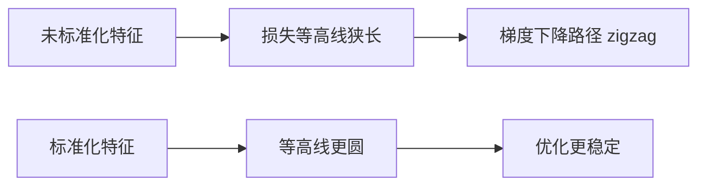
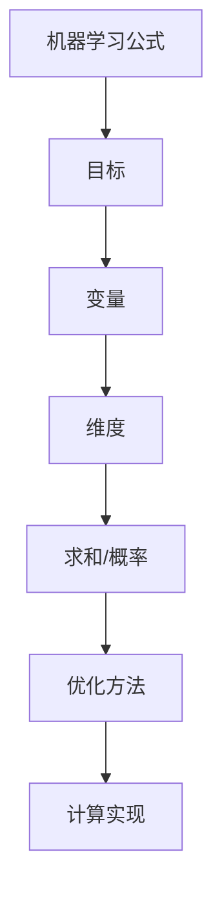

# 03 数值计算与经典算法推导地图：公式最后如何变成可运行算法

## 学习目标

学完这一章，你应该能做到：

- 理解为什么很多机器学习模型没有闭式解，需要迭代优化。
- 知道浮点数误差、数值稳定性、矩阵病态、条件数为什么会影响模型训练。
- 理解梯度下降、牛顿法、拟牛顿、坐标下降、矩阵分解在算法求解中的角色。
- 能用“七步法”阅读机器学习推导：目标、变量、维度、求和、概率假设、优化方法、计算实现。
- 能把线性回归、逻辑回归、Ridge/Lasso、PCA、SVM、K-means、决策树、GBDT、神经网络、Transformer 的公式放到对应数学模块中。

前两章解决“公式怎么读”和“公式在优化什么”。这一章解决最后一块：

> 这些公式到底如何在计算机里被稳定地算出来？

## 为什么这部分对机器学习和量化重要

金融工程学生经常会觉得：

```text
理论公式看起来对，但代码跑出来不稳定。
```

原因可能不是理论错，而是数值计算问题：

- 特征高度共线，$X^T X$ 接近不可逆。
- 因子尺度差异太大，优化器训练困难。
- 学习率太大，损失震荡。
- 概率太接近 0，`log(0)` 崩掉。
- 协方差矩阵估计不稳定，组合权重极端。
- 神经网络梯度消失或爆炸。

中低频量化里尤其常见：

- 候选因子很多，样本并不多。
- 因子之间相关性高。
- 收益噪声大。
- 协方差矩阵估计误差会被组合优化放大。

所以你不仅要看懂数学公式，还要知道公式在计算机实现时会遇到什么问题。

## 一、闭式解与迭代解

### 1. 闭式解是什么

闭式解就是可以用有限个明确公式直接写出答案。

线性回归在一定条件下有闭式解：


$$
\hat{w} = (X^T X)^{-1} X^T y
$$

看起来很漂亮，但有前提：

- $X^T X$ 可逆。
- 数据规模不太大。
- 数值条件不能太差。

### 2. 迭代解是什么

很多模型没有简单闭式解，只能从一个初始参数开始，不断更新：


$$
\theta_0 \to \theta_1 \to \theta_2 \to ... \to \theta_T
$$

典型更新：


$$
\theta_{t+1} = \theta_t - \eta \nabla J(\theta_t)
$$

### 3. 为什么很多 ML 模型没有闭式解

| 原因 | 例子 |
|---|---|
| 损失函数复杂 | 神经网络 |
| 有不可导部分 | Lasso 的 L1 在 0 点不可导 |
| 有约束 | SVM、组合优化 |
| 数据规模巨大 | 深度学习、大规模文本 |
| 模型非线性 | 逻辑回归、神经网络、GBDT |

所以 DeepSeek 说“不必过度纠结解析解”是对的。你要重点理解：

```text
目标函数是什么？
参数如何更新？
为什么这个更新能降低损失？
什么时候会不稳定？
```

## 二、浮点数与数值误差

### 1. 计算机不是精确实数

数学里实数无限精确，计算机里通常用浮点数近似。

例如：

```text
0.1 + 0.2
```

在计算机中可能不是精确的 `0.3`，而是接近 `0.30000000000000004`。

这不是 Python 特有问题，而是浮点表示的普遍现象。

### 2. 机器学习里的影响

| 场景 | 风险 |
|---|---|
| 很小概率取 log | `log(0)` 或数值溢出 |
| 大矩阵求逆 | 舍入误差被放大 |
| 梯度连乘 | 梯度消失或爆炸 |
| 特征尺度差异大 | 优化路径很差 |
| 协方差矩阵估计 | 小误差导致组合权重极端 |

### 3. 稳定写法的直觉

不稳定：


$$
\log(\exp(a) + \exp(b))
$$

如果 $a$ 或 $b$ 很大，`exp` 可能溢出。

稳定思想：

```text
先减去最大值，再计算。
```

这就是很多库里 `logsumexp` 技巧的来源。

你不必一开始手写这些函数，但要知道：库函数比直接翻译公式更稳定。

## 三、矩阵病态与条件数

### 1. 什么是病态矩阵

如果矩阵接近不可逆，小的数据误差会导致解发生巨大变化，这叫病态。

在线性回归中：


$$
\hat{w} = (X^T X)^{-1} X^T y
$$

如果 $X^T X$ 病态，参数会很不稳定。

量化例子：

```text
因子 A = 估值因子
因子 B = 估值因子的轻微变形
因子 C = 与 A 高度相关
```

这些因子放进同一个回归，参数可能乱跳。

### 2. 条件数

条件数衡量一个问题对输入误差有多敏感。

直觉：

```text
条件数大 -> 小误差会被放大 -> 数值不稳定
条件数小 -> 解更稳定
```

### 3. 解决思路

| 问题 | 方法 |
|---|---|
| 特征共线 | 删除冗余特征、PCA、Ridge |
| 尺度差异 | 标准化 |
| 协方差矩阵不稳 | shrinkage、因子模型、约束优化 |
| 直接求逆不稳 | 用矩阵分解或优化算法 |

经验：

```text
少直接求逆，多用稳定求解。
```

数学写 $(X^T X)^{-1}$，代码里通常不建议真的手动求逆。

## 四、特征缩放为什么重要

假设两个特征：

```text
市值：几十亿到几万亿
ROE：-0.5 到 0.5
```

它们尺度差异巨大。梯度下降会在不同方向上“步子不协调”。



常见标准化：


$$
z = (x - mean) / std
$$

量化因子里，常做：

- 去极值。
- 标准化。
- 行业中性。
- 市值中性。

这不仅是统计处理，也是数值计算处理。

## 五、常见迭代优化方法

### 1. 梯度下降


$$
\theta_{t+1} = \theta_t - \eta \nabla J(\theta_t)
$$

优点：

- 简单。
- 通用。
- 易扩展到大模型。

缺点：

- 学习率敏感。
- 可能收敛慢。
- 非凸问题可能陷入局部区域。

### 2. 牛顿法

牛顿法使用二阶信息：


$$
\theta_{t+1} = \theta_t - H^{-1} \nabla J(\theta_t)
$$

其中 $H$ 是 Hessian 矩阵。

直觉：

```text
梯度告诉你往哪走；
Hessian 告诉你地形弯曲程度。
```

优点：

- 接近最优点时收敛快。

缺点：

- Hessian 计算和求逆成本高。
- 大模型中不现实。

### 3. 拟牛顿

拟牛顿方法不直接计算完整 Hessian，而是近似它。常见：

- BFGS。
- L-BFGS。

逻辑回归、小中型凸优化问题常见。

### 4. 坐标下降

坐标下降每次只优化一个参数或一组参数。

Lasso 常用坐标下降，因为 L1 不光滑，但沿单个坐标更新更方便。

```text
固定其他参数
只更新 w_1
再更新 w_2
...
循环直到收敛
```

### 5. 选择表

| 方法 | 适合问题 |
|---|---|
| 梯度下降/SGD | 大规模可微模型、神经网络 |
| 牛顿法 | 小规模、二阶信息可得问题 |
| L-BFGS | 中等规模平滑凸优化 |
| 坐标下降 | Lasso、稀疏模型 |
| 专用求解器 | SVM、组合优化、二次规划 |

## 六、矩阵分解：别总想着直接求逆

### 1. QR 分解

可用于更稳定地解最小二乘问题。

### 2. 特征值分解

对称矩阵如协方差矩阵常用：


$$
\Sigma = Q \Lambda Q^T
$$

用于 PCA、风险分解。

### 3. SVD


$$
X = U \Sigma V^T
$$

SVD 很重要，因为它：

- 比直接求逆更稳定。
- 可用于 PCA。
- 可用于降维。
- 可用于推荐系统和低秩近似。

### 4. 量化中的矩阵分解

| 场景 | 分解用途 |
|---|---|
| PCA 风险模型 | 提取共同风险方向 |
| 协方差矩阵稳定化 | 降维、去噪 |
| 因子冗余识别 | 看主成分解释比例 |
| 组合优化 | 降低协方差估计误差 |

## 七、梯度消失与梯度爆炸

神经网络中，反向传播会连续乘很多导数。


$$
\frac{\partial L}{\partial w} = \frac{\partial L}{\partial h_k} \cdot \frac{\partial h_k}{\partial h_{k-1}} \cdot ... \cdot \frac{\partial h_1}{\partial w}
$$

如果很多项都小于 1：

```text
0.5 × 0.5 × 0.5 × ... -> 趋近 0
```

梯度消失。

如果很多项都大于 1：

```text
2 × 2 × 2 × ... -> 很大
```

梯度爆炸。

解决思路包括：

- 合理初始化。
- 标准化。
- 残差连接。
- 梯度裁剪。
- 使用 ReLU 等激活。

你不必马上深入神经网络，但要知道深度学习训练不只是“套公式”，数值稳定性非常关键。

## 八、看公式推导的七步法

遇到机器学习公式，按这个顺序拆：

```text
1. 看目标：它在预测、估计、分类、降维，还是优化组合？
2. 看变量：哪些是数据，哪些是参数，哪些是超参数？
3. 看维度：标量、向量、矩阵能不能乘起来？
4. 看求和：是在对样本求和，还是对特征/类别/时间求和？
5. 看概率假设：是否来自 MLE/MAP？
6. 看优化方法：有闭式解，还是要迭代？
7. 看计算实现：会不会有数值稳定、尺度、矩阵病态问题？
```



## 九、经典算法推导地图

### 1. 线性回归

核心目标：


$$
\min_{w} \lVert y - Xw\rVert_2^2
$$

数学模块：

- 矩阵乘法。
- L2 范数。
- OLS。
- 矩阵求导。
- 正态误差下的 MLE。

你要看懂：

```text
为什么平方误差？
为什么能有闭式解？
为什么共线性会导致不稳定？
```

### 2. Ridge / Lasso

Ridge：


$$
\min_{w} \lVert y - Xw\rVert_2^2 + \lambda \lVert w\rVert_2^2
$$

Lasso：


$$
\min_{w} \lVert y - Xw\rVert_2^2 + \lambda \lVert w\rVert_1
$$

数学模块：

- 范数。
- 正则化。
- MAP。
- 凸优化。
- 坐标下降。

量化连接：

- Ridge 稳定多因子回归。
- Lasso 初步筛选候选因子。

### 3. 逻辑回归

模型：


$$
p_i = \operatorname{sigmoid}(x_i^T w)
$$

损失：


$$
L = -\sum_i [ y_i \log p_i + (1-y_i)\log(1-p_i) ]
$$

数学模块：

- 内积。
- sigmoid。
- 伯努利似然。
- 交叉熵。
- 梯度下降。

你要看懂：

```text
逻辑回归不是普通回归预测 0/1，
而是在估计类别概率。
```

### 4. PCA

目标：


$$
\begin{gathered}
\max_{w} w^T \Sigma w \\
\text{s.t.} \lVert w\rVert_2 = 1
\end{gathered}
$$

数学模块：

- 协方差矩阵。
- 约束优化。
- 拉格朗日乘子。
- 特征值/特征向量。
- SVD。

量化连接：

- 提取统计风险因子。
- 降低因子维度。
- 分析收益共同波动。

### 5. SVM

核心思想：

```text
最大化分类间隔
```

典型软间隔形式：


$$
\begin{gathered}
\min_{w,b,\xi} \frac{1}{2}\lVert w\rVert_2^2 + C\sum_i \xi_i \\
\text{s.t.} y_i(w^T x_i+b) \ge 1 - \xi_i \\
\xi_i \ge 0
\end{gathered}
$$

数学模块：

- 几何间隔。
- L2 范数。
- 约束优化。
- KKT。
- 对偶问题。
- 核技巧。

你要看懂：

```text
SVM 不是只找能分类的线，
而是找间隔最大的分类边界。
```

### 6. K-means

目标：


$$
\min_{C, \mu} \sum_i \lVert x_i - \mu_{c_i}\rVert_2^2
$$

翻译：

```text
把每个样本分到某个簇，
让样本到所属簇中心的距离平方和最小。
```

数学模块：

- L2 距离。
- 迭代优化。
- 非凸优化。

量化连接：

- 股票聚类。
- 因子风格聚类。
- 市场状态聚类。

### 7. 决策树

分裂标准：


$$
\text{Information Gain} = H(\text{parent}) - \text{weighted average } H(\text{children})
$$

或 Gini：


$$
\operatorname{Gini} = 1 - \sum_k p_k^2
$$

数学模块：

- 熵。
- 信息增益。
- Gini。
- 贪心算法。

你要看懂：

```text
树每一步都选一个能让节点更纯的分裂。
```

### 8. GBDT / XGBoost

核心思想：

```text
后一棵树拟合前面模型的误差方向。
```

XGBoost 推导常见：

- 损失函数。
- 梯度。
- Hessian。
- 泰勒二阶展开。
- 正则化。

你看到二阶泰勒展开：


$$
L(y, \hat{y} + f) \approx L(y, \hat{y}) + g f + \frac{1}{2} h f^2
$$

读法：

```text
用当前点的一阶梯度 g 和二阶曲率 h 近似新模型加入后的损失变化。
```

### 9. 神经网络

一层：


$$
h = \sigma(Wx + b)
$$

多层：


$$
x \to h_1 \to h_2 \to ... \to \hat{y} \to L
$$

数学模块：

- 矩阵乘法。
- 非线性激活。
- 链式法则。
- 梯度下降。
- 数值稳定。

你要看懂：

```text
神经网络就是很多线性变换 + 非线性变换的复合函数。
训练靠链式法则反向传播梯度。
```

### 10. Transformer 基础公式

注意力：


$$
\operatorname{Attention}(Q,K,V)=\operatorname{softmax}(QK^T / \sqrt{d_k})V
$$

逐项翻译：

| 部分 | 含义 |
|---|---|
| $Q$ | Query，查询向量矩阵 |
| $K$ | Key，键向量矩阵 |
| $V$ | Value，值向量矩阵 |
| $QK^T$ | token 两两相似度 |
| $/sqrt(d_k)$ | 缩放，避免内积过大 |
| `softmax` | 转成权重 |
| `softmax(...)V` | 用权重加权 Value |

数学模块：

- 矩阵乘法。
- 内积相似度。
- softmax。
- 数值稳定。
- 梯度下降。

你现在不必完整推导 Transformer，但这个公式的主干一定要读懂。

## 十、量化场景里的数值计算警报

| 现象 | 可能数学/数值原因 | 处理思路 |
|---|---|---|
| 回归系数巨大且不稳定 | 因子共线、矩阵病态 | Ridge、删因子、PCA |
| 组合权重极端 | 协方差矩阵估计误差 | shrinkage、权重约束 |
| 因子回测好但样本外差 | 过拟合、数据泄露 | 交叉验证、样本外检验 |
| 优化器不收敛 | 学习率、尺度、非凸 | 标准化、调学习率 |
| 分类损失 NaN | `log(0)`、溢出 | 使用稳定库函数、clip 概率 |
| 神经网络训练很慢 | 梯度问题或尺度问题 | 标准化、改优化器、初始化 |

## 十一、常见误解与陷阱

| 误解 | 更准确的理解 |
|---|---|
| 数学公式有闭式解，代码就应该直接照写 | 代码更关注数值稳定性，不一定直接求逆 |
| 训练失败就是模型不好 | 可能只是尺度、学习率或数值问题 |
| PCA 只是线性代数题 | 它也是风险建模和降维工具 |
| SVD 太理论 | 它是稳定计算和降维的重要工具 |
| 神经网络公式只是矩阵乘法 | 还要关注梯度和数值稳定 |
| 回测结果不稳定一定是市场变了 | 也可能是因子共线、估计误差、过拟合 |
| 优化器越复杂越好 | 简单问题用简单方法更稳 |

## 十二、读公式练习

### 练习 1：闭式解 vs 迭代解

解释下面两种写法的区别：


$$
\hat{w} = (X^T X)^{-1} X^T y
$$


$$
w_{t+1}=w_t-\eta \nabla J(w_t)
$$

分别适合什么场景？

### 练习 2：判断数值风险

如果你有 50 个因子，其中很多因子相关系数超过 0.95。用普通 OLS 做回归可能出现什么问题？可以怎么处理？

### 练习 3：读 Transformer 注意力公式

翻译：


$$
\operatorname{Attention}(Q,K,V)=\operatorname{softmax}(QK^T/\sqrt{d_k})V
$$

要求说明：

- $QK^T$ 在算什么？
- 为什么要除以 `sqrt(d_k)`？
- softmax 的作用是什么？
- 最后乘 $V$ 得到什么？

### 练习 4：XGBoost 二阶近似

用自己的话解释：


$$
L(y, \hat{y} + f) \approx L(y, \hat{y}) + gf + \frac{1}{2}hf^2
$$

其中 $g$ 和 $h$ 分别代表什么？

### 练习 5：组合优化警报

为什么协方差矩阵估计误差会导致组合权重极端？尝试用“优化器会利用估计误差”这句话解释。

## 十三、自检清单

- [ ] 我能区分闭式解和迭代解。
- [ ] 我知道为什么很多 ML 模型没有闭式解。
- [ ] 我知道浮点数不是精确实数。
- [ ] 我能解释矩阵病态和共线性的关系。
- [ ] 我知道条件数大意味着数值敏感。
- [ ] 我知道为什么特征标准化有助于优化。
- [ ] 我能说出梯度下降、牛顿法、坐标下降的大致区别。
- [ ] 我知道为什么代码里不建议直接手动求逆。
- [ ] 我能解释 SVD 和 PCA 的关系。
- [ ] 我知道梯度消失和梯度爆炸的直觉。
- [ ] 我能用七步法拆一个 ML 公式。
- [ ] 我能把常见算法对应到它背后的数学模块。

## 十四、术语表

| 术语 | 解释 |
|---|---|
| 闭式解 | 可以直接用有限公式表达的解 |
| 迭代解 | 通过多轮更新逐步逼近的解 |
| 浮点数 | 计算机对实数的近似表示 |
| 数值稳定性 | 计算过程对误差不敏感的性质 |
| 病态矩阵 | 小误差会导致解巨大变化的矩阵 |
| 条件数 | 衡量问题数值敏感性的指标 |
| 标准化 | 减均值除以标准差等尺度处理 |
| Hessian | 二阶偏导数组成的矩阵 |
| 牛顿法 | 使用梯度和 Hessian 的二阶优化方法 |
| 拟牛顿 | 用近似 Hessian 信息优化的方法 |
| 坐标下降 | 每次沿一个参数方向优化的方法 |
| QR 分解 | 一种矩阵分解，可稳定解最小二乘 |
| 特征值分解 | 把矩阵分解为特征向量和特征值 |
| SVD | 奇异值分解，稳定且通用的矩阵分解 |
| 梯度消失 | 梯度在反向传播中趋近 0 |
| 梯度爆炸 | 梯度在反向传播中过大 |
| softmax | 把一组分数转成概率权重的函数 |
| logsumexp | 稳定计算 log 求和指数的技巧 |

## 十五、延伸阅读

- 数值线性代数：重点看矩阵求解、条件数、SVD，不必一开始追求证明。
- 优化方法：重点理解梯度下降、牛顿法、坐标下降、约束优化。
- ESL：把线性模型、正则化、PCA、分类模型和数学推导连接起来。
- 深度学习基础：重点看反向传播、初始化、归一化、优化器。
- 量化实践：重点观察因子共线、协方差估计、组合优化稳定性。
