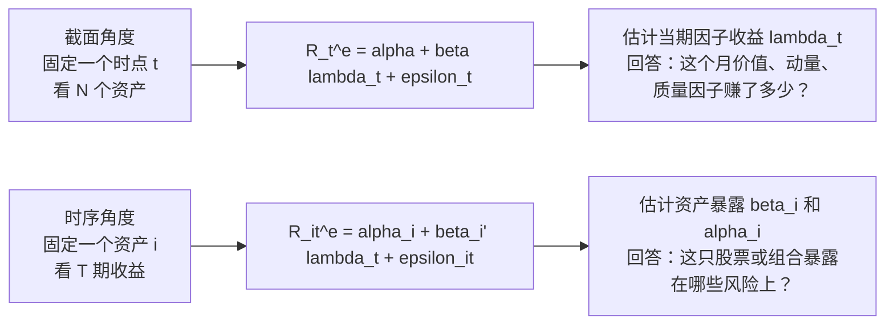
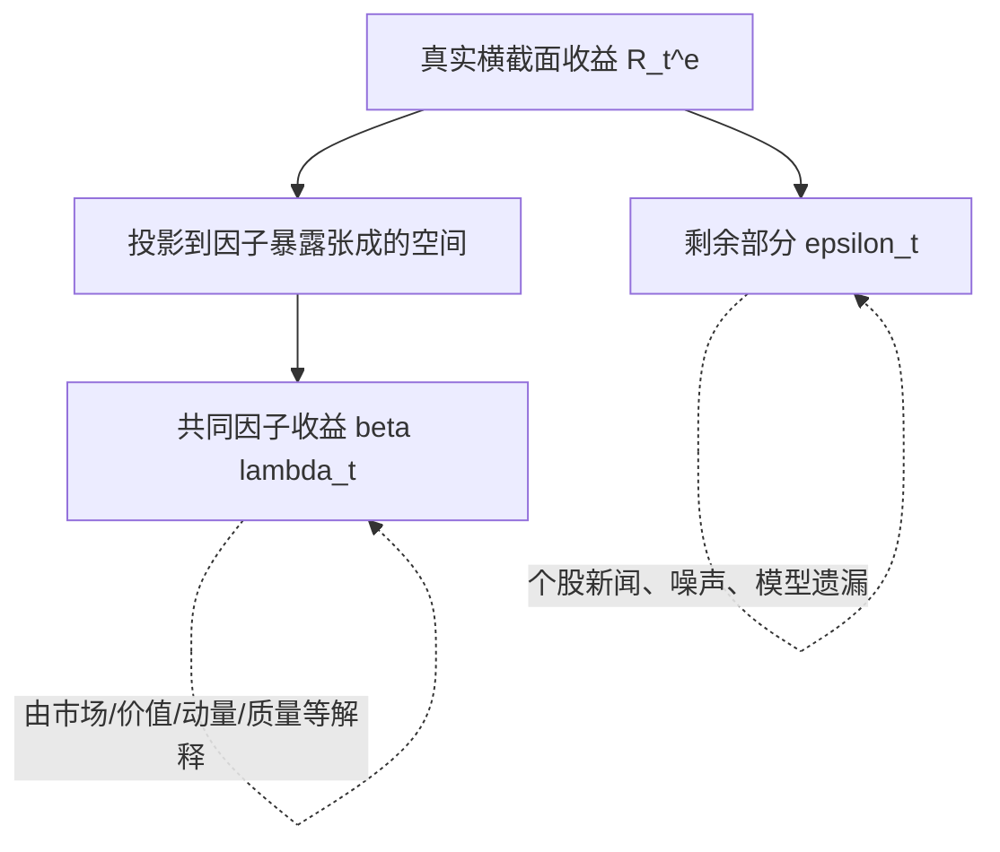
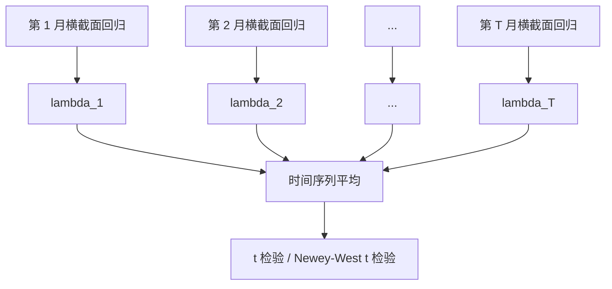
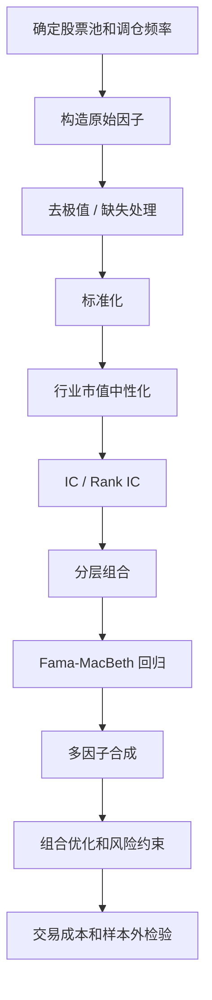
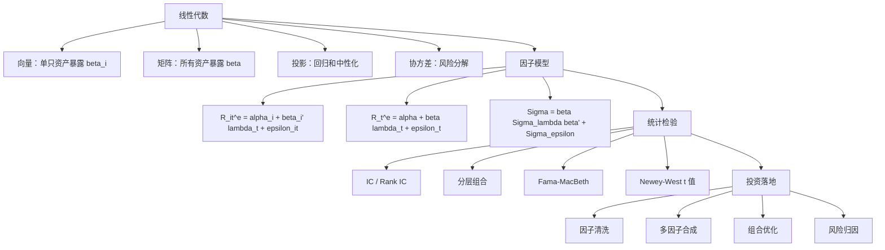

# 因子模型专题：从线性代数到中低频量化

> 目标：把因子模型掰开揉碎。本文专门对照《因子投资方法与实践》中的符号，先讲清楚“一个资产、一个时点、一组资产、一段时间”分别怎么写，再用线性代数解释截面回归、时序回归、协方差分解、Fama-MacBeth 和中低频选股因子研究流程。

## 0. 先把 PDF 符号和本文符号对应起来

你截图中的核心公式有三类。

第一类是截面角度：

$$
E[R_i^e]=\alpha_i+\beta_i'\lambda
$$

第二类是沿时间轴展开：

$$
R_{i1}^e=\alpha_i+\beta_i'\lambda_1+\varepsilon_{i1}
$$

$$
R_{i2}^e=\alpha_i+\beta_i'\lambda_2+\varepsilon_{i2}
$$

$$
\cdots
$$

$$
R_{iT}^e=\alpha_i+\beta_i'\lambda_T+\varepsilon_{iT}
$$

第三类是把 \(N\) 个资产放在一起的向量形式：

$$
R_t^e=\alpha+\beta\lambda_t+\varepsilon_t
$$

并由此得到协方差分解：

$$
\Sigma=\beta\Sigma_{\lambda}\beta'+\Sigma_{\varepsilon}
$$

### 0.1 符号对照表

> 说明：很多 Markdown 阅读器不渲染表格中的 LaTeX。为了方便查阅，本节不用表格内公式，而是把每个符号单独列成“公式块 + 维度 + 含义”。

#### 资产 i 的超额收益

PDF 符号：

$$
R_i^e
$$

本文常用写法：

$$
r_i^e
$$

维度：标量。

含义：资产 \(i\) 的超额收益。

#### 资产 i 在 t 期的超额收益

PDF 符号：

$$
R_{it}^e
$$

本文常用写法：

$$
r_{i,t}^e
$$

维度：标量。

含义：资产 \(i\) 在 \(t\) 期的超额收益。

#### 第 t 期所有资产的超额收益向量

PDF 符号：

$$
R_t^e
$$

本文常用写法：

$$
r_t^e
$$

维度：

$$
N\times 1
$$

含义：第 \(t\) 期所有资产的超额收益向量。

#### 资产 i 的 Alpha

PDF 符号和本文写法：

$$
\alpha_i
$$

维度：标量。

含义：资产 \(i\) 的定价误差或异常收益。

#### 所有资产的 Alpha 向量

PDF 符号和本文写法：

$$
\alpha
$$

维度：

$$
N\times 1
$$

含义：所有资产的 Alpha 向量。

#### 资产 i 的因子暴露列向量

PDF 符号和本文写法：

$$
\beta_i
$$

维度：

$$
K\times 1
$$

含义：资产 \(i\) 对 \(K\) 个因子的暴露。

#### 资产 i 的因子暴露行向量

PDF 符号和本文写法：

$$
\beta_i'
$$

维度：

$$
1\times K
$$

含义：资产 \(i\) 的暴露行向量，用来和 \(\lambda_t\) 做内积。

#### 所有资产的因子暴露矩阵

PDF 符号：

$$
\beta
$$

本文有时也写作：

$$
B
$$

维度：

$$
N\times K
$$

含义：所有资产对所有因子的暴露矩阵。每一行对应一只资产，每一列对应一个因子。

#### 因子预期收益或风险溢价

PDF 符号和本文写法：

$$
\lambda
$$

维度：

$$
K\times 1
$$

含义：因子预期收益，也常被叫作因子风险溢价。

#### 第 t 期因子实现收益

PDF 符号：

$$
\lambda_t
$$

本文有时也写作：

$$
f_t
$$

维度：

$$
K\times 1
$$

含义：第 \(t\) 期每个因子的实际收益。

#### 资产 i 在 t 期的特异收益

PDF 符号：

$$
\varepsilon_{it}
$$

本文常用写法：

$$
\epsilon_{i,t}
$$

维度：标量。

含义：资产 \(i\) 在 \(t\) 期不能被共同因子解释的收益。

#### 第 t 期所有资产的特异收益向量

PDF 符号：

$$
\varepsilon_t
$$

本文常用写法：

$$
\epsilon_t
$$

维度：

$$
N\times 1
$$

含义：第 \(t\) 期所有资产的特异收益向量。

#### 资产收益协方差矩阵

PDF 符号：

$$
\Sigma
$$

本文有时写作：

$$
\Sigma_r
$$

维度：

$$
N\times N
$$

含义：所有资产收益之间的协方差矩阵。

#### 因子收益协方差矩阵

PDF 符号：

$$
\Sigma_{\lambda}
$$

本文有时写作：

$$
\Sigma_f
$$

维度：

$$
K\times K
$$

含义：所有因子收益之间的协方差矩阵。

#### 特异收益协方差矩阵

PDF 符号：

$$
\Sigma_{\varepsilon}
$$

本文有时写作：

$$
\Sigma_{\epsilon}
$$

维度：

$$
N\times N
$$

含义：所有资产特异收益之间的协方差矩阵。

本文为了便于和 PDF 对照，会尽量保留 PDF 的写法：用 \(\beta\) 表示暴露矩阵，用 \(\lambda_t\) 表示因子第 \(t\) 期实现收益。

## 1. 因子模型到底在说什么

因子模型的核心想法很朴素：

> 一只资产的收益，可以拆成“共同因素带来的收益”和“自己独有的收益”。

对一只资产 \(i\)，写成：

$$
R_{it}^e=\alpha_i+\beta_i'\lambda_t+\varepsilon_{it}
$$

逐项解释：

- \(R_{it}^e\)：资产 \(i\) 在 \(t\) 期的超额收益，通常是资产收益减去无风险收益。
- \(\alpha_i\)：模型解释不了但长期平均存在的收益，也叫定价误差。
- \(\beta_i'\lambda_t\)：共同因子贡献的收益。
- \(\varepsilon_{it}\)：资产自己的特异扰动。

如果有 \(K\) 个因子：

$$
\beta_i=
\begin{bmatrix}
\beta_{i1}\\
\beta_{i2}\\
\vdots\\
\beta_{iK}
\end{bmatrix},
\qquad
\lambda_t=
\begin{bmatrix}
\lambda_{1t}\\
\lambda_{2t}\\
\vdots\\
\lambda_{Kt}
\end{bmatrix}
$$

那么：

$$
\beta_i'\lambda_t
=
\begin{bmatrix}
\beta_{i1} & \beta_{i2} & \cdots & \beta_{iK}
\end{bmatrix}
\begin{bmatrix}
\lambda_{1t}\\
\lambda_{2t}\\
\vdots\\
\lambda_{Kt}
\end{bmatrix}
=
\sum_{k=1}^{K}\beta_{ik}\lambda_{kt}
$$

也就是说：

$$
R_{it}^e
=
\alpha_i
+\beta_{i1}\lambda_{1t}
+\beta_{i2}\lambda_{2t}
+\cdots
+\beta_{iK}\lambda_{Kt}
+\varepsilon_{it}
$$

这就是因子模型最基本的展开。

### 1.1 一个小例子

假设只有 3 个因子：

- 市场因子 \(MKT\)
- 价值因子 \(VALUE\)
- 动量因子 \(MOM\)

某股票 \(i\) 的暴露为：

$$
\beta_i=
\begin{bmatrix}
1.10\\
0.60\\
-0.20
\end{bmatrix}
$$

某个月三个因子收益为：

$$
\lambda_t=
\begin{bmatrix}
2.0\%\\
1.0\%\\
-0.5\%
\end{bmatrix}
$$

共同因子贡献为：

$$
\beta_i'\lambda_t
=1.10\times2.0\%+0.60\times1.0\%+(-0.20)\times(-0.5\%)
$$

$$
=2.2\%+0.6\%+0.1\%=2.9\%
$$

如果该股票 Alpha 为 \(0.1\%\)，特异收益为 \(-0.4\%\)，则：

$$
R_{it}^e=0.1\%+2.9\%-0.4\%=2.6\%
$$

这个例子说明：因子模型不是玄学，它就是“暴露乘以因子收益，再求和”。

## 2. 截面角度和时序角度

PDF 图 1.2 的重点是：同一个模型，可以从截面角度看，也可以从时序角度看。

### 2.1 截面角度：同一时点看很多资产

在某个时点 \(t\)，你有 \(N\) 个资产：

$$
R_t^e=
\begin{bmatrix}
R_{1t}^e\\
R_{2t}^e\\
\vdots\\
R_{Nt}^e
\end{bmatrix}
$$

Alpha 向量：

$$
\alpha=
\begin{bmatrix}
\alpha_1\\
\alpha_2\\
\vdots\\
\alpha_N
\end{bmatrix}
$$

暴露矩阵：

$$
\beta=
\begin{bmatrix}
\beta_{11} & \beta_{12} & \cdots & \beta_{1K}\\
\beta_{21} & \beta_{22} & \cdots & \beta_{2K}\\
\vdots & \vdots & \ddots & \vdots\\
\beta_{N1} & \beta_{N2} & \cdots & \beta_{NK}
\end{bmatrix}
$$

因子收益：

$$
\lambda_t=
\begin{bmatrix}
\lambda_{1t}\\
\lambda_{2t}\\
\vdots\\
\lambda_{Kt}
\end{bmatrix}
$$

残差向量：

$$
\varepsilon_t=
\begin{bmatrix}
\varepsilon_{1t}\\
\varepsilon_{2t}\\
\vdots\\
\varepsilon_{Nt}
\end{bmatrix}
$$

于是：

$$
R_t^e=\alpha+\beta\lambda_t+\varepsilon_t
$$

维度检查：

$$
N\times1
=
N\times1
+
(N\times K)(K\times1)
+
N\times1
$$

这就是 PDF 公式：

$$
R_t^e=\alpha+\beta\lambda_t+\varepsilon_t
$$

### 2.2 时序角度：同一个资产看很多期

固定资产 \(i\)，沿时间展开：

$$
R_{i1}^e=\alpha_i+\beta_i'\lambda_1+\varepsilon_{i1}
$$

$$
R_{i2}^e=\alpha_i+\beta_i'\lambda_2+\varepsilon_{i2}
$$

$$
\cdots
$$

$$
R_{iT}^e=\alpha_i+\beta_i'\lambda_T+\varepsilon_{iT}
$$

把它写成一组时间序列回归：

$$
\begin{bmatrix}
R_{i1}^e\\
R_{i2}^e\\
\vdots\\
R_{iT}^e
\end{bmatrix}
=
\begin{bmatrix}
1 & \lambda_{11} & \lambda_{21} & \cdots & \lambda_{K1}\\
1 & \lambda_{12} & \lambda_{22} & \cdots & \lambda_{K2}\\
\vdots & \vdots & \vdots & \ddots & \vdots\\
1 & \lambda_{1T} & \lambda_{2T} & \cdots & \lambda_{KT}
\end{bmatrix}
\begin{bmatrix}
\alpha_i\\
\beta_{i1}\\
\beta_{i2}\\
\vdots\\
\beta_{iK}
\end{bmatrix}
+
\begin{bmatrix}
\varepsilon_{i1}\\
\varepsilon_{i2}\\
\vdots\\
\varepsilon_{iT}
\end{bmatrix}
$$

维度检查：

$$
T\times1=(T\times(K+1))((K+1)\times1)+T\times1
$$

### 2.3 用图理解两种角度

如果你把数据想象成一个收益面板：

$$
\mathcal{R}^e=
\begin{bmatrix}
R_{11}^e & R_{12}^e & \cdots & R_{1T}^e\\
R_{21}^e & R_{22}^e & \cdots & R_{2T}^e\\
\vdots & \vdots & \ddots & \vdots\\
R_{N1}^e & R_{N2}^e & \cdots & R_{NT}^e
\end{bmatrix}
$$

其中：

- 行方向是资产维度，从资产 1 到资产 \(N\)。
- 列方向是时间维度，从第 1 期到第 \(T\) 期。

那么：

- 横着看一行，是某个资产的时间序列。
- 竖着看一列，是某个时点的横截面。
- 因子模型就是在这个面板上同时解释“不同资产为什么收益不同”和“同一资产为什么随时间波动”。

## 3. 从线性代数看因子模型

### 3.1 向量内积：暴露乘以收益

因子贡献：

$$
\beta_i'\lambda_t
$$

本质是两个向量的内积。内积大，说明：

- 资产 \(i\) 对收益高的因子暴露高。
- 或者资产 \(i\) 对亏损因子暴露低甚至为负。

内积可以理解为“方向相似度 × 长度”：

$$
\beta_i'\lambda_t=\|\beta_i\|\|\lambda_t\|\cos\theta
$$

如果 \(\beta_i\) 和 \(\lambda_t\) 方向一致，因子贡献为正；方向相反，因子贡献为负。

### 3.2 矩阵乘法：一次算完所有资产

单只资产：

$$
R_{it}^e=\alpha_i+\beta_i'\lambda_t+\varepsilon_{it}
$$

所有资产：

$$
R_t^e=\alpha+\beta\lambda_t+\varepsilon_t
$$

矩阵乘法 \(\beta\lambda_t\) 实际上是在同时计算：

$$
\begin{bmatrix}
\beta_1'\lambda_t\\
\beta_2'\lambda_t\\
\vdots\\
\beta_N'\lambda_t
\end{bmatrix}
$$

即每只资产的共同因子收益。

### 3.3 列空间：因子能解释的收益空间

\(\beta\) 的每一列代表一个因子在所有资产上的暴露：

$$
\beta=
\begin{bmatrix}
| & | & & |\\
\beta_{\cdot 1} & \beta_{\cdot 2} & \cdots & \beta_{\cdot K}\\
| & | & & |
\end{bmatrix}
$$

线性组合：

$$
\beta\lambda_t
=
\lambda_{1t}\beta_{\cdot1}
+\lambda_{2t}\beta_{\cdot2}
+\cdots
+\lambda_{Kt}\beta_{\cdot K}
$$

所以 \(\beta\lambda_t\) 落在 \(\beta\) 的列空间中。

直觉：

- 因子能解释的那部分收益，必须能由这些因子暴露列向量线性组合出来。
- 解释不出来的部分，就是残差 \(\varepsilon_t\)。

### 3.4 秩：为什么因子不能高度重复

如果两个因子几乎一样，比如 PE 和 PB 高度相关，则 \(\beta\) 的列之间接近线性相关。

这会导致：

$$
\beta'\beta
$$

接近不可逆，回归估计不稳定。

在线性代数中，这叫多重共线性。它的后果是：

- 单个因子系数忽大忽小。
- t 值不稳定。
- 因子方向解释困难。
- 多因子合成容易重复押注同一种风格。

解决办法：

- 删除高度相关的因子。
- 做正交化。
- 做 PCA 降维。
- 用岭回归等正则化方法。

## 4. 协方差分解：PDF 公式

本节推导 PDF 中的核心风险分解式：

$$
\Sigma=\beta\Sigma_{\lambda}\beta'+\Sigma_{\varepsilon}
$$

PDF 中的式子：

$$
R_t^e=\alpha+\beta\lambda_t+\varepsilon_t
$$

假设：

$$
E[\varepsilon_t]=0
$$

以及：

$$
\operatorname{cov}(\lambda_t,\varepsilon_t)=0
$$

对两边求协方差。

因为 \(\alpha\) 是常数向量：

$$
\operatorname{cov}(\alpha)=0
$$

所以：

$$
\operatorname{cov}(R_t^e)
=
\operatorname{cov}(\beta\lambda_t+\varepsilon_t)
$$

展开：

$$
\operatorname{cov}(\beta\lambda_t+\varepsilon_t)
=
\operatorname{cov}(\beta\lambda_t)
+\operatorname{cov}(\varepsilon_t)
+\operatorname{cov}(\beta\lambda_t,\varepsilon_t)
+\operatorname{cov}(\varepsilon_t,\beta\lambda_t)
$$

由于：

$$
\operatorname{cov}(\lambda_t,\varepsilon_t)=0
$$

交叉项为 0。又因为：

$$
\operatorname{cov}(\beta\lambda_t)=\beta\operatorname{cov}(\lambda_t)\beta'
$$

令：

$$
\Sigma=\operatorname{cov}(R_t^e)
$$

$$
\Sigma_{\lambda}=\operatorname{cov}(\lambda_t)
$$

$$
\Sigma_{\varepsilon}=\operatorname{cov}(\varepsilon_t)
$$

得到：

$$
\Sigma=\beta\Sigma_{\lambda}\beta'+\Sigma_{\varepsilon}
$$

这就是你截图里的公式。

### 4.1 维度检查

$$
\Sigma: N\times N
$$

$$
\beta: N\times K
$$

$$
\Sigma_{\lambda}: K\times K
$$

$$
\beta': K\times N
$$

所以：

$$
\beta\Sigma_{\lambda}\beta'
:
(N\times K)(K\times K)(K\times N)=N\times N
$$

和 \(\Sigma\) 的维度一致。

### 4.2 经济含义

资产总风险：

$$
\Sigma
$$

被拆成两部分：

$$
\beta\Sigma_{\lambda}\beta'
$$

和：

$$
\Sigma_{\varepsilon}
$$

第一部分是系统性风险：

- 市场整体涨跌。
- 价值风格涨跌。
- 小盘风格涨跌。
- 动量风格涨跌。
- 行业共同波动。

第二部分是特异风险：

- 个股公告。
- 财报意外。
- 停牌复牌。
- 个股流动性冲击。
- 模型没有覆盖的个体噪声。

### 4.3 为什么这个分解很重要

如果你持有组合权重 \(w\)，组合方差是：

$$
\operatorname{var}(R_p)=w'\Sigma w
$$

代入因子风险分解：

$$
\operatorname{var}(R_p)
=w'(\beta\Sigma_{\lambda}\beta'+\Sigma_{\varepsilon})w
$$

整理：

$$
\operatorname{var}(R_p)
=w'\beta\Sigma_{\lambda}\beta'w+w'\Sigma_{\varepsilon}w
$$

令组合因子暴露：

$$
b_p=\beta'w
$$

则：

$$
\operatorname{var}(R_p)
=b_p'\Sigma_{\lambda}b_p+w'\Sigma_{\varepsilon}w
$$

这说明组合风险来自：

- 组合对系统因子的暴露 \(b_p\)。
- 因子本身的波动 \(\Sigma_{\lambda}\)。
- 个股特异风险 \(w'\Sigma_{\varepsilon}w\)。

如果你做的是中低频多因子选股，组合优化和风险控制基本都绕不开这个式子。

## 5. 三种常见因子模型

### 5.1 宏观或交易因子模型

这类模型中，因子收益 \(\lambda_t\) 是直接可观察的时间序列，例如：

- 市场超额收益。
- SMB 小市值减大市值。
- HML 高账面市值比减低账面市值比。
- MOM 高动量减低动量。

对资产 \(i\) 做时间序列回归：

$$
R_{it}^e=\alpha_i+\beta_i'\lambda_t+\varepsilon_{it}
$$

估计的是：

- \(\alpha_i\)：是否有不能被这些因子解释的超额收益。
- \(\beta_i\)：资产对因子的风险暴露。

### 5.2 基本面或风格因子模型

这类模型中，因子暴露是股票特征，例如：

- 市值。
- 估值。
- 盈利。
- 成长。
- 动量。
- 波动率。
- 流动性。
- 杠杆。
- 行业。

横截面回归：

$$
R_{t+1}^e=\alpha_t+\beta_t\lambda_t+\varepsilon_{t+1}
$$

这里的 \(\beta_t\) 通常来自调仓时点可观察的股票特征，\(\lambda_t\) 是回归估计出来的当期因子收益。

### 5.3 统计因子模型

统计因子不一定有明确经济含义，通常由 PCA 或其他降维方法得到：

$$
R_t^e=L f_t+\varepsilon_t
$$

其中 \(L\) 是载荷矩阵，\(f_t\) 是统计因子。

优点：

- 能压缩高维协方差矩阵。
- 对风险建模有用。

缺点：

- 解释性较弱。
- 主成分方向可能随样本变化。
- 不一定适合直接讲投资故事。

## 6. 截面回归：中低频选股因子的核心语言

中低频选股中，我们经常有如下数据：

- 每个月末的股票特征 \(x_{i,t}\)。
- 下个月收益 \(R_{i,t+1}\)。

最简单的单因子横截面回归：

$$
R_{i,t+1}=a_t+b_t x_{i,t}+\varepsilon_{i,t+1}
$$

多因子横截面回归：

$$
R_{i,t+1}=a_t+x_{i,t}'\lambda_t+\varepsilon_{i,t+1}
$$

把所有股票写成矩阵：

$$
R_{t+1}=1a_t+X_t\lambda_t+\varepsilon_{t+1}
$$

其中 \(X_t\) 是当期因子暴露矩阵：

$$
X_t=
\begin{bmatrix}
x_{11,t} & x_{12,t} & \cdots & x_{1K,t}\\
x_{21,t} & x_{22,t} & \cdots & x_{2K,t}\\
\vdots & \vdots & \ddots & \vdots\\
x_{N1,t} & x_{N2,t} & \cdots & x_{NK,t}
\end{bmatrix}
$$

OLS 估计：

$$
\hat\lambda_t=(X_t'X_t)^{-1}X_t'R_{t+1}
$$

如果包含截距，就把一列全 1 拼到 \(X_t\) 前面。

### 6.1 横截面回归在问什么

它问的是：

> 在同一个月里，因子值更高的股票，下个月收益是否更高？

如果价值因子的 \(\hat\lambda_t>0\)，说明这个月价值因子赚钱。

如果长期平均：

$$
\bar\lambda=\frac{1}{T}\sum_{t=1}^{T}\hat\lambda_t
$$

显著大于 0，说明这个因子在样本期内有稳定正溢价。

### 6.2 横截面回归和 IC 的关系

单因子回归：

$$
R_i=a+bx_i+\varepsilon_i
$$

斜率：

$$
\hat b=\frac{\operatorname{cov}(x,R)}{\operatorname{var}(x)}
$$

相关系数：

$$
\operatorname{corr}(x,R)=\frac{\operatorname{cov}(x,R)}{\sigma_x\sigma_R}
$$

所以：

$$
\hat b=\operatorname{corr}(x,R)\frac{\sigma_R}{\sigma_x}
$$

如果 \(x\) 已标准化，\(\sigma_x=1\)，那么回归斜率和 IC 方向一致。

直觉：

- IC 只看排序或线性相关强弱。
- 横截面回归斜率还带有收益单位。
- 多因子回归可以控制其他因子后看边际贡献。

## 7. 时间序列回归：资产或组合的风险归因

如果你已经有一个策略组合收益 \(R_{p,t}^e\)，想知道它到底赚的是 Alpha 还是风格暴露，可以做：

$$
R_{p,t}^e=\alpha_p+\beta_p'\lambda_t+\varepsilon_{p,t}
$$

例如：

$$
R_{p,t}^e
=
\alpha_p
+\beta_{MKT}MKT_t
+\beta_{SMB}SMB_t
+\beta_{HML}HML_t
+\beta_{MOM}MOM_t
+\varepsilon_{p,t}
$$

解释：

- \(\beta_{MKT}>1\)：组合比市场更激进。
- \(\beta_{SMB}>0\)：组合偏小市值。
- \(\beta_{HML}>0\)：组合偏价值。
- \(\beta_{MOM}>0\)：组合偏动量。
- \(\alpha_p>0\)：在控制这些因子后还有剩余收益。

### 7.1 什么时候用时序回归

- 检验策略收益是否能被常见风格因子解释。
- 分析基金经理收益来源。
- 估计某只股票或组合的 Beta。
- 做风险归因。

### 7.2 什么时候用截面回归

- 检验某个选股因子是否能解释未来收益。
- 每期估计因子收益。
- 控制多个股票特征后看某个因子的边际作用。
- 做 Fama-MacBeth 回归。

## 8. 因子暴露、因子收益、因子组合：三件事不要混

### 8.1 因子暴露

因子暴露是“你押注了什么”。

例子：

- 股票 A 的市值因子暴露高。
- 股票 B 的估值因子暴露高。
- 策略组合对动量因子暴露为正。

数学上是：

$$
\beta_i
$$

或：

$$
x_{i,t}
$$

### 8.2 因子收益

因子收益是“这个押注这期赚了多少”。

数学上是：

$$
\lambda_t
$$

例如，价值因子这个月收益为 \(1.2\%\)，动量因子这个月收益为 \(-0.8\%\)。

### 8.3 因子组合

因子组合是人为构造出来、用来代表某个因子的投资组合。

例如：

- 买高价值股票，卖低价值股票。
- 买高动量股票，卖低动量股票。
- 买小市值股票，卖大市值股票。

因子组合收益可以作为 \(\lambda_t\) 的观测代理。

## 9. Fama-MacBeth：把截面和时间合起来

Fama-MacBeth 的逻辑非常适合中低频因子研究。

### 9.1 第一步：每期做横截面回归

每个月：

$$
R_{i,t+1}=a_t+x_{i,t}'\lambda_t+\varepsilon_{i,t+1}
$$

对所有股票 \(i=1,\ldots,N\) 做一次回归，得到：

$$
\hat\lambda_t
$$

这表示第 \(t\) 期每个因子的横截面收益。

### 9.2 第二步：沿时间取平均

有了 \(T\) 期结果：

$$
\hat\lambda_1,\hat\lambda_2,\ldots,\hat\lambda_T
$$

计算：

$$
\bar\lambda=\frac{1}{T}\sum_{t=1}^{T}\hat\lambda_t
$$

再检验：

$$
H_0:\bar\lambda=0
$$

t 值：

$$
t=\frac{\bar\lambda}{\operatorname{se}(\bar\lambda)}
$$

如果 \(\hat\lambda_t\) 有自相关，用 Newey-West 标准误。

### 9.3 图解

## 10. 因子清洗：为什么先处理再回归

原始因子一般不能直接用。原因是：

- 极端值会支配回归。
- 不同行业财务指标不可比。
- 市值暴露可能伪装成其他因子。
- 缺失值会改变股票池。
- 因子量纲不同，不适合直接合成。

### 10.1 去极值

标准差法：

$$
x_i^{clip}=\min(\max(x_i,\bar x-cs),\bar x+cs)
$$

MAD 法：

$$
MAD=\operatorname{median}(|x_i-\operatorname{median}(x)|)
$$

上下界：

$$
\operatorname{median}(x)\pm c\cdot MAD
$$

### 10.2 标准化

$$
z_i=\frac{x_i-\bar x}{s_x}
$$

标准化后：

$$
\bar z=0,\qquad s_z=1
$$

### 10.3 中性化

假设你要把市值和行业影响剔除：

$$
x=Z\gamma+u
$$

其中 \(Z\) 包括：

- 截距项。
- \(\log(\text{市值})\)。
- 行业哑变量。

OLS 残差：

$$
\hat u=x-Z\hat\gamma
$$

中性化后的因子：

$$
x^{neutral}=\hat u
$$

线性代数解释：

$$
\hat u=M_Zx
$$

其中：

$$
M_Z=I-Z(Z'Z)^{-1}Z'
$$

这表示把 \(x\) 投影到 \(Z\) 的正交补空间里。

## 11. PCA：多个因子太像怎么办

如果你的因子库里有：

- PE
- PB
- PS
- PCF
- 股息率

它们可能都在表达“估值”。直接一起放进多因子模型，会有共线性。

PCA 的做法是对标准化后的因子矩阵 \(X\) 求协方差：

$$
S=\frac{1}{N-1}X'X
$$

特征值分解：

$$
S=Q\Lambda Q'
$$

主成分：

$$
Z=XQ
$$

第一主成分解释最大方差，第二主成分解释剩余方向里的最大方差。

### 11.1 PCA 和因子模型的关系

PCA 是用统计方式找“共同变化方向”。

因子模型是用少数共同因子解释大量资产收益。

两者都在做降维：

一句话概括：高维资产收益可以被拆成“少数共同因子 + 特异扰动”。

差别是：

- 经济因子先有解释，再检验收益。
- PCA 先从数据中找方向，再解释含义。

## 12. 从研究到实盘：一套完整流程

### 12.1 单因子检查清单

| 检查项 | 问题 | 常用指标 |
| --- | --- | --- |
| 覆盖率 | 每期有多少股票可用 | 非缺失比例 |
| 分布 | 是否有极端值 | 分位数、偏度、峰度 |
| 方向 | 高因子值是否对应高收益 | IC、Rank IC |
| 单调性 | 分组收益是否逐组变化 | 分层组合收益 |
| 稳定性 | 是否只在个别年份有效 | 分年份 IC |
| 独立性 | 是否只是市值或行业暴露 | 中性化后 IC |
| 可交易 | 收益能否覆盖成本 | 换手率、冲击成本 |

### 12.2 多因子合成

等权合成：

$$
score_i=\frac{1}{K}\sum_{k=1}^{K}z_{ik}
$$

ICIR 加权：

$$
score_i=\sum_{k=1}^{K}w_kz_{ik}
$$

其中：

$$
w_k=\frac{ICIR_k}{\sum_{j=1}^{K}|ICIR_j|}
$$

回归预测：

$$
\hat R_{i,t+1}=x_{i,t}'\hat\theta
$$

### 12.3 组合优化

基础目标：

$$
\max_w w'\hat\mu-\frac{\gamma}{2}w'\Sigma w
$$

约束：

$$
\sum_i w_i=1
$$

$$
w_i\ge 0
$$

相对基准的行业中性：

$$
H'w=H'w_b
$$

风格暴露约束：

$$
\left|\beta'w-\beta'w_b\right|\le c
$$

跟踪误差：

$$
TE=\sqrt{(w-w_b)'\Sigma(w-w_b)}
$$

## 13. 最容易混淆的 8 个点

### 13.1 Beta 和 Lambda

本节对应两个符号：

$$
\beta_i
$$

和：

$$
\lambda_t
$$

- \(\beta_i\)：资产有什么暴露。
- \(\lambda_t\)：这个暴露在本期赚了多少钱。

暴露是属性，因子收益是价格。

### 13.2 因子收益和股票收益

股票收益是：

$$
R_{it}^e
$$

因子收益是：

$$
\lambda_{kt}
$$

股票收益由多个因子收益共同解释。

### 13.3 因子暴露和因子值

在基本面因子模型里，股票特征常常直接作为暴露，例如标准化后的 BP、ROE、动量。

所以很多中文语境里“因子值”和“因子暴露”会混用。但严格说：

- 因子值是原始或处理后的特征。
- 因子暴露是模型中进入 \(\beta\) 或 \(X\) 的解释变量。

### 13.4 Alpha 和残差

Alpha 是长期平均的无法解释收益：

$$
\alpha_i
$$

残差是每期的随机扰动：

$$
\varepsilon_{it}
$$

Alpha 是系统偏差，残差是当期噪声。

### 13.5 截面回归和时间序列回归

- 截面回归：固定 \(t\)，看很多资产。
- 时间序列回归：固定 \(i\)，看很多期。

### 13.6 风险因子和 Alpha 因子

风险因子用于解释共同风险，Alpha 因子用于预测收益。

在实践中，同一个变量可能两者都是。例如市值既是风险风格，也是选股信号。

### 13.7 相关不等于有效

一个因子有高 IC，但可能：

- 换手太高。
- 容量太小。
- 只在某个行业有效。
- 被交易成本吃掉。
- 是未来函数或数据偏差。

### 13.8 回测收益不等于可投资收益

回测要进一步扣除：

- 佣金。
- 印花税。
- 滑点。
- 冲击成本。
- 停牌和涨跌停无法成交。
- 真实资金容量约束。

## 14. 一页总图

## 15. 对照 PDF 翻书时的阅读提示

看到：

$$
E[R_i^e]=\alpha_i+\beta_i'\lambda
$$

你要读成：

> 从长期平均看，资产 \(i\) 的预期超额收益由它对各个因子的暴露 \(\beta_i\) 和这些因子的风险溢价 \(\lambda\) 决定，剩余平均解释不了的部分是 \(\alpha_i\)。

看到：

$$
R_t^e=\alpha+\beta\lambda_t+\varepsilon_t
$$

你要读成：

> 在第 \(t\) 期，把所有资产一起看，收益向量等于 Alpha 向量加上暴露矩阵乘以当期因子收益，再加上特异扰动。

看到：

$$
\Sigma=\beta\Sigma_{\lambda}\beta'+\Sigma_{\varepsilon}
$$

你要读成：

> 资产收益的总协方差可以拆成共同因子造成的系统性协方差，以及个体残差造成的特异协方差。

看到“截面角度 vs 时序角度”，你要马上问：

- 是固定时间看很多资产，还是固定资产看很多时间？
- 当前回归是在估计 \(\lambda_t\)，还是估计 \(\beta_i\)？
- 当前问题是在做选股因子检验，还是做组合收益归因？

## 16. 最小必会公式清单

单资产因子模型：

$$
R_{it}^e=\alpha_i+\beta_i'\lambda_t+\varepsilon_{it}
$$

多资产向量形式：

$$
R_t^e=\alpha+\beta\lambda_t+\varepsilon_t
$$

预期收益形式：

$$
E[R_i^e]=\alpha_i+\beta_i'\lambda
$$

协方差分解：

$$
\Sigma=\beta\Sigma_{\lambda}\beta'+\Sigma_{\varepsilon}
$$

组合暴露：

$$
b_p=\beta'w
$$

组合风险：

$$
\operatorname{var}(R_p)=b_p'\Sigma_{\lambda}b_p+w'\Sigma_{\varepsilon}w
$$

横截面回归：

$$
R_{t+1}=1a_t+X_t\lambda_t+\varepsilon_{t+1}
$$

Fama-MacBeth 平均因子收益：

$$
\bar\lambda=\frac{1}{T}\sum_{t=1}^{T}\hat\lambda_t
$$

IC：

$$
IC_t=\operatorname{corr}(x_{i,t},R_{i,t+1})
$$

中性化：

$$
x^{neutral}=M_Zx
$$

其中：

$$
M_Z=I-Z(Z'Z)^{-1}Z'
$$

## 17. 学习路线

第一遍读本文时，只抓主线：

1. 因子模型就是收益分解。
2. \(\beta\) 是暴露，\(\lambda\) 是因子收益。
3. 截面回归估计因子收益，时序回归估计资产暴露。
4. 协方差分解用于风险模型。
5. 中低频因子研究主要靠 IC、分层组合和 Fama-MacBeth。

第二遍读时，手推这些公式：

1. \(\beta_i'\lambda_t=\sum_k\beta_{ik}\lambda_{kt}\)。
2. \(R_t^e=\alpha+\beta\lambda_t+\varepsilon_t\) 的维度。
3. \(\Sigma=\beta\Sigma_{\lambda}\beta'+\Sigma_{\varepsilon}\)。
4. OLS 解 \(\hat\lambda=(X'X)^{-1}X'R\)。
5. 中性化残差 \(x^{neutral}=M_Zx\)。

第三遍读时，拿一个真实因子做完整流程：

1. 构造因子。
2. 去极值。
3. 标准化。
4. 中性化。
5. 算 IC。
6. 做分层组合。
7. 做 Fama-MacBeth。
8. 看交易成本和稳定性。

真正掌握因子模型的标志是：你看到任意一个因子，都能说清楚它的暴露矩阵怎么写、因子收益怎么估、风险怎么分解、统计显著性怎么检验、最后能不能进入组合。
