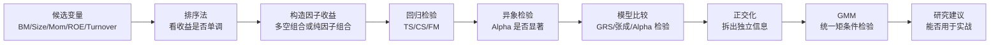
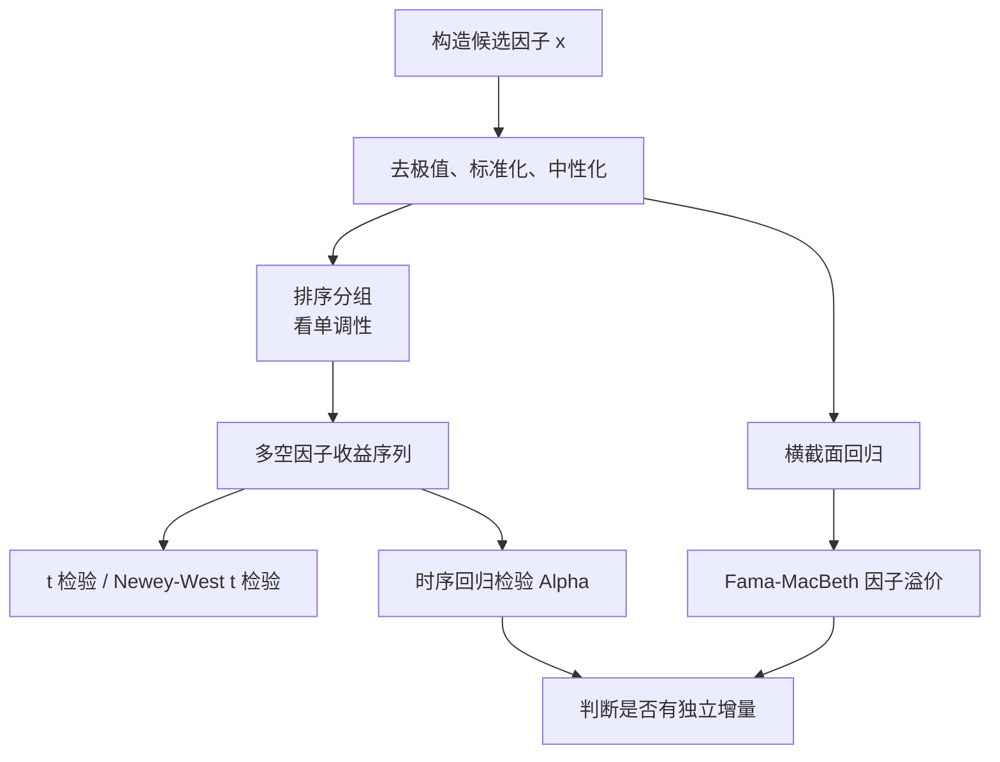

# 第二章学习路线与方法地图

> 说明：本文按《因子投资方法与实践》第 2 章的方法论脉络重讲，不摘录原书大段文字。重点是把公式、维度、推导、金融含义和中低频量化实战用法讲清楚。

## 1. 第二章到底在讲什么

第二章的核心不是“多背几个检验公式”，而是回答一个因子研究员每天都会遇到的问题：

**我发现了一个变量，它到底是不是因子？它能不能解释收益？它有没有独立增量？它能不能进入组合？**

因此整章可以理解成一条实证资产定价流水线：

用一句话概括：

**排序法看现象，回归法讲解释，异象检验看 Alpha，模型比较看谁更好，正交化看独立信息，GMM 提供统一检验语言。**

## 2. 你需要先抓住三个维度

因子模型最容易混乱，是因为同时出现三个维度。

资产维度：

$$
i=1,2,\ldots,N
$$

时间维度：

$$
t=1,2,\ldots,T
$$

因子维度：

$$
k=1,2,\ldots,K
$$

最基础的单资产、单时点、多个因子模型是：

$$
R_{it}^e=\alpha_i+\beta_i'\lambda_t+\varepsilon_{it}
$$

展开后是：

$$
R_{it}^e
=
\alpha_i
+
\beta_{i1}\lambda_{1t}
+
\beta_{i2}\lambda_{2t}
+
\cdots
+
\beta_{iK}\lambda_{Kt}
+
\varepsilon_{it}
$$

其中：

- $R_{it}^e$：资产 $i$ 在 $t$ 期的超额收益。
- $\alpha_i$：模型解释不了的平均超额收益。
- $\beta_{ik}$：资产 $i$ 对第 $k$ 个因子的暴露。
- $\lambda_{kt}$：第 $k$ 个因子在 $t$ 期的实现收益。
- $\varepsilon_{it}$：资产 $i$ 在 $t$ 期的特异扰动。

## 3. 第二章 8 个模块怎么学

推荐阅读顺序：

1. `01_投资组合排序法：从分组收益到多空因子.md`
2. `02_多因子模型回归检验：时间序列_截面_FamaMacBeth.md`
3. `03_因子暴露与因子收益：beta_lambda_alpha到底是什么.md`
4. `04_异象检验：Alpha是否真的存在.md`
5. `05_多因子模型比较：GRS检验与均值方差张成.md`
6. `06_因子正交化：从投影到多重共线性处理.md`
7. `07_GMM广义矩估计：资产定价检验的统一语言.md`
8. `08_实战研究建议：从论文方法到中低频因子流程.md`

## 4. 方法之间的关系

排序法回答：

**按某个变量从低到高分组，高组和低组收益是否明显不同？**

时间序列回归回答：

**一个资产或组合的收益，能否被已有因子收益解释？剩下的 Alpha 是否显著？**

横截面回归回答：

**同一时点上，不同资产的收益差异，是否能由它们的因子暴露差异解释？**

Fama-MacBeth 回归回答：

**每期做横截面回归，再沿时间求平均，因子风险溢价是否长期显著？**

异象检验回答：

**控制已有多因子模型后，新变量是否还能产生显著 Alpha？**

模型比较回答：

**模型 A 和模型 B 谁更能解释一组测试资产的平均收益？**

正交化回答：

**一个因子的有效性到底来自它自己，还是来自和其他因子的重叠部分？**

GMM 回答：

**能不能把资产定价模型写成一组矩条件，然后统一估计和检验？**

## 5. 最小知识闭环

如果你只想先打好量化基本功，至少掌握以下闭环：

## 6. 最常见的学习误区

误区一：把因子值、因子暴露、因子收益混为一谈。

正确理解：

- 因子值或公司特征：比如 BM、Size、Momentum。
- 因子暴露：模型中的解释变量，经常由因子值标准化后得到。
- 因子收益：横截面回归系数，或多空组合收益。

误区二：只看多空收益，不看是否能被已有模型解释。

一个变量的多空收益显著，只说明它有原始收益差异；如果被 Size、Value、Momentum 等已有因子解释掉，就不能轻易说发现了新异象。

误区三：只看 t 值，不看样本外、交易成本和换手。

在实战中，一个因子要进入组合，至少要经受：

- 稳定性检验。
- 样本外检验。
- 交易成本检验。
- 行业、市值、风格暴露检查。
- 容量和换手检查。

## 7. 第二章学完后的能力目标

学完这组笔记，你应该能做到：

1. 看懂一篇因子论文里的排序表。
2. 区分时间序列回归、横截面回归和 Fama-MacBeth 回归。
3. 解释 Alpha、Beta、Lambda 的金融含义。
4. 判断一个变量是普通预测变量、异象，还是定价因子候选。
5. 理解 GRS 检验为什么是在联合检验多个 Alpha。
6. 理解正交化为什么本质是投影和残差。
7. 明白 GMM 为什么是资产定价检验的统一语言。
