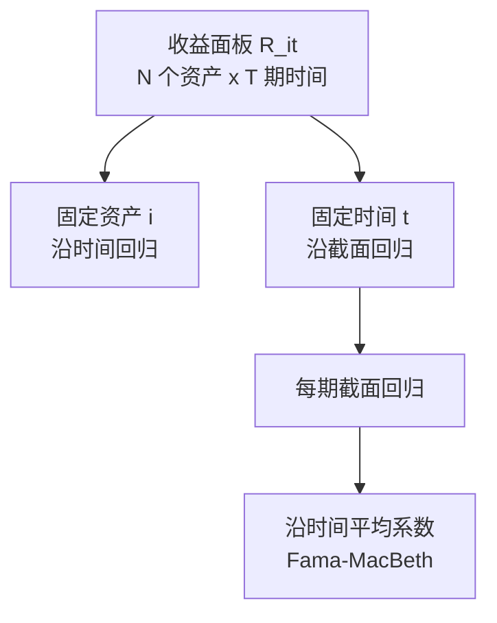

# 02 多因子模型回归检验：时间序列、截面、Fama-MacBeth

> 说明：本文按《因子投资方法与实践》第 2 章的方法论脉络重讲，不摘录原书大段文字。重点是把公式、维度、推导、金融含义和中低频量化实战用法讲清楚。

## 1. 本节解决什么问题

排序法能告诉你“高组和低组收益不同”，但不能完整回答：

**这些收益差异能不能被多因子模型解释？因子风险溢价是否显著？**

第二章的回归检验主要有三类：

- 时间序列回归。
- 截面回归。
- Fama-MacBeth 回归。

它们的区别不是公式长得不一样，而是“切数据的方向”不同。

## 2. 三种回归的维度地图

时间序列回归：

**固定一个资产或组合 $i$，看它很多期收益如何被因子收益解释。**

截面回归：

**固定一个时间 $t$，看很多资产的收益差异如何被因子暴露解释。**

Fama-MacBeth：

**每一期做一次截面回归，再把每期的因子收益估计量沿时间求平均。**

## 3. 时间序列回归

对资产或测试组合 $i$：

$$
R_{it}^e
=
\alpha_i
+
\beta_i'f_t
+
\varepsilon_{it}
$$

其中：

- $R_{it}^e$：资产 $i$ 第 $t$ 期超额收益。
- $f_t$：第 $t$ 期可观测因子收益，维度 $K\times 1$。
- $\beta_i$：资产 $i$ 对因子的暴露，维度 $K\times 1$。
- $\alpha_i$：因子模型解释不了的平均超额收益。

把 $T$ 期堆起来：

$$
R_i
=
\mathbf{1}\alpha_i
+
F\beta_i
+
\varepsilon_i
$$

维度：

$$
R_i:T\times 1,\quad
\mathbf{1}:T\times 1,\quad
F:T\times K,\quad
\beta_i:K\times 1
$$

令：

$$
X=
\begin{bmatrix}
\mathbf{1} & F
\end{bmatrix}
$$

OLS 估计量：

$$
\hat\theta_i
=
\begin{bmatrix}
\hat\alpha_i \\
\hat\beta_i
\end{bmatrix}
=
(X'X)^{-1}X'R_i
$$

## 4. 时间序列回归的金融含义

如果 $\hat\alpha_i$ 显著大于 0，说明这个资产或组合的平均收益不能被已有因子解释。

在异象研究里，常见做法是：

1. 先用候选变量构造多空组合。
2. 得到多空组合收益 $R_{A,t}$。
3. 用已有多因子模型回归：

$$
R_{A,t}
=
\alpha_A
+
\beta_A'f_t
+
\varepsilon_{A,t}
$$

如果 $\alpha_A$ 显著为正，说明候选变量有模型无法解释的超额收益。

## 5. 截面回归

固定时间 $t$，有 $N$ 个资产。

$$
R_t^e
=
\alpha_t\mathbf{1}
+
B_t\lambda_t
+
\varepsilon_t
$$

其中：

- $R_t^e$：$N\times 1$ 的资产收益向量。
- $B_t$：$N\times K$ 的因子暴露矩阵。
- $\lambda_t$：$K\times 1$ 的当期因子收益。
- $\varepsilon_t$：$N\times 1$ 的残差。

如果暂时忽略截距，OLS 为：

$$
\hat\lambda_t
=
(B_t'B_t)^{-1}B_t'R_t^e
$$

含截距时，把 $\mathbf{1}$ 和 $B_t$ 合成解释变量矩阵：

$$
X_t=
\begin{bmatrix}
\mathbf{1} & B_t
\end{bmatrix}
$$

$$
\hat\theta_t
=
(X_t'X_t)^{-1}X_t'R_t^e
$$

## 6. 截面回归的金融含义

横截面回归的系数 $\hat\lambda_t$ 是：

**第 $t$ 期市场给某个因子暴露支付的收益。**

如果价值因子的 $\hat\lambda_{value,t}$ 为正，说明这一期价值暴露高的股票平均收益更高。

## 7. Fama-MacBeth 回归

Fama-MacBeth 是两步法。

第一步，每期做横截面回归：

$$
R_{i,t+1}^e
=
a_t
+
b_{i,t}'\lambda_t
+
\varepsilon_{i,t+1}
$$

得到每期因子收益估计：

$$
\hat\lambda_1,\hat\lambda_2,\ldots,\hat\lambda_T
$$

第二步，沿时间求平均：

$$
\bar\lambda
=
\frac{1}{T}
\sum_{t=1}^{T}\hat\lambda_t
$$

标准误：

$$
SE(\bar\lambda_k)
=
\frac{s(\hat\lambda_{k,t})}{\sqrt{T}}
$$

t 值：

$$
t_k
=
\frac{\bar\lambda_k}{SE(\bar\lambda_k)}
$$

如果 $\hat\lambda_{k,t}$ 有自相关，则用 Newey-West 标准误。

## 8. 推导：为什么 FM 是先截面、再时间

对每一期：

$$
\hat\lambda_t
=
(B_t'B_t)^{-1}B_t'R_{t+1}^e
$$

如果因子 $k$ 有真实风险溢价 $\lambda_k$，那么每期估计量可以理解为：

$$
\hat\lambda_{k,t}
=
\lambda_k
+
u_{k,t}
$$

沿时间求平均：

$$
\bar\lambda_k
=
\lambda_k
+
\frac{1}{T}
\sum_{t=1}^{T}u_{k,t}
$$

如果误差均值趋近于 0：

$$
\frac{1}{T}
\sum_{t=1}^{T}u_{k,t}
\to 0
$$

则：

$$
\bar\lambda_k
\to
\lambda_k
$$

这就是 FM 用时间平均估计长期风险溢价的直觉。

## 9. 三种方法怎么选

时间序列回归适合：

- 因子收益已经可观测。
- 检验组合 Alpha。
- 做业绩归因。

截面回归适合：

- 因子暴露可观测。
- 估计每期纯因子收益。
- 做中低频选股因子检验。

Fama-MacBeth 适合：

- 检验因子风险溢价是否长期显著。
- 控制多个公司特征。
- 做论文式横截面资产定价检验。

## 10. 常见误解

误解一：时间序列回归和截面回归只是把矩阵转置一下。

不对。它们的经济问题不同。时间序列回归看一个资产随时间的风险暴露，截面回归看同一时点不同资产的收益差异。

误解二：FM 的第二步就是普通均值 t 检验，所以不重要。

不对。第二步决定了长期风险溢价是否显著，是 FM 的核心。

误解三：横截面回归里的系数一定等于排序法多空收益。

不一定。排序法构造的是分组组合收益，横截面回归估计的是控制其他变量后的边际因子收益。

## 11. 一页速查

时间序列回归：

$$
R_{it}^e
=
\alpha_i
+
\beta_i'f_t
+
\varepsilon_{it}
$$

截面回归：

$$
R_t^e
=
a_t\mathbf{1}
+
B_t\lambda_t
+
\varepsilon_t
$$

Fama-MacBeth 平均风险溢价：

$$
\bar\lambda
=
\frac{1}{T}\sum_{t=1}^{T}\hat\lambda_t
$$

FM t 值：

$$
t_k
=
\frac{\bar\lambda_k}{SE(\bar\lambda_k)}
$$

## 12. 练习题

1. 为什么时间序列回归常用来检验 Alpha？
2. 为什么横截面回归的系数可以解释为当期因子收益？
3. 用 $N=4,K=3,T=40$ 写出 FM 第一步中 $B_t$、$R_t$、$\lambda_t$ 的维度。
4. 如果 $\hat\lambda_t$ 自相关，为什么普通 t 值会偏乐观？
