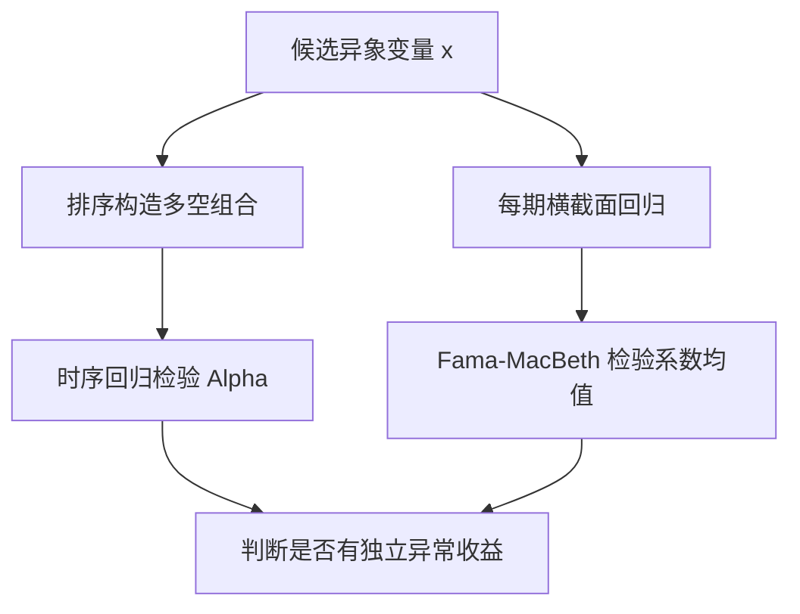

# 04 异象检验：Alpha 是否真的存在

> 说明：本文按《因子投资方法与实践》第 2 章的方法论脉络重讲，不摘录原书大段文字。重点是把公式、维度、推导、金融含义和中低频量化实战用法讲清楚。

## 1. 本节解决什么问题

异象是指：

**某个变量能带来已有多因子模型无法解释的超额收益。**

注意关键词是“无法解释”。如果一个变量只是因为暴露在价值、规模、动量上而赚钱，它不一定是新异象。

## 2. 异象检验的两条路线

## 3. 路线一：时序回归检验异象

先用候选变量构造异象组合收益 $R_{A,t}$，再用已有多因子模型解释：

$$
R_{A,t}
=
\alpha_A
+
\beta_A'f_t
+
\varepsilon_{A,t}
$$

原假设：

$$
H_0:\alpha_A=0
$$

备择假设：

$$
H_1:\alpha_A\ne 0
$$

如果 $\hat\alpha_A$ 显著大于 0，则说明这个异象组合获得了模型不能解释的收益。

## 4. Alpha 的 OLS 估计

写成矩阵：

$$
R_A
=
X\theta_A
+
\varepsilon_A
$$

其中：

$$
X=
\begin{bmatrix}
1 & f_1'\\
1 & f_2'\\
\vdots & \vdots\\
1 & f_T'
\end{bmatrix}
$$

$$
\theta_A=
\begin{bmatrix}
\alpha_A\\
\beta_A
\end{bmatrix}
$$

OLS：

$$
\hat\theta_A
=
(X'X)^{-1}X'R_A
$$

取第一项就是 $\hat\alpha_A$。

## 5. 为什么要用稳健标准误

金融收益序列常有：

- 异方差。
- 自相关。
- 持仓重叠导致的平滑。

经典 OLS 方差：

$$
\operatorname{var}(\hat\theta\mid X)
=
\sigma^2(X'X)^{-1}
$$

如果误差不是同方差且无自相关，这个公式会失真。

更一般地：

$$
\operatorname{var}(\hat\theta\mid X)
=
(X'X)^{-1}X'\Omega X(X'X)^{-1}
$$

其中 $\Omega$ 是误差协方差矩阵。White 和 Newey-West 的核心，就是估计这个中间项。

## 6. 路线二：横截面回归检验异象

每期做：

$$
R_{i,t+1}^e
=
a_t
+
\gamma_t x_{i,t}
+
c_t'z_{i,t}
+
\varepsilon_{i,t+1}
$$

其中：

- $x_{i,t}$：候选异象变量。
- $z_{i,t}$：控制变量，例如 Size、BM、Momentum、行业哑变量。
- $\gamma_t$：候选异象变量在第 $t$ 期的收益。

得到：

$$
\hat\gamma_1,\hat\gamma_2,\ldots,\hat\gamma_T
$$

再检验：

$$
\bar\gamma
=
\frac{1}{T}\sum_{t=1}^{T}\hat\gamma_t
$$

是否显著不为零。

## 7. 金融含义

时序回归检验的是：

**异象组合的收益能否被已有因子收益解释。**

横截面回归检验的是：

**控制其他公司特征后，候选变量是否仍能预测个股收益。**

前者更像组合层面检验，后者更像股票层面检验。

## 8. 实战使用

中低频因子研究建议：

1. 先排序，看分组收益和多空收益。
2. 对多空收益做时序回归，检验 Alpha。
3. 再做 Fama-MacBeth，控制行业、市值、估值、动量等变量。
4. 检查样本外、换手、容量和交易成本。

## 9. 常见误解

误解一：只要多空收益显著，就是异象。

不对。异象强调“已有模型解释不了”。

误解二：Alpha 显著就一定能实盘赚钱。

不一定。Alpha 可能被交易成本、冲击成本、做空约束吃掉。

误解三：控制变量越多越好。

不一定。控制变量过多可能引入多重共线性，也可能让解释变得不稳定。

## 10. 一页速查

异象组合时序回归：

$$
R_{A,t}
=
\alpha_A
+
\beta_A'f_t
+
\varepsilon_{A,t}
$$

Alpha 原假设：

$$
H_0:\alpha_A=0
$$

横截面异象检验：

$$
R_{i,t+1}^e
=
a_t
+
\gamma_t x_{i,t}
+
c_t'z_{i,t}
+
\varepsilon_{i,t+1}
$$

FM 均值：

$$
\bar\gamma
=
\frac{1}{T}\sum_{t=1}^{T}\hat\gamma_t
$$

## 11. 练习题

1. 为什么异象检验必须控制已有因子？
2. 时序回归 Alpha 和横截面回归 $\gamma$ 有什么区别？
3. 如果 Alpha 显著但换手极高，你会如何判断？
4. 为什么 Newey-West 经常用于异象收益检验？
