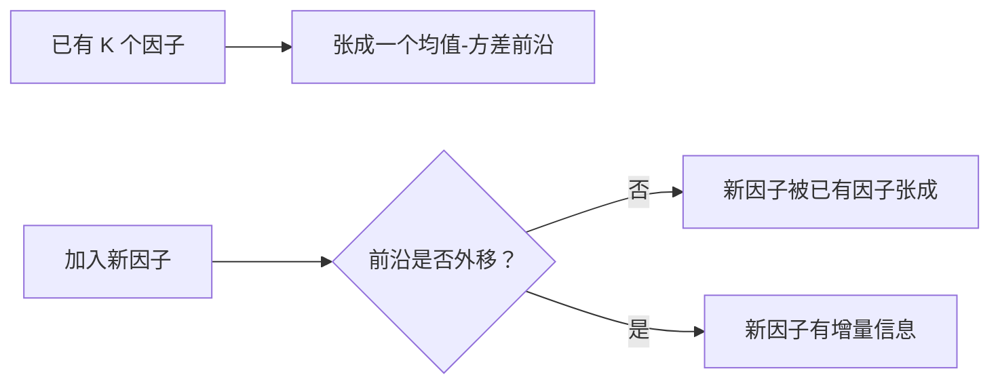

# 05 多因子模型比较：GRS 检验与均值-方差张成

> 说明：本文按《因子投资方法与实践》第 2 章的方法论脉络重讲，不摘录原书大段文字。重点是把公式、维度、推导、金融含义和中低频量化实战用法讲清楚。

## 1. 本节解决什么问题

多因子模型比较要回答：

**模型 A 和模型 B，谁更能解释一组测试资产的平均收益？**

一个好模型应使测试资产的 Alpha 尽可能接近 0。

## 2. 时间序列回归框架

对 $N$ 个测试资产：

$$
R_t^e
=
\alpha
+
Bf_t
+
\varepsilon_t
$$

其中：

- $R_t^e:N\times 1$
- $\alpha:N\times 1$
- $B:N\times K$
- $f_t:K\times 1$
- $\varepsilon_t:N\times 1$

模型有效的核心原假设：

$$
H_0:\alpha=0
$$

这不是检验单个 Alpha，而是联合检验所有测试资产的 Alpha。

## 3. GRS 检验的直觉

GRS 检验问：

**一组测试资产的 Alpha 是否整体显著偏离 0？**

如果 Alpha 向量很大，且残差协方差较小，说明模型解释失败。

GRS 统计量常写为：

$$
GRS
=
\frac{T-N-K}{N}
\left[
1+\bar f'\hat\Sigma_f^{-1}\bar f
\right]^{-1}
\hat\alpha'\hat\Sigma_\varepsilon^{-1}\hat\alpha
$$

在原假设下：

$$
GRS \sim F_{N,T-N-K}
$$

## 4. GRS 每一项是什么意思

$\hat\alpha'\hat\Sigma_\varepsilon^{-1}\hat\alpha$：

**按残差风险调整后的 Alpha 大小。**

如果某个 Alpha 大，但这个资产残差波动也很大，那么证据没那么强。

$\left[1+\bar f'\hat\Sigma_f^{-1}\bar f\right]^{-1}$：

**因子自身均值和风险对检验的调整。**

$\frac{T-N-K}{N}$：

**自由度调整。**

## 5. 推导直觉：为什么是二次型

如果只检验一个 Alpha：

$$
t^2
=
\frac{\hat\alpha^2}{\operatorname{var}(\hat\alpha)}
$$

多个 Alpha 时，把标量推广成向量：

$$
\hat\alpha'\operatorname{var}(\hat\alpha)^{-1}\hat\alpha
$$

这就是“多维 t 值”的思想。

如果 Alpha 向量沿着残差风险很小的方向偏离 0，那么证据更强。

## 6. 均值-方差张成

均值-方差张成检验问：

**新资产或新因子是否能扩展原有因子张成的投资机会集合？**

如果新因子不能改善均值-方差前沿，就说明它没有提供新的投资机会。

几何直觉：

## 7. GRS 与张成检验的关系

GRS 更像在问：

**测试资产的 Alpha 是否联合为 0？**

张成检验更像在问：

**新资产或新因子是否改善投资机会集合？**

两者都与 Alpha 有关，但角度不同。

## 8. Alpha 检验

单个 Alpha 检验：

$$
t_i
=
\frac{\hat\alpha_i}{SE(\hat\alpha_i)}
$$

优点是直观。

缺点是忽略多个测试资产之间的联合关系，也容易产生多重检验问题。

## 9. 实战使用

如果你比较两个模型：

- 模型 A：市场、规模、价值。
- 模型 B：市场、规模、价值、动量、盈利、投资。

可以选择同一组测试组合，例如按 Size-BM 或 Size-Momentum 排序得到的组合。

对每个模型分别回归，比较：

- Alpha 是否更接近 0。
- GRS 是否拒绝。
- 平均绝对 Alpha 是否更小。
- 调整后 $R^2$ 是否更高。
- 新因子是否能被旧因子解释。

## 10. 常见误解

误解一：GRS 不显著就说明模型是真的。

不对。只能说在这组测试资产和样本下，没有足够证据拒绝模型。

误解二：因子越多模型越好。

不一定。因子越多越容易过拟合，也可能让经济解释变弱。

误解三：单个 Alpha 都不显著，联合检验也一定不显著。

不一定。多个小 Alpha 方向一致时，联合检验可能显著。

## 11. 一页速查

多资产时序回归：

$$
R_t^e
=
\alpha
+
Bf_t
+
\varepsilon_t
$$

联合原假设：

$$
H_0:\alpha=0
$$

GRS 统计量：

$$
GRS
=
\frac{T-N-K}{N}
\left[
1+\bar f'\hat\Sigma_f^{-1}\bar f
\right]^{-1}
\hat\alpha'\hat\Sigma_\varepsilon^{-1}\hat\alpha
$$

## 12. 练习题

1. 为什么 GRS 是联合检验，而不是单个 Alpha 检验？
2. $\hat\Sigma_\varepsilon^{-1}$ 在 GRS 中起什么作用？
3. 为什么模型因子越多不一定越好？
4. 用自己的话解释“均值-方差张成”。
