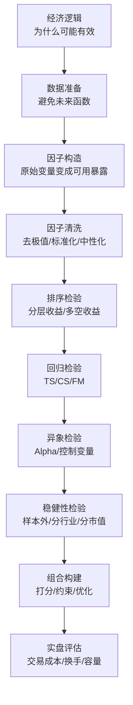

# 08 实战研究建议：从论文方法到中低频因子流程

> 说明：本文按《因子投资方法与实践》第 2 章的方法论脉络重讲，不摘录原书大段文字。重点是把公式、维度、推导、金融含义和中低频量化实战用法讲清楚。

## 1. 本节解决什么问题

第二章最后的重点是：方法不是孤立使用的。真正的因子研究需要一条完整流程。

核心问题是：

**一个变量从想法到进入实盘组合，需要经过哪些统计检验和投资检验？**

## 2. 完整研究流程

## 3. 第一步：经济逻辑

因子不是从数据里硬挖出来的数字。一个可研究因子至少要有经济解释：

- 风险补偿：承担某种系统性风险，所以获得溢价。
- 行为偏差：投资者过度反应或反应不足。
- 市场摩擦：限制套利、流动性约束、机构行为。
- 信息扩散：信息没有立刻被价格完全反映。

## 4. 第二步：数据处理

常见原则：

- 财务数据必须考虑公告日，不能使用未来财报。
- 收益率要使用可交易价格。
- 剔除无法买入或卖出的股票。
- 处理停牌、涨跌停、新股、ST。
- 保证股票池和基准一致。

## 5. 第三步：因子清洗

去极值：

$$
x_{i,t}^{clip}
=
\min
\left(
\max(x_{i,t},q_{low,t}),
q_{high,t}
\right)
$$

标准化：

$$
z_{i,t}
=
\frac{x_{i,t}-\bar x_t}{s_t}
$$

中性化：

$$
z_t
=
Z_t\gamma_t+u_t
$$

$$
z_t^\perp=\hat u_t
$$

其中 $Z_t$ 可以包含行业哑变量、市值、Beta 等控制变量。

## 6. 第四步：排序检验

最少要看：

- 分组收益是否单调。
- 多空收益是否显著。
- 多空收益是否稳定。
- 是否被少数极端月份贡献。
- 换手率是否可接受。

多空收益：

$$
R_{H-L,t+1}=R_{H,t+1}-R_{L,t+1}
$$

均值 t 值：

$$
t=
\frac{\bar R_{H-L}}{SE(\bar R_{H-L})}
$$

## 7. 第五步：回归检验

时间序列 Alpha：

$$
R_{A,t}
=
\alpha_A+\beta_A'f_t+\varepsilon_{A,t}
$$

横截面回归：

$$
R_{i,t+1}^e
=
a_t+\gamma_t x_{i,t}+c_t'z_{i,t}+\varepsilon_{i,t+1}
$$

Fama-MacBeth：

$$
\bar\gamma=
\frac{1}{T}\sum_{t=1}^{T}\hat\gamma_t
$$

## 8. 第六步：模型比较

如果你的新因子要进入多因子模型，需要问：

- 加入后测试资产 Alpha 是否下降？
- GRS 检验是否改善？
- 新因子是否能被旧因子解释？
- 新因子与旧因子相关性是否过高？
- 加入后组合表现是否更稳？

新因子时序回归：

$$
f_{new,t}
=
\alpha_{new}
+
b'f_{old,t}
+
u_t
$$

如果 $\alpha_{new}$ 显著，说明新因子有旧模型解释不了的收益。

## 9. 第七步：实盘组合

线性打分：

$$
score_{i,t}
=
\sum_{k=1}^{K}w_kz_{i,k,t}
$$

IC 加权：

$$
w_k
=
\frac{ICIR_k}{\sum_{j=1}^{K}|ICIR_j|}
$$

简单约束优化：

$$
\max_w
\quad
w'\mu
-
\frac{\gamma}{2}w'\Sigma w
$$

约束：

$$
\mathbf{1}'w=1
$$

$$
|B'w-b_{bench}|\leq c
$$

这表示在追求预期收益时，控制行业、风格和风险暴露。

## 10. 最容易踩的坑

未来函数：

使用了当时还不知道的信息。

幸存者偏差：

只使用现在还存在的股票，忽略退市股票。

多重检验：

试了很多因子，只报告显著的。

过拟合：

参数在样本内表现很好，样本外崩溃。

交易成本忽略：

回测收益看起来高，扣成本后消失。

风险暴露偷跑：

因子收益其实来自行业、市值、Beta 等风险暴露。

## 11. 一页研究模板

写因子研究报告时，建议固定包含：

1. 因子定义和经济逻辑。
2. 数据来源和可得性。
3. 因子清洗方法。
4. 覆盖率和分布统计。
5. IC、Rank IC、ICIR。
6. 分层收益和多空收益。
7. Fama-MacBeth 回归。
8. Alpha 检验。
9. 分年度、分行业、分市值稳健性。
10. 换手率、交易成本、容量。
11. 是否进入多因子模型。

## 12. 一页速查

标准化：

$$
z_{i,t}
=
\frac{x_{i,t}-\bar x_t}{s_t}
$$

多空收益：

$$
R_{H-L,t+1}=R_{H,t+1}-R_{L,t+1}
$$

Alpha 检验：

$$
R_{A,t}
=
\alpha_A+\beta_A'f_t+\varepsilon_{A,t}
$$

FM 均值：

$$
\bar\gamma=
\frac{1}{T}\sum_{t=1}^{T}\hat\gamma_t
$$

组合风险：

$$
\operatorname{var}(R_p)=w'\Sigma w
$$

## 13. 练习题

1. 设计一个价值因子的完整研究流程。
2. 为什么实战中不能只看 IC？
3. 如果一个因子样本内有效、样本外无效，可能有哪些原因？
4. 为什么因子进入组合前必须检查行业和市值暴露？
